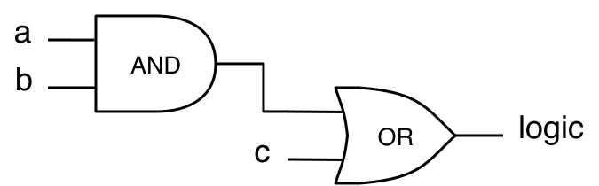
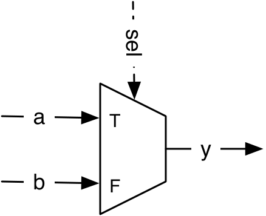
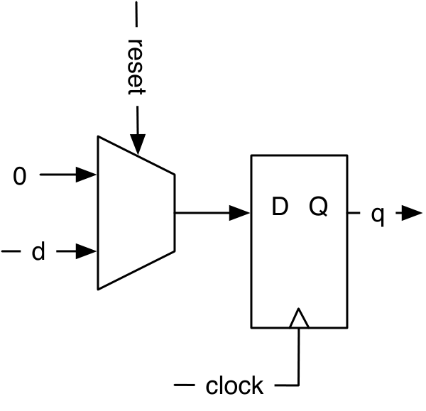
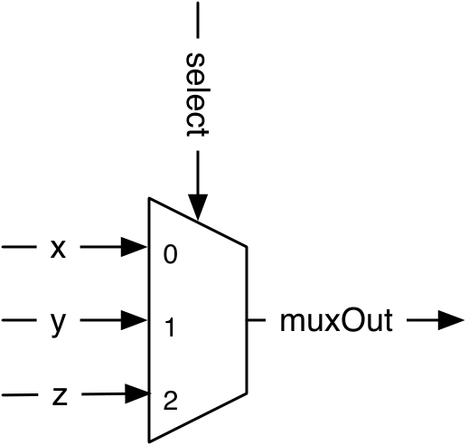
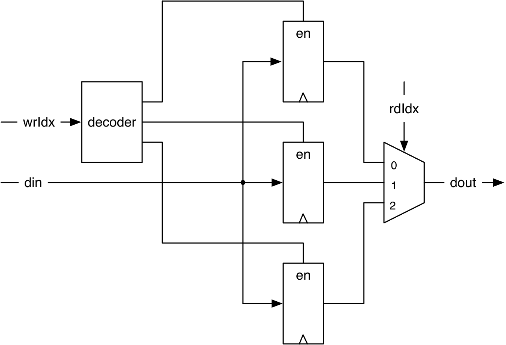

# Chapter 2 — Basic Components

With the toolchain working and a first module generated in Chapter 1, this
chapter introduces the core vocabulary of digital design in Chisel: the data
types and constants, the operators that form combinational logic, the
multiplexer, and the register that gives a circuit memory. It finishes with
`Bundle` and `Vec` for grouping signals — enough to build a real processor
register file. Every later chapter is assembled from these pieces.

*Conventions: every file path is relative to `tutorial/ch02-basic-components/`,
and every command is run from that folder.*

Digital systems use **binary signals**: every wire carries one of two values.
We call them 0/1, low/high, false/true, or deasserted/asserted — all the same
thing. This chapter introduces the two building blocks from which *every*
digital circuit is made:

1. **Combinational logic** — outputs depend only on the current inputs
   (gates, multiplexers, arithmetic).
2. **Registers** (state) — outputs depend on inputs *and* the past
   (flip-flops that update on the clock edge).

## What's in this project

```
ch02-basic-components/
├── build.sbt
├── project/build.properties
├── src/main/scala/
│   ├── Logic.scala           ← combinational features, all in one module
│   ├── RegisterFile.scala    ← registers, Vec, Bundle, a 32×32 register file
│   └── Generate.scala        ← entry point: emits SystemVerilog for both
└── src/test/scala/
    ├── LogicTest.scala        ← checks Logic's outputs
    └── RegisterFileTest.scala ← checks the register file
```

Two of the book's example files anchor this chapter:
`src/main/scala/Logic.scala` (all the combinational examples) and
`src/main/scala/RegisterFile.scala` (registers/`Vec`/`Bundle`). Smaller
concept snippets that aren't a standalone file are shown **inline and marked as
illustrative**.

> **Quick start — jump to [§2.11](#211-build-run-and-check) to build, run, and
> test right now**, then come back for the concepts. Or read top-to-bottom.

---

## 2.1 Chisel types and constants

Chisel has three bit-vector data types:

| Type   | Meaning |
|--------|---------|
| `Bits` | a raw vector of bits (few operations; rarely used directly) |
| `UInt` | the same bits interpreted as an **unsigned** integer |
| `SInt` | the same bits interpreted as a **signed** integer (two's complement) |

Declaring a type with a width (the `.W` suffix makes a Scala `Int` into a
Chisel width):

`src/main/scala/Logic.scala`
```scala
Bits(8.W)   // 8-bit raw vector
UInt(8.W)   // 8-bit unsigned integer
SInt(10.W)  // 10-bit signed integer
```

A width need not be a literal — you can cast a **Scala** `Int` variable `n` to a
Chisel `Width` with `.W` and use it wherever a width is expected. This is the
first hint of Chisel's generator power (a width computed at build time):

`src/main/scala/Logic.scala`
```scala
n.W
Bits(n.W)
```

**Constants** are made by converting a Scala number with `.U` (unsigned),
`.S` (signed), or `.B` (Bool):

`src/main/scala/Logic.scala`
```scala
0.U          // a UInt constant 0
-3.S         // an SInt constant -3
3.U(4.W)     // a 4-bit constant of value 3
```

> If the `3.U` / `4.W` notation looks odd, read it as a typed integer constant —
> like `3L` for a `long` in C, Java, and Scala.

> **Pitfall (from the book):** to give a constant a width you must use `.W`.
> Writing `1.U(32)` does **not** make a 32-bit constant — `(32)` is read as
> *bit-extraction at index 32*, giving a single 0 bit. Always write `1.U(32.W)`.

Chisel benefits from **Scala's type inference**, and in many places the type — and
the bit width — can be left out for Chisel to infer. That is why a Chisel
description is often more concise and readable than the equivalent VHDL or
Verilog. (Even so, spelling out widths at creation is good practice; see §2.8.)

Non-decimal constants use a string prefixed by `h` (hex), `o` (octal), or `b`
(binary); underscores group digits and are ignored:

`src/main/scala/Logic.scala`
```scala
"hff".U         // 255 in hex
"o377".U        // 255 in octal
"b1111_1111".U  // 255 in binary
```

Characters (ASCII) can be constants too, and `Bool` has `true.B` / `false.B`:

`src/main/scala/Logic.scala`
```scala
val aChar = 'A'.U   // 65
Bool(); true.B; false.B
```

All of the constructs above live together in `src/main/scala/Logic.scala` —
open it and match each line to the notes here.

---

## 2.2 Combinational circuits

Chisel uses the familiar C/Java/Scala operators. This one line builds an AND
gate feeding an OR gate:

`src/main/scala/Logic.scala`
```scala
val logic = (a & b) | c
```

<p align="center">
  
</p>

***Figure 2.1** — Logic for the expression `(a & b) | c`. The Chisel expression
and the schematic are one and the same: `&` builds the AND gate, `|` builds the
OR gate. The wires may carry a single bit or a whole vector of bits — the same
code works for both.*

You did not declare `logic`'s type or width — Chisel **infers** both from the
expression. Remember: this creates *gates*, it does not compute a number.

**Bitwise / arithmetic operators** (condensed cheat-sheet; each of these
appears as a named `val` in `src/main/scala/Logic.scala`, e.g. `val a_and_b = a & b`):

```scala
a & b   // AND        a + b   // add
a | b   // OR          a - b   // subtract
a ^ b   // XOR        -a       // negate
~a      // NOT         a * b   // multiply (width = sum of widths)
                       a / b   // divide
                       a % b   // modulo
```
*illustrative*

Width rules: add/subtract → max of the two widths; multiply → sum of widths;
divide/modulo → width of the numerator.

**Full operator and function tables** (from the book, for reference):

| Operator | Description | Types |
|----------|-------------|-------|
| `* / %` | multiply, divide, modulo | UInt, SInt |
| `+ -` | add, subtract | UInt, SInt |
| `=== =/=` | equal, not-equal | UInt, SInt → Bool |
| `> >= < <=` | comparison | UInt, SInt → Bool |
| `<< >>` | shift left / right (SInt sign-extends) | UInt, SInt |
| `~` | NOT | UInt, SInt, Bool |
| `& \| ^` | AND, OR, XOR | UInt, SInt, Bool |
| `!` | logical NOT | Bool |
| `&& \|\|` | logical AND, OR | Bool |

> **Note** equality is `===` (three equals) and inequality is `=/=`, because
> Scala already uses `==`/`!=` for object comparison.

> **Operator precedence.** Chisel's operator precedence is a side effect of how
> the hardware tree is built as the Scala operators execute, so it follows
> **Scala's** precedence — which is *similar but not identical* to Java/C (and
> different again from VHDL, where all logic operators share one precedence and
> evaluate left-to-right). When in doubt, **use parentheses.**

| Function | Description | Types |
|----------|-------------|-------|
| `v.andR v.orR v.xorR` | AND/OR/XOR reduction of all bits | UInt, SInt → Bool |
| `v(n)` | extract a single bit | UInt, SInt |
| `v(end, start)` | extract a bit field | UInt, SInt |
| `Fill(n, v)` | replicate a bit string n times | UInt, SInt |
| `a ## b` | concatenate | UInt, SInt |
| `Cat(a, b, ...)` | concatenate | UInt, SInt |

### Wire and the `:=` update operator

A signal can be declared as a `Wire` first, then driven with `:=`:

`src/main/scala/Logic.scala`
```scala
val w = Wire(UInt())
w := a & b
```

### Bit extraction, sub-fields, concatenation

`src/main/scala/Logic.scala`
```scala
val sign = x(31)             // single bit at index 31
val lowByte = largeWord(7, 0) // bits 7 down to 0 (a sub-field)
val word = highByte ## lowByte // concatenate: high byte then low byte
```

---

## 2.3 Multiplexer

A **multiplexer** ("mux") selects one of several inputs. In its most basic
form it chooses between two.

<p align="center">
  
</p>

***Figure 2.2** — A basic 2:1 multiplexer. The select signal `sel` chooses which
input reaches the output `y`: when `sel` is true the `T` input (`a`) is passed,
otherwise the `F` input (`b`).*

The 2:1 mux is so common that Chisel provides `Mux`:

`src/main/scala/Logic.scala`
```scala
val sel = b === c
val result = Mux(sel, a, b)   // sel==true → a, else → b
```

`sel` must be a `Bool`; `a` and `b` can be any Chisel type as long as they
match. With logic, arithmetic, and a mux you can express *any* combinational
circuit (Chapter 4 adds nicer abstractions like `when`/`switch`).

---

## 2.4 Registers (state)

A **register** is a group of D flip-flops. It is implicitly connected to the
global `clock` and updates on the rising edge. If you give it an initial value,
it also gets a synchronous reset to that value.

<p align="center">
  
</p>

***Figure 2.3** — A `RegInit(0.U)` register. Input `d` and the reset value `0`
feed a multiplexer selected by `reset`; its output goes to the D input of the
flip-flop, whose output `q` updates on the rising edge of `clock`. Chisel wires
`clock` and `reset` implicitly — you never declare them.*

*illustrative — the standard forms*
```scala
val reg = RegInit(0.U(8.W))  // 8-bit register, resets to 0
reg := d                     // drive its input; read it just by name (reg)

val r2 = RegNext(d)          // register whose input is d (no reset value)
val r3 = RegNext(d, 0.U)     // input d, resets to 0
```

**Naming convention:** postfix register names with `Reg` (e.g. `cntReg`,
`blkReg` from Chapter 1) so readers can tell state from combinational wires.
Following Java/Scala custom, use **CamelCase** for multi-word identifiers, with
functions and variables starting lower-case and classes/types (a `Module` name,
say) upper-case. Names are otherwise up to you — pick descriptive ones — but a
handful of words are **reserved** (listed in the book's *Reserved Keywords*
appendix).

### Counting

Counting clock cycles is how you measure time in hardware. A counter that runs
0→9 and wraps:

*illustrative*
```scala
val cntReg = RegInit(0.U(8.W))
cntReg := cntReg + 1.U
when(cntReg === 9.U) {
  cntReg := 0.U
}
```

(You saw exactly this pattern drive the blinking LED in Chapter 1.)

---

## 2.5 Structure with `Bundle` and `Vec`

Chisel groups related signals two ways:

- **`Bundle`** — named fields of possibly different types (like a C `struct` or
  VHDL `record`). You define one by extending `Bundle`. Every `io = IO(new
  Bundle { ... })` you have written *is* a bundle.
- **`Vec`** — an indexable collection of the **same** type (like an array).
  A `Vec` serves three purposes: (1) dynamic (hardware) indexing = a multiplexer;
  (2) register files (multiplexing the read, generating the write-enable); and
  (3) parameterizing the number of ports of a `Module`. For collections of
  *generator* data (or hardware elements you don't index in hardware) use a Scala
  `Seq` instead.

Both create **new, user-defined Chisel types** and can be nested arbitrarily.

### Bundle

Define a bundle by extending `Bundle` and listing its fields as `val`s:

*illustrative*
```scala
class Channel() extends Bundle {
  val data = UInt(32.W)
  val valid = Bool()
}
```

Create one with `new`, wrap it in a `Wire`, and access fields with dot notation:

*illustrative*
```scala
val ch = Wire(new Channel())
ch.data := 123.U
ch.valid := true.B

val b = ch.valid
```

A bundle can also be referenced as a whole:

*illustrative*
```scala
val channel = ch
```

### Vec

A combinational `Vec` is created with a size and an element type, and **wrapped
in a `Wire`**; individual elements are accessed with `(index)`:

*illustrative*
```scala
val v = Wire(Vec(3, UInt(4.W)))

v(0) := 1.U
v(1) := 3.U
v(2) := 5.U

val index = 1.U(2.W)
val a = v(index)         // dynamic index = a multiplexer
```

A combinational `Vec` indexed by a signal is **literally a multiplexer**. For
example, connecting three wires `x`, `y`, `z` into a `Vec` and reading it with a
`select` signal picks one of them onto `muxOut`:

*illustrative*
```scala
val m = Wire(Vec(3, UInt(8.W)))
m(0) := x
m(1) := y
m(2) := z
val muxOut = m(select)
```

<p align="center">
  
</p>

***Figure 2.4** — A `Vec` wrapped in a `Wire` is just a multiplexer. The three
inputs `x`, `y`, `z` become the mux inputs `0`, `1`, `2`; `select` chooses which
one drives `muxOut`.*

Like `WireDefault`, **`VecInit`** gives a `Vec` default values. The following is
a 3:1 multiplexer with three constant defaults (the width, 3 bits, is set on the
first constant), which a `when` can overwrite (three more 2:1 muxes); the last
line selects one input. `VecInit` **already returns hardware**, so — unlike a
plain `Vec` — it need not be wrapped in a `Wire`:

*illustrative*
```scala
val defVec = VecInit(1.U(3.W), 2.U, 3.U)
when (cond) {
  defVec(0) := 4.U
  defVec(1) := 5.U
  defVec(2) := 6.U
}
val vecOut = defVec(sel)
```

`VecInit` can be fed **signals**, not just constants — here wires `d`, `e`, `f`
drive the three `Vec` inputs:

*illustrative*
```scala
val defVecSig = VecInit(d, e, f)
val vecOutSig = defVecSig(sel)
```

Wrapping a `Vec` in a **register** instead gives an array of registers with
one write port and one read port:

<p align="center">
  
</p>

***Figure 2.5** — A vector of (three) registers. The write index `wrIdx` drives a
decoder that enables exactly one register to capture `din`; the read index
`rdIdx` selects one register's output onto `dout` through a multiplexer. This is
exactly the structure the register file below scales up to 32 entries.*

Both concepts come together in the register file below, which **is** a file in
this project.

### Combining `Bundle` and `Vec`

Bundles and vectors mix freely. A **`Vec` of a `Bundle`** type takes the bundle
as its element prototype:

*illustrative*
```scala
val vecBundle = Wire(Vec(8, new Channel()))
```

A **`Bundle` containing a `Vec`** field:

*illustrative*
```scala
class BundleVec extends Bundle {
  val field = UInt(8.W)
  val vector = Vec(4, UInt(8.W))
}
```

For a **register of a bundle type that needs a reset value**, first build a
`Wire` of the bundle, set its fields, then pass it to `RegInit`:

*illustrative*
```scala
val initVal = Wire(new Channel())

initVal.data := 0.U
initVal.valid := false.B

val channelReg = RegInit(initVal)
```

Combining `Bundle`s and `Vec`s lets you define your own powerful data-structure
abstractions.

---

## 2.6 A register file (registers + `Vec` + `Bundle`)

A processor's register file is a classic use of a `Vec` of registers with
dynamic read/write addressing. This one has 32 registers, each 32 bits — as in
a 32-bit RISC-V.

`src/main/scala/RegisterFile.scala`
```scala
import chisel3._

class RegisterFile(debug: Boolean) extends Module {
  val io = IO(new Bundle {
    val rs1 = Input(UInt(5.W))
    val rs2 = Input(UInt(5.W))
    val rd = Input(UInt(5.W))
    val wrData = Input(UInt(32.W))
    val wrEna = Input(Bool())
    val rs1Val = Output(UInt(32.W))
    val rs2Val = Output(UInt(32.W))
    val dbgPort = if (debug)
      Some(Output(Vec(32, UInt(32.W)))) else None
  })
  val regfile = RegInit(VecInit(Seq.fill(32)(0.U(32.W))))
  io.rs1Val := regfile(io.rs1)
  io.rs2Val := regfile(io.rs2)
  when(io.wrEna) {
    regfile(io.rd) := io.wrData
  }
  if (debug) {
    io.dbgPort.get := regfile
  }
}
```

Read this carefully — it packs several ideas:

- **`Vec` of registers with reset:**
  `RegInit(VecInit(Seq.fill(32)(0.U(32.W))))`. `Seq.fill(32)(...)` is a *Scala*
  sequence of 32 zero constants (generator data), `VecInit` turns it into a
  Chisel `Vec`, and `RegInit` makes that the reset value of 32 registers.
- **Dynamic read = mux:** `regfile(io.rs1)` reads whichever register `rs1`
  addresses — that index becomes a 32:1 multiplexer in hardware.
- **Dynamic write = decoder + enables:** `when(io.wrEna){ regfile(io.rd) := ...}`
  writes the addressed register only when write-enable is high.
- **Scala vs. Chisel `if`/`when`:** `when` is *Chisel* — it builds a hardware
  conditional (a mux/enable) that exists every cycle. `if (debug)` is *Scala* —
  it runs once at build time and decides *whether the hardware even exists*.
- **Optional port via `Option`:** `dbgPort` is `Some(...)` only when
  `debug` is true, else `None`. This is a *generator* feature — the same class
  produces two different circuits (with or without a debug port) depending on a
  constructor argument. This is the kind of thing Verilog/VHDL cannot do
  cleanly and where Chisel shines.

The `Seq.fill(32)(0.U(32.W))` above resets *every* register to the same value.
When you instead want **distinct reset values per register**, list them in the
`VecInit` directly (and you can still connect each element's input separately):

*illustrative*
```scala
val initReg = RegInit(VecInit(0.U(3.W), 1.U, 2.U))
val resetVal = initReg(sel)
initReg(0) := d
initReg(1) := e
initReg(2) := f
```

---

## 2.7 Pitfall: no partial assignment (and the workaround)

In Chisel 3+ you may **not** assign to a slice of a signal. This is illegal and
fails during elaboration:

*illustrative — DOES NOT COMPILE*
```scala
val assignWord = Wire(UInt(16.W))
assignWord(7, 0)  := lowByte   // ✗ partial assignment not allowed
assignWord(15, 8) := highByte  // ✗
```

**Workaround A — a local `Bundle`, then `asUInt`** (present in `Logic.scala`):

`src/main/scala/Logic.scala`
```scala
val assignWord = Wire(UInt(16.W))

class Split extends Bundle {
  val high = UInt(8.W)
  val low = UInt(8.W)
}

val split = Wire(new Split())
split.low := lowByte
split.high := highByte
assignWord := split.asUInt
```

**Workaround B — a `Vec` of `Bool`, then `asUInt`** (also in `Logic.scala`):

`src/main/scala/Logic.scala`
```scala
val vecResult = Wire(Vec(4, Bool()))
vecResult(0) := data(0)
vecResult(1) := data(1)
vecResult(2) := data(2)
vecResult(3) := data(3)
val uintResult = vecResult.asUInt
```

---

## 2.8 `Wire`, `Reg`, `IO`, and `=` vs. `:=`

`UInt`/`SInt`/`Bits` are just *types* — by themselves they are not hardware.
They become hardware only when wrapped:

- `Wire(...)` → combinational logic
- `Reg(...)` / `RegInit(...)` → a register (flip-flops)
- `IO(...)` → a module's ports

You **name** a hardware object with Scala's `=`, and you **drive** an existing
object with Chisel's `:=`:

*illustrative*
```scala
val w = Wire(UInt(8.W))  //  =  : create and name the hardware
w := a & b               //  := : drive a value onto existing hardware
```

(Scala also has mutable `var`, but it is useless for describing hardware — you
name hardware once with `val` and drive it with `:=`.)

Best practices the book stresses:

- Give combinational `Wire`s a **default value** so they are assigned on every
  path (an unassigned combinational signal would be a latch, which Chisel
  rejects). `WireDefault` folds the default into the declaration:

  *illustrative*
  ```scala
  val number = WireDefault(10.U(4.W))
  ```
- Give registers a **reset value** (`RegInit`) so simulation/verification is
  deterministic:

  *illustrative*
  ```scala
  val reg = RegInit(0.S(8.W))
  ```
  (Leaving a register undefined at reset can save some load on the reset wire,
  but known reset values simplify testing and verification.)
- Specify **bit widths** at creation even though Chisel can infer them.

---

## 2.9 Chisel *generates* hardware (the mental model)

This is the single most important idea in the book. Chisel code *looks* like
Java/C, but it does not execute statement-by-statement to compute a result.
Instead, when your Scala program runs, each Chisel statement **adds a node** to
a graph of hardware components and wires them together. That graph is the
circuit; Chisel emits it as SystemVerilog. Once built, **all of it runs in
parallel, every clock cycle.**

So when you read Chisel, don't imagine a program running — **imagine the
gates and flip-flops being drawn on a page.** Each `Wire`/`Reg`/operator is a
piece of that drawing.

---

## 2.10 The `Logic` module as a whole

`src/main/scala/Logic.scala` collects the combinational examples above into one
module. Its ports let a test observe each construct's result:

`src/main/scala/Logic.scala` (the ports)
```scala
val io = IO(new Bundle {
  val a = Input(UInt(1.W))
  val b = Input(UInt(1.W))
  val c = Input(UInt(1.W))
  val out    = Output(UInt(1.W))   // (a & b) | c
  val cat    = Output(UInt(16.W))  // highByte ## lowByte
  val ch     = Output(UInt(8.W))   // 'A'.U = 65
  val word   = Output(UInt(16.W))  // Bundle-based partial assignment
  val result = Output(UInt(4.W))   // Vec[Bool]-based assembly
})
```

Generating it produces exactly these ports in SystemVerilog (see §2.11):

```systemverilog
module Logic(
  input         clock, reset, io_a, io_b, io_c,
  output        io_out,
  output [15:0] io_cat,
  output [7:0]  io_ch,
  output [15:0] io_word,
  output [3:0]  io_result
);
```

---

## 2.11 Build, run, and check

Three things you can do in this project. Run them from this folder.

### (a) Run the test bench — the fastest way to *check* the hardware

```
$ sbt test
```

Expected output:

```
[info] LogicTest:
[info] Logic
[info] - should pass
[info] RegisterFileTest:
[info] RegisterFile
[info] - should have a debug port
[info] RegisterFile
[info] - should work without the debug port
[info] Run completed in 1 second, 32 milliseconds.
[info] Total number of tests run: 3
[info] Suites: completed 2, aborted 0
[info] Tests: succeeded 3, failed 0, canceled 0, ignored 0, pending 0
[info] All tests passed.
[success] Total time: 4 s
```

Three tests, all green.

### (b) Generate the SystemVerilog — to *see* the hardware

`src/main/scala/Generate.scala`
```scala
import chisel3._

object Generate extends App {
  emitVerilog(new Logic())
  emitVerilog(new RegisterFile(true))
}
```

```
$ sbt "runMain Generate"
```

This writes **`Logic.sv`** and **`RegisterFile.sv`** into this folder. Open them
and match the ports to the `io` bundles. In `RegisterFile.sv` you will see 32
outputs `io_dbgPort_0 … io_dbgPort_31` — that is the debug `Vec` flattened into
individual ports.

### (c) Understand the test bench

Testing is covered fully in the book's Chapter 3, but here is enough to read
`src/test/scala/LogicTest.scala`:

`src/test/scala/LogicTest.scala`
```scala
import chisel3._
import chiseltest._
import org.scalatest.flatspec.AnyFlatSpec

class LogicTest extends AnyFlatSpec with ChiselScalatestTester {
  "Logic" should "pass" in {
    test(new Logic) { dut =>
      dut.io.a.poke(1.U)          // drive an input
      dut.io.b.poke(0.U)
      dut.io.c.poke(1.U)
      dut.clock.step()            // advance one clock cycle
      dut.io.out.expect(1.U)      // (1 & 0) | 1 = 1
      dut.io.cat.expect("hff01".U)
      dut.io.ch.expect(65.U)      // 'A'
      dut.io.word.expect("hff01".U)
      dut.io.result.expect(5.U)
    }
  }
}
```

- **`poke`** drives a value onto an input port.
- **`step()`** advances the simulated clock by one cycle.
- **`expect`** asserts an output equals a value; a mismatch fails the test.

`src/test/scala/RegisterFileTest.scala` does the same for the register file:
it writes `123` to register 4, steps the clock, then checks that reading
register 4 (`rs1Val`) returns `123` **and** that the debug port shows `123` at
index 4. A second test builds the module *without* the debug port
(`new RegisterFile(false)`) and confirms it still works — demonstrating the
`Option`-based generator from §2.6.

---

## 2.12 Recap

- Every circuit is combinational logic + registers.
- `UInt`/`SInt`/`Bits` become hardware only inside `Wire`, `Reg`, or `IO`.
- `=` names hardware; `:=` drives it.
- `Mux` selects; a `Vec` indexed by a signal is a mux; a `Vec` of `Reg` is a
  register array.
- `Bundle` groups named signals; `Option` + Scala `if` let one module generate
  different hardware (the debug port).
- Chisel **builds** a parallel hardware graph — it does not run like software.

---

## 2.13 Exercises

1. **Break a test on purpose.** In `src/main/scala/Logic.scala` change the mux
   to `Mux(sel, b, a)` (swap the inputs), run `sbt test`, and read the failure
   message. Then revert.
2. **Add an XOR output.** Add `val xor = Output(UInt(1.W))` to `Logic`'s `io`,
   drive it with `io.xor := a ^ b`, regenerate with `sbt "runMain Generate"`,
   and find the new port in `Logic.sv`. (Optionally add an `expect` for it in
   `LogicTest.scala`.)
3. **Shrink the register file.** Change `RegisterFile` from 32 to 8 registers
   (the `Seq.fill(32)` and the `Vec(32, …)`), regenerate, and confirm
   `RegisterFile.sv` now has `io_dbgPort_0 … io_dbgPort_7`.
4. **From the book (FPGA):** take the Chapter 1 blinking-LED project (from
   `chisel-examples`), copy it to a new folder, and add switch inputs to its `io`
   bundle:

   ```scala
   val sw = Input(UInt(2.W))
   ```
   *illustrative*

   You must also **assign the FPGA pins** for those switches — see the pin
   assignments in a Quartus project file such as the DE2-115 board's
   [`alu.qsf`](https://github.com/schoeberl/chisel-examples/blob/master/quartus/altde2-115/alu.qsf)
   (this can also be done in the tool's GUI). Then work up in three steps:

   1. **Prove inputs work first.** Drop *all* blinking logic and wire **one
      switch straight to the LED**. Compile, configure the board: can you switch
      the LED on and off? If yes, inputs are working; if not, debug the pin
      configuration before going further.
   2. **A combinational function.** Use **two switches**, `AND` them onto the
      LED, then **change the function** (try OR, XOR).
   3. **A multiplexer.** Use **three switches**: one as the select signal and the
      other two as the inputs of a 2:1 mux driving the LED.

   No board? Express each step here and inspect the generated SystemVerilog
   instead. (Chapter 3 introduces a testing framework so you can check circuits
   *without* an FPGA and physical switches.)

Back to the **[tutorial index](../README.md)**.
Next: **[Chapter 3 — Build Process and Testing](../ch03-build-and-testing/README.md)**.
