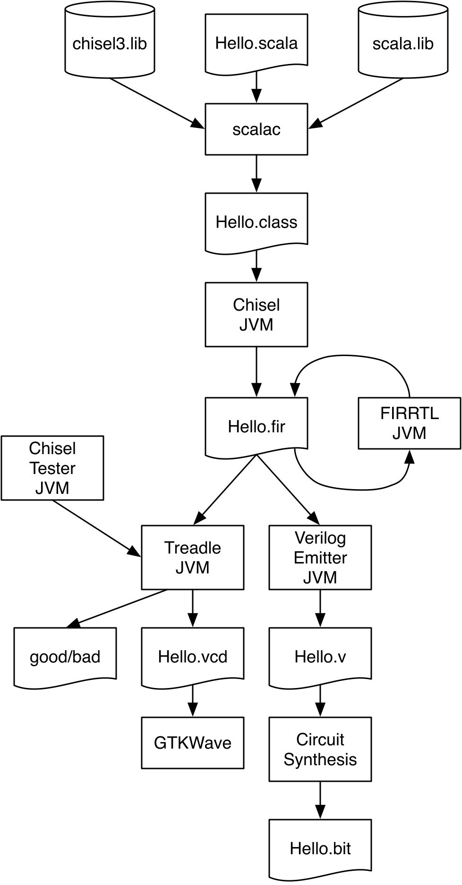

# Chapter 3 — Build Process and Testing

Chapters 1 and 2 showed how to *describe* hardware; this chapter is about the
*workflow* around it — the three mechanics you need before building anything
larger. You will see how a Chisel project is compiled with **sbt** (the Scala
Build Tool, which also fetches the right Scala and Chisel versions), how Scala
**packages** organize your sources, how to **generate** synthesizable Verilog,
and how to **test** circuits in simulation with ChiselTest — including waveforms
and `printf` debugging. Testing is where Chisel's Scala foundation pays off: the
full power of Scala is available for writing test benches.

*Conventions: every file path is relative to `tutorial/ch03-build-and-testing/`,
and every command is run from that folder.*

## What's in this project

```
ch03-build-and-testing/
├── build.sbt
├── project/build.properties
├── figures/flow.png
├── src/main/scala/
│   ├── Hello.scala             the blinking LED (reused) — Verilog generation
│   ├── mypack/pack.scala       module `Abc` in package `mypack`
│   └── usepack.scala           three ways to use a module from another package
└── src/test/scala/
    ├── ExampleTest.scala       pure ScalaTest (no hardware)
    ├── testing.scala           the DUTs + ChiselTest benches + printf
    └── WaveformTest.scala      VCD waveform generation
```

---

## 3.1 Building your project with sbt

sbt downloads Chisel and the Chisel tester from a Maven repository, guided by
`build.sbt`. Pin a concrete version (as we do — Chisel 6.5.0) rather than
`latest.release`: a fixed version builds offline and reproducibly; a floating
version needs the network on every build.

### 3.1.1 Source organization (and packages)

sbt inherits Maven's source layout. A typical Chisel project looks like:

```
project/                 (the project home; holds build.sbt)
├── build.sbt
├── src/
│   ├── main/scala/       hardware sources
│   │   └── package/
│   │       └── sub-package/
│   └── test/scala/       testers
│       └── package/
├── target/               compiled class files (generated)
└── generated/            generated Verilog (by convention)
```

Everything under `src/main/scala` is hardware; everything under
`src/test/scala` is tests. Chisel inherits Java/Scala **packages** for
namespacing. To put a module in a package, declare it and place the file in a
matching sub-folder:

`src/main/scala/mypack/pack.scala`
```scala
package mypack

import chisel3._

class Abc extends Module {
  val io = IO(new Bundle {})
}
```

There are three ways to use `Abc` from another package. All three are in one
file here:

`src/main/scala/usepack.scala`
```scala
// (1) Fully-qualified name — no import:
val abc = new mypack.Abc()

// (2) Import the single class:
import mypack.Abc
val abc = new Abc()

// (3) Wildcard import — `_` brings in everything public from mypack:
import mypack._
val abc = new Abc()
```

Both `pack.scala` and `usepack.scala` exist only to show how packages and
imports are organized — **neither has a runnable part.** They define modules
(`mypack.Abc`, and the `AbcUser*` wrappers) but no `object … extends App` with a
`main`, so there is nothing to `sbt "runMain …"` here. sbt will still *compile*
them as part of the `main` tree; they simply produce no output of their own. The
first thing in this project you can actually run is `Hello`, in the next section.

### 3.1.2 Running sbt

The runnable entry point of this project is `Hello.scala` — the blinking LED
reused from Chapter 1. It is **unrelated to `usepack.scala`**: the package
example above was purely about source organization, whereas `Hello` is a real
module wrapped in an `object … extends App`, which is what makes it runnable:

`src/main/scala/Hello.scala`
```scala
class Hello extends Module {
  val io = IO(new Bundle {
    val led = Output(UInt(1.W))
  })
  // ... blinking-LED logic from Chapter 1 ...
}

// An `object extends App` is a runnable program — this is the `main`:
object Hello extends App {
  emitVerilog(new Hello())
}
```

```
$ sbt run
```

compiles the whole `main` tree and looks for an `object` with a `main` (i.e.
`extends App`). If several exist, sbt lists them so you can choose. To pick one
directly:

```
$ sbt "runMain Hello"
```

By convention, `sbt run` searches only `main`, not `test`. Run the test suite
with:

```
$ sbt test
```

And, rarely, to run a `main` that happens to live under `test`:

```
$ sbt "test:runMain some.Object"
```

### 3.1.3 Generating Verilog

A Scala `object` that `extends App` is a program. Ours creates the module and
hands it to `emitVerilog`:

`src/main/scala/Hello.scala`
```scala
object Hello extends App {
  emitVerilog(new Hello())
}
```

```
$ sbt "runMain Hello"
```

Expected output (and a new **`Hello.sv`** appears in this folder):

```
[info] running Hello
[success] Total time: 1 s
```

> **Book vs. reality (`.v` → `.sv`):** the book says this writes `Hello.v`.
> Chisel 6 uses the CIRCT/firtool backend and emits **SystemVerilog `Hello.sv`**.
> Inside you'll find `module Hello` with an `output io_led` (Chisel prepends
> `io_` to port names) plus the implicit `clock` and `reset` inputs, and the
> two registers `cntReg`/`blkReg` with a synchronous reset.

Two variants, also in `Hello.scala`:

`src/main/scala/Hello.scala`
```scala
// write into a subfolder:  sbt "runMain HelloOption"  -> generated/Hello.sv
object HelloOption extends App {
  emitVerilog(new Hello(), Array("--target-dir", "generated"))
}

// print to the console instead of a file:  sbt "runMain HelloString"
object HelloString extends App {
  println(getVerilogString(new Hello()))
}
```

### 3.1.4 Tool flow

<p align="center">
  
</p>

***Figure 3.1** — Tool flow of the Chisel ecosystem (through Chisel 3.6). Your
`Hello.scala` is compiled by `scalac` (together with the Chisel and Scala
libraries) into `Hello.class`, which the JVM runs to produce **FIRRTL**
(`Hello.fir`), an intermediate representation of the circuit. From FIRRTL, one
path simulates the design (Treadle + the Chisel tester → pass/fail and an
optional `Hello.vcd` waveform for GTKWave); the other path emits Verilog
(`Hello.v`) for a synthesis tool that ultimately produces an FPGA bitstream
(`Hello.bit`).*

> Chisel 5+ replaced the Scala FIRRTL compiler and Treadle with the CIRCT
> `firtool` backend (which is why we get `.sv`), but the overall shape —
> Chisel → intermediate representation → simulate **or** emit HDL → synthesize —
> is unchanged.

### 3.1.5 Chisel, Scala, and Java versions

Chisel is a Scala library, and Scala runs on the JVM, so the three versions are
linked. Java 8 is a safe baseline; Scala 2.13 is the safe choice (Chisel 6 is
Scala-2.13 only). Because Chisel ships a Scala **compiler plugin**, the highest
usable Scala *patch* version is limited by that plugin. Highest supported
versions per Chisel release:

| Chisel | Scala | Java |
|--------|-------|------|
| 3.5.6 | 2.13.10 | 17 |
| 3.6.1 | 2.13.14 | 22 |
| 5.3.x | 2.13.14 | 22 |
| 6.5.x | 2.13.14 | 22 |
| 6.7.x | 2.13.16 | 24 |

This project uses **Chisel 6.5.0 / Scala 2.13.14** (this machine runs Java 20,
comfortably within range). Chisel 6 bundles `firtool`, so nothing extra needs
installing — which is why it's the recommended version.

> **Tip — a ready-made starting point:** the
> [`chisel-empty`](https://github.com/schoeberl/chisel-empty) GitHub *template*
> is a minimal project (an adder + a tester + a `Makefile`). Press "Use this
> template" to start your own repo; `make` generates Verilog, `make test` runs
> the tester, `make clean` removes generated files.

---

## 3.2 Testing with Chisel

A hardware test is a **test bench**: it instantiates the **design under test
(DUT)**, drives its inputs, observes its outputs, and compares them to expected
values. Chisel's tester, **ChiselTest** (package `chiseltest`), is built on top
of Scala's **ScalaTest** — and because you write tests in Scala, you have the
full language available (loops, reference models, etc.).

### 3.2.1 ScalaTest (the foundation)

ChiselTest extends ScalaTest, so meet ScalaTest first. This is a plain unit
test — no hardware — that reads like an executable specification:

`src/test/scala/ExampleTest.scala`
```scala
import org.scalatest._
import org.scalatest.flatspec.AnyFlatSpec
import org.scalatest.matchers.should.Matchers

class ExampleTest extends AnyFlatSpec with Matchers {
  "Integers" should "add" in {
    val i = 2; val j = 3
    i + j should be (5)
  }
  "Integers" should "multiply" in {
    val a = 3; val b = 4
    a * b should be (12)
  }
}
```

Run just this suite:

```
$ sbt "testOnly ExampleTest"
```

Expected output:

```
[info] ExampleTest:
[info] Integers
[info] - should add
[info] Integers
[info] - should multiply
[info] Run completed in 154 milliseconds.
[info] Total number of tests run: 2
[info] Suites: completed 1, aborted 0
[info] Tests: succeeded 2, failed 0, canceled 0, ignored 0, pending 0
[info] All tests passed.
```

`sbt test` runs *all* suites (regression testing); `sbt "testOnly X"` runs one.
(Misspell the name and you get a quiet `No tests were executed`.)

### 3.2.2 ChiselTest

ChiselTest needs three imports; including `chiseltest` in `build.sbt` also
pulls in the right ScalaTest, so you don't add ScalaTest separately:

`src/test/scala/testing.scala`
```scala
import chisel3._
import chiseltest._
import org.scalatest.flatspec.AnyFlatSpec
```

Our DUT — a 2-bit bitwise AND, plus an equality flag:

`src/test/scala/testing.scala`
```scala
class DeviceUnderTest extends Module {
  val io = IO(new Bundle {
    val a = Input(UInt(2.W))
    val b = Input(UInt(2.W))
    val out = Output(UInt(2.W))
    val equ = Output(Bool())
  })
  io.out := io.a & io.b
  io.equ := io.a === io.b
}
```

A test bench `extends AnyFlatSpec with ChiselScalatestTester`. `test(dut){ ... }`
runs the body against the DUT. This first version **prints** outputs:

`src/test/scala/testing.scala`
```scala
class SimpleTest extends AnyFlatSpec with ChiselScalatestTester {
  "DUT" should "pass" in {
    test(new DeviceUnderTest) { dut =>
      dut.io.a.poke(0.U)                                  // drive an input
      dut.io.b.poke(1.U)
      dut.clock.step()                                    // advance one cycle
      println("Result is: " + dut.io.out.peekInt())       // read as Scala Int
      dut.io.a.poke(3.U)
      dut.io.b.poke(2.U)
      dut.clock.step()
      println("Result is: " + dut.io.out.peekInt())
    }
  }
}
```

- **`poke(value)`** drives a Chisel value onto an input port.
- **`step(n = 1)`** advances the simulated clock.
- **`peekInt()` / `peekBoolean()`** read an output back as a *Scala* value.

```
$ sbt "testOnly SimpleTest"
```

```
Result is: 0
Result is: 2
[info] SimpleTest:
[info] DUT
[info] - should pass
```

`0 AND 1 = 0`, `3 AND 2 = 2`. Rather than eyeball printouts, assert with
**`expect`**:

`src/test/scala/testing.scala`
```scala
class SimpleTestExpect extends AnyFlatSpec with ChiselScalatestTester {
  "DUT" should "pass" in {
    test(new DeviceUnderTest) { dut =>
      dut.io.a.poke(0.U); dut.io.b.poke(1.U)
      dut.clock.step()
      dut.io.out.expect(0.U)
      dut.io.a.poke(3.U); dut.io.b.poke(2.U)
      dut.clock.step()
      dut.io.out.expect(2.U)
    }
  }
}
```

A passing `expect` prints nothing special; the suite just reports success. A
**failing** `expect` reports the mismatch and where it happened. If you changed
the last line to `expect(4.U)` you'd see:

*illustrative — output of a deliberately broken expect*
```
[info] - should pass *** FAILED ***
[info]   io_out=2 (0x2) did not equal expected=4 (0x4)
                   (lines in testing.scala: 27) (testing.scala:35)
```

You can also read outputs into Scala types and use plain `assert` — handy when
test logic needs the value (e.g. looping until a condition holds):

`src/test/scala/testing.scala`
```scala
class SimpleTestPeek extends AnyFlatSpec with ChiselScalatestTester {
  "DUT" should "pass" in {
    test(new DeviceUnderTest) { dut =>
      dut.io.a.poke(0.U); dut.io.b.poke(1.U)
      dut.clock.step()
      val res = dut.io.out.peekInt()       // a Scala BigInt
      assert(res == 0)
      val equ = dut.io.equ.peekBoolean()   // a Scala Boolean
      assert(!equ)
    }
  }
}
```

### 3.2.3 Waveforms

For debugging you often want to see many signals over time. A ChiselTest can
emit a **VCD** waveform (all registers and IO). Attach `WriteVcdAnnotation`:

`src/test/scala/WaveformTest.scala`
```scala
class WaveformTest extends AnyFlatSpec with ChiselScalatestTester {
  "Waveform" should "pass" in {
    test(new DeviceUnderTest)
      .withAnnotations(Seq(WriteVcdAnnotation)) { dut =>
      dut.io.a.poke(0.U); dut.io.b.poke(0.U); dut.clock.step()
      dut.io.a.poke(1.U); dut.io.b.poke(0.U); dut.clock.step()
      dut.io.a.poke(0.U); dut.io.b.poke(1.U); dut.clock.step()
      dut.io.a.poke(1.U); dut.io.b.poke(1.U); dut.clock.step()
    }
  }
}
```

```
$ sbt "testOnly WaveformTest"
```

This writes the waveform to
`test_run_dir/Waveform_should_pass/DeviceUnderTest.vcd`. Open it in
[GTKWave](http://gtkwave.sourceforge.net/) (*File → Open New Window*), then drag
signals from the left panel into the wave view.

> The command-line form `sbt "testOnly WaveformTest -- -DwriteVcd=1"` does the
> same without the annotation in the source.

Writing every `poke` by hand doesn't scale. `WaveformCounterTest` uses Scala
loops to enumerate all input combinations instead:

`src/test/scala/WaveformTest.scala`
```scala
class WaveformCounterTest extends AnyFlatSpec with ChiselScalatestTester {
  "WaveformCounter" should "pass" in {
    test(new DeviceUnderTest)
      .withAnnotations(Seq(WriteVcdAnnotation)) { dut =>
      for (a <- 0 until 4)
        for (b <- 0 until 4) {
          dut.io.a.poke(a.U); dut.io.b.poke(b.U)
          dut.clock.step()
        }
    }
  }
}
```

### 3.2.4 printf debugging

You can also drop a `printf` right into a module; it fires on each rising clock
edge during simulation:

`src/test/scala/testing.scala`
```scala
class DeviceUnderTestPrintf extends Module {
  val io = IO(new Bundle {
    val a = Input(UInt(2.W))
    val b = Input(UInt(2.W))
    val out = Output(UInt(2.W))
  })
  io.out := io.a & io.b
  printf("dut: %d %d %d\n", io.a, io.b, io.out)
}
```

Driving it over all input combinations (`SimplePrintfTest`) and running:

```
$ sbt "testOnly SimplePrintfTest"
```

prints one line per cycle, verifying the AND by inspection:

```
dut:  0  0  0
dut:  0  1  0
dut:  0  2  0
dut:  0  3  0
dut:  1  0  0
dut:  1  1  1
dut:  1  2  0
dut:  1  3  1
dut:  2  0  0
dut:  2  1  0
dut:  2  2  2
dut:  2  3  2
dut:  3  0  0
dut:  3  1  1
dut:  3  2  2
dut:  3  3  3
[info] - should pass
```

Chisel `printf` supports C- and Scala-style formatting.

### Run everything at once

```
$ sbt test
```

Expected tail (8 tests across 7 suites, with the `Result is:`/`dut:` prints
interleaved above):

```
[info] Run completed in 1 second, 93 milliseconds.
[info] Total number of tests run: 8
[info] Suites: completed 7, aborted 0
[info] Tests: succeeded 8, failed 0, canceled 0, ignored 0, pending 0
[info] All tests passed.
```

---

## 3.3 Recap

- **sbt** compiles (`sbt run` / `sbt "runMain X"`), tests (`sbt test` /
  `sbt "testOnly X"`), and fetches Chisel/Scala for you.
- **Packages** namespace your code; place `package foo` files under a matching
  folder and import with a name, `import foo.Bar`, or `import foo._`.
- **`emitVerilog`** turns a `Module` into SystemVerilog (`.sv` in Chisel 6).
- **ChiselTest** (on top of ScalaTest): `test(dut){ … }`, `poke`, `step`,
  `expect`, `peekInt`/`peekBoolean`; add `WriteVcdAnnotation` for waveforms and
  `printf` for printf-debugging. Scala loops generate stimulus.

---

## 3.4 Exercises

1. **Explore the generated hardware.** Run `sbt "runMain Hello"` and open
   `Hello.sv`. Find `module Hello`, the `output io_led`, and the implicit
   `clock`/`reset`. Then try `sbt "runMain HelloString"` and
   `sbt "runMain HelloOption"` and note where each sends its output.
2. **Break a test.** In `src/test/scala/testing.scala` change a
   `SimpleTestExpect` expectation to a wrong value, run
   `sbt "testOnly SimpleTestExpect"`, and read the failure message (compare it
   to the illustrative one in §3.2.2). Revert.
3. **Look at a waveform.** Run `sbt "testOnly WaveformCounterTest"` and open the
   `.vcd` under `test_run_dir/…` in GTKWave. Confirm `out` equals `a & b` each
   cycle.
4. **Add a test (from the book).** Take your AND-gate / multiplexer design from
   the Chapter 2 exercise, write a ChiselTest that enumerates all inputs with
   Scala loops, and check each output with `expect()`.

Back to the **[tutorial index](../README.md)**.
Previous: **[Chapter 2 — Basic Components](../ch02-basic-components/README.md)**.
Next: **[Chapter 4 — Components](../ch04-components/README.md)**.
