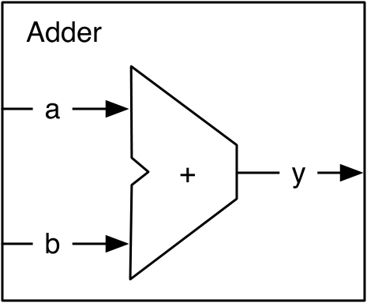
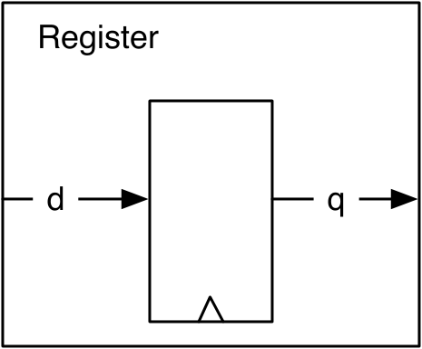
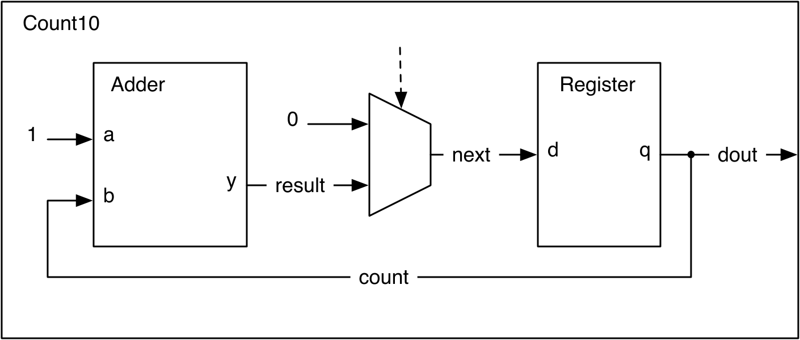
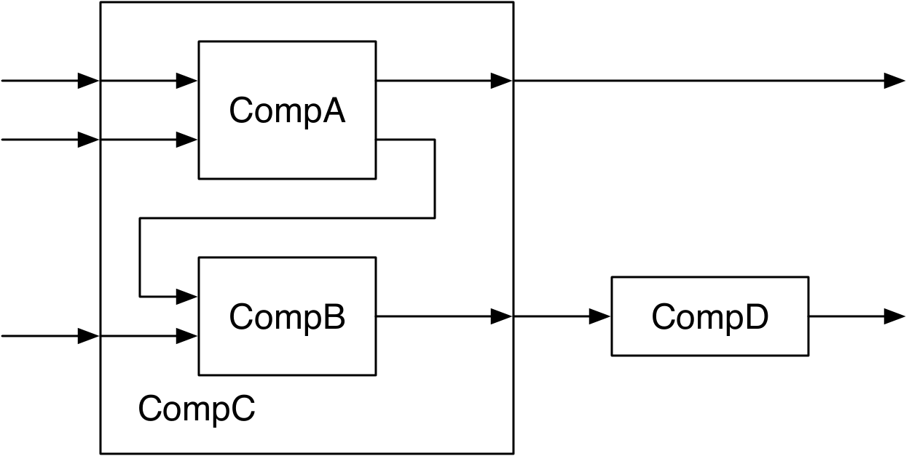
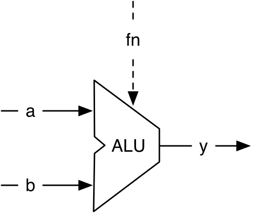

# Chapter 4 — Components

A larger design is built from **components** (Chisel calls them *modules*),
often nested into a hierarchy. Each component has an interface of input and
output **ports** — like the pins of a chip — and you build a system by wiring
components together. This chapter shows how to define a module, instantiate it,
and connect it to others: first a counter assembled from an adder and a
register, then a small hierarchy of nested components, an ALU (introducing the
`switch`/`is` construct), and finally the `<>` bulk-connection operator.

*Conventions: every file path is relative to `tutorial/ch04-components/`, and
every command is run from that folder.*

## What's in this project

```
ch04-components/
├── build.sbt · project/build.properties
├── figures/                        chapter diagrams (PNG)
├── src/main/scala/
│   ├── components.scala            all modules of the chapter
│   └── Generate.scala              emits Count10.sv and Alu.sv
└── src/test/scala/
    └── ComponentsTest.scala        checks Count10 and the Alu
```

---

## 4.1 Components in Chisel are modules

A component `extends Module` and holds its interface in a field `io`, built from
a `Bundle` wrapped in `IO(...)`. Each field is wrapped in `Input(...)` or
`Output(...)` — **direction is from the component's own point of view**. Ports
are accessed with dot notation (`io.a`).

We build a counter from two tiny components. First the **adder** — two 8-bit
inputs, one 8-bit output:

<p align="center">
  
</p>

***Figure 4.1** — An adder component: inputs `a`, `b`, output `y`.*

`src/main/scala/components.scala`
```scala
class Adder extends Module {
  val io = IO(new Bundle {
    val a = Input(UInt(8.W))
    val b = Input(UInt(8.W))
    val y = Output(UInt(8.W))
  })

  io.y := io.a + io.b
}
```

Next the **register** component — an 8-bit register with input `d`, output `q`:

<p align="center">
  
</p>

***Figure 4.2** — A register component.*

`src/main/scala/components.scala`
```scala
class Register extends Module {
  val io = IO(new Bundle {
    val d = Input(UInt(8.W))
    val q = Output(UInt(8.W))
  })

  val reg = RegInit(0.U)
  reg := io.d
  io.q := reg
}
```

Now wire them into a counter that runs 0→9 and wraps. An adder adds 1 to
`count`; a multiplexer picks between that sum and 0; the result feeds the
register, whose output is `count`:

<p align="center">
  
</p>

***Figure 4.3** — `Count10` built from an `Adder` and a `Register`.*

`src/main/scala/components.scala`
```scala
class Count10 extends Module {
  val io = IO(new Bundle {
    val dout = Output(UInt(8.W))
  })

  val add = Module(new Adder())
  val reg = Module(new Register())

  val count = reg.io.q              // the register output
  add.io.a := 1.U                   // connect the adder
  add.io.b := count
  val result = add.io.y
  val next = Mux(count === 9.U, 0.U, result)  // Mux + register input
  reg.io.d := next
  io.dout := count
}
```

Key idea: a submodule is created with `new`, **wrapped in `Module(...)`**, and
bound to a `val` (`add`, `reg`). You then reach its ports through `.io`
(`add.io.a`, `reg.io.q`).

---

## 4.2 Nested components

Real designs nest components into a hierarchy. In the example below, `CompC`
contains `CompA` and `CompB`; `CompD` sits beside `CompC`; a `TopLevel` wires
`CompC` and `CompD` together.

<p align="center">
  
</p>

***Figure 4.4** — A hierarchy of components. `CompC` is assembled from `CompA`
and `CompB`; one output of `CompA` feeds `CompB`. `CompD` is at the same level
as `CompC`.*

The leaf components are shown with **empty bodies** — this section is about
*connecting* components, not their function (the comment `// function of A`
marks where logic would go):

`src/main/scala/components.scala`
```scala
class CompA extends Module {
  val io = IO(new Bundle {
    val a = Input(UInt(8.W));  val b = Input(UInt(8.W))
    val x = Output(UInt(8.W)); val y = Output(UInt(8.W))
  })
  // function of A
}

class CompB extends Module {
  val io = IO(new Bundle {
    val in1 = Input(UInt(8.W)); val in2 = Input(UInt(8.W))
    val out = Output(UInt(8.W))
  })
  // function of B
}
```

`CompC` creates A and B with `Module(new ...)` and connects them:

`src/main/scala/components.scala`
```scala
class CompC extends Module {
  val io = IO(new Bundle {
    val inA = Input(UInt(8.W)); val inB = Input(UInt(8.W)); val inC = Input(UInt(8.W))
    val outX = Output(UInt(8.W)); val outY = Output(UInt(8.W))
  })

  val compA = Module(new CompA())
  val compB = Module(new CompB())

  compA.io.a := io.inA            // connect A
  compA.io.b := io.inB
  io.outX := compA.io.x
  compB.io.in1 := compA.io.y      // A's y feeds B's in1
  compB.io.in2 := io.inC
  io.outY := compB.io.out
}
```

`CompD` and the `TopLevel` that ties everything together are also in
`components.scala` (`class CompD`, `class TopLevel`).

> **Why these don't generate Verilog:** because `CompA`/`CompB`/`CompD` have no
> logic, their outputs are never driven. Chisel refuses to emit an
> unconnected sink (`io_x not fully initialized`), so `TopLevel` cannot be
> elaborated. That's expected here — they exist only to show wiring. `Count10`
> and `Alu` below *are* complete and do generate.

> **Rule of thumb (from the book):** a component's interface is verbose, so make
> the component's *function* at least as long as its interface — otherwise the
> boilerplate dominates.

---

## 4.3 An Arithmetic Logic Unit (ALU)

An ALU computes one of several functions of two inputs, selected by a function
input `fn`. It is usually combinational (no state).

<p align="center">
  
</p>

***Figure 4.5** — An ALU: data inputs `a`, `b`, function select `fn`, output `y`.*

This ALU supports add / subtract / or / and, selected by a 2-bit `fn`. It uses
the **`switch`/`is`** construct (a readable multi-way selection), which needs
`import chisel3.util._`:

`src/main/scala/components.scala`
```scala
class Alu extends Module {
  val io = IO(new Bundle {
    val a = Input(UInt(16.W))
    val b = Input(UInt(16.W))
    val fn = Input(UInt(2.W))
    val y = Output(UInt(16.W))
  })

  io.y := 0.U                       // a default is required

  switch(io.fn) {
    is(0.U) { io.y := io.a + io.b }
    is(1.U) { io.y := io.a - io.b }
    is(2.U) { io.y := io.a | io.b }
    is(3.U) { io.y := io.a & io.b }
  }
}
```

A default assignment before the `switch` is required so `io.y` is driven on
every path (otherwise Chisel would infer a latch and reject it).

---

## 4.4 Bulk connections with `<>`

Wiring bundles field-by-field is tedious. The **`<>`** operator connects two
bundles by matching leaf-field **names** and directions. In the book (an older
Chisel), it connected the names present in both bundles and simply left any
unmatched names unconnected. Three pipeline stages — `Fetch`, `Decode`,
`Execute` — connect with just two `<>` operators, plus one to the parent port:

`src/main/scala/components.scala`
```scala
val fetch = Module(new Fetch())
val decode = Module(new Decode())
val execute = Module(new Execute)

fetch.io <> decode.io     // instr, pc  (Fetch out -> Decode in)
decode.io <> execute.io   // aluOp, regA, regB
io <> execute.io          // result (Execute out -> parent out)
```

The `Fetch`/`Decode`/`Execute`/`Processor` definitions are in
`components.scala`.

### Chisel 6 changed `<>` — this `Processor` no longer elaborates

This is the one place the book diverges from Chisel 6. **Chisel 6's `<>`
requires both bundles to carry the *same* leaf fields;** it no longer silently
ignores unmatched names. Here `fetch.io` has `{instr, pc}` while `decode.io`
also has `{aluOp, regA, regB}`, so `fetch.io <> decode.io` now fails at
elaboration:

```
Connection between left (Fetch.io) and source (Decode.io) failed
@.regB: Left Record missing field (regB).
```

(The book's `Processor` is kept in `components.scala` for reference, alongside
the other illustrative-only modules; nothing elaborates it, so the project
still compiles.)

The idiomatic fix is to **group the signals that cross each stage boundary into
their own bundle**, so every `<>` connects two bundles of *identical* shape. A
reworked `Processor6` does exactly that, with trivial stage logic added so
there is something to simulate and test:

`src/main/scala/components.scala`
```scala
// signals crossing each stage boundary, grouped into a bundle
class FetchDecode extends Bundle {
  val instr = UInt(32.W)
  val pc = UInt(32.W)
}
class DecodeExecute extends Bundle {
  val aluOp = UInt(5.W)
  val regA = UInt(32.W)
  val regB = UInt(32.W)
}

class Processor6 extends Module {
  val io = IO(new Bundle {
    val result = Output(UInt(32.W))
  })

  val fetch = Module(new Fetch6())
  val decode = Module(new Decode6())
  val execute = Module(new Execute6())

  decode.io.in <> fetch.io.out    // FetchDecode   (Fetch out -> Decode in)
  execute.io.in <> decode.io.out  // DecodeExecute (Decode out -> Execute in)
  io.result := execute.io.result  // single field: a plain := is clearest
}
```

Each stage exposes its boundary bundle as one `Input`/`Output` port (see
`Fetch6`/`Decode6`/`Execute6` in `components.scala`), so `decode.io.in` and
`fetch.io.out` are both a `FetchDecode` and connect cleanly. The last hop is a
single scalar into the parent port, so a plain `:=` reads better than `<>`
(the parent `io` and `execute.io` don't have matching field sets either).

With `Fetch6` emitting `instr = 42`, `pc = 100`, and `Execute6` adding the two
forwarded values, the whole pipeline reduces to `result = 142` — which is what
the tests below check.

---

## 4.5 Build, run, and check

### Run the tests

```
$ sbt test
```

Expected output:

```
[info] ComponentsTest:
[info] Count10
[info] - should count 0..9 and wrap
[info] Alu
[info] - should add, subtract, or, and
[info] Processor6
[info] - should carry values through the <> bulk connections
[info] Processor6
[info] - should hold the result steady across cycles (no state)
[info] Run completed in 1 second, 160 milliseconds.
[info] Total number of tests run: 4
[info] Suites: completed 1, aborted 0
[info] Tests: succeeded 4, failed 0, canceled 0, ignored 0, pending 0
[info] All tests passed.
```

### Generate SystemVerilog

```
$ sbt "runMain Generate"
```

Writes `Count10.sv`, `Alu.sv`, and `Processor6.sv`. In `Count10.sv` the module
has an `output [7:0] io_dout` plus the implicit `clock`/`reset`; in `Alu.sv` the
`switch` becomes a multiplexer indexed by `io_fn` (`assign io_y = _GEN[io_fn]`).
`Processor6.sv` shows the payoff of a purely-combinational, constant-fed
pipeline: firtool flattens the three stages and folds the arithmetic away
entirely, leaving just the top-level port:

```systemverilog
module Processor6(
  input         clock,
                reset,
  output [31:0] io_result
);

  assign io_result = 32'h8E;   // 142 = 42 + 100
endmodule
```

---

## 4.6 Recap

- A component `extends Module`; ports live in `io = IO(new Bundle{ ... })`,
  each `Input`/`Output` from the module's own viewpoint.
- Instantiate a submodule with `Module(new X())`, bind it to a `val`, and reach
  its ports via `.io`.
- Build hierarchy by connecting submodule ports with `:=`, or connect whole
  bundles by name with `<>`. In Chisel 6 `<>` requires both bundles to have the
  *same* leaf fields, so group each stage boundary's signals into a shared
  bundle (see `Processor6`) rather than relying on the book's lenient behavior.
- `switch`/`is` (from `chisel3.util._`) expresses multi-way selection; give the
  output a default first.

## 4.7 Exercises

1. **Extend the ALU.** The four `fn` codes 0–3 are taken, so widen `fn` to 3
   bits and add XOR (`is(4.U){ io.y := io.a ^ io.b }`), regenerate, and add an
   `expect` for it in `ComponentsTest.scala`.
2. **Change the modulus.** Make `Count10` count to 15 instead of 9 (`count ===
   15.U`), and update the test loop.
3. **Give a leaf a function.** Implement `CompD` (e.g. `io.out := io.in + 1.U`),
   then add `emitVerilog(new CompD())` to `Generate` and confirm it now
   elaborates.

Back to the **[tutorial index](../README.md)**.
Previous: **[Chapter 3 — Build Process and Testing](../ch03-build-and-testing/README.md)**.
Next: **[Chapter 5 — Combinational Building Blocks](../ch05-combinational-building-blocks/README.md)**.
