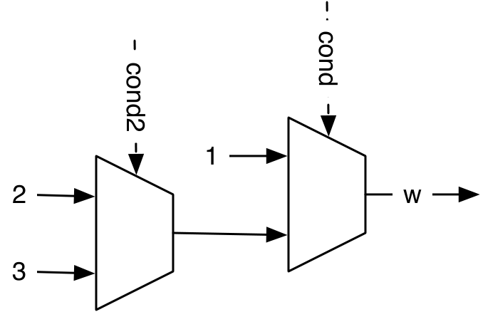
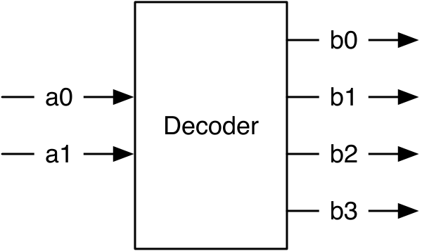
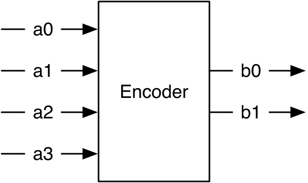
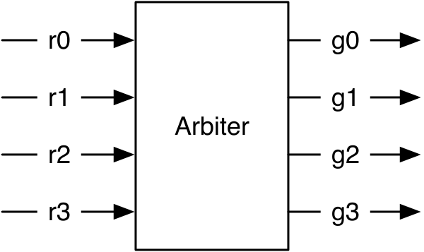
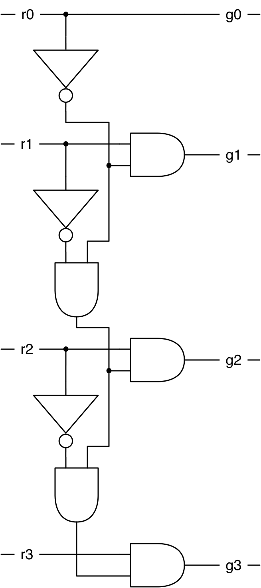
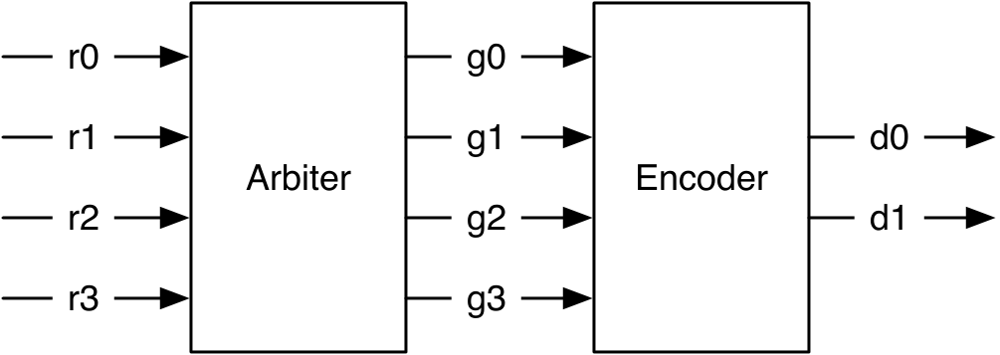
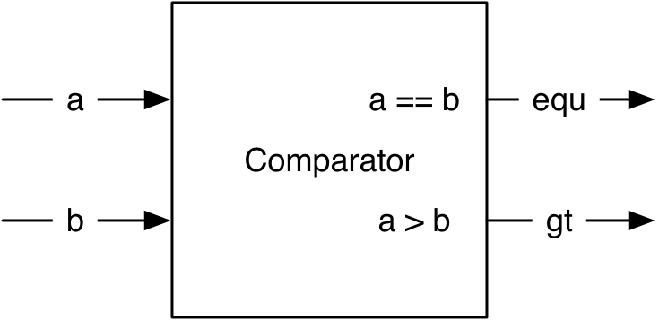

# Chapter 5 — Combinational Building Blocks

This chapter collects the standard combinational circuits you reach for again
and again: decoders, encoders, arbiters, a priority encoder, and a comparator.
Along the way it shows the Chisel ways to *describe* combinational logic —
named Boolean expressions and the conditional constructs `when` /
`.elsewhen` / `.otherwise` / `WireDefault` — and introduces the first
**hardware generator** idea: a Scala `for` loop that builds repeated hardware.

*Conventions: every file path is relative to
`tutorial/ch05-combinational-building-blocks/`, and every command is run from
that folder.*

## What's in this project

```
ch05-combinational-building-blocks/
├── build.sbt · project/build.properties
├── figures/
├── src/main/scala/
│   ├── Combinational.scala   Boolean exprs + when/otherwise/elsewhen/WireDefault
│   ├── EncDec.scala          decoder + encoder (+ generated 16-bit encoder)
│   ├── arbiter.scala         3 arbiter styles (manual, table, generator loop)
│   ├── Comparator.scala      equal / greater-than
│   └── Generate.scala        emits EncDec.sv, Arbiter3Loop.sv, Comparator.sv
└── src/test/scala/
    ├── CombinationalTest.scala
    ├── EncDecTest.scala
    ├── ArbiterTest.scala
    └── ComparatorTest.scala
```

---

## 5.1 Describing combinational circuits

The simplest form is a **named Boolean expression** — assign it to a Scala
`val`, then reuse it:

`src/main/scala/Combinational.scala`
```scala
val e = (a & b) | c   // a named Boolean expression
val f = ~e            // reused in another expression
```

`e` is fixed: reassigning with Scala `=` gives *reassignment to val*, and using
Chisel `:=` gives a runtime *Cannot reassign to read-only*.

For conditional logic, declare a `Wire`, give it a default, and update it with
**`when`**. This describes a **multiplexer** (select `cond` between 0 and 3) —
not sequential "if" execution:

`src/main/scala/Combinational.scala`
```scala
val w = Wire(UInt())

w := 0.U
when (cond) {
  w := 3.U
}
```

`when` has an else called **`.otherwise`**; assigning in every branch means no
separate default is needed:

`src/main/scala/Combinational.scala`
```scala
when (cond) {
  w := 1.U
} .otherwise {
  w := 2.U
}
```

A chain with **`.elsewhen`** builds a *priority* chain of multiplexers (earlier
conditions win):

`src/main/scala/Combinational.scala`
```scala
when (cond) {
  w := 1.U
} .elsewhen (cond2) {
  w := 2.U
} .otherwise {
  w := 3.U
}
```

<p align="center">
  
</p>

***Figure 5.1** — A `when`/`.elsewhen`/`.otherwise` chain becomes a chain of
2:1 multiplexers, with priority toward the first condition.*

Finally, **`WireDefault`** folds the default into the declaration:

`src/main/scala/Combinational.scala`
```scala
val w = WireDefault(0.U)

when (cond) {
  w := 3.U
}
```

> **Why `when` and not Scala's `if`?** `when`/`.elsewhen`/`.otherwise` generate
> *hardware* (multiplexers) that exist every cycle. Scala's `if`/`else` run once
> at generation time and choose *what hardware to build* — used when writing
> generators (see the arbiter loop below).

---

## 5.2 Decoder

A **decoder** turns an *n*-bit binary number into a one-hot signal of up to
2ⁿ bits (exactly one bit set).

<p align="center">
  
</p>

***Figure 5.2** — A 2-to-4 decoder.*

Its truth table:

| a (in) | b (out) |
|:------:|:-------:|
| 00 | 0001 |
| 01 | 0010 |
| 10 | 0100 |
| 11 | 1000 |

A **`switch`** statement (from `chisel3.util._`) reads exactly like the table.
Even though every input is listed, Chisel still requires a default (`result :=
0.U`) to avoid an unintended latch:

`src/main/scala/EncDec.scala`
```scala
result := 0.U
switch(sel) {
  is (0.U) { result := 1.U }
  is (1.U) { result := 2.U }
  is (2.U) { result := 4.U }
  is (3.U) { result := 8.U }
}
```

Looking at the table, the pattern is just "shift a 1 left by `sel`", which is a
one-liner that also scales to any width:

`src/main/scala/EncDec.scala`
```scala
result := 1.U << sel
```

> **Last-connect note:** `EncDec.scala` shows all three formulations
> (UInt switch, binary-literal switch, and the shift) one after another. Chisel
> keeps the **last** assignment, so the shift is what actually drives `decout`;
> the switches are there to compare styles.

---

## 5.3 Encoder

An **encoder** is the inverse: a one-hot input to a binary output.

<p align="center">
  
</p>

***Figure 5.3** — A 4-to-2 encoder. Non-one-hot inputs are undefined, so a
default catches them.*

| a (in) | b (out) |
|:------:|:-------:|
| 0001 | 00 |
| 0010 | 01 |
| 0100 | 10 |
| 1000 | 11 |
| ???? | ?? (default) |

`src/main/scala/EncDec.scala`
```scala
b := "b00".U
switch (a) {
  is ("b0001".U) { b := "b00".U }
  is ("b0010".U) { b := "b01".U }
  is ("b0100".U) { b := "b10".U }
  is ("b1000".U) { b := "b11".U }
}
```

Unlike the decoder, there's no neat one-liner. For a *wide* encoder we write a
small **generator** with a Scala `for` loop (this loop runs at build time — it
is *not* a hardware counter). Each `Vec` element is the index `i` when bit `i`
of the input is set, else 0; OR-reducing them gives the result:

`src/main/scala/EncDec.scala`
```scala
val v = Wire(Vec(16, UInt(4.W)))
v(0) := 0.U
for (i <- 1 until 16) {
  v(i) := Mux(hotIn(i), i.U, 0.U) | v(i - 1)
}
val encOut = v(15)
```

---

## 5.4 Arbiter

An **arbiter** grants a shared resource to one of several requesters. This is a
*priority* arbiter: lower bit index = higher priority (e.g. request `0101` →
grant `0001`).

<p align="center">
  
</p>

***Figure 5.4** — Symbol of a 4-bit arbiter: requests `r0..r3`, grants `g0..g3`.*

Grant *i* is asserted only when request *i* is set **and** no lower request won.
The schematic chains a "not granted so far" signal down the priority order:

<p align="center">
  
</p>

***Figure 5.5** — The 4-bit arbiter: each grant ANDs its request with the
"nobody-lower-won" chain.*

We show three equivalent styles. **(1) Written out by hand** for 3 requests,
using `Vec`s of `Bool`:

`src/main/scala/arbiter.scala`
```scala
val grant = VecInit(false.B, false.B, false.B)
val notGranted = VecInit(false.B, false.B)

grant(0) := request(0)
notGranted(0) := !grant(0)
grant(1) := request(1) && notGranted(0)
notGranted(1) := !grant(1) && notGranted(0)
grant(2) := request(2) && notGranted(1)
```

**(2) Directly as a truth table** with `switch`:

`src/main/scala/arbiter.scala`
```scala
val grant = WireDefault("b0000".U(3.W))
switch (request) {
  is ("b000".U) { grant := "b000".U }
  is ("b001".U) { grant := "b001".U }
  is ("b010".U) { grant := "b010".U }
  is ("b011".U) { grant := "b001".U }
  // ... 100, 101, 110, 111
}
```

**(3) As a parameterized generator** — the same chain built with a `for` loop,
so it scales to `n` requests:

`src/main/scala/arbiter.scala`
```scala
val grant = VecInit.fill(n)(false.B)
val notGranted = VecInit.fill(n)(false.B)

grant(0) := request(0)
notGranted(0) := !grant(0)
for (i <- 1 until n) {
  grant(i) := request(i) && notGranted(i - 1)
  notGranted(i) := !grant(i) && notGranted(i - 1)
}
```

---

## 5.5 Priority encoder

Combine an arbiter with an encoder and you get a **priority encoder**: the
arbiter first reduces any input to a single highest-priority bit, which the
encoder then turns into a binary index. This removes the plain encoder's
"input must be one-hot" restriction.

<p align="center">
  
</p>

***Figure 5.6** — An arbiter feeding an encoder makes a priority encoder.*

---

## 5.6 Comparator

Two outputs — equal and greater-than — are enough for every comparison
(`a >= b` is `equ || gt`; `a <= b` is `!gt`). It's so short it's usually inlined
rather than made a module:

<p align="center">
  
</p>

***Figure 5.7** — A comparator with `equ` and `gt` outputs.*

`src/main/scala/Comparator.scala`
```scala
val equ = a === b
val gt = a > b
```

---

## 5.7 Build, run, and check

```
$ sbt test
```

Expected tail (11 tests across 4 suites):

```
[info] Run completed in 1 second, 210 milliseconds.
[info] Total number of tests run: 11
[info] Suites: completed 4, aborted 0
[info] Tests: succeeded 11, failed 0, canceled 0, ignored 0, pending 0
[info] All tests passed.
```

Generate SystemVerilog:

```
$ sbt "runMain Generate"
```

writes `EncDec.sv`, `Arbiter3Loop.sv`, and `Comparator.sv`.

---

## 5.8 Recap

- Describe combinational logic with named expressions or `when` /
  `.elsewhen` / `.otherwise` / `WireDefault`; always drive every path (or use a
  default) so no latch is inferred.
- `switch`/`is` reads like a truth table (needs `chisel3.util._`).
- A decoder is `1.U << sel`; an encoder is a switch, or a `for`-loop generator
  for wide inputs.
- A priority arbiter chains a "nobody-lower-won" signal; a `for` loop turns it
  into a parameterized generator.
- Scala `for`/`if` run at *build time* to generate hardware; `when` builds
  hardware that runs every cycle.

## 5.9 Exercise

Build a **7-segment display decoder**: a combinational circuit mapping a 4-bit
input (0–15) to the 7 segment-enable bits, using a `switch`. Add a test that
checks a few digits, and (optionally) wire it to switches and a display on an
FPGA board.

Back to the **[tutorial index](../README.md)**.
Previous: **[Chapter 4 — Components](../ch04-components/README.md)**.
Next: **[Chapter 6 — Sequential Building Blocks](../ch06-sequential-building-blocks/README.md)**.
