# Chapter 6 — Sequential Building Blocks

Sequential circuits are circuits whose outputs depend on the inputs *and* on
past values — they have **state**. The state element is the **register**
(a bank of D flip-flops that updates on the rising clock edge). This chapter
starts from the register and its variants, then builds the sequential circuits
you use constantly: counters, tick/timing generators, a one-shot timer,
pulse-width modulation, shift registers, and on-chip memory.

*Conventions: every file path is relative to
`tutorial/ch06-sequential-building-blocks/`, and every command is run from that
folder.*

> The book shows several **waveform** figures in this chapter (for the register,
> the enable, and the tick generator). Those are generated by LaTeX and aren't
> available as images here, so this page uses the **schematic** figures and
> describes the timing in prose. You can always produce a real waveform yourself
> with `WriteVcdAnnotation` (see Chapter 3) and view the `.vcd` in GTKWave.

## What's in this project

```
ch06-sequential-building-blocks/
├── build.sbt · project/build.properties
├── figures/
├── src/main/scala/
│   ├── Registers.scala      register forms (RegInit, RegNext, ...)
│   ├── Counter.scala        Count100 + 5 counter styles (abstract Counter base)
│   ├── Timer.scala          one-shot down-counter timer
│   ├── Pwm.scala            PWM generator function + LED fade modulation
│   ├── ShiftRegister.scala  delay / serial-in-parallel-out / parallel-in-serial-out
│   ├── memory.scala         SyncReadMem: plain, forwarding, write-first
│   └── Generate.scala       emits SystemVerilog for the modules
└── src/test/scala/
    ├── RegisterTest.scala · CounterTest.scala · TimerTest.scala
    ├── ShiftRegisterTest.scala · PwmTest.scala · MemoryTest.scala
```

---

## 6.1 Registers

A register captures its input `D` on the rising clock edge and holds it at `Q`.
The clock is global and implicit in Chisel — you never wire it.

<p align="center">
  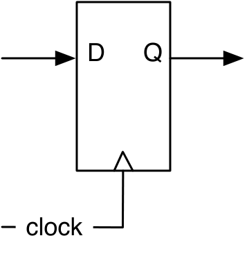
</p>

***Figure 6.1** — A register: input `D`, output `Q`, clocked on the rising edge
(the little triangle).*

`src/main/scala/Registers.scala`
```scala
val reg = RegInit(0.U(8.W))  // resets to 0
reg := d                     // connect the input
val q = reg                  // read the output by name

val nextReg = RegNext(d)     // define + connect in one step
val bothReg = RegNext(d, 0.U) // ... with a reset value
```

`RegInit` gives a **synchronous reset**: conceptually a multiplexer selects the
init value when `reset` is high.

<p align="center">
  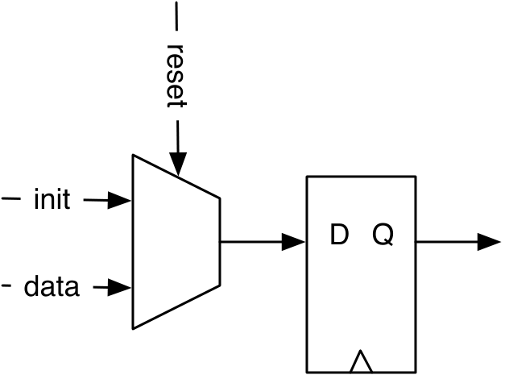
</p>

***Figure 6.2** — Synchronous reset adds a mux on the input (init value vs. data).*

A very common pattern is a register with an **enable**: capture the input only
when `enable` is high, otherwise hold. It's a mux that feeds the output back:

<p align="center">
  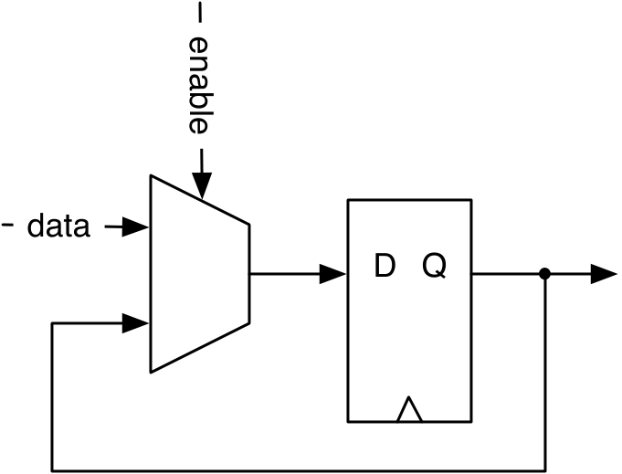
</p>

***Figure 6.3** — A register with enable: when `enable` is low the output feeds
back, so the value is held.* Chisel spells this `RegEnable(d, enable)` (or a
`when(enable){ reg := d }`).

---

## 6.2 Counters

The most basic sequential circuit: a register feeding an adder feeding back.

<p align="center">
  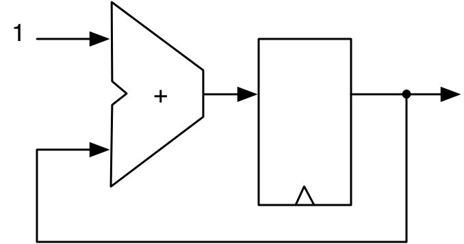
</p>

***Figure 6.4** — A free-running counter (register + adder). A 4-bit one counts
0..15 and wraps.*

`Count100` wraps at 9 using a `Mux`:

`src/main/scala/Counter.scala`
```scala
val cntReg = RegInit(0.U(8.W))
cntReg := Mux(cntReg === 9.U, 0.U, cntReg + 1.U)
```

To count **events** rather than every cycle, increment under a condition:

<p align="center">
  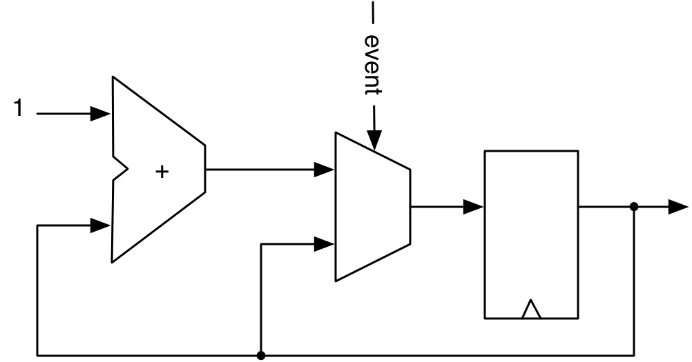
</p>

***Figure 6.5** — An event counter increments only when its condition holds.*

The same "count to N and wrap" can be written with `when`, with a `Mux`, counting
down, or produced by a **function** (a lightweight generator). All four extend a
shared abstract `Counter`, so one test drives them all:

`src/main/scala/Counter.scala`
```scala
// when form
cntReg := cntReg + 1.U
when(cntReg === N) { cntReg := 0.U }

// a function that returns a counter
def genCounter(n: Int) = {
  val cntReg = RegInit(0.U(8.W))
  cntReg := Mux(cntReg === n.U, 0.U, cntReg + 1.U)
  cntReg
}
val count10 = genCounter(10)
val count99 = genCounter(99)
```

> **Off-by-one:** to count *10* cycles, set `N = 9`. The counter takes values
> `0..N` inclusive.

**The "nerd" counter** — a micro-optimization: count from `N-2` down to `-1` so
detecting the end only checks the **sign bit**, not a full comparator:

`src/main/scala/Counter.scala`
```scala
val MAX = (N - 2).S(8.W)
val cntReg = RegInit(MAX)
io.tick := false.B
cntReg := cntReg - 1.S
when(cntReg(7)) {        // sign bit set => reached -1
  cntReg := MAX
  io.tick := true.B
}
```

### Generating timing (ticks)

Counters give a circuit its sense of *time*: count `n = f_clock / f_tick`
cycles and emit a single-cycle **tick**. That tick is used as an **enable**
(not a derived clock) to run slower logic — blinking an LED, a UART baud rate,
display multiplexing, button debouncing. The `when`/`Mux` counters above set
`io.tick` at the top of the count exactly this way. Always give timing counters
an explicit width so a `0.U` reset value doesn't accidentally infer a 1-bit
register.

---

## 6.3 A one-shot timer

Like a kitchen timer: load a value, count down, assert `done` at 0 and stop.

<p align="center">
  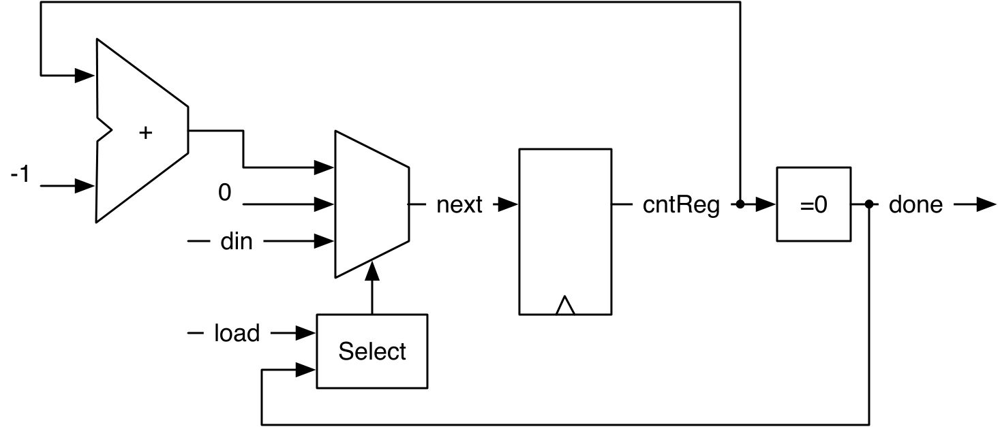
</p>

***Figure 6.6** — A one-shot timer. `load` picks `din`; otherwise `cntReg - 1`;
at 0 the mux holds 0 and `done` is asserted.*

`src/main/scala/Timer.scala`
```scala
val cntReg = RegInit(0.U(8.W))
val done = cntReg === 0.U

val next = WireDefault(0.U)
when (load) {
  next := din
} .elsewhen (!done) {
  next := cntReg - 1.U
}
cntReg := next
```

`load` has priority over the decrement; at 0 neither branch fires so the default
0 holds the timer stopped.

---

## 6.4 Pulse-width modulation (PWM)

A PWM signal has a fixed period and a variable **duty cycle** (fraction of the
period spent high). Low-pass filtering a PWM signal makes a cheap DAC; the eye
does the filtering when dimming an LED.

<p align="center">
  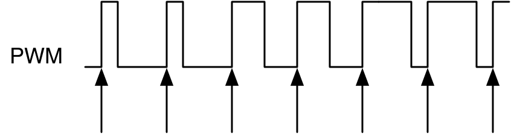
</p>

***Figure 6.7** — PWM: same period, varying high-time (here 25 %, 50 %, 75 %).*

A reusable generator **function** returns the PWM signal (its last expression is
the return value). `unsignedBitLength(n)` sizes the counter to hold `n`:

`src/main/scala/Pwm.scala`
```scala
def pwm(nrCycles: Int, din: UInt) = {
  val cntReg = RegInit(0.U(unsignedBitLength(nrCycles - 1).W))
  cntReg := Mux(cntReg === (nrCycles - 1).U, 0.U, cntReg + 1.U)
  din > cntReg
}

val dout = pwm(10, 3.U)   // high for 3 of every 10 cycles (tested below)
```

The module also *modulates* the duty cycle up and down with a second pair of
registers to fade an LED (`src/main/scala/Pwm.scala`, the `modulationReg` /
`upReg` block).

---

## 6.5 Shift registers

Flip-flops chained output-to-input. In the simplest form it's an N-cycle delay.

<p align="center">
  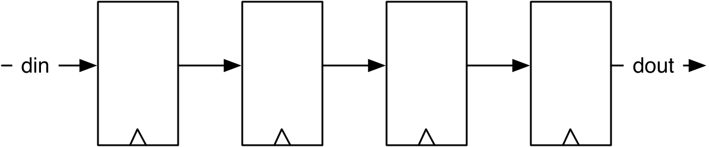
</p>

***Figure 6.8** — A 4-stage shift register: a 4-cycle delay from `din` to `dout`.*

`src/main/scala/ShiftRegister.scala`
```scala
val shiftReg = Reg(UInt(4.W))
shiftReg := shiftReg(2, 0) ## din  // shift left, new bit in at LSB
val dout = shiftReg(3)             // MSB out
```

**Serial-in, parallel-out** (e.g. a UART receiver) shifts in from the MSB and
reads the whole register:

<p align="center">
  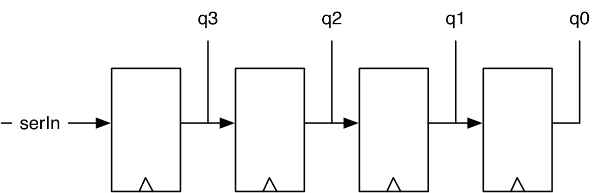
</p>

***Figure 6.9** — Serial-in, parallel-out.*

`src/main/scala/ShiftRegister.scala`
```scala
val outReg = RegInit(0.U(4.W))
outReg := serIn ## outReg(3, 1)
val q = outReg
```

**Parallel-in, serial-out** (e.g. a UART transmitter) loads a word, then shifts
it out one bit per cycle:

<p align="center">
  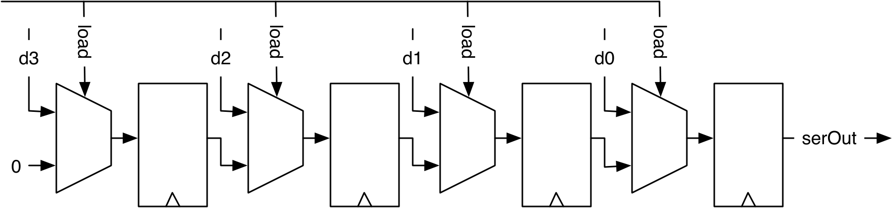
</p>

***Figure 6.10** — Parallel-in, serial-out.*

`src/main/scala/ShiftRegister.scala`
```scala
val loadReg = RegInit(0.U(4.W))
when (load) {
  loadReg := d
} otherwise {
  loadReg := 0.U ## loadReg(3, 1)
}
val serOut = loadReg(0)
```

---

## 6.6 Memory

Small memories can be a `Reg` of a `Vec`, but that's expensive; real memory uses
SRAM / FPGA block RAM. FPGA memories are **synchronous**: the read data appears
**one clock cycle after** the address is applied. Chisel's `SyncReadMem` maps to
these blocks.

<p align="center">
  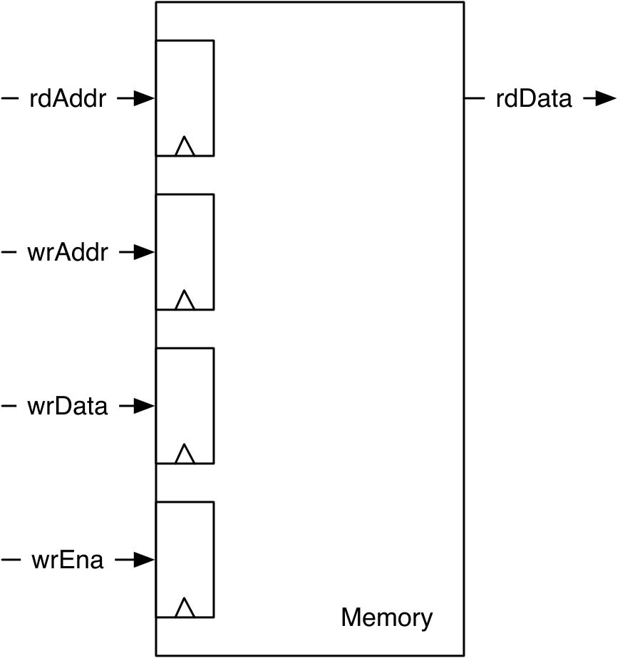
</p>

***Figure 6.11** — A synchronous dual-port memory (registered inputs).*

`src/main/scala/memory.scala`
```scala
val mem = SyncReadMem(1024, UInt(8.W))   // 1 KiB, byte-wide
io.rdData := mem.read(io.rdAddr)
when(io.wrEna) {
  mem.write(io.wrAddr, io.wrData)
}
```

**Read-during-write** to the same address is *undefined* for `SyncReadMem`. To
read the freshly written value, add a **forwarding** path: compare the
addresses, gate with write-enable, and select the (one-cycle-delayed) write data
over the memory output.

<p align="center">
  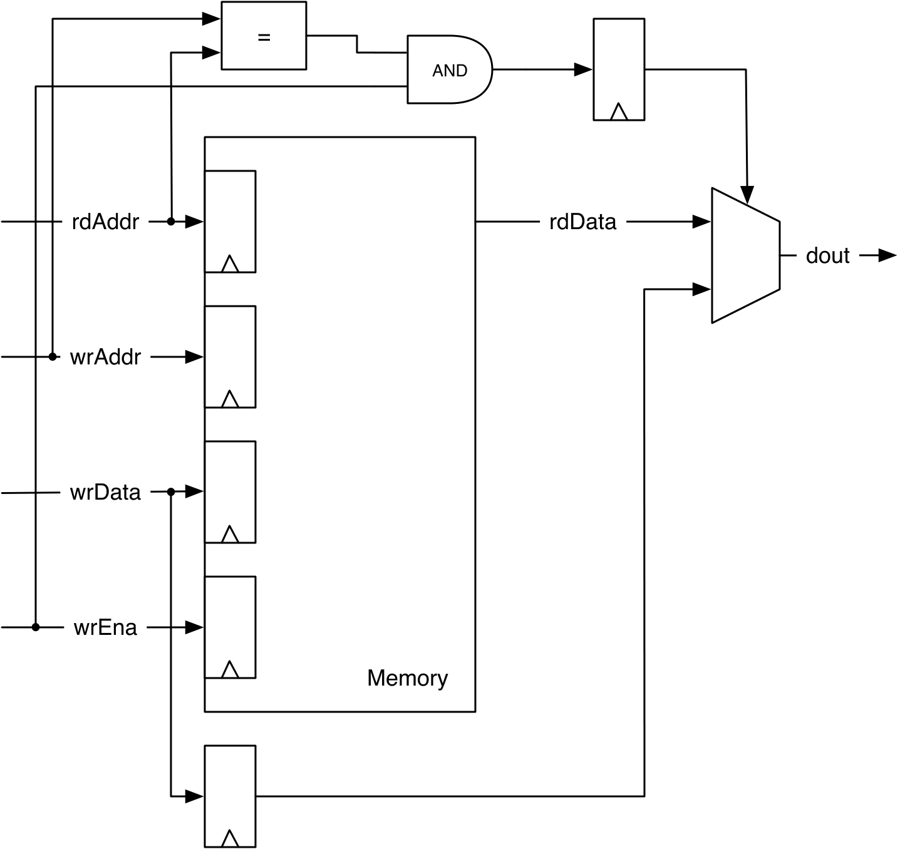
</p>

***Figure 6.12** — Forwarding makes read-during-write return the new value.*

`src/main/scala/memory.scala`
```scala
val wrDataReg = RegNext(io.wrData)
val doForwardReg = RegNext(io.wrAddr === io.rdAddr && io.wrEna)
val memData = mem.read(io.rdAddr)
when(io.wrEna) { mem.write(io.wrAddr, io.wrData) }
io.rdData := Mux(doForwardReg, wrDataReg, memData)
```

Because this pattern is common, `SyncReadMem` can build it for you via a
read-under-write parameter — `WriteFirst` (forward), `ReadFirst`, or `Undefined`:

`src/main/scala/memory.scala`
```scala
val mem = SyncReadMem(1024, UInt(8.W), SyncReadMem.WriteFirst)
```

> Memories can also be initialized from a `.hex`/`.bin` file with
> `loadMemoryFromFile`. That needs a resource file, so it's left out of this
> runnable project; see the book's `memory_init` example.

---

## 6.7 Build, run, and check

```
$ sbt test
```

Expected tail (15 tests across 6 suites):

```
[info] Run completed in 1 second, 447 milliseconds.
[info] Total number of tests run: 15
[info] Suites: completed 6, aborted 0
[info] Tests: succeeded 15, failed 0, canceled 0, ignored 0, pending 0
[info] All tests passed.
```

Generate SystemVerilog:

```
$ sbt "runMain Generate"
```

writes `Registers.sv`, `WhenCounter.sv`, `Timer.sv`, `Pwm.sv`,
`ShiftRegister.sv`, `Memory.sv`, and `ForwardingMemory.sv`.

---

## 6.8 Recap

- A register (`RegInit`/`RegNext`) is the state element; clock and reset are
  implicit. Add an enable to hold values.
- A counter is a register + adder; wrap with `when` or `Mux`, count up or down,
  or generate one with a function. Use a tick as an *enable* for slower logic.
- A timer is a loadable down-counter; PWM is a counter compared against a
  threshold, nicely packaged as a function.
- Shift registers convert between serial and parallel data.
- Use `SyncReadMem` for on-chip memory (read data is one cycle late); add
  forwarding — or `WriteFirst` — for defined read-during-write.

## 6.9 Exercises

1. **Slow tick + display.** Add a counter that produces a single-cycle tick
   every ~500 ms and use it as the enable of a 4-bit counter (as you'd drive a
   7-segment display).
2. **Modulated PWM.** Drive an LED with the modulated PWM in `Pwm.scala`; pick
   the PWM frequency and the modulation frequency.
3. **Memory + FSMs (advanced).** Instantiate a `SyncReadMem` and two state
   machines: one writes a string, the other reads it back (remember the one-cycle
   read latency). Test with `printf`.

Back to the **[tutorial index](../README.md)**.
Previous: **[Chapter 5 — Combinational Building Blocks](../ch05-combinational-building-blocks/README.md)**.
Next: **[Chapter 7 — Input Processing](../ch07-input-processing/README.md)**.
