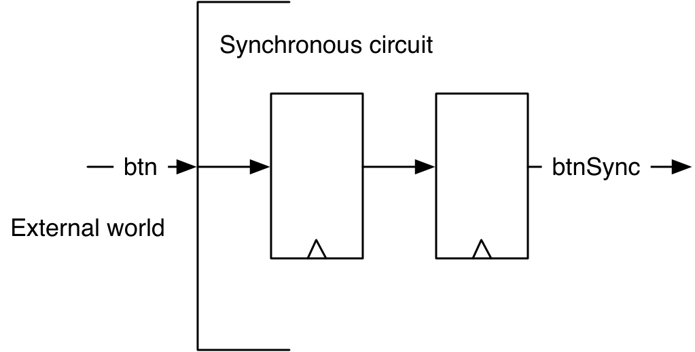
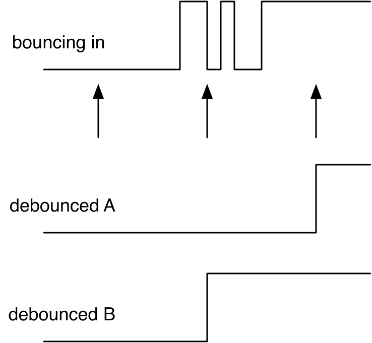
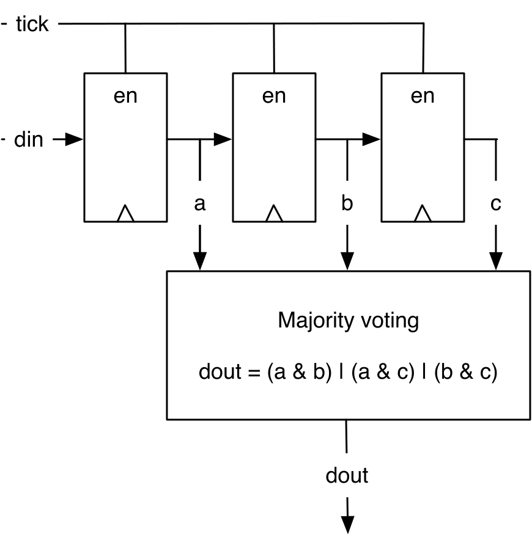

# Chapter 7 — Input Processing

Signals coming from the outside world — buttons, switches, sensors — are
**asynchronous** to your clock: they can change at any instant, bounce, and
carry noise. Feeding them straight into a synchronous circuit causes
metastability, missed or double events, and glitches. This chapter builds the
standard input-processing chain that cleans such signals up: an **input
synchronizer**, a **debouncer**, a **majority-voting** noise filter, and
**rising-edge detection** — plus how to synchronize the **reset** signal itself.
Debouncing and noise filtering could also be handled with external analog
components, but doing it in the digital domain is more cost-efficient.

*Conventions: every file path is relative to `tutorial/ch07-input-processing/`,
and every command is run from that folder.*

## What's in this project

```
ch07-input-processing/
├── build.sbt · project/build.properties
├── figures/
├── src/main/scala/
│   ├── Debounce.scala    Debounce (explicit) + DebounceFunc (function-based)
│   ├── SyncReset.scala   synchronizing the reset signal
│   ├── Counter.scala     WhenCounter (dependency of SyncReset)
│   └── Generate.scala
└── src/test/scala/
    ├── DebounceTest.scala
    └── SyncResetTest.scala
```

---

## 7.1 Asynchronous input and the synchronizer

An asynchronous input can violate a flip-flop's setup/hold time and push it into
**metastability** (an undefined level, briefly). We can't prevent it, but we can
*contain* it: put **two flip-flops** in series at the input. If the first goes
metastable it almost always settles within one clock period, so the second
samples a clean value.

<p align="center">
  
</p>

***Figure 7.1** — The border between the external world and the synchronous
circuit: a two-flip-flop input synchronizer.*

In Chisel it's a one-liner (two chained `RegNext`s):

`src/main/scala/Debounce.scala`
```scala
val btnSync = RegNext(RegNext(btn))
```

Every asynchronous external signal needs a synchronizer — including the reset
(see §7.5).

> **Exception:** an asynchronous input does *not* need synchronization when it
> depends on a synchronous output signal whose maximum propagation delay is
> known. The classic example is interfacing an asynchronous SRAM to a
> synchronous circuit, e.g., a microprocessor — the read data is "asynchronous"
> only in the sense that it isn't generated by a clocked register, but its
> timing relative to the address/enable the processor drove is bounded and known.

---

## 7.2 Debouncing

A mechanical switch **bounces**: it flips between 0 and 1 for a few milliseconds
before settling. Used raw, that looks like many transitions. The fix is to
**sample** the signal with a period longer than the maximum bounce time: at most
one sample lands in the bouncing region, so you still see a single clean
transition.

<p align="center">
  
</p>

***Figure 7.2** — Sampling slower than the bounce time yields one clean
transition (the mid-bounce sample can go either way — both are fine).*

We generate the slow sampling with a counter that emits a single-cycle `tick`
(the timing-tick pattern from Chapter 6). First we pick the divide factor:

```scala
val fac = 100000000/100
```
*illustrative* — the tutorial project passes this same factor in as the
`Debounce` constructor's default argument (`fac: Int = 100000000 / 100`)
rather than a bare `val`, so it can be tuned per instance (see §7.6's test,
which uses a much smaller `fac` to keep simulation short).

On each tick we latch the synchronized input:

`src/main/scala/Debounce.scala`
```scala
val btnDebReg = RegInit(false.B)

val cntReg = RegInit(0.U(32.W))
val tick = cntReg === (fac - 1).U

cntReg := cntReg + 1.U
when (tick) {
  cntReg := 0.U
  btnDebReg := btnSync
}
```

`fac` is the divide factor: e.g. a 100 MHz clock and `fac = 100000000/100` gives
a 100 Hz sample rate (fine for a <10 ms bounce). **Debouncing comes after the
synchronizer** — synchronize first, then process in the digital domain.

---

## 7.3 Majority voting (noise filter)

If the input is noisy (brief spikes), a **majority vote** over the last three
samples removes any change shorter than the sample period. It's a 3-bit shift
register (enabled by `tick`) feeding a majority function.

<p align="center">
  
</p>

***Figure 7.3** — Three tick-enabled samples `a`, `b`, `c` feed
`dout = (a&b) | (a&c) | (b&c)`.*

`src/main/scala/Debounce.scala`
```scala
val shiftReg = RegInit(0.U(3.W))
when (tick) {
  shiftReg := shiftReg(1, 0) ## btnDebReg   // shift left, new sample in LSB
}
val btnClean = (shiftReg(2) & shiftReg(1)) | (shiftReg(2) & shiftReg(0)) | (shiftReg(1) & shiftReg(0))
```

> Majority voting is only rarely needed — reach for it when the input is
> genuinely noisy.

### Edge detection

To turn the clean level into a one-shot event, compare it with its own delayed
value — a rising edge is "high now, low one cycle ago":

`src/main/scala/Debounce.scala`
```scala
val risingEdge = btnClean & !RegNext(btnClean)

val reg = RegInit(0.U(8.W))
when (risingEdge) {
  reg := reg + 1.U   // count one press
}
```

---

## 7.4 Packaging the chain as functions

Each stage is a tiny, reusable building block, so it's natural to write them as
Chisel **functions that return hardware** rather than full modules. `DebounceFunc`
does exactly this — `sync`, `rising`, `tickGen`, and `filter` each build and
return their piece:

`src/main/scala/Debounce.scala`
```scala
def sync(v: Bool) = RegNext(RegNext(v))
def rising(v: Bool) = v & !RegNext(v)
def tickGen() = {
  val reg = RegInit(0.U(log2Up(fac).W))
  val tick = reg === (fac - 1).U
  reg := Mux(tick, 0.U, reg + 1.U)
  tick
}
def filter(v: Bool, t: Bool) = {
  val reg = RegInit(0.U(3.W))
  when (t) { reg := reg(1, 0) ## v }
  (reg(2) & reg(1)) | (reg(2) & reg(0)) | (reg(1) & reg(0))
}
```

`Debounce` and `DebounceFunc` describe the *same* hardware — the function
version is just more composable. (Functions as hardware generators are covered
in depth in Chapter 10.) If useful, those functions can be elevated to some
utility class object, so any module can reuse them without repeating the code.

---

## 7.5 Synchronizing reset

Every digital circuit needs a reset signal to bring registers to a defined
state; in Chisel, that reset state is set via the **`RegInit`** constructor.
A reset is usually an asynchronous input too, so its **release** must be
synchronized — otherwise different registers may leave reset in different
cycles and become inconsistent. Note the nuance either way: a *synchronous*
reset can itself violate a flip-flop's setup/hold time (it's just another
signal into the flip-flop's logic), and even when the reset is wired in as an
*asynchronous* reset input, its *release* still needs to be synchronized to
the clock. Chisel hides `clock` and `reset`, but you can access them: make a
top-level module that synchronizes the external reset and drives the contained
module's reset input.

`src/main/scala/SyncReset.scala`
```scala
class SyncReset extends Module {
  val io = IO(new Bundle() {
    val value = Output(UInt(1.W))
  })

  val syncReset = RegNext(RegNext(reset))  // two-FF synchronizer on reset
  val cnt = Module(new WhenCounter(5))
  cnt.reset := syncReset                   // drive the child's reset input

  io.value := cnt.io.cnt
}
```

---

## 7.6 Build, run, and check

```
$ sbt test
```

Expected tail (3 tests across 2 suites):

```
[info] Run completed in 954 milliseconds.
[info] Total number of tests run: 3
[info] Suites: completed 2, aborted 0
[info] Tests: succeeded 3, failed 0, canceled 0, ignored 0, pending 0
[info] All tests passed.
```

The `DebounceTest` uses a small divide factor (`FAC = 100`) so the sample period
is short enough to simulate. It drives a brief glitch followed by a steady press
and checks the LED counter only advances once the signal is stable across
several samples.

Generate SystemVerilog:

```
$ sbt "runMain Generate"
```

writes `Debounce.sv`, `DebounceFunc.sv`, and `SyncReset.sv`.

---

## 7.7 Recap

- Every asynchronous input needs a **two-flip-flop synchronizer**
  (`RegNext(RegNext(x))`) to contain metastability.
- **Debounce** by sampling slower than the bounce time (a tick-driven register).
- **Majority-vote** three samples to suppress spikes; detect a **rising edge**
  with `x & !RegNext(x)` to make a one-shot event.
- Package small reusable stages as **functions that return hardware**.
- Synchronize the **reset** release with the same two-flip-flop trick and drive a
  submodule's `reset` explicitly.

## 7.8 Exercise

Build a counter incremented by a button and shown on the LEDs. First observe the
bouncing, then add the full chain — synchronizer → debounce → majority vote →
edge detect — and compare. With a low sample frequency (e.g. 1 Hz) you can
simulate bounces by tapping the button quickly before holding it.

Pick a 1 Hz sample frequency by dividing a 100 MHz input clock by 100,000,000
(i.e. `fac = 100000000`). Test the circuit **both** without and with the
debouncing circuit sampling at 1 Hz, so you can directly observe the
difference the debouncer makes. With majority voting enabled, you'll notice
the button now needs to be held for **1–2 seconds** for a reliable increment —
and since the *release* of the button is majority-voted too, the release is
only recognized once the button has been held longer than that same 1–2
second window.

Back to the **[tutorial index](../README.md)**.
Previous: **[Chapter 6 — Sequential Building Blocks](../ch06-sequential-building-blocks/README.md)**.
Next: **[Chapter 8 — Finite-State Machines](../ch08-finite-state-machines/README.md)**.
