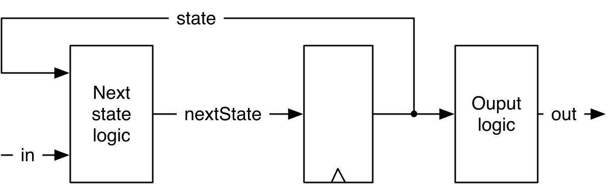
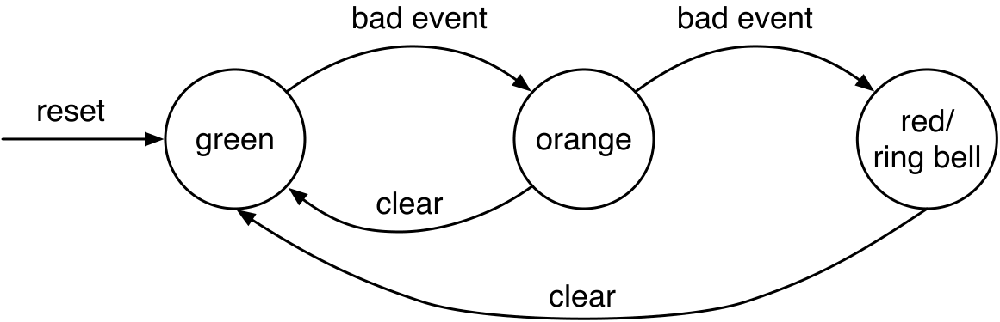
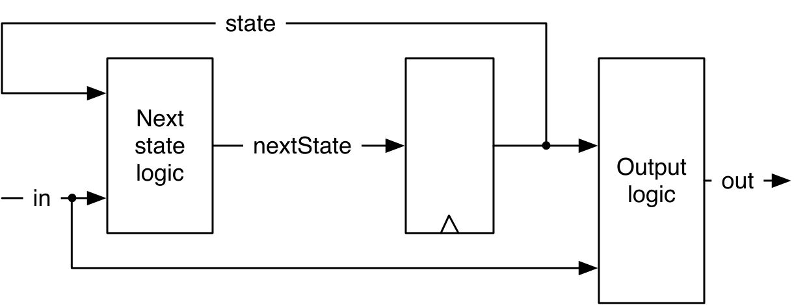
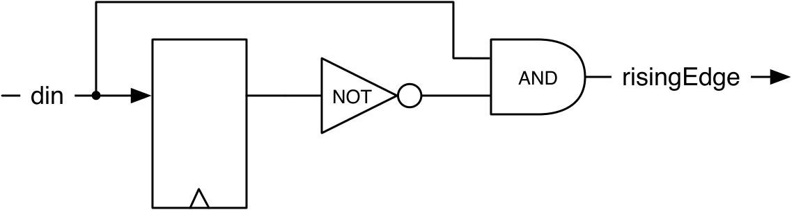
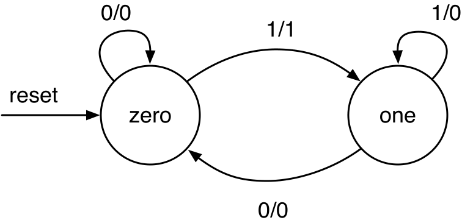
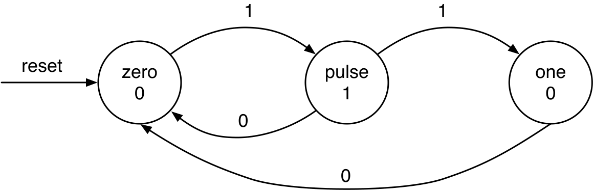

# Chapter 8 — Finite-State Machines

A finite-state machine (FSM) is the workhorse of control logic: a set of
**states**, guarded **transitions** between them, and an **output** computed
from the state. Every FSM is three pieces — a **state register**, **next-state
logic**, and **output logic**. FSMs are also called synchronous sequential
circuits, and have an initial state set on reset.

In principle, *any* digital circuit with registers or other memory can be
described as one single FSM. In practice this isn't useful — try to describe
your laptop as a single FSM. The next chapter shows how to build larger
systems out of smaller FSMs by combining them into **communicating** FSMs.

This chapter builds a Moore FSM (an alarm), then contrasts **Moore** vs.
**Mealy** machines using a rising-edge detector done both ways.

*Conventions: every file path is relative to
`tutorial/ch08-finite-state-machines/`, and every command is run from that
folder.*

## What's in this project

```
ch08-finite-state-machines/
├── build.sbt · project/build.properties
├── figures/
├── src/main/scala/
│   ├── SimpleFsm.scala        Moore alarm FSM (green/orange/red)
│   ├── RisingFsm.scala        Mealy rising-edge detector (2 states)
│   ├── RisingMooreFsm.scala   Moore rising-edge detector (3 states)
│   └── Generate.scala
└── src/test/scala/
    └── FsmTest.scala
```

---

## 8.1 A basic (Moore) FSM

<p align="center">
  
</p>

***Figure 8.1** — A Moore FSM: a state register, next-state logic (from state +
input), and output logic (from state only).*

Our example is an **alarm**: it escalates green → orange → red on repeated *bad
events*, rings a bell in *red*, and resets to green on *clear*.

<p align="center">
  
</p>

***Figure 8.2** — State diagram of the alarm FSM. Arrows are guarded
transitions; the bell output lives inside the `red` state (Moore).*

The same behaviour as a **state table** (bad event has priority over clear, so
clear is "don't care" when a bad event occurs):

| State | Bad event | Clear | Next state | Ring bell |
|-------|:---------:|:-----:|------------|:---------:|
| green | 0 | 0 | green | 0 |
| green | 1 | – | orange | 0 |
| orange | 0 | 0 | orange | 0 |
| orange | 1 | – | red | 0 |
| orange | 0 | 1 | green | 0 |
| red | – | 0 | red | 1 |
| red | 0 | 1 | green | 1 |

At this point we could spend some effort choosing an optimal **state
encoding** — two common options are **binary** and **one-hot** — but we leave
that low-level optimization to the synthesis tool and aim for readable code
instead. In the current version of Chisel, `ChiselEnum` represents states in
**binary** encoding; if a different encoding is wanted (e.g. one-hot), define
Chisel constants for the state names instead of using `ChiselEnum`.

In Chisel, states are symbolic names via **`ChiselEnum`**, the state is a
`RegInit`, next-state logic is a `switch` over the state with input-guarded
`when`s, and the output is a plain expression on the state. The FSM's inputs
and output use the Chisel type `Bool`, and using `switch`/`is` requires
`import chisel3.util._`:

`src/main/scala/SimpleFsm.scala`
```scala
object State extends ChiselEnum {
  val green, orange, red = Value
}
import State._

val stateReg = RegInit(green)

switch (stateReg) {
  is (green)  { when(io.badEvent) { stateReg := orange } }
  is (orange) {
    when(io.badEvent) { stateReg := red }
    .elsewhen(io.clear) { stateReg := green }
  }
  is (red)    { when(io.clear) { stateReg := green } }
}

io.ringBell := stateReg === red   // Moore: output depends only on state
```

> Unlike Verilog/VHDL, you don't need a separate `nextState` wire: a Chisel
> register is a normal value you can assign inside the `switch`.

---

## 8.2 A faster (Mealy) FSM

In a **Moore** machine the output depends only on the state, so an input change
can't affect the output until the *next* clock edge. A **Mealy** machine adds a
combinational path from input to output, so it can react in the *same* cycle.

<p align="center">
  
</p>

***Figure 8.3** — A Mealy FSM: output logic reads the state **and** the input.*

The rising-edge detector as a Mealy machine needs only **two** states; the
output pulse is emitted on the `zero → one` transition:

<p align="center">
  
</p>

***Figure 8.4** — The Mealy rising-edge detector: state is one D flip-flop; the
output compares the current input with the stored value.*

<p align="center">
  
</p>

***Figure 8.5** — Mealy state diagram. Transition labels are `input / output`;
the `1` output appears only on `zero → one`.*

`src/main/scala/RisingFsm.scala`
```scala
object State extends ChiselEnum { val zero, one = Value }
import State._
val stateReg = RegInit(zero)

io.risingEdge := false.B          // default output
switch (stateReg) {
  is(zero) {
    when(io.din) {
      stateReg := one
      io.risingEdge := true.B     // pulse ON the transition (Mealy)
    }
  }
  is(one) {
    when(!io.din) { stateReg := zero }
  }
}
```

> For something this small, the one-liner `val rising = din & !RegNext(din)`
> (Chapter 6) is easier to read and uses the same hardware — prefer it. Use full
> FSMs for circuits with three or more states.

---

## 8.3 Moore vs. Mealy

The same edge detector as a **Moore** machine needs a **third** state, `puls`,
just to hold the output high for exactly one cycle:

<p align="center">
  
</p>

***Figure 8.6** — Moore edge detector: three states; the output lives in `puls`.*

`src/main/scala/RisingMooreFsm.scala`
```scala
object State extends ChiselEnum { val zero, puls, one = Value }
import State._
val stateReg = RegInit(zero)

switch (stateReg) {
  is(zero) { when(io.din)  { stateReg := puls } }
  is(puls) {
    when(io.din) { stateReg := one } .otherwise { stateReg := zero }
  }
  is(one)  { when(!io.din) { stateReg := zero } }
}

io.risingEdge := stateReg === puls  // Moore: output from state only
```

The difference is observable and is exactly what the tests assert:

- **Mealy** (`RisingFsm`): `risingEdge` is high the **same cycle** `din` goes
  high (and is less than a full clock wide in hardware).
- **Moore** (`RisingMooreFsm`): `risingEdge` rises **one cycle later** and is
  exactly one clock wide.

Laid out as a waveform, the two outputs look distinctly different: the Mealy
`risingEdge` follows the rising edge of `din` immediately, combinationally, so
its pulse is *less than one clock period wide*; the Moore `risingEdge` only
rises on the *next* clock tick after `din` goes high, but its pulse is then
*exactly one clock period wide*.

***Figure 8.7** — Mealy and Moore waveforms for the rising-edge detector: the
Mealy output tracks the input edge immediately (a narrow, less-than-a-clock
pulse), while the Moore output lags one cycle behind but is a clean,
full-width pulse.*

**Which to use?** Mealy reacts faster and uses less state, but its
input-to-output combinational path can chain into long paths — or, if
communicating FSMs form a loop, a combinational loop (a design error). Moore
machines cut that path with the state register, so they **compose more safely**.
Prefer Moore for communicating FSMs (next chapter); use Mealy only when
same-cycle reaction is essential.

---

## 8.4 Build, run, and check

```
$ sbt test
```

Expected tail (3 tests):

```
[info] FsmTest:
[info] SimpleFsm
[info] - should ring the bell after two bad events
[info] RisingFsm (Mealy)
[info] - should pulse on the same cycle as the edge
[info] RisingMooreFsm (Moore)
[info] - should pulse one cycle after the edge
[info] Tests: succeeded 3, failed 0, canceled 0, ignored 0, pending 0
[info] All tests passed.
```

Generate SystemVerilog:

```
$ sbt "runMain Generate"
```

writes `SimpleFsm.sv`, `RisingFsm.sv`, and `RisingMooreFsm.sv`.

---

## 8.5 Recap

- An FSM = state register + next-state logic + output logic.
- Encode states with `ChiselEnum`; drive the state `RegInit` from a `switch` of
  input-guarded `when`s. No separate `nextState` wire is needed.
- **Moore**: output from state only (safe to compose, one cycle later).
- **Mealy**: output from state + input (same-cycle, but a combinational path).
- Prefer Moore for communicating FSMs; reserve Mealy for same-cycle reaction.

## 8.6 Exercise

Write a **traffic-light controller** FSM (with a test bench). Ensure a safe
all-red/orange phase when switching directions. For extra interest, add a
priority road and car detectors on the minor road: switch the minor road green
only when a car is detected, then return to the priority road.

*This is a classic FSM exercise; see Dally, §14.3, for a worked example.*

Back to the **[tutorial index](../README.md)**.
Previous: **[Chapter 7 — Input Processing](../ch07-input-processing/README.md)**.
Next: **[Chapter 9 — Communicating State Machines](../ch09-communicating-state-machines/README.md)**.
