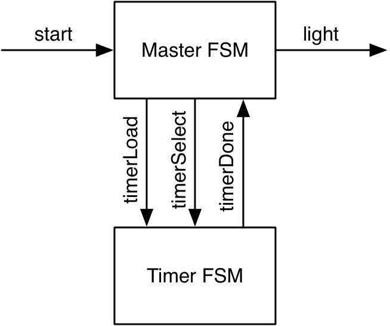
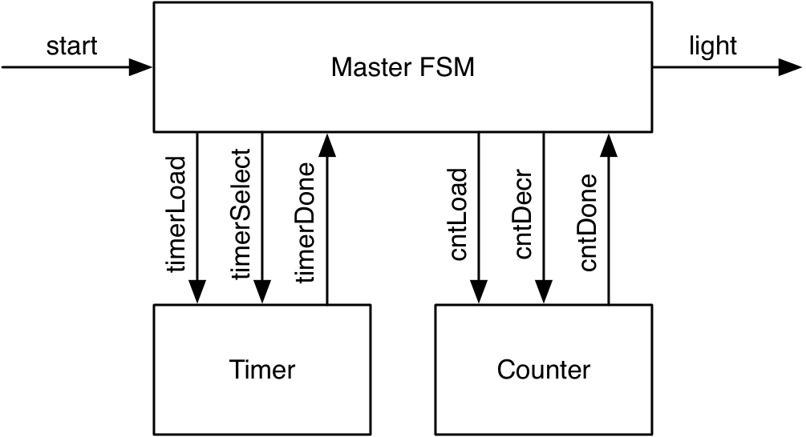
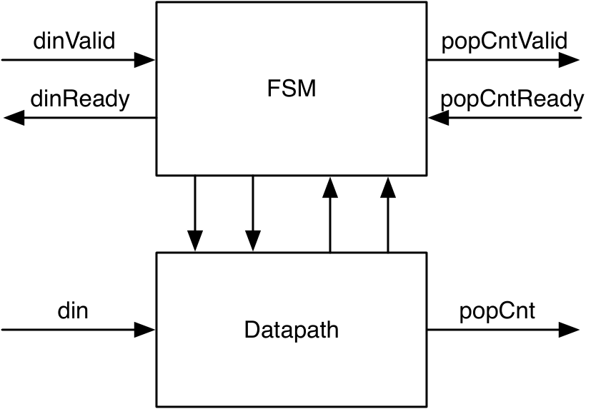
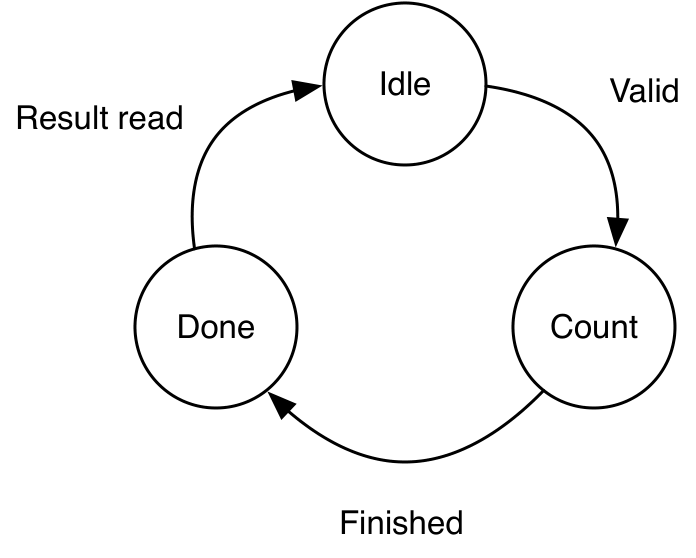
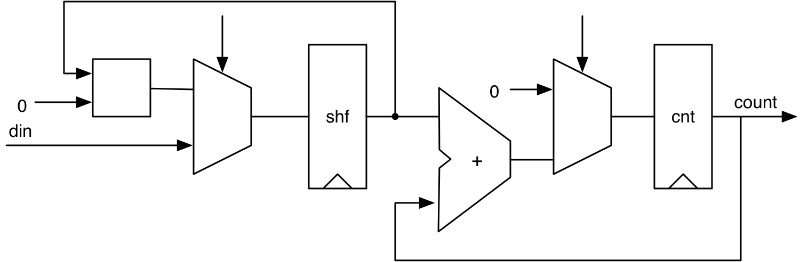
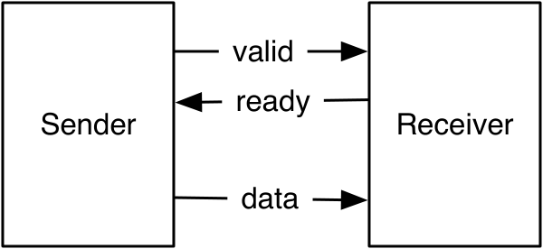

# Chapter 9 — Communicating State Machines

Some problems are too complex for a single FSM. The fix is to **factor** the
design into several smaller FSMs that communicate through signals — one FSM's
output is another's input. This chapter builds a light flasher two ways
(factoring a 27-state machine down to three states), then combines an FSM with a
**datapath** (an FSMD) to compute a popcount, and finishes with the
**ready/valid** handshake interface (`DecoupledIO`) used to move data between
subsystems.

*Conventions: every file path is relative to
`tutorial/ch09-communicating-state-machines/`, and every command is run from
that folder.*

## What's in this project

```
ch09-communicating-state-machines/
├── build.sbt · project/build.properties
├── figures/
├── src/main/scala/
│   ├── Flasher.scala           Flasher (master + timer) and Flasher2 (+ counter)
│   ├── PopulationCount.scala   FSMD: PopCountFSM + PopCountDataPath + top level
│   ├── ReadyValidBuffer.scala  a one-word buffer with DecoupledIO
│   └── Generate.scala
└── src/test/scala/
    ├── FlasherTest.scala · PopulationCountTest.scala · ReadyValidBufferTest.scala
```

---

## 9.1 A light flasher

This example is taken from Dally, Harting & Aamodt's VHDL textbook, Chapter 17.[^dally]

Spec: on a one-cycle `start`, flash the light **three times** — on for 6 cycles,
off for 4 cycles between flashes — then wait. A direct FSM needs **27 states**
(1 idle + 3×6 on + 2×4 off — the state diagram for this direct implementation
is on p. 376 of the same book). Instead, factor it: a **master FSM** does the
flashing logic, a **timer FSM** does the waiting.

<p align="center">
  
</p>

***Figure 9.1** — The flasher as two communicating FSMs. The master drives
`timerLoad`/`timerSelect`; the timer reports `timerDone`.*

The timer is a down-counter loaded with 5 or 3 (for the 6- or 4-cycle
intervals), asserting `timerDone` at 0:

`src/main/scala/Flasher.scala`
```scala
val timerReg = RegInit(0.U)
timerDone := timerReg === 0.U

when(!timerDone) { timerReg := timerReg - 1.U }
when (timerLoad) {
  when (timerSelect) { timerReg := 5.U } .otherwise { timerReg := 3.U }
}
```

The master FSM (`Flasher`) implements the blinking sequence directly, with a
state for every phase — `off`, `flash1`, `space1`, `flash2`, `space2`,
`flash3` — each one waiting for `timerDone` and (in the `off` state) loading
the timer:

`src/main/scala/Flasher.scala`
```scala
switch(stateReg) {
  is(off) {
    timerLoad := true.B
    timerSelect := true.B
    when (start) { stateReg := flash1 }
  }
  is (flash1) {
    timerSelect := false.B
    light := true.B
    when (timerDone) { stateReg := space1 }
  }
  is (space1) {
    when (timerDone) { stateReg := flash2 }
  }
  is (flash2) {
    timerSelect := false.B
    light := true.B
    when (timerDone) { stateReg := space2 }
  }
  is (space2) {
    when (timerDone) { stateReg := flash3 }
  }
  is (flash3) {
    timerSelect := false.B
    light := true.B
    when (timerDone) { stateReg := off }
  }
}
```

`flash1/2/3` and `space1/2` are near-duplicates. Factoring the *flash count*
into a **second counter FSM** reduces the master to three states (`off`,
`flash`, `space`):

<p align="center">
  
</p>

***Figure 9.2** — Adding a flash-count FSM shrinks the master to three states.*

`src/main/scala/Flasher.scala`
```scala
switch(stateReg) {
  is(off) {
    timerLoad := true.B; timerSelect := true.B; cntLoad := true.B
    when (start) { stateReg := flash }
  }
  is (flash) {
    timerSelect := false.B
    light := true.B
    when (timerDone & !cntDone) { stateReg := space }
    when (timerDone & cntDone)  { stateReg := off }
  }
  is (space) {
    cntDecr := timerDone
    when (timerDone) { stateReg := flash }
  }
}
```

The three-state master needs a companion: a **down-counter FSM** that tracks
the *remaining* flashes and tells the master when it has flashed enough:

`src/main/scala/Flasher.scala`
```scala
val cntReg = RegInit(0.U)
cntDone := cntReg === 0.U

when(cntLoad) { cntReg := 2.U }
when(cntDecr) { cntReg := cntReg - 1.U }
```

Note it is loaded with **2**, not 3, even though the spec asks for three
flashes: the counter tracks *remaining* flashes after the current one, and it
is only decremented in the `space` state (once `timerDone`), so the third
flash finishes with the counter already at 0 (`cntDone`).

`Flasher2` is more configurable — changing the interval lengths or the number of
flashes needs no FSM changes, only the load constants. Both versions share
`FlasherBase`, so one test drives them identically.

[^dally]: W. J. Dally, R. C. Harting, and T. M. Aamodt, *Digital Design Using
VHDL: A Systems Approach*, Cambridge University Press, 2016.

---

## 9.2 A state machine with a datapath (FSMD)

A very common pattern: an FSM **controls** a datapath that does the
**computation**. Here we compute a **popcount** — also known as the
**[Hamming weight](https://en.wikipedia.org/wiki/Hamming_weight)** — the number
of symbols different from the zero symbol, which for a bit string is simply
the number of set bits.

<p align="center">
  
</p>

***Figure 9.3** — FSMD: the FSM handles control + ready/valid handshakes; the
datapath does the work; control/status signals connect them.*

<p align="center">
  
</p>

***Figure 9.4** — The control FSM: `idle → count → done`.*

The FSM only sequences and handshakes; it never touches data:

`src/main/scala/PopulationCount.scala`
```scala
switch(stateReg) {
  is(idle) {
    io.dinReady := true.B
    when(io.dinValid) { io.load := true.B; stateReg := count }
  }
  is(count) { when(io.done) { stateReg := done } }
  is(done)  {
    io.popCntValid := true.B
    when(io.popCntReady) { stateReg := idle }
  }
}
```

<p align="center">
  
</p>

***Figure 9.5** — The datapath: shift right, add the LSB to an accumulator, and
count down until all bits are processed.*

`src/main/scala/PopulationCount.scala`
```scala
dataReg := 0.U ## dataReg(7, 1)          // shift right
popCntReg := popCntReg + dataReg(0)      // add the LSB
val done = counterReg === 0.U
when (!done) { counterReg := counterReg - 1.U }
when(io.load) { dataReg := io.din; popCntReg := 0.U; counterReg := 8.U }
```

The top-level `PopulationCount` instantiates both and wires control to status
— `dinValid`/`dinReady`/`popCntValid`/`popCntReady` connect to the FSM,
`din`/`popCnt`/`load`/`done` connect to the datapath:

`src/main/scala/PopulationCount.scala`
```scala
class PopulationCount extends Module {
  val io = IO(new Bundle {
    val dinValid = Input(Bool())
    val dinReady = Output(Bool())
    val din = Input(UInt(8.W))
    val popCntValid = Output(Bool())
    val popCntReady = Input(Bool())
    val popCnt = Output(UInt(4.W))
  })

  val fsm = Module(new PopCountFSM)
  val data = Module(new PopCountDataPath)

  fsm.io.dinValid := io.dinValid
  io.dinReady := fsm.io.dinReady
  io.popCntValid := fsm.io.popCntValid
  fsm.io.popCntReady := io.popCntReady

  data.io.din := io.din
  io.popCnt := data.io.popCnt
  data.io.load := fsm.io.load
  fsm.io.done := data.io.done
}
```

(The datapath includes a `printf` "debug output" — you'll see it print each
cycle during the test.)

---

## 9.3 The ready/valid interface

To move data between subsystems, the **ready/valid** handshake is the standard:
the sender (also called the **producer** or **source**) asserts `valid` when
data is available, the receiver (also called the **consumer** or
**destination**) asserts `ready` when it can accept, and the transfer happens
on the cycle **both** are high.

<p align="center">
  
</p>

***Figure 9.6** — Ready/valid: `data` + `valid` from the sender, `ready` from
the receiver; transfer when both are asserted.*

The book illustrates three timing variations as waveform diagrams; described
here in prose instead:

- *Early ready.* The receiver asserts `ready` from clock cycle 2 on, before the
  sender has any data. The transfer happens in cycle 4, once `valid` also
  rises; from cycle 5 on neither the sender has data nor the receiver is ready
  for the next transfer. When a receiver can always accept data, this becomes
  an **"always ready"** interface, and `ready` can simply be hardcoded to
  `true`.
- *Late ready.* The sender asserts `valid` from clock cycle 2 on, before the
  receiver is ready. The transfer again happens in cycle 4, and from cycle 5 on
  neither signal is asserted again. Symmetrically, one could imagine an
  **"always valid"** interface — but then the data probably wouldn't change on
  `ready` being asserted, so the handshake signals would simply be dropped.
- *Single-cycle ready/valid and back-to-back transfers.* `ready` and `valid`
  can both be asserted for just a single clock cycle — transferring `D1` — or
  data can be transferred **back-to-back**, on consecutive clock cycles, as
  with `D2` followed immediately by `D3`.

Chisel packages this as **`DecoupledIO`** (in `chisel3.util`), parameterized by
the data type, with the data in a field called `bits`:

*illustrative — the shape of DecoupledIO*
```scala
class DecoupledIO[T <: Data](gen: T) extends Bundle {
  val ready = Input(Bool())
  val valid = Output(Bool())
  val bits  = Output(gen)
}
```

One question the interface leaves open: may `ready` or `valid` be de-asserted
again after being raised, if no transfer took place in between (e.g. a
receiver that was ready for a while becomes not ready for some unrelated
reason, or a sender's data stops being valid without a transfer happening)?
`DecoupledIO` places no requirement either way — whether this is allowed is
left to the concrete usage of the interface.

> To stay composable, neither `ready` nor `valid` may depend combinationally on
> the other. `DecoupledIO` places no ordering rules; `IrrevocableIO` adds the
> convention (used by AXI) that once `valid` is raised it stays until the
> transfer, and `bits` doesn't change.

The **AXI** bus builds on exactly this convention, but goes further: it uses
**four separate ready/valid channels** — read address, read data, write
address, and write data. On every one of them, AXI additionally forbids the
sender from waiting for `ready` before asserting `valid` in the first place
(it may only hold `valid` once raised, per `IrrevocableIO`, until the transfer
happens). The receiver side is more relaxed — it may lower `ready` again
before `valid` is asserted, and it is allowed to wait for `valid` before
asserting `ready`. Note that this is *just* a convention: it cannot be
enforced merely by using the `IrrevocableIO` class — the hardware still has to
be designed to honor it.

A one-word buffer uses a `DecoupledIO` on each side. A single `emptyReg` is a
two-state Moore FSM (empty/full); `in.ready`/`out.valid` come only from that
state, so there's no combinational input→output path. The input side is
`Flipped` because `DecoupledIO` is defined from the sender's viewpoint:

`src/main/scala/ReadyValidBuffer.scala`
```scala
val io = IO(new Bundle {
  val in = Flipped(new DecoupledIO(UInt(8.W)))
  val out = new DecoupledIO(UInt(8.W))
})

val dataReg = Reg(UInt(8.W))
val emptyReg = RegInit(true.B)

io.in.ready := emptyReg
io.out.valid := !emptyReg
io.out.bits := dataReg

when (emptyReg & io.in.valid)  { dataReg := io.in.bits; emptyReg := false.B }
when (!emptyReg & io.out.ready) { emptyReg := true.B }
```

---

## 9.4 Build, run, and check

```
$ sbt test
```

Expected (3 tests; the popcount test also prints the datapath's debug lines):

```
[info] - should accept, hold, and release one word
[info] - should count the set bits
[info] - should flash three times (both versions)
[info] Tests: succeeded 3, failed 0, canceled 0, ignored 0, pending 0
[info] All tests passed.
```

Generate SystemVerilog:

```
$ sbt "runMain Generate"
```

writes `Flasher.sv`, `Flasher2.sv`, `PopulationCount.sv`, and
`ReadyValidBuffer.sv`.

---

## 9.5 Recap

- **Factor** a big FSM into communicating FSMs that exchange control signals
  (flasher: master + timer, then + a flash counter → 3 states, configurable).
- An **FSMD** pairs a control FSM with a datapath; the FSM sequences and
  handshakes, the datapath computes (popcount).
- The **ready/valid** handshake (`DecoupledIO`) moves data safely; transfer on
  the cycle both `ready` and `valid` are high. Use `Flipped` for the input side.
- Keep FSM interfaces Moore-like (no combinational input→output path) so they
  compose without combinational loops (see Chapter 8).

## 9.6 Exercise

Extend the popcount FSMD, or build your own FSMD (e.g. a serial multiplier or a
GCD unit) with a ready/valid input and output. Then chain two
`ReadyValidBuffer`s and confirm data flows through with the handshake.

Back to the **[tutorial index](../README.md)**.
Previous: **[Chapter 8 — Finite-State Machines](../ch08-finite-state-machines/README.md)**.
Next: **[Chapter 10 — Hardware Generators](../ch10-hardware-generators/README.md)**.
