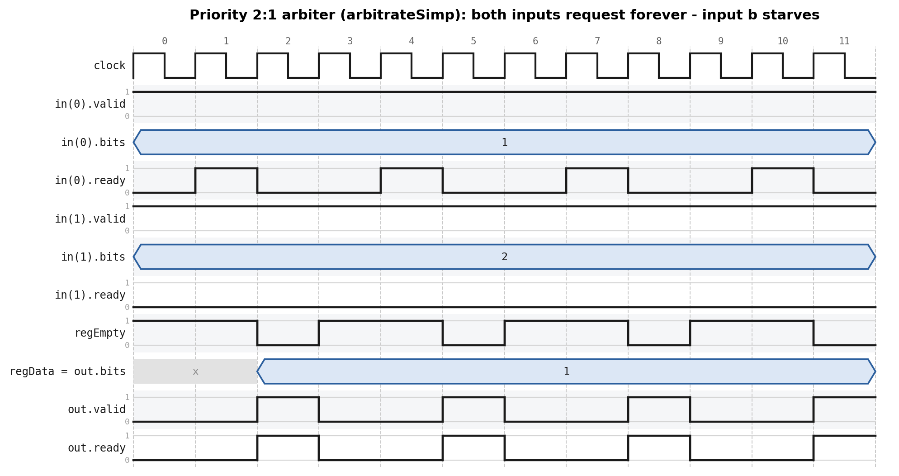
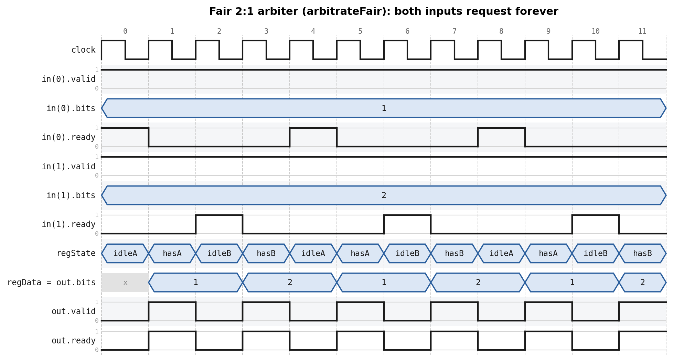
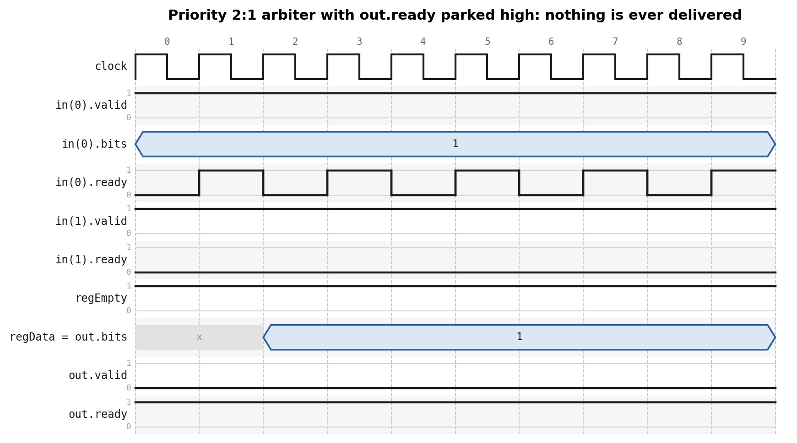

# Chapter 10 — Hardware Generators

This is Chisel's superpower: because a Chisel description *is* a Scala program,
the full power of Scala runs at hardware-construction time. You don't write a
separate script to emit VHDL — the generator and the hardware are the same code.
This chapter is a tour of generator techniques: lightweight **functions** that
return hardware, **generating combinational logic/ROM tables**, configuration
with **parameters / case classes / type parameters**, **inheritance**, and
**functional programming** (`reduce`/`reduceTree`).

*Conventions: every file path is relative to
`tutorial/ch10-hardware-generators/`, and every command is run from that folder.
The book's Chapter 10 has no figures; the arbiter timing diagrams in
[§10.6.2](#1062-an-arbitration-tree) are additions of this tutorial, recorded from real
simulation runs.*

## What's in this project

```
ch10-hardware-generators/
├── build.sbt · project/build.properties
├── figures/                arbiter timing diagrams
├── src/main/scala/
│   ├── FunctionalComp.scala a function returning two values in a tuple
│   ├── FunctionalAdd.scala  summing a Vec with reduce/reduceTree
│   ├── FunctionalMin.scala  min-search four ways (+ a pure-Scala reference model)
│   ├── MinVariants.scala    those four again, one module each, to compare their Verilog
│   ├── MinDemo.scala        emits and measures the four (sbt "runMain MinDemo")
│   ├── BcdTable.scala      binary -> BCD table generated with a Scala loop
│   ├── GenHardware.scala   VecInit ROM tables (a string, a square table)
│   ├── ParamAdder.scala    width parameter + two instances
│   ├── Config.scala         case classes for parameters (+ ConfigDemo)
│   ├── ParamFunc.scala      a mux parameterized by a Chisel TYPE
│   ├── ParamModule.scala    a MODULE parameterized by a Chisel type (router + payload)
│   ├── ParamBundle.scala    a BUNDLE parameterized by a Chisel type (+ PortDemo: the three parameter spellings)
│   ├── RegisterFile.scala   optional debug port via Scala's Option
│   ├── Ticker.scala         abstract base + three implementations (inheritance)
│   ├── ArbiterTree.scala    reduceTree arbitration tree: fair and priority 2:1
│   └── Generate.scala      emits .sv for every design, or just the ones you name
└── src/test/scala/  (one test per topic)
```

---

## 10.1 A little Scala

Two variable kinds: `val` (immutable — used to *name* hardware) and `var`
(mutable — used only when *generating* hardware, never to name a component).
Key building blocks for generators: `for` loops, `if`/`else` (evaluated at
generation time — they choose *what hardware to build*, they are **not**
multiplexers), **tuples** (`(a, b)`, accessed `._1`/`._2`, for returning
multiple values), and the **`Seq`** collection.

The type of a `val`/`var` is normally inferred from the assigned value, but it
can be stated explicitly:

```scala
val number: Int = 42
```

A `for` loop is the classic way to drive a circuit generator. The following
loop connects the bits of a shift register one to the next:

```scala
val regVec = Reg(Vec(8, UInt(1.W)))

regVec(0) := io.din
for (i <- 1 until 8) {
  regVec(i) := regVec(i - 1)
}
```


> This is *not* the most concise way to write a shift register. It is better
> to use a plain `UInt` of the right width and assign its new value with an
> expression using the `##` operator (concatenation) and proper indexing. The
> loop version above is shown purely to demonstrate a Scala `for` loop used
> for circuit generation.

A Scala **tuple** groups a sequence of possibly different types in
parentheses; fields are accessed with `._n`, starting at `1`. The following
snippet builds a tuple representing a city (zip code, name):

```scala
val city = (2000, "Frederiksberg")
val zipCode = city._1
val name = city._2
```

*Scala note — Scala tuples → [§G.2](../SCALA-NOTES.md#g2-tuples).*

Tuples are useful for returning more than one value from a function — see
§10.2 below.

The **`Seq`** collection (an ordered, by default immutable, sequence) is
indexed with `()`, zero-based. It is the preferred general-purpose collection
for Chisel hardware generators:

```scala
val numbers = Seq(1, 15, -2, 0)
val second = numbers(1)   // second == 15
```

---

## 10.2 Lightweight components with functions

A module has boilerplate; a Scala **function that returns hardware** is a
lighter alternative. It's a real generator — calling it *builds* hardware
(the return value of a Scala function is the result of its last expression).
As a simple example, an adder function:

```scala
def adder(x: UInt, y: UInt) = {
  x + y
}
```

*Scala note — a `def` method → [§C.4](../SCALA-NOTES.md#c4-def-methods), and a block's value is its last expression → [§C.5](../SCALA-NOTES.md#c5-block-as-expression-implicit-return).*

Calling it twice creates two independent adder instances — no add operation
runs at elaboration time, the calls just build hardware:

```scala
val x = adder(a, b)
// another adder
val y = adder(c, d)
```

> This adder is an artificial example to keep things simple — Chisel already
> provides an adder generator via the `+` operator (`UInt`'s `+(that: UInt)`).

Functions can also carry state via a register. If the function body is a
single statement, the curly braces can be omitted:

```scala
def delay(x: UInt) = RegNext(x)
```


Calling the function with itself as the argument chains two registers,
producing a two-clock-cycle delay:

```scala
val delOut = delay(delay(delIn))
```


> Again, too small an example to be useful on its own — `RegNext()` already
> *is* the one-cycle delay function; this just shows function composition.

Functions return only one value. To return more than one, wrap several
output wires in a Scala **tuple**:

`src/main/scala/FunctionalComp.scala`
```scala
  def compare(a: UInt, b: UInt) = {
    val equ = a === b
    val gt = a > b
    (equ, gt)   // return a tuple
  }
```

The tuple returned by a call can be accessed with `._n`:

```scala
val cmp = compare(inA, inB)
val equResult = cmp._1
val gtResult = cmp._2
```

Or decomposed directly into named wires, as this chapter's project does:

`src/main/scala/FunctionalComp.scala`
```scala
  val (equ, gt) = compare(io.a, io.b)   // decompose the tuple
```

Functions used across modules belong in a Scala `object` of utilities.

---

## 10.3 Generating combinational logic (ROM tables)

A truth table is combinational logic — a ROM addressed by its input. Build one
with **`VecInit`** and ordinary Scala:

`src/main/scala/GenHardware.scala`
```scala
  // A Scala String is a Seq[Char]; map each char to a UInt -> a ROM of bytes.
  val msg = "Hello World!"
  // VecInit takes a Seq of UInts and returns a Vec of UInts.
  val text = VecInit(msg.map(_.U))
  val len = msg.length.U

  // A small square-lookup ROM.
  val n = io.squareIn
  val squareROM = VecInit(0.U, 1.U, 4.U, 9.U, 16.U, 25.U)
  val square = squareROM(n)
```

*Scala note — `map`/`reduce`/`zip`/`zipWithIndex` → [§F.3](../SCALA-NOTES.md#f3-map--foreach--reduce--zip--zipwithindex), and a `String` as a `Seq[Char]` → [§F.4](../SCALA-NOTES.md#f4-string-as-a-seqchar).*

The classic example is **binary → BCD** conversion. In VHDL you'd generate this
table with an external script; in Chisel a Scala loop builds it inline:

`src/main/scala/BcdTable.scala`
```scala
  val table = Wire(Vec(100, UInt(8.W)))

  // Convert binary i to BCD: tens digit in the upper nibble, ones in the lower.
  for (i <- 0 until 100) {
    table(i) := (((i / 10) << 4) + i % 10).U
  }

  io.data := table(io.address)
```

> The same idea generates trig lookup tables, filter constants, or even a whole
> assembler for a soft CPU — all in the same language, executed during
> generation.

### File Reading

A logic table can also be built from data read from a **file** at generation
time, using the standard Scala/Java `scala.io.Source`:

```scala
import chisel3._
import scala.io.Source

class FileReader extends Module {
  val io = IO(new Bundle {
    val address = Input(UInt(8.W))
    val data = Output(UInt(8.W))
  })

  val array = new Array[Int](256)
  var idx = 0

  // read the data into a Scala array
  val source = Source.fromFile("data.txt")
  for (line <- source.getLines()) {
    array(idx) = line.toInt
    idx += 1
  }

  // convert the Scala Array to a Scala sequence Seq
  val table = VecInit(array.toIndexedSeq.map(_.U(8.W)))

  // use the table
  io.data := table(io.address)
}
```

The maybe-intimidating line is `VecInit(array.toIndexedSeq.map(_.U(8.W)))`:
`toIndexedSeq` converts the Scala `Array` to a `Seq`, which supports `map`.
`map` invokes a function on each element and returns a sequence of the
results — here `_.U(8.W)` converts each Scala `Int` to a Chisel `UInt`
literal of 8 bits. `VecInit` then builds a Chisel `Vec` from that `Seq` of
Chisel values. The same pattern (`msg.map(_.U)`, above) is what turns the
`"Hello World!"` string into a byte ROM — a Scala/Java `String` is itself a
`Seq[Char]`, so `map` works on it directly.

### Type Conversion

All Chisel types are ultimately just a collection of bits, so converting
between them is easy. A `Vec` of bytes can be packed into a 32-bit `UInt` (the first
element lands in the low bits):

```scala
val vec = Wire(Vec(4, UInt(8.W)))
val word = vec.asUInt
```

and unpacked back with `asTypeOf`:

```scala
val vec2 = word.asTypeOf(Vec(4, UInt(8.W)))
```

A `Bundle` converts to a `UInt` the same way:

```scala
class MyBundle extends Bundle {
  val a = UInt(8.W)
  val b = UInt(16.W)
}

val bundle = Wire(new MyBundle)
val word2 = bundle.asUInt

val bundle2 = word2.asTypeOf(new MyBundle)
```

and the same conversion can zero-initialize every field of a bundle at once:

```scala
val bundle3 = 0.U.asTypeOf(new MyBundle)
```

> **Bit order caveat:** a `Bundle`'s fields are packed in the *opposite* order
> from a `Vec`'s elements — the **last** declared field (`b` above) lands in
> the **low** bits of the `UInt`, followed by the second-to-last, and so on.

---

## 10.4 Configuration with parameters

A generator earns its keep when one description can produce a whole *family* of
circuits. The knobs are plain Scala — values and types passed to a constructor —
and they come in four flavours, in rising order of power:

| Flavour | What gets configured | Where |
|---------|----------------------|-------|
| Simple parameter | a number: bit width, depth, port count | [10.4.1](#1041-simple-parameters) |
| `case class` | many parameters bundled (and validated) as one value | [10.4.2](#1042-grouping-parameters-in-a-case-class) |
| Type parameter | the Chisel *type* a function, module, or bundle works on | [10.4.3](#1043-functions-with-type-parameters), [10.4.4](#1044-modules-with-type-parameters), [10.4.5](#1045-parameterized-bundles) |
| `Option` port | whether a port exists at all | [10.4.6](#1046-optional-ports) |

All four share one property worth holding on to: they are resolved while the
hardware is being *constructed*, so by the time Verilog exists the parameter is
gone — it has been baked into widths, module counts, and port lists.

### 10.4.1 Simple parameters

The simplest knob is an ordinary constructor argument. `n` below is a Scala
`Int`, in scope throughout the class body, and it reaches the hardware through
`n.W`, which turns an `Int` into the `Width` that `UInt(...)` expects:

`src/main/scala/ParamAdder.scala`
```scala
class ParamAdder(n: Int) extends Module {
  val io = IO(new Bundle {
    val a = Input(UInt(n.W))
    val b = Input(UInt(n.W))
    val c = Output(UInt(n.W))
  })

  io.c := io.a + io.b
}
```

Note there is no `val` in front of `n`. The parameter is only read while the
module is being built, so it does not need to survive as a field — Scala keeps
it as a `private[this]` value, which is exactly what you want (a public
`val`-parameter of a *`Bundle`* actually causes trouble; see
[10.4.5](#1045-parameterized-bundles)).

Two differently-sized adders then come from the same generator — inside
`UseAdder`:

`src/main/scala/ParamAdder.scala`
```scala
  val add8 = Module(new ParamAdder(8))
  val add16 = Module(new ParamAdder(16))
```

**A Chisel parameter is not a Verilog `parameter`.** In Verilog or VHDL the knob
stays in the generated code (`parameter WIDTH = 8`, a VHDL generic) and the
*downstream* tool specializes it. Chisel resolves it first: each distinct
argument elaborates its own concrete module, and the emitted SystemVerilog
contains no `n` anywhere. Generate it and look at the top of `UseAdder.sv`
(comments trimmed):

```
$ sbt "runMain Generate UseAdder"
...
emitting UseAdder.sv
```

Run bare, `Generate` emits every design in the chapter; naming one keeps the
output to a single file — see [§10.7](#107-build-run-and-check) for the list of
names and for a way to emit one module without going through `Generate` at all.

```
module ParamAdder(	// src/main/scala/ParamAdder.scala:4:7
  input  [7:0] io_a,
               io_b,
  output [7:0] io_c
);

  assign io_c = io_a + io_b;
endmodule

module ParamAdder_1(	// src/main/scala/ParamAdder.scala:4:7
  input  [15:0] io_a,
                io_b,
  output [15:0] io_c
);

  assign io_c = io_a + io_b;
endmodule
```

One source class, two Verilog modules: `ParamAdder` (from `n = 8`) and
`ParamAdder_1` (from `n = 16`), each with its widths already hard-wired. Chisel
appends `_1`, `_2`, … to keep the names unique. Both modules point back to the
same source line, `ParamAdder.scala:4:7` — a useful reminder that the two are
one generator seen twice.

Further down the same file, the instantiation site inside `UseAdder` shows the
second thing the parameter decided — where signals get **truncated**:

```
  ParamAdder add8 (	// src/main/scala/ParamAdder.scala:22:20
    .io_a (io_x[7:0]),	// src/main/scala/ParamAdder.scala:29:13
    .io_b (io_y[7:0]),	// src/main/scala/ParamAdder.scala:30:13
    .io_c (_add8_io_c)
  );
  ParamAdder_1 add16 (	// src/main/scala/ParamAdder.scala:23:21
    .io_a (io_x),
    .io_b (io_y),
    .io_c (_add16_io_c)
  );
```

`add8` is fed the same 16-bit `io_x`/`io_y` as `add16`, but its ports are 8 bits
wide, so Chisel inserts `[7:0]` slices. That is a real behavioural difference
produced purely by a constructor argument, and it is what the test below
exploits to tell the two instances apart.

**Naming and defaulting parameters.** Since these are plain Scala arguments,
they get Scala's call-site conveniences: a default value lets callers omit the
common case, and named arguments keep a long parameter list readable and
unswappable:

```scala
class ParamAdder(n: Int = 32) extends Module { ... }

val a = Module(new ParamAdder())          // 32 bits
val b = Module(new ParamAdder(n = 8))     // 8 bits, spelled out
```

*Scala note — default arguments → [§C.7](../SCALA-NOTES.md#c7-default-arguments); named arguments → [§C.6](../SCALA-NOTES.md#c6-named-arguments).*

**Rejecting nonsense early.** Nothing stops a caller from writing
`new ParamAdder(0)`, which would elaborate a zero-width adder. A `require` at
the top of the module makes the constructor refuse instead:

```scala
class ParamAdder(n: Int) extends Module {
  require(n > 0, "width must be positive, got " + n)
  ...
}
```

Because `require` runs before any hardware is built, a bad value fails at
elaboration with a plain Scala exception rather than producing a broken circuit:

```
java.lang.IllegalArgumentException: requirement failed: width must be positive, got 0
```

*Scala note — `require` as a precondition → [§J.4](../SCALA-NOTES.md#j4-require).*
The same idea applied to a whole parameter set is
[10.4.2](#1042-grouping-parameters-in-a-case-class).

**How do you test a parameter?** There is nothing to poke: `n` is consumed at
*generation* time and has vanished by the time the simulation starts. What you
*can* observe is the one place the width shows through — an n-bit `+` keeps n
bits, so the carry out is dropped and the sum wraps modulo 2ⁿ. The bench builds
one test per width with an ordinary Scala `for` loop, the same trick the
generator itself uses:

`src/test/scala/ParamAdderTest.scala`
```scala
  for (n <- Seq(4, 8, 16)) {
    val mask = (1 << n) - 1

    s"ParamAdder($n)" should s"add modulo 2^$n" in {
      test(new ParamAdder(n)) { dut =>
        val cases = Seq((0, 0), (1, 2), (mask, 0), (mask, 1), (mask, mask), (mask / 2, mask / 2 + 1))
        for ((a, b) <- cases) {
          dut.io.a.poke(a.U)
          dut.io.b.poke(b.U)
          // An n-bit `+` keeps n bits: the carry out is dropped.
          dut.io.c.expect(((a + b) & mask).U)
        }
      }
    }
  }
```

`UseAdder` is checked the same way. Both instances are fed the full 16-bit
`io.x`/`io.y`, but `add8`'s ports are only 8 bits wide, so those connections
**truncate** — and since the result is `add16.io.c | add8.io.c`, the two
instances are told apart from outside: with `x = 0x00ff, y = 1` the 8-bit adder
wraps to `0x00` while the 16-bit one produces `0x0100`.

`src/test/scala/ParamAdderTest.scala`
```scala
      def check(x: Int, y: Int): Unit = {
        val sum16 = (x + y) & 0xffff
        val sum8 = ((x & 0xff) + (y & 0xff)) & 0xff
        dut.io.x.poke(x.U)
        dut.io.y.poke(y.U)
        dut.io.res.expect((sum16 | sum8).U)
      }
```

```
$ sbt "testOnly ParamAdderTest"
[info] ParamAdderTest:
[info] ParamAdder(4)
[info] - should add modulo 2^4
[info] ParamAdder(8)
[info] - should add modulo 2^8
[info] ParamAdder(16)
[info] - should add modulo 2^16
[info] UseAdder
[info] - should combine an 8-bit and a 16-bit instance of the same generator
[info] Tests: succeeded 4, failed 0, canceled 0, ignored 0, pending 0
```

### 10.4.2 Grouping parameters in a case class

A generator with one knob takes one argument; a generator with eight knobs
taking eight arguments is a mess to thread through submodules. A **`case
class`** packages many parameters into one lightweight, immutable value
(optionally validated):

`src/main/scala/Config.scala`
```scala
case class Config(txDepth: Int, rxDepth: Int, width: Int)
```

A `case class` can also validate its parameters, so a bad configuration fails
at elaboration instead of producing broken hardware:

`src/main/scala/Config.scala`
```scala
case class SaveConf(txDepth: Int, rxDepth: Int, width: Int) {
  assert(txDepth > 0 && rxDepth > 0 && width > 0, "parameters must be larger than 0")
}
```

*Scala note — `case class` → [§B.2](../SCALA-NOTES.md#b2-case-class); Scala's `assert` → [§J.3](../SCALA-NOTES.md#j3-assert-scala).*

An object of the case class is created by calling the constructor; fields are
immutable and read by name:

`src/main/scala/Config.scala`
```scala
// Run with:  sbt "runMain ConfigDemo"
object ConfigDemo extends App {
  val param = Config(4, 2, 16)
  println("The width is " + param.width)
}
```

### 10.4.3 Functions with type parameters

The knob does not have to be a number: a generator can also be parameterized by
a Chisel *type*. `[T <: Data]` accepts any Chisel type, so one mux works for a
`UInt` or a whole `Bundle` (this is how Chisel's own `Mux` is generic):

`src/main/scala/ParamFunc.scala`
```scala
  // A multiplexer parameterized by a Chisel TYPE: [T <: Data] accepts any
  // Chisel type (Data is the root of the type system). Same function works for
  // a UInt or a whole Bundle.
  def myMux[T <: Data](sel: Bool, tPath: T, fPath: T): T = {
    val ret = WireDefault(fPath)
    when (sel) {
      ret := tPath
    }
    ret
  }
```

*Scala note — a type parameter with an upper bound → [§D.1](../SCALA-NOTES.md#d1-type-parameters-t-with-an-upper-bound-t--x).*

Calling it with a plain `UInt` needs nothing special:

`src/main/scala/ParamFunc.scala`
```scala
  // Use with a simple UInt type.
  val resA = myMux(io.selA, 5.U, 10.U)
```

> **Caveat:** both mux paths must be of the *same* type `T`. Mixing types
> compiles (Scala can't always tell `T` apart at the call site) but fails at
> **runtime**, e.g. mixing a `UInt` true-path with an `SInt` false-path:
> ```scala
> val resErr = myMux(selA, 5.U, 10.S)   // runtime error: types don't match
> ```

For the "complex" case, `ComplexIO` is a two-field `Bundle`, and a `Bundle`
*constant* is built by wiring up each field of a `Wire`:

`src/main/scala/ParamFunc.scala`
```scala
class ComplexIO extends Bundle {
  val d = UInt(10.W)
  val b = Bool()
}
```

`src/main/scala/ParamFunc.scala`
```scala
  // Use with a complex Bundle type (build Bundle constants with a Wire).
  val tVal = Wire(new ComplexIO)
  tVal.b := true.B
  tVal.d := 42.U
  val fVal = Wire(new ComplexIO)
  fVal.b := false.B
  fVal.d := 13.U

  val resB = myMux(io.selB, tVal, fVal)  // Muxing a Bundle type
```

The first version of `myMux` used `WireDefault` to build a wire of type `T`
*with* a default value. If a plain wire of the type is wanted without an
initial value, use `fPath.cloneType` to get the Chisel type instead:

`src/main/scala/ParamFunc.scala`
```scala
  // Alternative using fPath.cloneType when no default value is wanted.
  def myMuxAlt[T <: Data](sel: Bool, tPath: T, fPath: T): T = {
    val ret = Wire(fPath.cloneType)
    ret := fPath
    when (sel) {
      ret := tPath
    }
    ret
  }
```

### 10.4.4 Modules with type parameters

Whole **modules**, not just functions, can be parameterized by a Chisel type.
A network-on-chip router that should not hard-code its payload format adds a
type parameter `T` to the module constructor (and takes one constructor
argument of that type); the number of ports is a second, ordinary `Int`
parameter:

`src/main/scala/ParamModule.scala`
```scala
class NocRouter[T <: Data](dt: T, n: Int) extends Module {
  val io = IO(new Bundle {
    val inPort = Input(Vec(n, dt))
    val address = Input(Vec(n, UInt(8.W)))
    val outPort = Output(Vec(n, dt))
  })

  // Route the payload according to the address; a plain swap of the two ports
  // stands in for real routing here, just enough to elaborate (n = 2).
  io.outPort(0) := io.inPort(1)
  io.outPort(1) := io.inPort(0)
}
```

Define the payload type as an ordinary `Bundle`, then instantiate the router
with an instance of that type and the port count:

`src/main/scala/ParamModule.scala`
```scala
class Payload extends Bundle {
  val data = UInt(16.W)
  val flag = Bool()
}
```

`src/main/scala/ParamModule.scala`
```scala
  val router = Module(new NocRouter(new Payload, 2))
```

The wrapper `UseParamRouter` in that file connects it up so there is
something to generate Verilog for.

### 10.4.5 Parameterized bundles

The router above needs two separate parallel vectors — one for the addresses,
one for the data — and nothing but convention keeps entry `i` of the one lined
up with entry `i` of the other. A cleaner design gives a port its own `Bundle`;
since the payload type is a parameter, that `Bundle` is parameterized too:

`src/main/scala/ParamBundle.scala`
```scala
class Port[T <: Data](dt: T) extends Bundle {
  val address = UInt(8.W)
  val data = dt.cloneType
}
```

Two details in that declaration are worth pausing on:

- **`dt.cloneType`** gives `data` a fresh, unbound copy of the payload *type*
  instead of reusing the caller's object. A Chisel `Data` object is both a type
  and (potentially) a piece of hardware; `cloneType` asks for just the type. Skip
  it and `data` and `dt` are literally the same object, which Chisel rejects with
  an `AliasedAggregateFieldException`.
- **The parameter has no `val`.** Chisel keeps no record of which `val`s in a
  `Bundle` you meant as ports — it finds them by reflecting over the bundle's
  **public** `Data`-typed members. Writing `val dt: T` would therefore make the
  parameter a *third* field: no error, no warning, just a `Port` that is silently
  a whole extra `Payload` wider, on every port and through every `:=`. Without
  the `val`, Scala keeps `dt` as a `private[this]` field and it never shows up.
  Marking it `private val` (as the book does) is equivalent as far as Chisel is
  concerned, and says the same thing more explicitly.

> **Watch out in a `case class`.** Case-class parameters are public `val`s by
> definition, so `case class Port[T <: Data](dt: T) extends Bundle` *does* get the
> phantom field even though no `val` was typed. There `private val` has to be
> spelled out.

`PortDemo` in the same file carries all three spellings so the difference can be
seen rather than taken on faith. It prints the field map (`elements`) Chisel
builds for each, and then the router's port list with and without the phantom
field (it writes no `.sv` files):

```
$ sbt "runMain PortDemo"
...
Port         (dt, no val)      fields: data, address
PortPrivate  (private val dt)  fields: data, address
PortPublic   (val dt)          fields: data, address, dt
```

With `val dt`, every port of the router carries the payload *twice* — eight
phantom `_dt_` ports across the two inputs and two outputs, and no warning
anywhere:

```
--- val dt (public: extra dt field) ---
module NocRouter2(
  input         clock,
                reset,
  input  [15:0] io_inPort_0_dt_data,
  input         io_inPort_0_dt_flag,
  input  [7:0]  io_inPort_0_address,
  input  [15:0] io_inPort_0_data_data,
  input         io_inPort_0_data_flag,
  ...
```

The demo's last case is `PortAliased`, the public `val` *without* `cloneType`,
where the two fields are the same object and Chisel refuses outright instead of
silently widening:

```
chisel3.AliasedAggregateFieldException: PortAliased contains aliased fields named (data,dt)
```

`src/test/scala/ParamBundleTest.scala` locks all of this in: two fields for
`Port` and `PortPrivate`, exactly eight `_dt_` ports for `PortPublic`, and the
aliasing exception for `PortAliased`.

With that `Bundle` in hand, the router's ports become a single parameterized
type, and it is instantiated by wrapping the payload type in a `Port`:

`src/main/scala/ParamBundle.scala`
```scala
class NocRouter2[T <: Data](dt: T, n: Int) extends Module {
  val io = IO(new Bundle {
    val inPort = Input(Vec(n, dt))
    val outPort = Output(Vec(n, dt))
  })

  // Route the payload according to the address; again a swap stands in for the
  // real routing logic.
  io.outPort(0) := io.inPort(1)
  io.outPort(1) := io.inPort(0)
}
```

`src/main/scala/ParamBundle.scala`
```scala
  val router = Module(new NocRouter2(new Port(new Payload), 2))
```

`UseParamRouter2` wraps it the same way as `UseParamRouter`, and
`src/test/scala/ParamBundleTest.scala` checks that both fields of the `Port`
actually survive the trip through the router. (The type-parameterized *module*
of the previous section has its own bench,
`src/test/scala/ParamModuleTest.scala`, one file per source file.)

### 10.4.6 Optional ports

Some IO ports should only exist under a configuration flag. Example: a
register file for a 32-bit RISC core, with an optional debug port that
exposes every register (useful for the tester, wasteful in the final
design). The `debug: Boolean` constructor parameter decides — via Scala's
`Option` (`Some`/`None`) — whether the port exists at all:

`src/main/scala/RegisterFile.scala`
```scala
class RegisterFile(debug: Boolean) extends Module {
  val io = IO(new Bundle {
    val rs1 = Input(UInt(5.W))
    val rs2 = Input(UInt(5.W))
    val rd = Input(UInt(5.W))
    val wrData = Input(UInt(32.W))
    val wrEna = Input(Bool())
    val rs1Val = Output(UInt(32.W))
    val rs2Val = Output(UInt(32.W))
    val dbgPort = if (debug)
      Some(Output(Vec(32, UInt(32.W)))) else None
  })
  val regfile = RegInit(VecInit(Seq.fill(32)(0.U(32.W))))
  io.rs1Val := regfile(io.rs1)
  io.rs2Val := regfile(io.rs2)
  when(io.wrEna) {
    regfile(io.rd) := io.wrData
  }
  // The port is unwrapped with .get - only ever reached when it exists.
  if (debug) {
    io.dbgPort.get := regfile
  }
}
```

(We built this same register file, without the optional port, in
[Chapter 2](../ch02-basic-components/README.md).)

Note where the decision happens: `if (debug)` is **Scala**, evaluated while the
hardware is being constructed, so it chooses *what to build* — it is not a
multiplexer. `io.dbgPort` is a Scala `Option[Vec[UInt]]`, not a hardware
signal, and `.get` unwraps it. Guarding the assignment with `if (debug)` is
what keeps `.get` from ever running on a `None`.

On the tester side, the optional port is unwrapped the same way, with `.get`:

`src/test/scala/RegisterFileTest.scala`
```scala
      dut.io.dbgPort.get(4).expect(123.U)
```

The whole register file is visible at once through that one port, which is what
makes it worth having in a tester:

`src/test/scala/RegisterFileTest.scala`
```scala
      // Every register is visible at once through the debug port.
      dut.io.dbgPort.get(4).expect(123.U)
      dut.io.dbgPort.get(2).expect(456.U)
      dut.io.dbgPort.get(7).expect(0.U)
```

Build the same module with `debug = false` and the port is simply not there.
Two things follow, both asserted in the test:

`src/test/scala/RegisterFileTest.scala`
```scala
  it should "raise an exception when the missing port is unwrapped" in {
    test(new RegisterFile(false)) { dut =>
      assert(dut.io.dbgPort.isEmpty)
      intercept[NoSuchElementException] {
        dut.io.dbgPort.get(4).expect(123.U)
      }
    }
  }
```

First, reaching for the port anyway is a plain Scala `NoSuchElementException`
(`None.get`) raised while the test elaborates — not a hardware fault, and not
something the Chisel compiler can catch for you. Second, the `None` port costs
*nothing*: it leaves no trace in the generated Verilog, which is the entire
point of making it optional.

---

## 10.5 Inheritance

`Module` is a Scala class, so use inheritance to share an interface. An abstract
`Ticker` fixes the `io`; three subclasses implement tick generation differently
(up, down, nerd) — and a single generic test drives all of them:

`src/main/scala/Ticker.scala`
```scala
abstract class Ticker(n: Int) extends Module {
  val io = IO(new Bundle {
    val tick = Output(Bool())
  })
}
```

Each subclass generates the tick its own way — counting up, counting down, or
counting down to `-1` to avoid a comparator:

`src/main/scala/Ticker.scala`
```scala
// Tick generation by counting up.
class UpTicker(n: Int) extends Ticker(n) {
  val N = (n - 1).U
  val cntReg = RegInit(0.U(8.W))
  cntReg := cntReg + 1.U
  val tick = cntReg === N
  when(tick) {
    cntReg := 0.U
  }
  io.tick := tick
}

// Tick generation by counting down to 0.
class DownTicker(n: Int) extends Ticker(n) {
  val N = (n - 1).U
  val cntReg = RegInit(N)
  cntReg := cntReg - 1.U
  when(cntReg === 0.U) {
    cntReg := N
  }
  io.tick := cntReg === N
}

// The "nerd" version: count down to -1 to avoid a comparator.
class NerdTicker(n: Int) extends Ticker(n) {
  val N = n
  val MAX = (N - 2).S(8.W)
  val cntReg = RegInit(MAX)
  io.tick := false.B
  cntReg := cntReg - 1.S
  when(cntReg(7)) {
    cntReg := MAX
    io.tick := true.B
  }
}
```

*Scala note — an `abstract class` with constructor parameters → [§A.5](../SCALA-NOTES.md#a5-abstract-class-with-constructor-parameters).*

The tester takes `[T <: Ticker]`, so it accepts any implementation:

`src/test/scala/TickerTest.scala`
```scala
trait TickerTestFunc {
  def testFn[T <: Ticker](dut: T, n: Int) = {
    var count = -1   // -1 means no tick seen yet
    for (_ <- 0 to n * 3) {
      if (count > 0)
        dut.io.tick.expect(false.B)
      else if (count == 0)
        dut.io.tick.expect(true.B)

      if (dut.io.tick.peekBoolean())
        count = n - 1
      else
        count -= 1
      dut.clock.step()
    }
  }
}
```

`testFn` has three effective parameters: (1) the type parameter `[T <: Ticker]`
itself, which accepts `Ticker` or any subclass, (2) `dut`, the design under
test, of type `T` or a subtype thereof, and (3) `n`, the number of clock
cycles expected between ticks. It waits for the first tick (the exact start
point may differ between implementations), then checks that `tick` repeats
every `n` cycles.

**Recommended workflow:** get the *simplest* ticker (`UpTicker`) and the
tester itself working and correct first — `println` debugging is fine at this
stage — before trusting the tester to check the other, trickier
implementations (`DownTicker`, `NerdTicker`). Once confident, run just the
ticker tests with:

```
$ sbt "testOnly TickerTest"
```

---

## 10.6 Functional programming

Every generator so far was driven by a loop or an `if`. But a Chisel `Vec` is
also a Scala collection, which means Scala's **higher-order functions** — methods
that take another *function* as an argument — apply to hardware: `map`, `zip`,
`reduce` and friends. That flips how a regular structure is described. Instead of
writing the wiring loop, you hand over a function that combines *two* signals and
let the collection method build the structure that applies it across all of them.

The rest of this intro is the machinery — `reduce`, function literals, and
`reduceTree` — all of it in one small module, `FunctionalAdd`. Two worked examples
then follow: a **minimum search** over a `Vec`
([§10.6.1](#1061-minimum-search)) and an **arbitration tree** built from nothing
but 2:1 arbiters ([§10.6.2](#1062-an-arbitration-tree)).

Start with the simplest case, summing a `Vec`: define an `add` function and fold
the vector with Scala's `reduce`, which combines the first two elements, then
combines that result with the next, and so on until one value remains:

`src/main/scala/FunctionalAdd.scala`
```scala
  def add(a: UInt, b: UInt) = a + b
  val sumNamed = vec.reduce(add)
```

Naming that function is optional. The combining function can be written straight
into the call as an anonymous **function literal** — parameters in parentheses,
then `=>`, then the body:

```scala
// (param) => function body
val sumLiteral = vec.reduce((a: UInt, b: UInt) => a + b)
```

Filled in for the adder above, the parameters are the two operands and the body
is their sum, so the literal reads `(a: UInt, b: UInt) => a + b` and the whole
`add` definition disappears into the `reduce` call:

```scala
  val sumLiteral = vec.reduce((a: UInt, b: UInt) => a + b)
```

When the parameters are used once each, in order, Scala's `_` wildcard can stand
in for them and the types are inferred from the collection — which collapses the
literal to just the operator:

```scala
  val sum = vec.reduceTree(_ + _)
```

*Scala note — higher-order functions → [§E.4](../SCALA-NOTES.md#e4-higher-order-functions) and the `_` placeholder (point-free) → [§E.3](../SCALA-NOTES.md#e3-the-_-placeholder-point-free-style).*

That last line also swaps `reduce` for **`reduceTree`**, which is the other half
of the story. `reduce` folds left, producing a *chain* of adders —
`((((in0+in1)+in2)+in3)+in4)` — whose combinational delay grows as `O(n)`.
`reduceTree` builds a balanced *tree* instead, `O(log n)` deep, which is what you
want for a wide sum. Same combining function, different structure generated from
it.

All three spellings above are in the same module, wired to their own outputs, so
the test can confirm they really do describe one adder network:

```
$ sbt "testOnly FunctionalAddTest"
[info] FunctionalAddTest:
[info] FunctionalAdd
[info] - should sum the vector
[info] - should give the same sum for all three spellings
[info] Tests: succeeded 2, failed 0, canceled 0, ignored 0, pending 0
```

One caveat to carry forward: `reduceTree` is Chisel's own method on `Vec` (part
of `chisel3._`, no extra import needed), *not* a Scala collection method — Scala
has `reduce` but no `reduceTree`. That distinction bites as soon as a reduction
leaves Chisel's collections, which [§10.6.1](#1061-minimum-search) runs into.

### 10.6.1 Minimum search

Nothing about `reduceTree` is specific to addition: it takes any function of two
elements. Passing a `Mux` instead of an adder turns the same call into a
minimum-search tree, the first of four variants in `FunctionalMin`:

`src/main/scala/FunctionalMin.scala`
```scala
  // (a) minimum value only: reduceTree with a Mux.
  val min = vec.reduceTree((x, y) => Mux(x < y, x, y))
```

Each tree node keeps the smaller of its two inputs, so the root ends up with the
smallest of all `n` — an `n`-input minimum built from one line and `n-1` muxes.

Often the **index** of the minimum is wanted as well, and that is where the
reduction needs to carry more than one value per element. Two ways to do it. The
first packs value and index into a `Bundle` and reduces over that, comparing on
the `.v` field while both fields travel together:

`src/main/scala/FunctionalMin.scala`
```scala
  // (b) value AND index, using a Bundle to carry both.
  class Two extends Bundle {
    val v = UInt(w.W)
    val idx = UInt(8.W)
  }
  val vecTwo = Wire(Vec(n, new Two()))
  for (i <- 0 until n) {
    vecTwo(i).v := vec(i)
    vecTwo(i).idx := i.U
  }
  val res = vecTwo.reduceTree((x, y) => Mux(x.v < y.v, x, y))
```

Note the indices are *constants* baked in during generation (`i.U`), not hardware
counters — the `for` loop runs at elaboration time.

The second way uses Scala **tuples** + `zipWithIndex` and avoids declaring a
`Bundle`, at the price of writing the comparison twice:

`src/main/scala/FunctionalMin.scala`
```scala
  // (c) value AND index, using Scala tuples + zipWithIndex + reduce.
  val resFun = vec.zipWithIndex
    .map((x) => (x._1, x._2.U))
    .reduce((x, y) => (Mux(x._1 < y._1, x._1, y._1),
      Mux(x._1 < y._1, x._2, y._2)))
```

Here `zipWithIndex` turns the `Vec[UInt]` into a Scala `Vector` of tuples
`(UInt, Int)`; the result is *still* a Scala `Vector`, not a Chisel `Vec` —
so it must use `reduce`, **not** `reduceTree`, which only exists on Chisel's
`Vec`.

**Why the comparison appears twice.** That `reduce` looks redundant — the same
`x._1 < y._1` written in both muxes — but it has to be. A Scala tuple is not
Chisel `Data`, so there is no single `Mux` that can select *a pair*; the value and
the index must each be muxed on their own. What makes the result correct is that
both muxes are driven by the **same** condition, so the surviving value and the
surviving index always come from the same element. Writing two *different*
conditions there would be the bug.

> **Ties.** All four variants compare with a strict `<`, so on a tie the *later*
> element wins and the index returned is that of the **last** minimum. The
> pure-Scala model below uses `<=` and keeps the **first**. With
> `Seq(1, 0, 3, 2, 0, 5)` the hardware reports index 4 while
> `ScalaFunctionalMin.findMin` reports index 1 — the two agree only when the
> minimum is unique, which is why the bench pokes a vector with a unique minimum.

To keep using `reduceTree`, swap the Scala tuple for a Chisel **`MixedVec`**
(a fixed-size, indexable collection whose elements can have different
types — like a tuple, but usable as an actual Chisel collection):

`src/main/scala/FunctionalMin.scala`
```scala
  // (d) a Chisel MixedVec carries value and index like a tuple would, but IS a
  //     Chisel collection - so reduceTree is available again.
  val scalaVector = vec.zipWithIndex
    .map((x) => MixedVecInit(x._1, x._2.U(8.W)))
  val resFun2 = VecInit(scalaVector)
    .reduceTree((x, y) => Mux(x(0) < y(0), x, y))
```

`MixedVecInit` comes from `chisel3.util._`, so that import joins `chisel3._` at
the top of the file. `map` still yields a Scala `Vector`, but of `MixedVec`s;
wrapping it in `VecInit` converts it to a Chisel `Vec` and makes `reduceTree`
available again, at the cost of that extra conversion step. `resFun2` ends up a
two-element `MixedVec`, indexed like an ordinary `Vec` — `(0)` is the value and
`(1)` the index:

`src/main/scala/FunctionalMin.scala`
```scala
  io.resC := resFun2(0)
  io.idxC := resFun2(1)
```

The value-and-index variants (b), (c) and (d) each drive their own pair of
outputs, so one test can confirm all of them agree. And since the whole thing is a *search*, it has
an obvious pure-Scala counterpart — the same `reduce` over a `Seq[Int]`, in the
same file:

`src/main/scala/FunctionalMin.scala`
```scala
object ScalaFunctionalMin {
  def findMin(v: Seq[Int]) = {
    v.zip((0 until v.length).toList).reduce((x, y) => if (x._1 <= y._1) x else y)
  }
}
```

`src/test/scala/FunctionalMinTest.scala` checks the reference model first, then
the hardware against the same expected answer — a **pure-Scala reference model**
is a powerful testing pattern, and it is especially cheap here because the
hardware reduction and the Scala one are written the same way:

```
$ sbt "testOnly FunctionalMinTest"
[info] FunctionalMinTest:
[info] ScalaFunctionalMin (reference model)
[info] - should find the min and index
[info] a tie
[info] - should give the last index in hardware and the first in the model
[info] FunctionalMin
[info] - should find the min value and its index
[info] Tests: succeeded 3, failed 0, canceled 0, ignored 0, pending 0
```

The middle case is the tie caveat above, pinned as a test: it asserts index 4 from
all three hardware variants and index 1 from the model, so if a future edit
changes either comparison the bench says so.

#### Comparing the four in generated Verilog

Four spellings that compute the same thing raise the obvious question: do they
build the same *circuit*? `FunctionalMin` can't answer it — it elaborates all four
at once, so its Verilog is one tangle. `src/main/scala/MinVariants.scala` therefore
carries each variant again as its own small module (`MinValueOnly`, `MinBundle`,
`MinTuple`, `MinMixedVec`), and `MinDemo` emits and measures each:

```
$ sbt "runMain MinDemo"        # 4 inputs, the default
$ sbt "runMain MinDemo 8"      # 8 inputs
```

For four 8-bit inputs, variant **(a)** is the baseline — no index to carry, so it
is nothing but three compare-and-select stages:

```
--- (a) MinValueOnly  reduceTree + Mux ---
comparators:  3   muxes:  3   wires:  2
  wire [7:0] _io_min_T_1 = io_in_0 < io_in_1 ? io_in_0 : io_in_1;
  wire [7:0] _io_min_T_3 = io_in_2 < io_in_3 ? io_in_2 : io_in_3;
  assign io_min = _io_min_T_1 < _io_min_T_3 ? _io_min_T_1 : _io_min_T_3;
```

Read the dependencies: `_T_1` and `_T_3` are independent, so they settle in
parallel, and only the last line waits on them. That is the *tree* — two levels
deep for four inputs.

Variant **(b)** adds the index. Each comparison is now a named wire feeding two
muxes (one for the value, one for the index), and firtool reduces the index
arithmetic to a concatenation of the comparison bits:

```
--- (b) MinBundle     Bundle + reduceTree ---
comparators:  3   muxes:  4   wires:  5
  wire       _res_T = io_in_0 < io_in_1;
  wire [7:0] _res_T_1_v = _res_T ? io_in_0 : io_in_1;
  wire       _res_T_2 = io_in_2 < io_in_3;
  wire [7:0] _res_T_3_v = _res_T_2 ? io_in_2 : io_in_3;
  wire       _res_T_4 = _res_T_1_v < _res_T_3_v;
  assign io_min = _res_T_4 ? _res_T_1_v : _res_T_3_v;
  assign io_idx = _res_T_4 ? {7'h0, ~_res_T} : {7'h1, ~_res_T_2};
```

Variant **(d)**, the `MixedVec` one, comes out *identical* — same wire count, same
mux count, same two-level shape, same `{7'h0, ~…}` index expression, only the
generated names differ:

```
--- (d) MinMixedVec   MixedVec + reduceTree ---
comparators:  3   muxes:  4   wires:  5
  wire       _resFun2_T = io_in_0 < io_in_1;
  wire [7:0] _resFun2_T_1_0 = _resFun2_T ? io_in_0 : io_in_1;
  wire       _resFun2_T_2 = io_in_2 < io_in_3;
  wire [7:0] _resFun2_T_3_0 = _resFun2_T_2 ? io_in_2 : io_in_3;
  wire       _resFun2_T_4 = _resFun2_T_1_0 < _resFun2_T_3_0;
  assign io_min = _resFun2_T_4 ? _resFun2_T_1_0 : _resFun2_T_3_0;
  assign io_idx = _resFun2_T_4 ? {7'h0, ~_resFun2_T} : {7'h1, ~_resFun2_T_2};
```

So the `VecInit` conversion that bought back `reduceTree` costs **nothing** in
hardware — `MixedVec` and `Bundle` are two ways to write one netlist.

Variant **(c)** is the one that differs. Follow the chain: each stage consumes the
previous stage's output, so the comparisons are strictly sequential, and the index
needs *nested* muxes:

```
--- (c) MinTuple      Scala tuple + reduce ---
comparators:  3   muxes:  5   wires:  5
  wire       _resFun_T_2 = io_in_0 < io_in_1;
  wire [7:0] _resFun_T_1 = _resFun_T_2 ? io_in_0 : io_in_1;
  wire       _resFun_T_6 = _resFun_T_1 < io_in_2;
  wire [7:0] _resFun_T_5 = _resFun_T_6 ? _resFun_T_1 : io_in_2;
  wire       _resFun_T_9 = _resFun_T_5 < io_in_3;
  assign io_min = _resFun_T_9 ? _resFun_T_5 : io_in_3;
  assign io_idx =
    {6'h0, _resFun_T_9 ? (_resFun_T_6 ? {1'h0, ~_resFun_T_2} : 2'h2) : 2'h3};
```

**Why (c) differs and (b) ≡ (d): it is the fold, not the container.** The three
index-carrying variants differ in two independent ways, and only one of them
reaches the hardware:

| | how the pair is carried | how the sequence is folded |
|---|---|---|
| (b) | `Bundle` (`Two`) | `reduceTree` |
| (c) | Scala tuple `(UInt, UInt)` | `reduce` |
| (d) | `MixedVec` | `reduceTree` |

The **container** is erased at elaboration. A `Bundle` with an 8-bit `v` and an
8-bit `idx`, and a 2-element `MixedVec` of two 8-bit values, are the same 16 bits
of aggregate as far as FIRRTL is concerned; named fields versus positional indices
is a Scala-side distinction only. That is why (b) and (d) come out
character-for-character equivalent apart from generated names.

The **fold** is what builds structure. `reduce` is a left fold, so
`op(op(op(e0,e1),e2),e3)` — every step depends on the previous one, giving a chain.
`reduceTree` pairs elements up and recurses, giving `op(op(e0,e1),op(e2,e3))` — the
two inner ops are independent and settle in parallel.

To be sure the tuple is not the culprit, take variant (b)'s `Bundle` unchanged and
swap only the fold:

```scala
  val res = vecTwo.reduce((x, y) => Mux(x.v < y.v, x, y))   // reduce, not reduceTree
```
*illustrative — a control experiment, not part of the project*

That emits (c)'s chain exactly — sequential `_res_T` → `_res_T_2` → `_res_T_4`, and
the same nested index mux — from a `Bundle`:

```
  wire       _res_T = io_in_0 < io_in_1;
  wire [7:0] _res_T_1_v = _res_T ? io_in_0 : io_in_1;
  wire       _res_T_2 = _res_T_1_v < io_in_2;
  wire [7:0] _res_T_3_v = _res_T_2 ? _res_T_1_v : io_in_2;
  wire       _res_T_4 = _res_T_3_v < io_in_3;
  assign io_min = _res_T_4 ? _res_T_3_v : io_in_3;
  assign io_idx = _res_T_4 ? (_res_T_2 ? {7'h0, ~_res_T} : 8'h2) : 8'h3;
```

So variant (c)'s shape is not a consequence of choosing a tuple *directly*. It is a
consequence of what the tuple forces: a tuple is not `Data`, so it cannot be a
`Vec` element, so after `zipWithIndex.map` you are holding a plain Scala
`IndexedSeq` — and `reduceTree` does not exist there. Asking for it is a compile
error, not a fallback:

```
[error] value reduceTree is not a member of IndexedSeq[(chisel3.UInt, chisel3.UInt)]
```

The container choice therefore decides the fold available to you, and the fold
decides the circuit. `MixedVec` exists precisely to break that link: it *is* `Data`,
so a `Vec` of them is a Chisel collection again and `reduceTree` comes back — which
is why (d) lands on (b)'s netlist rather than (c)'s.

The **comparator count is the same in all four** — finding a minimum of `n`
values takes `n-1` comparisons however you associate them. What changes is
**depth**, and that only shows up as `n` grows:

| Variant | Shape | n = 4 | n = 8 |
|---------|-------|-------|-------|
| (a) `MinValueOnly` | tree, value only | 3 cmp / 3 mux / 2 wires | 7 cmp / 7 mux / 6 wires |
| (b) `MinBundle` | tree, value + index | 3 cmp / 4 mux / 5 wires | 7 cmp / 10 mux / 13 wires |
| (c) `MinTuple` | **chain**, value + index | 3 cmp / 5 mux / 5 wires | 7 cmp / **13** mux / 13 wires |
| (d) `MinMixedVec` | tree, value + index | 3 cmp / 4 mux / 5 wires | 7 cmp / 10 mux / 13 wires |

At `n = 8` the chain is seven compare-and-select stages back to back — one
critical path through all of them — where the trees are three levels. `sbt
"runMain MinDemo 8"` prints it plainly: `_resFun_T_2` → `_T_6` → `_T_10` → `_T_14`
→ `_T_18` → `_T_22` → `_T_25` → `io_min`, each waiting on the last.

That is the practical takeaway of [§10.6](#106-functional-programming): the
combining function decides *what* is computed, the fold decides the *shape* it is
computed in, and the container decides which folds you are allowed to use. Wherever
`reduceTree` is available, prefer it — and `MixedVec` is the way to keep it
available when an index has to ride along.

`src/test/scala/MinVariantsTest.scala` keeps the four honest: each finds minimum
`1` at index `2` in `Seq(3, 5, 1, 7)`, and all three index variants agree on the
tie rule (last index) despite the different associativity.

### 10.6.2 An arbitration tree

`reduceTree` also builds an arbitration tree out of nothing but 2:1 arbiters.
A base class fixes the interface: the input is a `Vec` of ready/valid
(`DecoupledIO`) interfaces, the output a single ready/valid interface.

`src/main/scala/ArbiterTree.scala`
```scala
class Arbiter[T <: Data: Manifest](n: Int, private val gen: T) extends Module {
  val io = IO(new Bundle {
    val in = Flipped(Vec(n, new DecoupledIO(gen)))
    val out = new DecoupledIO(gen)
  })
}
```

(`gen` is a `private val` for exactly the reason given under
[§10.4.5](#1045-parameterized-bundles) — a public `Data`-typed field
would become a stray element of the surrounding `Bundle`.)

A subclass then supplies a function that arbitrates between exactly two
requests, and reduces the whole `Vec` with it — that single line *is* the tree:

`src/main/scala/ArbiterTree.scala`
```scala
  io.out <> io.in.reduceTree((a, b) => arbitrateSimp(a, b))
```

All that is left is to write the 2:1 arbitration function itself.

> **About the waveforms below.** The book has no timing diagram for the
> arbiters, but the two versions are much easier to tell apart when you watch
> them cycle by cycle. Each diagram below shows **one 2:1 node** (an
> `Arbiter(2, UInt(8.W))`, i.e. a tree of a single node), with `in(0)` playing
> the role of `a` and `in(1)` of `b`. Every value in them was **recorded from a
> real simulation** — a temporary chiseltest bench peeked every port each cycle;
> the internal registers are shown too, since each one is observable from the
> ports (`in(0).ready` *is* `regReadyA`, `out.bits` *is* `regData`, `out.valid`
> is `!regEmpty`, and the fair arbiter's `regState` follows uniquely from
> `ready`/`valid`/`bits`). You can reproduce them with `WriteVcdAnnotation`
> (Chapter 3) and GTKWave.

#### Simple Arbitration

The combinational priority arbiter from earlier chapters can't be reused
directly here: with a ready/valid interface, a combinational path from
`ready` to `valid` isn't allowed, so the winning request's data must be
**registered**. The following 2:1 arbitration function assumes a requester
holds `valid` until it is read (acknowledged by `ready`), and that `ready`
can be asserted one cycle after `valid` is seen:

`src/main/scala/ArbiterTree.scala`
```scala
  def arbitrateSimp(a: DecoupledIO[T], b: DecoupledIO[T]) = {

    val regData = Reg(gen)
    val regEmpty = RegInit(true.B)
    val regReadyA = RegInit(false.B)
    val regReadyB = RegInit(false.B)

    val out = Wire(new DecoupledIO(gen))

    when (a.valid & regEmpty & !regReadyB) {
      regReadyA := true.B
    } .elsewhen (b.valid & regEmpty & !regReadyA) {
      regReadyB := true.B
    }
    a.ready := regReadyA
    b.ready := regReadyB

    when (regReadyA) {
      regData := a.bits
      regEmpty := false.B
      regReadyA := false.B
    }
    when (regReadyB) {
      regData := b.bits
      regEmpty := false.B
      regReadyB := false.B
    }

    out.valid := !regEmpty
    when (out.ready) {
      regEmpty := true.B
    }

    out.bits := regData
    out
  }

```

Four registers do the work: `regData` holds the output data, `regEmpty`
flags that the data register is empty, and `regReadyA`/`regReadyB` are the
registered `ready` signals for the two inputs. When the data register is
empty and one input is `valid`, `ready` is asserted (registered) for *that*
input only — there is just one data register, so only one input can be
accepted at a time. Once a registered `ready` fires, the input is still
assumed `valid`, so its data is captured, `regEmpty` is cleared, and the
`ready` flag resets. The output is `valid` whenever the data register is not
empty; once the receiver asserts `ready`, the register empties again. Note
this always favors input `a` when both are pending — it is a **priority**
arbiter, not a fair one.

**Cycle by cycle.** Both inputs request forever (`a` sends `1`, `b` sends `2`,
both hold `valid` high), and the consumer plays a correct handshake: it asserts
`out.ready` only in a cycle in which it sees `out.valid`.

<p align="center">
  
</p>

***Timing diagram — the priority arbiter (`arbitrateSimp`), both inputs
requesting.*** Read it four cycles at a time — that is one full period:

- **Cycle 0** — `regEmpty` is `1` and neither `ready` is asserted yet. This is
  the cycle in which `a.valid & regEmpty & !regReadyB` holds, so `regReadyA` is
  set *for the next* cycle. (`ready` is registered; that is the whole point of
  this arbiter.)
- **Cycle 1** — `in(0).ready` is high. Because `a` still holds `valid`, the
  `when (regReadyA)` block captures `a.bits` into `regData`, clears `regEmpty`,
  and drops `regReadyA` again.
- **Cycle 2** — `regEmpty` is `0`, so `out.valid` is high with `out.bits = 1`.
  The consumer sees `valid`, asserts `ready`, and `regEmpty` is set again.
- **Cycle 3** — `regEmpty` is back to `1`, but no `ready` is asserted yet: a
  registered `ready` can only be *set* in a cycle where `regEmpty` is already
  high, so this cycle is spent deciding. Cycle 4 then repeats cycle 1.

Two things stand out. First, the throughput of one node is **one word every
four cycles** with this consumer — the acknowledge, the capture, and the
handover each cost a cycle. Second, and the section's real point:
**`in(1).ready` never rises at all.** Every time `regEmpty` is high, `a.valid`
is high and `regReadyB` is low, so the `when`/`.elsewhen` chain always takes
the first branch. Input `b` is locked out forever — that is the starvation the
test measures.

#### Fair Arbitration

A priority arbiter lets a high-priority requester dominate. A **fair** 2:1
arbiter instead remembers who won last time, using a small state machine
with two idle states (so each input gets a turn) and two "has data" states:

`src/main/scala/ArbiterTree.scala`
```scala
  def arbitrateFair(a: DecoupledIO[T], b: DecoupledIO[T]) = {
    object State extends ChiselEnum {
      val idleA, idleB, hasA, hasB = Value
    }
    import State._
    val regData = Reg(gen)
    val regState = RegInit(idleA)
    val out = Wire(new DecoupledIO(gen))
    a.ready := regState === idleA
    b.ready := regState === idleB
    out.valid := (regState === hasA || regState === hasB)
    switch(regState) {
      is (idleA) {
        when (a.valid) {
          regData := a.bits
          regState := hasA
        } otherwise {
          regState := idleB
        }
      }
      is (idleB) {
        when (b.valid) {
          regData := b.bits
          regState := hasB
        } otherwise {
          regState := idleA
        }
      }
      is (hasA) {
        when (out.ready) {
          regState := idleB
        }
      }
      is (hasB) {
        when (out.ready) {
          regState := idleA
        }
      }
    }
    out.bits := regData
    out
  }
```

One data register plus one state register are enough. In `idleA`, only input
`a` is accepted (`ready` for `a` only); if `a` isn't valid, the state moves on
to `idleB` so `b` gets a chance next. Once a request is accepted the state
moves to `hasA`/`hasB`; when the consumer takes the output (`out.ready`), the
state returns to the *other* input's idle state — guaranteeing the next
winner alternates rather than letting one input starve the other. (With just
one data register, the arbiter can only be ready for one input at a time; a
second data register would be needed to accept both inputs in the same
cycle.) Building an `Arbiter` out of these functions and `reduceTree` gives a
whole arbitration tree essentially "for free".

**Cycle by cycle.** Exactly the same stimulus as before — both inputs
requesting forever, `a` sending `1` and `b` sending `2`, consumer asserting
`out.ready` only when it sees `out.valid`:

<p align="center">
  
</p>

***Timing diagram — the fair arbiter (`arbitrateFair`), both inputs
requesting.*** The `regState` lane is the whole story; the period is again four
cycles, but this time it delivers **two** words:

- **Cycle 0** — `regState = idleA`, so `a.ready` (`in(0).ready`) is high and
  `b.ready` is low. `a.valid` is high, so `regData := a.bits` and the state goes
  to `hasA`.
- **Cycle 1** — `hasA`: `out.valid` is high with `out.bits = 1`. The consumer
  takes it (`out.ready`), and the state moves to `idleB` — the *other* input's
  turn, which is exactly what makes the arbiter fair.
- **Cycle 2** — `idleB`: now `in(1).ready` is the one asserted, `b.bits = 2` is
  captured, state goes to `hasB`.
- **Cycle 3** — `hasB`: `out.bits = 2` is handed over, and the state returns to
  `idleA`.

Compare the two `ready` lanes with the priority diagram: here they take turns
(and are never both high — there is only one data register), so `out.bits`
alternates `1, 2, 1, 2, …` and neither input starves. Throughput is **one word
every two cycles**, twice the priority arbiter's, because the idle state does
the deciding *and* the capturing in one cycle instead of spending a cycle on a
registered `ready`.

The waveform doesn't show the "input not valid" case, because both inputs
request in every cycle here. If, say, `a` were idle in `idleA`, the `otherwise`
branch would move straight to `idleB` on the next edge, so an idle input costs
one cycle and never blocks the other one. `regData` is undefined (`x`) until the
first capture — it is a plain `Reg(gen)`, with no reset value.

#### Fair vs. priority, measured

`src/test/scala/ArbiterTreeTest.scala` drives both trees through the base class
`Arbiter[_ <: UInt]` — one tester, two implementations, the same trick as
`TickerTest`. Each of the four inputs requests forever with a distinct value
(input *i* sends *i+1*), and the test records what reaches the output.

The **fair** tree round-robins, so nothing starves:

```
fair served: List(3, 1, 4, 2, 3, 1, 4, 2, 3, 1, 4, 2, 3, 1, 4, 2, 3, 1, 4)
```

The **priority** tree serves only values `1` and `3` — inputs 1 and 3 are the
`b` side of their 2:1 node, and `a` always wins, so they never get a turn:

```
priority served: List(1, 3, 1, 3, 1, 3, 1, 3, 1, 3, 1, 3)
```

Both lines are printed by `sbt test`. That is the section's point made
concrete, and the tests assert exactly it:
`ArbiterTree` must serve all four inputs, `ArbiterSimpleTree` must starve two.

> **A second caveat on the simple arbiter.** Its last statement is
> `when (out.ready) { regEmpty := true.B }` — it empties the data register
> whenever `ready` is high, without checking `valid`. Because that assignment
> comes *after* the capture, last-connect-wins makes it override the capture. A
> consumer that simply parks `ready` high therefore receives **nothing at all**,
> which is why the test asserts an empty output for that case. A correct
> handshake would empty the register only on `out.valid && out.ready`. The fair
> arbiter has no such problem: it moves state only on `out.ready` while in a
> `has` state.
>
> The waveform makes the deadlock obvious — same priority node as above, but with
> `out.ready` parked high from cycle 0:
>
> <p align="center">
>   
> </p>
>
> ***Timing diagram — the priority arbiter with `out.ready` held high.***
> `regEmpty` is stuck at `1` for every cycle, so `out.valid` never rises and the
> consumer receives nothing. Data *is* accepted — `in(0).ready` pulses every
> other cycle and `regData` becomes `1` — it is just thrown away each time,
> because the later `when (out.ready) { regEmpty := true.B }` overrides the
> `regEmpty := false.B` from the capture. Note also that `in(0).ready` now
> pulses every second cycle rather than every fourth: the arbiter thinks it is
> empty and keeps re-accepting `a`.

---

## 10.7 Build, run, and check

```
$ sbt test
```

Expected tail (39 tests across 13 suites):

```
[info] Total number of tests run: 39
[info] Suites: completed 13, aborted 0
[info] Tests: succeeded 39, failed 0, canceled 0, ignored 0, pending 0
[info] All tests passed.
```

Generate SystemVerilog:

```
$ sbt "runMain Generate"
```

emits `BcdTable.sv`, `GenHardware.sv`, `UseAdder.sv`, `ParamFunc.sv`,
`FunctionalMin.sv`, `UpTicker.sv`, `ArbiterTree.sv` (the generated 4:1
arbitration tree), `UseParamRouter.sv` / `UseParamRouter2.sv` (the two
type-parameterized routers), and `RegisterFile.sv` (built with `debug = false`,
so with no debug port).

**Emitting just one design.** All ten at once is rarely what you want. Pass a
name and only that design is elaborated:

```
$ sbt "runMain Generate UseAdder"
...
emitting UseAdder.sv
```

Several names work as well, and `list` prints the available ones:

```
$ sbt "runMain Generate UseAdder ParamFunc"
...
emitting UseAdder.sv
emitting ParamFunc.sv
```

```
$ sbt "runMain Generate list"
...
Available designs: BcdTable, GenHardware, UseAdder, ParamFunc, FunctionalMin, UpTicker, ArbiterTree, UseParamRouter, UseParamRouter2, RegisterFile
```

A name that is not on the list generates nothing and exits non-zero, rather than
silently falling back to all of them:

```
$ sbt "runMain Generate Nope"
...
Unknown design(s): Nope
Available designs: BcdTable, GenHardware, UseAdder, ParamFunc, FunctionalMin, UpTicker, ArbiterTree, UseParamRouter, UseParamRouter2, RegisterFile
```

The selection is nothing fancier than a `Seq` of name → *function value* pairs;
wrapping each `emitVerilog` in `() => …` is what keeps an unselected design from
being elaborated when the `Seq` is built:

`src/main/scala/Generate.scala`
```scala
  val designs: Seq[(String, () => Unit)] = Seq(
    "BcdTable" -> (() => emitVerilog(new BcdTable())),
    "GenHardware" -> (() => emitVerilog(new GenHardware())),
    "UseAdder" -> (() => emitVerilog(new UseAdder())),   // ParamAdder(8) and (16)
    ...
  )
```

**One module, without touching Scala.** Chisel also ships a command-line entry
point that looks a module up by name and instantiates it reflectively:

```
$ sbt "runMain circt.stage.ChiselMain --module UseAdder --target systemverilog --target-dir generated"
```

That writes `generated/UseAdder.sv` and nothing else — handy for a module
`Generate` does not list. The catch is the reflection: it can only build a class
with a **no-argument constructor**, so it cannot be pointed at a generator that
takes parameters:

```
$ sbt "runMain circt.stage.ChiselMain --module ParamAdder --target systemverilog --target-dir generated"
Error: Unable to create instance of module 'ParamAdder'! (Does this class take parameters?)
```

There is no place on that command line to say `n = 8`. Supplying parameters
requires Scala code — which is exactly what `Generate` (or a small
`object … extends App`) is for, and why the parameterized designs in this chapter
are reached through no-argument wrappers such as `UseAdder`, `UseParamRouter`,
and `UseParamRouter2`.

And the case-class demo:

```
$ sbt "runMain ConfigDemo"
...
The width is 16
```

And the parameterized-`Bundle` demo from
[§10.4.5](#1045-parameterized-bundles), which prints the field list for the three
parameter spellings and the router's port list with and without the phantom field
(it writes no `.sv` files):

```
$ sbt "runMain PortDemo"
...
Port         (dt, no val)      fields: data, address
PortPrivate  (private val dt)  fields: data, address
PortPublic   (val dt)          fields: data, address, dt
```

And the minimum-search comparison from
[§10.6.1](#comparing-the-four-in-generated-verilog), which emits the four variants
one module at a time and reports the size of each (also no `.sv` files — it prints
to stdout). It takes the vector length as an optional argument:

```
$ sbt "runMain MinDemo 8"
...
=== summary ===
(a) MinValueOnly  re   comparators:  7   muxes:  7   wires:  6
(b) MinBundle     Bu   comparators:  7   muxes: 10   wires: 13
(c) MinTuple      Sc   comparators:  7   muxes: 13   wires: 13
(d) MinMixedVec   Mi   comparators:  7   muxes: 10   wires: 13
```

---

## 10.8 Recap

- Chisel generators run Scala at construction time — `for`/`if`/collections
  choose and build hardware.
- **Functions** return hardware (tuples for multiple outputs); **`VecInit`**
  builds ROM/logic tables from Scala data or files.
- Parameterize by **value** (constructor args, case classes) or by **type**
  (`[T <: Data]`) for functions and modules; use `Option` for optional ports.
- Use **inheritance** to share an interface and test many variants with one
  bench.
- **`reduce`/`reduceTree`** + function literals compose hardware functionally;
  check against a **Scala reference model**.

## 10.9 Exercise

Generate a sine lookup table with a few lines of Scala (`math.sin`, scaled to
`UInt`) and index it with a counter. Then write a `reduceTree`-based generator
(e.g. a wide OR, a max-finder, or a popcount) and test it against a Scala
reference model.

Back to the **[tutorial index](../README.md)**.
Previous: **[Chapter 9 — Communicating State Machines](../ch09-communicating-state-machines/README.md)**.
Next: **[Chapter 11 — Example Designs](../ch11-example-designs/README.md)**.
