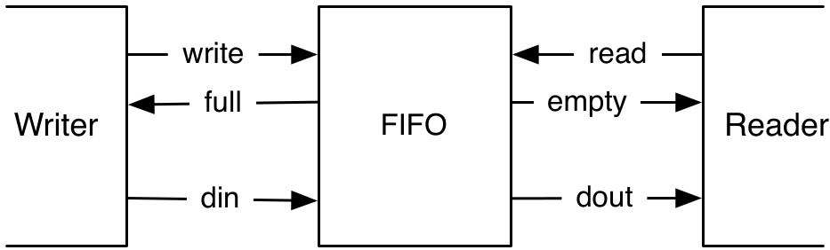

# Chapter 11 — Example Designs

Two classic building blocks you'll reuse everywhere: a **FIFO buffer** (to
decouple a producer from a consumer) and a **UART** serial port (the easiest way
to talk to an FPGA board). We build a simple *bubble* FIFO first, then generalize
the FIFO interface and show several implementations with different
speed/area trade-offs, and finally a modular UART (transmitter, receiver,
buffer) — with an end-to-end loopback test.

*Conventions: every file path is relative to `tutorial/ch11-example-designs/`,
and every command is run from that folder.*

## What's in this project

```
ch11-example-designs/
├── build.sbt · project/build.properties
├── figures/fifo.png
├── src/main/scala/
│   ├── BubbleFifo.scala        bubble FIFO with a custom write/full read/empty interface
│   ├── fifo/fifo.scala         generalized ready/valid FIFOs (5 implementations)
│   ├── uart/uart.scala         UART: Tx, Rx, Buffer, BufferedTx, Sender, Echo
│   ├── uart/UartLoopback.scala Tx->Rx loopback (tutorial helper for testing)
│   └── Generate.scala
└── src/test/scala/
    ├── BubbleFifoTest.scala
    ├── fifo/FifoTest.scala
    └── uart/UartTest.scala
```

---

## 11.1 A bubble FIFO

A FIFO decouples a writer from a reader. This one uses a simple custom interface:
`write`/`full` on the writer side, `read`/`empty` on the reader side.

<p align="center">
  
</p>

***Figure 11.1** — Writer → FIFO → Reader. `full`/`empty` are the handshake
(flow-control) flags.*

Each **stage** is one data register plus a two-state (empty/full) FSM:

`src/main/scala/BubbleFifo.scala`
```scala
class FifoRegister(size: Int) extends Module {
  // ...
  when(stateReg === empty) {
    when(io.enq.write) { stateReg := full; dataReg := io.enq.din }
  }.elsewhen(stateReg === full) {
    when(io.deq.read) { stateReg := empty }
  }
  io.enq.full := (stateReg === full)
  io.deq.empty := (stateReg === empty)
  io.deq.dout := dataReg
}
```

The FIFO chains `depth` stages; data **bubbles** downstream one stage per cycle:

`src/main/scala/BubbleFifo.scala`
```scala
val buffers = Array.fill(depth) { Module(new FifoRegister(size)) }
for (i <- 0 until depth - 1) {
  buffers(i + 1).io.enq.din   := buffers(i).io.deq.dout
  buffers(i + 1).io.enq.write := ~buffers(i).io.deq.empty
  buffers(i).io.deq.read      := ~buffers(i + 1).io.enq.full
}
io.enq <> buffers(0).io.enq
io.deq <> buffers(depth - 1).io.deq
```

It's simple and cheap, but has two limits: max throughput is **one word per two
cycles** (each stage toggles empty/full), and latency is **`depth` cycles**
(the bubble has to travel through). `BubbleFifoTest` also demonstrates
ChiselTest's `fork`/`join` for concurrent producer/consumer threads.

---

## 11.2 Generalized FIFOs (ready/valid + inheritance)

Generalize the handshake to **ready/valid** (`DecoupledIO`) and parameterize by
a Chisel type. A shared interface and an abstract base make implementations
interchangeable:

`src/main/scala/fifo/fifo.scala`
```scala
class FifoIO[T <: Data](private val gen: T) extends Bundle {
  val enq = Flipped(new DecoupledIO(gen))
  val deq = new DecoupledIO(gen)
}

abstract class Fifo[T <: Data](gen: T, val depth: Int) extends Module {
  val io = IO(new FifoIO(gen))
  require(depth > 0, "Number of buffer elements needs to be larger than 0")
}
```

Five implementations (all in `fifo.scala`), each a subclass of `Fifo`:

| Class | Idea | Trade-off |
|-------|------|-----------|
| `BubbleFifo` | chain of 1-word buffers | simplest; 1 word / 2 cycles |
| `DoubleBufferFifo` | each stage holds 2 words (data + shadow) | half the stages/latency; full throughput |
| `RegFifo` | circular buffer in a `Reg(Vec(...))` | good for small FIFOs |
| `MemFifo` | circular buffer in `SyncReadMem` | good for large FIFOs (1-cycle read latency handled) |
| `CombFifo` | `MemFifo` + a `DoubleBuffer` output stage | decouples the memory-read path |

Because they share `FifoIO`, **one generic test drives them all**
(`src/test/scala/fifo/FifoTest.scala`, `def testFn[T <: Fifo[_ <: Data]]`),
checking a single transfer, fill/drain in order, and a full-throughput speed
test. The double-buffer stage shows how to stay `ready` while full without
creating a combinational path between the two handshakes:

`src/main/scala/fifo/fifo.scala`
```scala
io.enq.ready := (stateReg === empty || stateReg === one)
io.deq.valid := (stateReg === one   || stateReg === two)
io.deq.bits  := dataReg
```

---

## 11.3 A serial port (UART)

A UART sends a byte as: one **start** bit (0), 8 **data** bits (LSB first), then
one or two **stop** bits (1); the line idles high. We build it modularly.

**Transmitter** — all state in three registers (a shift register, a baud-rate
counter, and a bit counter); no explicit FSM. It builds the 11-bit frame
`stop,stop ## data ## start` and shifts it out LSB-first:

`src/main/scala/uart/uart.scala`
```scala
io.channel.ready := (cntReg === 0.U) && (bitsReg === 0.U)
io.txd := shiftReg(0)
// when a bit period elapses and a byte is valid:
shiftReg := 3.U ## io.channel.bits ## 0.U   // two stop, data, one start
bitsReg := 11.U
```

**Receiver** — synchronize `rxd`, wait for the start-bit falling edge, then wait
1.5 bit-times to land in the *center* of bit 0, and sample every bit-time after:

`src/main/scala/uart/uart.scala`
```scala
val rxReg = RegNext(RegNext(io.rxd, 0.U), 0.U)          // synchronizer
val falling = !rxReg && (RegNext(rxReg) === 1.U)
// START_CNT ~ 1.5 bit times, BIT_CNT ~ 1 bit time
```

A single-byte **`Buffer`**, a **`BufferedTx`** (Tx + buffer), a **`Sender`**
(streams "Hello World!"), and an **`Echo`** (Rx → Tx) round out the design.

> **Book vs. here:** the book verifies the UART on real hardware (no unit test).
> To make it checkable in simulation, this project adds `UartLoopback`
> (`src/main/scala/uart/UartLoopback.scala`) — a `Tx` whose `txd` is wired
> straight into an `Rx`'s `rxd`. `UartTest` sends a byte in and expects the same
> byte out.
>
> Two things that test taught us, worth remembering: (1) the Rx has an initial
> idle countdown, so the transmitter must not start before the receiver is
> listening (the test steps 200 cycles first); and (2) a full frame exceeds
> ChiselTest's default 1000-cycle idle timeout, so the test calls
> `dut.clock.setTimeout(0)`.

---

## 11.4 Build, run, and check

```
$ sbt test
```

Expected tail (7 tests):

```
[info] Tests: succeeded 7, failed 0, canceled 0, ignored 0, pending 0
[info] All tests passed.
```

Generate SystemVerilog:

```
$ sbt "runMain Generate"
```

emits `BubbleFifo.sv`, `MemFifo.sv`, `DoubleBufferFifo.sv`, and `Sender.sv`.

---

## 11.5 Recap

- A **FIFO** decouples producer and consumer; the **bubble FIFO** is simple but
  peaks at one word per two cycles with `depth`-cycle latency.
- Generalize to **ready/valid** (`DecoupledIO`) + a Chisel type parameter, and
  use an **abstract base** so many implementations share one interface — and one
  test (`DoubleBuffer`, `Reg`/`Mem` circular buffers, combined).
- A **UART** decomposes into `Tx`/`Rx`/`Buffer`; the Rx samples each bit at its
  center after a 1.5-bit start delay. Test serial links with a **loopback**.

## 11.6 Exercises

1. **FIFO bandwidth.** Compare `BubbleFifo` vs. `DoubleBufferFifo` vs. `MemFifo`
   in `FifoTest`'s speed test (the assert prints cycles/word). Which reach one
   word per cycle?
2. **A simpler FIFO.** Write a 4-element register FIFO with 2-bit wrapping
   read/write pointers, treating equal pointers as *empty* (max 3 stored) — no
   empty/full flags. How much simpler is it?
3. **UART.** Extend `Sender` to stream the digits 0–9 repeatedly, polling
   `ready` between characters; or add one of your FIFOs in front of the `Tx`.

Back to the **[tutorial index](../README.md)**.
Previous: **[Chapter 10 — Hardware Generators](../ch10-hardware-generators/README.md)**.
Next: **[Chapter 12 — Interconnect](../ch12-interconnect/README.md)**.
