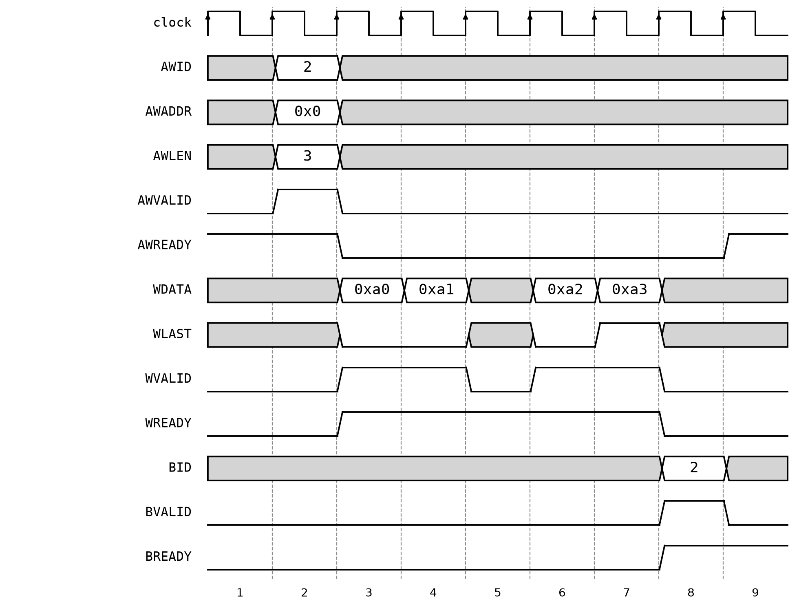
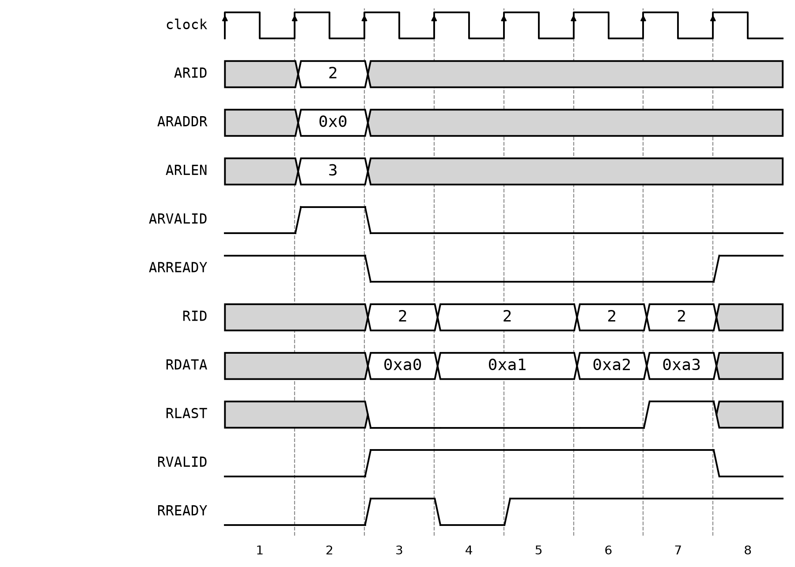
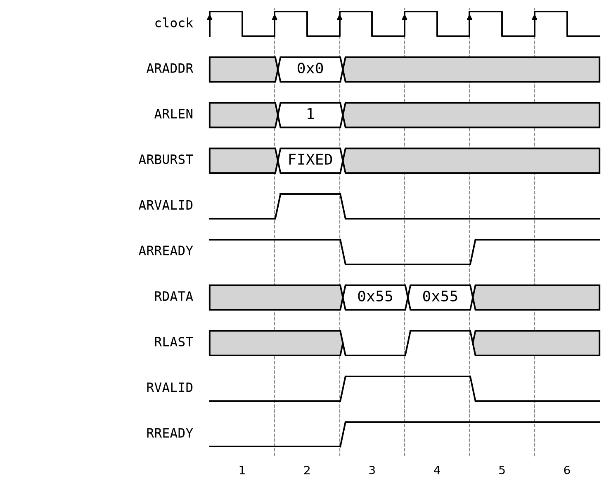
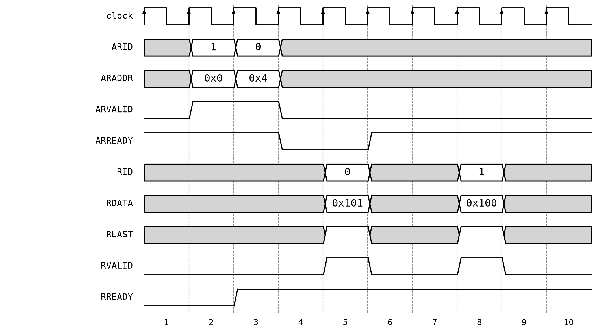

# Appendix — Full AXI4

[Section 12.7](README.md#axi) builds an **AXI4-Lite** slave: five ready/valid
channels, one data beat per address, one transaction at a time. Full **AXI4**
keeps those five channels unchanged and adds three things on top of them —
**bursts**, so one address handshake covers up to 256 data beats;
**transaction IDs**, so a master can have several transactions in flight; and
**out-of-order completion**, so a slave may answer them in whatever order it
can. This appendix builds and tests each one.

It lives outside the chapter because the machinery is large enough that it would
swamp the protocol comparison the chapter is actually making — and because none
of it is needed to follow that comparison.

*Conventions: every file path is relative to `tutorial/ch12-interconnect/`, and
every command is run from that folder. This appendix shares the chapter's sbt
project, so `sbt test` runs its tests along with the chapter's. Every timing
diagram here was captured by cycle-stepping the actual module and recording its
ports, not drawn by hand, so each level and bus value is what the elaborated
hardware really produces.*

---

## A.1 What the channels carry

Before the payloads, the handshake. Every AXI channel is a `Decoupled`, so the
source holds `valid` until the sink raises `ready` — which makes each channel
handshake **registered-style** in the terms of Sections 12.2 to 12.4, never
combinational: no slave here lets `READY` depend on the incoming `VALID`, so
nothing combinational runs from master to slave and back.

What AXI adds is not a fourth scheme but two ways around the one it has.
*Bursts* amortise a single address handshake over many data beats, and
*transaction ids* let several transactions be outstanding at once. Neither
changes the per-channel handshake; both change how much work it carries.

The five channels are the same as AXI4-Lite's. The difference is entirely in
the payloads, and it is concentrated in the address channel:

`src/main/scala/axi4/Axi4.scala`
```scala
class Axi4Addr(addrWidth: Int, idWidth: Int) extends Bundle {
  val id = UInt(idWidth.W)
  val addr = UInt(addrWidth.W)
  val len = UInt(8.W)       // beats in this burst, minus one (so 0 = 1 beat)
  val size = UInt(3.W)      // bytes per beat, log2 (2 = 4 bytes = 32 bits)
  val burst = UInt(2.W)
  val prot = UInt(3.W)
}
```

| Field | Meaning | AXI4-Lite equivalent |
|-------|---------|----------------------|
| `id` | transaction tag; responses carry it back | — (always one transaction) |
| `len` | beats **minus one**: `0` is a single beat, `255` is 256 | — (always one beat) |
| `size` | `log2` of the bytes per beat; `2` means 4 bytes | — (always the bus width) |
| `burst` | `FIXED`, `INCR`, or `WRAP` — how the address advances | — (no address advance) |
| `prot` | privilege / security / instruction attributes | same |

The off-by-one on `len` is the classic place to trip: a four-beat burst is
`len = 3`. It is encoded that way so that zero means something useful (a single
beat) rather than an illegal empty burst.

The data channels grow a `last` flag, and the response channels grow the `id`:

`src/main/scala/axi4/Axi4.scala`
```scala
class Axi4WrData extends Bundle {
  val data = UInt(32.W)
  val strb = UInt(4.W)
  val last = Bool()
}

class Axi4RdData(idWidth: Int) extends Bundle {
  val id = UInt(idWidth.W)
  val data = UInt(32.W)
  val resp = UInt(2.W)
  val last = Bool()
}
```

Note what W does *not* carry: no address and no id. A write burst's data beats
are matched to their address purely by arrival order on the channel, and the
slave counts them off using `last` rather than by re-deriving the count from
`len`. The burst types are named constants rather than bare numbers:

`src/main/scala/axi4/Axi4.scala`
```scala
object Axi4Burst {
  val fixed = 0.U(2.W)      // every beat hits the same address (e.g. a FIFO port)
  val incr = 1.U(2.W)       // address advances by the transfer size each beat
  val wrap = 2.U(2.W)
}
```

---

## A.2 Bursts

`Axi4Memory` is a small word-addressed memory that serves one read burst and
one write burst at a time. The write side is a three-state machine: take the
address, absorb data beats until `last`, then answer on B.

`src/main/scala/axi4/Axi4.scala`
```scala
  io.aw.ready := wState === wIdle
  io.w.ready := wState === wBurst
  io.b.valid := wState === wResp
  io.b.bits.id := wIdReg
  io.b.bits.resp := AxiResp.okay

  when(io.aw.fire) {
    wIdReg := io.aw.bits.id
    wAddrReg := io.aw.bits.addr
    wFixedReg := io.aw.bits.burst === Axi4Burst.fixed
    wState := wBurst
  }
  when(io.w.fire) {
    mem(index(wAddrReg)) := merge(mem(index(wAddrReg)), io.w.bits.data, io.w.bits.strb)
    when(!wFixedReg) {
      wAddrReg := wAddrReg + 4.U
    }
    // One response per burst, not per beat -- that is the whole saving.
    when(io.w.bits.last) {
      wState := wResp
    }
  }
  when(io.b.fire) {
    wState := wIdle
  }
```

<p align="center">
  
</p>

***Figure 12.12** — A four-beat INCR write burst, captured from `Axi4Memory`.
Grey marks a don't-care: a payload is only meaningful while its channel's
`VALID` is asserted.*

One address handshake in cycle 2 carries `AWID = 2`, `AWADDR = 0x0`, and
`AWLEN = 3`, and then four data beats follow with no further addressing. Cycle
5 is deliberately left empty: `WVALID` drops and the burst simply pauses. A
burst is a stream of beats, not a fixed-rate block, so the master may insert
gaps wherever it likes and the slave holds its place. `WLAST` marks the fourth
beat in cycle 7, and a **single** `BID = 2` response follows in cycle 8 — one
response for four beats, which is where the saving over AXI4-Lite comes from.

The address register advances itself as beats arrive, which is what makes the
burst a burst: the master handshakes an address once and the slave walks it.
`merge` applies the write strobes lane by lane, a Scala `map` building four
muxes that `Cat` reassembles — a small hardware generator in the sense of
[Chapter 10](../ch10-hardware-generators/README.md):

`src/main/scala/axi4/Axi4.scala`
```scala
  private def merge(old: UInt, data: UInt, strb: UInt) =
    Cat((3 to 0 by -1).map(b => Mux(strb(b), data(8 * b + 7, 8 * b), old(8 * b + 7, 8 * b))))
```

The read side generates `last` from a beat counter instead of consuming it:

`src/main/scala/axi4/Axi4.scala`
```scala
  io.r.bits.last := rCntReg === 0.U

  when(io.ar.fire) {
    rIdReg := io.ar.bits.id
    rAddrReg := io.ar.bits.addr
    rCntReg := io.ar.bits.len          // len is beats-minus-one, so it doubles
    rFixedReg := io.ar.bits.burst === Axi4Burst.fixed
    rState := rBurst
  }
  when(io.r.fire) {
    when(!rFixedReg) {
      rAddrReg := rAddrReg + 4.U
    }
    rCntReg := rCntReg - 1.U
    when(io.r.bits.last) {
      rState := rIdle
    }
  }
```

Loading `rCntReg` straight from `len` works precisely because of the off-by-one
above: the counter reaching zero *is* the last beat, so no separate decrement
or comparison against the length is needed.

<p align="center">
  
</p>

***Figure 12.13** — A four-beat INCR read burst, with the master stalling on the
second beat.*

The mirror image of the write: one `ARID = 2` / `ARLEN = 3` handshake in cycle
2, then four beats, each tagged with `RID = 2` so the master knows which
transaction they belong to, and `RLAST` on the fourth. The interesting cycle is
4 — the master drops `RREADY`, so beat `0xa1` is **held** across cycles 4 and 5
and transfers only once. Compare it with `0xa0`, `0xa2`, and `0xa3`, each of
which occupies a single cycle: a beat lasts as long as it takes to be accepted,
and stalling costs throughput without breaking the burst.

The test writes four beats and reads them back, checking that `last` appears on
the fourth beat and nowhere else, and that the id survives the round trip:

`src/test/scala/Axi4MemoryTest.scala`
```scala
      sendAddr(dut.io.ar, dut.clock, id = 2, addr = 0, len = 3, burst = Axi4Burst.incr)
      dut.io.r.ready.poke(true.B)
      for (i <- 0 until 4) {
        while (!dut.io.r.valid.peekBoolean()) dut.clock.step()
        dut.io.r.bits.id.expect(2.U)
        dut.io.r.bits.data.expect((0xa0 + i).U, s"beat $i")
        dut.io.r.bits.last.expect((i == 3).B, s"last only on beat 3, checked at $i")
        dut.clock.step()
      }
```

---

## A.3 FIXED versus INCR

`INCR` is the ordinary case — the address advances by `2^size` bytes per beat,
walking through memory. `FIXED` holds the address still for every beat, which
is what you want when the target is not memory at all but a single register:
draining a FIFO through one port, or pushing a stream at a UART's data
register. The memory implements this with the one flag it captured at address
time, `wFixedReg` / `rFixedReg`, gating the address increment.

The two modes are best read side by side. These are the same two-beat burst
from the same memory, at the same address, differing only in `ARBURST` — word 0
holds `0x55` and word 1 holds `0x66`:

<p align="center">
  
</p>

***Figure 12.14** — `ARBURST = FIXED`: both beats return `0x55`, the address never
moves.*

<p align="center">
  
</p>

***Figure 12.15** — `ARBURST = INCR`, everything else identical: the second beat
returns `0x66` from the next word.*

Every other signal in the two figures is the same, down to the cycle. The whole
difference between the modes is that one box of read data — which is what makes
`FIXED` useful for a device register, where advancing the address would read
the wrong thing entirely.

The test checks that two `FIXED` beats really do come from the same word rather
than from consecutive ones:

`src/test/scala/Axi4MemoryTest.scala`
```scala
      // Two beats, FIXED: both must come from word 0, not 0 and then 1.
      sendAddr(dut.io.ar, dut.clock, id = 0, addr = 0, len = 1, burst = Axi4Burst.fixed)
      dut.io.r.ready.poke(true.B)
      for (i <- 0 until 2) {
        while (!dut.io.r.valid.peekBoolean()) dut.clock.step()
        dut.io.r.bits.data.expect(0x55.U, s"FIXED beat $i stays at the same address")
        dut.clock.step()
      }
```

`WRAP`, the third type, is used for cache-line fills: the address advances as
in `INCR` but wraps around inside an aligned block, so a miss can be serviced
critical-word-first. It is not implemented here — see the exercise.

---

## A.4 Transaction IDs and out-of-order completion

This is what the ids are *for*. Without them a slave must answer transactions
in the order it received them, so one slow access blocks every access queued
behind it. Tag each transaction and the responses can come back in any order,
because the master can tell which is which.

`Axi4OooReadMemory` keeps a small table of accepted read commands and serves
whichever is ready first:

`src/main/scala/axi4/Axi4.scala`
```scala
  val busyRegs = RegInit(VecInit(Seq.fill(slots)(false.B)))
  val idRegs = RegInit(VecInit(Seq.fill(slots)(0.U(idWidth.W))))
  val addrRegs = RegInit(VecInit(Seq.fill(slots)(0.U(addrWidth.W))))
  val cntRegs = RegInit(VecInit(Seq.fill(slots)(0.U(8.W))))
  val delayRegs = RegInit(VecInit(Seq.fill(slots)(0.U(8.W))))
  val fixedRegs = RegInit(VecInit(Seq.fill(slots)(false.B)))
```

To make reordering visible without modelling a memory hierarchy, each accepted
command is given an artificial delay of `id * 4` cycles — a stand-in for the
real reasons latency varies (a bank conflict, a cache miss, a slow peripheral
sharing the port):

`src/main/scala/axi4/Axi4.scala`
```scala
  io.ar.ready := hasFree
  when(io.ar.fire) {
    busyRegs(freeSlot) := true.B
    idRegs(freeSlot) := io.ar.bits.id
    addrRegs(freeSlot) := io.ar.bits.addr
    cntRegs(freeSlot) := io.ar.bits.len
    fixedRegs(freeSlot) := io.ar.bits.burst === Axi4Burst.fixed
    delayRegs(freeSlot) := io.ar.bits.id << 2
  }
```

A command becomes eligible when its delay reaches zero, and `servingReg` latches
one until its burst finishes:

`src/main/scala/axi4/Axi4.scala`
```scala
  val ready = VecInit((0 until slots).map(i => busyRegs(i) && delayRegs(i) === 0.U))
  when(!servingReg && ready.reduce(_ || _)) {
    servingReg := true.B
    slotReg := PriorityEncoder(ready)
  }
```

The `servingReg` latch is not optional. AXI4 requires the beats of one burst to
arrive contiguously — read data belonging to different ids may **not** be
interleaved. (AXI3 permitted interleaving and AXI4 removed it, because the
reassembly buffers it forced on every master cost more than it saved.) So
transactions may complete out of order, but a burst, once started, runs to its
`last` beat before another is served.

<p align="center">
  
</p>

***Figure 12.16** — Two reads issued in one order and answered in the other.*

Both commands go out back to back: `ARID = 1` for address `0x0` in cycle 2,
`ARID = 0` for address `0x4` in cycle 3. `ARREADY` then drops, because both
slots of the table are occupied. The answers arrive in the opposite order —
`RID = 0` with `0x101` in cycle 5, and only in cycle 8 `RID = 1` with `0x100`.

Read the data values against the addresses and the point of the ids lands: the
beat in cycle 5 carries `0x101`, the contents of word 1, which is what the
**second** command asked for. Nothing but `RID` connects that beat to its
request — there is no ordering left to rely on. That is also why the gap in
cycles 6 and 7 is harmless: the master already has the id-0 result and can use
it while the slow transaction is still in flight, which is exactly the
head-of-line blocking that in-order completion would have imposed.

The test issues the slow request first and the fast one second, and requires
them back in the opposite order:

`src/test/scala/Axi4MemoryTest.scala`
```scala
      // id 1 is given the slow path (id * 4 cycles), id 0 the fast one. Issue
      // the slow one first; the ids are what make it safe to answer them in the
      // opposite order.
      sendAddr(dut.io.ar, dut.clock, id = 1, addr = 0, len = 0, burst = Axi4Burst.incr)
      sendAddr(dut.io.ar, dut.clock, id = 0, addr = 4, len = 0, burst = Axi4Burst.incr)

      dut.io.r.ready.poke(true.B)

      while (!dut.io.r.valid.peekBoolean()) dut.clock.step()
      dut.io.r.bits.id.expect(0.U, "the fast request comes back first")
      dut.io.r.bits.data.expect(0x101.U, "word 1, as addressed by the id-0 request")
```

The memory is initialised so that word *n* holds `0x100 + n`, which is what
makes the data check meaningful: `0x101` can only have come from the word the
id-0 request addressed, so the beat is provably matched to the right
transaction and not merely to the right order.

---

## A.5 Build, run, and check

The appendix shares the chapter's project, so its tests run with everything
else. To run just this suite:

```
$ sbt "testOnly Axi4MemoryTest"
```

```
[info] Axi4MemoryTest:
[info] An AXI4 memory
[info] - should write and read back a four-beat INCR burst
[info] - should hold the address across a FIXED burst
[info] An out-of-order AXI4 memory
[info] - should complete the later request first
[info] Run completed in 1 second, 572 milliseconds.
[info] Total number of tests run: 3
[info] Suites: completed 1, aborted 0
[info] Tests: succeeded 3, failed 0, canceled 0, ignored 0, pending 0
[info] All tests passed.
```

`sbt "runMain Generate"` emits `Axi4Memory.sv` and `Axi4OooReadMemory.sv` into
`generated/` along with the chapter's files.

---

## A.6 What these models leave out

Both modules are teaching models, not a compliant implementation. What is
missing, and why it would matter in real use:

- **`WRAP` bursts** — accepted by the bundle, but the memories treat anything
  that is not `FIXED` as `INCR`. A real cache-line fill would read the wrong
  addresses.
- **Narrow and unaligned transfers** — `size` is carried but ignored; both
  memories assume 4-byte beats on aligned addresses.
- **Write-data interleaving and multiple outstanding writes** — `Axi4Memory`
  accepts one write burst at a time; ids are echoed on B but do not enable
  concurrency on the write path.
- **Exclusive access** — `AxiResp.exOkay` is defined but never returned; there
  is no lock/monitor logic, so no atomic read-modify-write.
- **`cache`, `qos`, `region`, `user`, and `lock`** — omitted from the address
  bundle entirely to keep it readable.
- **Error responses** — every transfer returns `okay`. A real slave returns
  `slvErr` on a failed access and a decoder returns `decErr` for an unmapped
  address.
- **A dead cycle between bursts.** `Axi4OooReadMemory` holds two commands, yet
  measures only one transfer every two cycles: `servingReg` is set a cycle
  *after* a slot becomes ready and cleared on the last beat, so a bubble always
  falls between bursts. Selecting the next slot combinationally on the last beat
  would close it. The two slots therefore buy **ordering freedom, not
  throughput** — which is worth stating plainly, since "supports multiple
  outstanding transactions" reads easily as "goes faster."
- **The artificial `id * 4` delay** is a demonstration device, not a memory
  model. It makes reordering deterministic and testable; real latency variation
  comes from the memory system.

---

## A.7 Exercise

Add `WRAP` support to `Axi4Memory`'s read path. A wrapping burst stays inside
an aligned block of `len+1` beats — so with `len = 3` and 4-byte beats, a burst
starting at byte 8 reads words 2, 3, 0, 1. The block size is always a power of
two, which means the wrap is a masked increment rather than a comparison: keep
the high address bits fixed and let only the low ones advance. Then extend the
FIXED test to cover it, starting a burst part-way into a block so that the wrap
actually happens.

For a second exercise, give `Axi4Memory` a second outstanding write by
splitting its write path the way `Axi4OooReadMemory` splits its read path, and
check that the two B responses come back carrying the right ids.
