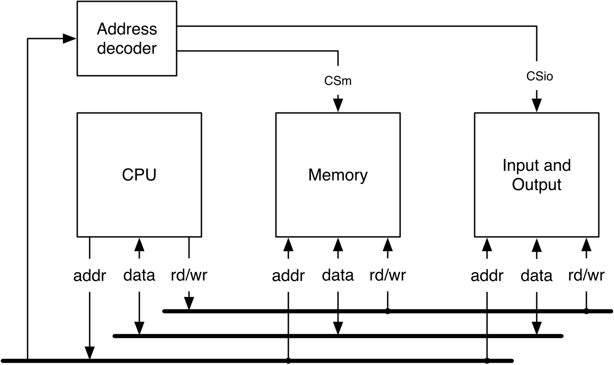
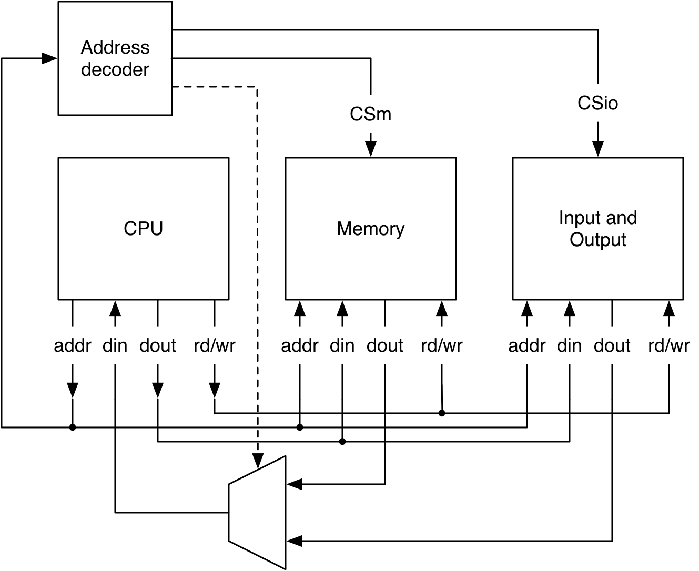

# Chapter 12 — Interconnect

Larger systems are built by connecting components, and **interconnect** defines
how. This chapter starts from the classic microprocessor bus, adapts it to an
on-chip "bus" (multiplexers instead of tri-state), adds handshaking for devices
with variable latency (a **pipelined** `PipeCon` interface), builds a memory-
mapped IO device bridging a bus to a ready/valid stream, and surveys the
standards (Wishbone, AXI).

*Conventions: every file path is relative to `tutorial/ch12-interconnect/`, and
every command is run from that folder.*

## What's in this project

```
ch12-interconnect/
├── build.sbt · project/build.properties
├── figures/
├── src/main/scala/
│   ├── soc/PipeCon.scala      the pipelined interconnect interface (Bundle)
│   ├── fifo/fifo.scala        a small RegFifo (dependency of the bridge)
│   ├── interconnect.scala     CounterDevice + memory-mapped RV bridge
│   └── Generate.scala
└── src/test/scala/
    ├── CounterDeviceTest.scala
    └── InterconnectTest.scala
```

---

## 12.1 From a classic bus to an on-chip bus

Interconnect standards such as [Wishbone](https://en.wikipedia.org/wiki/Wishbone_(computer_bus))
or AXI exist to simplify composing components into larger systems. Interconnect
is used **between chips** (external, e.g. a CPU talking to an external memory
chip) or **within a chip**, where the resulting system is called a
system-on-chip (SoC).

A classic microcomputer connects the CPU to memory and I/O over shared address,
data, and control buses, using **tri-state** drivers on the bidirectional data
bus and an **address decoder** driving chip-select (CS) lines. This kind of bus
interconnection was common with early microprocessors such as the
[Z80](https://en.wikipedia.org/wiki/Zilog_Z80) or the
[6502](https://en.wikipedia.org/wiki/MOS_Technology_6502).

<p align="center">
  
</p>

***Figure 12.1** — A CPU, memory, and I/O on shared address/data/control buses.*

The CPU is the bus master and drives the address and control lines (e.g. *read*
and *write*); not all address lines reach every peripheral, so the upper
address bits feed a decoder whose outputs drive each device's chip-select
input. On a read, the selected device drives the data bus after its access
time; on a write, the CPU drives the data bus and the peripheral latches it
(often on a rising clock edge). Because the data bus is shared and
bidirectional, every device's output needs a
[tri-state](https://en.wikipedia.org/wiki/Three-state_logic) driver: in the
tri-state (high-impedance) configuration **both output transistors are
disabled**, and the pin is practically disconnected from the logic — so
several devices can share the same wire without contention.

Note that in its simplest form **this bus has no clock at all**: timing is
defined purely by the read/write access times of the peripheral devices.

Modern computers use dedicated buses per purpose instead of one shared bus —
e.g. a dedicated memory bus for external memory, and serial, point-to-point I/O
buses such as [PCI Express](https://en.wikipedia.org/wiki/PCI_Express) for
peripherals. Nevertheless, the classic bus concept — an address bus, a data
bus, and chip-select signals — remains the mainstream mental model for core
interconnection, and we adapt it for on-chip use next.

On-chip, tri-state buses are impractical, so we **split** the data bus into
separate write-out and read-in wires and use a **multiplexer** (selected by the
address decoder) for the read path. On-chip wires are cheap compared to PCB
traces or connectors, so this duplication costs little. Connections are
clocked.

<p align="center">
  
</p>

***Figure 12.2** — On-chip: a read mux replaces the tri-state data bus; the
decoder drives both the chip selects and the mux.*

With this simple setup we assume every read or write completes in a single
clock cycle — realistic only for very small systems. A first, natural
extension is to expect the read result **one clock cycle after** the request,
which matches on-chip memories with a synchronous (registered), one-cycle-
latency read port, and also relaxes timing for IO devices. Writes are still
assumed to complete in one cycle.

To go further — devices with different or *varying* latency — we need
**handshaking**: the processor signals the start of a transaction with a read
or write request, and the device signals the *end* of the transaction with an
acknowledgment.

---

## 12.2 Handshaking: the pipelined PipeCon interface

### Combinational Handshake

The simplest handshake reacts within the request cycle: the processor drives
`address` and `rd` in cycle 2, and `ack` must respond **combinationally**,
within that same cycle. In the example timing, the read data itself is not
ready in one cycle but arrives two cycles later, in cycle 4 — `ack` and `data`
are each valid for a single cycle. The benefit is that a single-cycle
transaction becomes possible; the price is that the handshake, including
address decoding, is a combinational path through the peripheral, which can
hurt the maximum clock frequency. The classic Wishbone protocol uses exactly
this same-cycle acknowledgment (Wishbone later added a pipelined mode too).

Same-cycle acknowledgment has been criticized — a single-cycle transaction is
rarely realistic in a larger system — leading to the **SimpCon** proposal: a
specification where `ack` (or busy/ready) need not be valid in the request
cycle, enabling pipelined transactions and avoiding the combinational path
between processor, address decoding, and device.

### Pipelined Handshake

`PipeCon`, defined below, is exactly such a pipelined protocol: a read or
write command is signaled by asserting `rd` or `wr` for a single clock cycle
(address/write-data must be valid during that cycle), and each command is
acknowledged by `ack` **the earliest one cycle later** — later still if the
device needs to insert **wait states** by delaying `ack`. Read data is valid
together with `ack`.

In the timing example, addresses `A1`, `A2`, `A3` are requested with `rd`
pulsed for one cycle each; `ack` for `A1` arrives one cycle after the request
(the same two-cycle latency as the combinational example above), but because
each request only needs to be valid for a single cycle, `A2` and `A3` can be
requested **back-to-back** — giving a throughput of one word per clock cycle
once the pipeline is full, unlike the combinational protocol.

The Patmos processor uses an OCP variant with exactly this protocol for its IO
devices (memory is connected via a separate burst interface); the *Patmos
Handbook* documents the OCP interfaces in detail. The
[`t-crest/soc-comm`](https://github.com/t-crest/soc-comm) Chisel repository
implements this pipelined interface for multicore devices such as a
network-on-chip.

This point-to-point, pipelined interconnect generalizes naturally: processor
and peripherals each connect via such an interface to a switching fabric, and
if the system has more than one master, the fabric must **arbitrate** among
masters requesting reads or writes.

We call our interface `PipeCon` to emphasize its pipelined nature:

`src/main/scala/soc/PipeCon.scala`
```scala
class PipeCon(private val addrWidth: Int) extends Bundle {
  val address = Input(UInt(addrWidth.W))
  val rd = Input(Bool())
  val wr = Input(Bool())
  val rdData = Output(UInt(32.W))
  val wrData = Input(UInt(32.W))
  val wrMask = Input(UInt(4.W))
  val ack = Output(Bool())
}
```

---

## 12.3 An example IO device

`CounterDevice` implements `PipeCon`: four free-running 32-bit counters you can
read and load. Because the read result arrives the cycle *after* the command
(and the command is valid only that cycle), it **registers the address**
(`addrReg`) and **delays the ack** (`ackReg`):

Addressing four 32-bit counters needs **4 address bits**, not 2: addresses
count in *bytes*, while each counter is a 32-bit (4-byte) word, so the two
low address bits select a byte within a word and only the upper two bits
(`address(3, 2)`) select one of the four counters.

The counters themselves are a small **register file**: a `Reg` of a `Vec`,
initialized to all zeros by building a Scala `Seq` with `Seq.fill` (four
Chisel `0.U(32.W)` constants) and passing it to `VecInit`. Each counter is
free-running — it increments by one every cycle — except when a write
overwrites it that cycle.

`src/main/scala/interconnect.scala`
```scala
class CounterDevice extends Module {
  val io = IO(new PipeCon(4))
  val ackReg = RegInit(false.B)
  val addrReg = RegInit(0.U(2.W))
  val cntRegs = RegInit(VecInit(Seq.fill(4)(0.U(32.W))))

  ackReg := io.rd || io.wr
  when(io.rd) { addrReg := io.address(3, 2) }
  io.rdData := cntRegs(addrReg)

  for (i <- 0 until 4) { cntRegs(i) := cntRegs(i) + 1.U }
  when (io.wr) { cntRegs(io.address(3, 2)) := io.wrData }
  io.ack := ackReg
}
```

`CounterDeviceTest` wraps the protocol in `read()`/`write()` helpers that poll
`ack` — a clean pattern for driving a pipelined interface from a test.

---

## 12.4 Memory-mapped devices

Devices share the address space; upper address bits are decoded to select one.
As part of the system design we must choose an address map — there is no one
right answer. An example memory map for a **16-bit** microcontroller (so
addresses run 0x0000–0xffff): the lowest addresses hold a read-only memory
(ROM) with the program to execute, followed by a writable RAM for data; all
IO devices are pushed to the top of the space (above 0xf000) so they stay out
of the way if the memory regions need to grow, with **16 bytes** reserved per
device. This is a made-up example — an address map has as much flexibility as
the designer wants:

| Address | Device |
|---------|--------|
| 0x0000–0x0fff | ROM |
| 0x1000–0x1fff | RAM |
| 0xf000 | UART |
| 0xf010 | LEDs |
| 0xf020 | Keys |

Some IO devices, like the counter above, expose ordinary registers. Others —
like a UART — expose a **ready/valid** interface instead (see the ready/valid
interface in [Chapter 9](../ch09-communicating-state-machines/README.md#93-the-readyvalid-interface),
and the UART shift registers in
[Chapter 6](../ch06-sequential-building-blocks/README.md)). The common
solution is to map the write and read channel onto one address (driving the
corresponding `valid`/`ready` on the write or read command), and map the two
flags into a **status register** at a different address so software can poll
before it reads or writes:

| Address | read | write |
|---------|------|-------|
| 0xf000 | status | control |
| 0xf001 | receive buffer | transmit buffer |

| Status bit | Meaning |
|-----------|---------|
| 0 (TDRE) | Transmit data register empty (ok to send) |
| 1 (RDRF) | Receive data register full (data to read) |

When the transmit data register is empty (TDRE) we can send new data; when
the receive data register is full (RDRF) we can read data. The terminology
sounds dated because it *is*: this is precisely the status-register mapping
of the first serial port of the IBM PC, built around the
[8250](https://en.wikipedia.org/wiki/8250_UART) UART chip — and it is still a
valid design today.

Polling a status register this way is only safe if, once asserted, `rx.valid`
and `tx.ready` are **not allowed to be deasserted again** before being
consumed — otherwise software could poll "ready", act on it, and find the
condition gone. If a device cannot guarantee that, insert a one-word buffer
(register) on each of the two ready/valid channels between the memory-mapped
interface and the device to restore the guarantee.

For our memory-mapped devices we define a bundle:

`src/main/scala/interconnect.scala`
```scala
class MemoryMappedIO extends Bundle {
  val address = Input(UInt(4.W))
  val rd = Input(Bool())
  val wr = Input(Bool())
  val rdData = Output(UInt(32.W))
  val wrData = Input(UInt(32.W))
  val ack = Output(Bool())
}
```

`MemMappedRV` bridges this memory-mapped bus to a `Decoupled` (ready/valid) stream:
address 0 reads the status (`rx.valid ## tx.ready`), address 1 reads the receive
data / writes the transmit data:

`src/main/scala/interconnect.scala`
```scala
statusReg := io.rx.valid ## io.tx.ready
ackReg := io.mem.rd || io.mem.wr            // delayed ack (pipelined)
io.mem.rdData := Mux(addrReg === 0.U, statusReg, io.rx.bits)
io.tx.bits := io.mem.wrData
io.tx.valid := io.mem.wr
```

Like `CounterDevice`, `MemMappedRV` is accessible with one cycle of latency
(the minimum under the pipelined handshake): it registers the read address
(`addrReg`) and delays `ack` by one cycle (`ackReg`).

**Simplification:** to keep the example small, a read always returns
`io.rx.bits` even if the receive channel has no valid data (`rx.valid` false),
and a write always asserts `tx.valid` even if the send buffer is full — instead
of stalling `ack` until the channel is actually ready. The example delegates
that check entirely to software, which is expected to read the status register
first and only read/write data once TDRE/RDRF say it is safe.

`UseMemMappedRV` connects it to a small `RegFifo` (tx → enq, deq → rx) as a
loopback, so `InterconnectTest` can write a value and read it back through the
status/data registers.

---

## 12.5 Bus and Interface Standards

Several point-to-point and bus standards have been proposed over the years;
the ready/valid discipline from [Chapter 9](../ch09-communicating-state-machines/README.md)
underlies most of them.

### Wishbone

[Wishbone](https://en.wikipedia.org/wiki/Wishbone_(computer_bus)) is a
public-domain specification defining a point-to-point connection (not a bus in
the classic shared-wire sense), used by several open-source IP cores, but
still in the spirit of a microcomputer/backplane bus. This is not the best fit
for an SoC interconnect: Wishbone requires the **master** to hold address and
data valid for the *entire* read or write cycle. For a master whose data is
only valid a single cycle (like `PipeCon`'s), that means either registering
address/data *before* the Wishbone connection — costing an extra cycle of
latency — or an expensive multiplexer. A better fix is to register the
address and data **in the slave** instead, so address decoding happens in the
same cycle the address is registered. The mirror issue applies to the
**slave's** output data: since it is only valid for one cycle, a master that
doesn't sample it immediately must register it — so, by convention, the slave
should keep its last valid output held even after the Wishbone strobe
(`wb.stb`) is deasserted (holding data is normally free in hardware — it is
just a specification detail). The classic Wishbone specification has no
pipelined read or write; the newer **B4** specification adds a pipelined mode,
so a Wishbone system may now mix two specifications that are not necessarily
compatible with each other.

The `wishbone` timing figure shows an asynchronous (classic, combinational-ack)
read followed by an asynchronous write; the `wishbone:sync` figure shows the
same pair of transactions using the synchronous/pipelined variant, where
address and data no longer need to stay valid for the whole cycle.

### AXI

The Advanced Microcontroller Bus Architecture (AMBA), from ARM, defines three
buses: Advanced High-performance Bus (AHB), Advanced System Bus (ASB, the
predecessor of AHB, deprecated — it uses both clock phases, unusual for a
modern synchronous design), and Advanced Peripheral Bus (APB). AHB connects
on-chip memory, cache, and external memory to the processor; peripherals hang
off the lower-bandwidth APB via a bridge. An AHB transfer can complete in one
cycle with burst operation; an APB transfer takes **two cycles with no burst
mode**, and APB **v3** adds wait states to peripheral bus cycles.

AMBA AXI (Advanced eXtensible Interface) and **ACE version 4** are the latest
extension to AMBA. AXI adds out-of-order transaction completion via a 4-bit
transaction ID tag; a `ready` signal acknowledges the *start* of the
transaction, and the master must hold the transaction information (e.g. the
address) until the interconnect asserts `ready` — which gives up the elegant
single-cycle address phase of the original AHB. AXI applies ready/valid
handshaking across **all five channels**: read address, read data, write
address, write data, and write response. Decoupling write address from write
data this way requires a more complex slave able to accept the two in any
order.

### Open Core Protocol

Sonics Inc. defined the Open Core Protocol (OCP) as an open, freely available
standard, now maintained by the OCP International Partnership (OCP-IP). The
Patmos processor and the T-CREST multicore platform use OCP: the Patmos
repository contains memory controllers, peripheral devices, and a
network-on-chip, all with an OCP interface.

### Further Bus Specifications

**Avalon**, from Intel, is a system-on-a-programmable-chip interconnect
specification covering everything from a simple asynchronous static-RAM-style
interface to sophisticated pipelined transfers with variable latency. This
flexibility comes from the *Avalon Switch Fabric*, which translates between
the different interconnection styles and is generated by Intel's SOPC Builder
tool — but the switch fabric itself appears to be Intel-proprietary, tying the
specification to Intel FPGAs.

The **On-Chip Peripheral Bus (OPB)** is an open standard from IBM, used by
Xilinx for several years. It specifies a bus for multiple masters and slaves
without mandating an implementation — a distributed ring, a centralized
multiplexer, or a centralized AND/OR network are all suggested. Xilinx used
the AND/OR approach, which requires every inactive master and slave to drive
its data bus to zero; Xilinx has since moved all its interconnects to AXI.

---

## 12.6 Build, run, and check

```
$ sbt test
```

Expected tail (2 tests):

```
[info] Tests: succeeded 2, failed 0, canceled 0, ignored 0, pending 0
[info] All tests passed.
```

Generate SystemVerilog:

```
$ sbt "runMain Generate"
```

emits `CounterDevice.sv` and `UseMemMappedRV.sv`.

---

## 12.7 Recap

- A classic microprocessor bus (Z80/6502-style) shares one tri-state data bus,
  needs no clock, and defines timing purely through peripheral access times;
  on-chip interconnect replaces the tri-state data bus with a **read mux**
  driven by the **address decoder**; connections are clocked.
- A **combinational handshake** (classic Wishbone) allows single-cycle
  transactions but puts decoding on the critical path; SimpCon criticized this.
- A **pipelined handshake** (`PipeCon`: single-cycle command, delayed `ack`,
  optional wait states) avoids a same-cycle combinational path and allows
  back-to-back requests; used by Patmos/OCP and `t-crest/soc-comm`, and
  generalizes to point-to-point links through a switching fabric (with
  arbitration once there is more than one master).
- **Memory-mapped** devices live in the shared address space; a status register
  exposes ready/valid flags for polling (mirroring the IBM PC's 8250 UART), and
  a bridge (`MemMappedRV`) maps a bus to a `Decoupled` stream.
- Standards (Wishbone, AXI, OCP, Avalon, OPB) formalize these ideas atop
  ready/valid, each with its own trade-offs around who holds data valid and for
  how long.

## 12.8 Exercise

Add a second device to the bus with a different address range, an address
decoder that generates chip selects, and a read multiplexer selecting the active
device's `rdData` — then drive both from a test through the `read`/`write`
helpers.

**From the book:** Take `MemMappedRV` with a streaming device connected to its
`rx`/`tx` ports and write a ChiselTest testbench for the memory interface.
Explore what happens if the test ignores the status flags — i.e. it reads
data while the receive channel is invalid, or writes while the transmit
channel isn't ready. Then modify `MemMappedRV` so `ack` is delayed until the
streaming device's `rx`/`tx` are actually ready/valid, and check whether your
testbench still works with the delayed `ack`. If simulating both the
streaming device and the memory interface starts to feel awkward in plain
Scala — needing two software state machines running "in parallel" — that is
exactly the problem multithreaded testing solves; see the
[testing chapter](../ch13-debugging-testing-verification/README.md).

Back to the **[tutorial index](../README.md)**.
Previous: **[Chapter 11 — Example Designs](../ch11-example-designs/README.md)**.
Next: **[Chapter 13 — Debugging, Testing, and Verification](../ch13-debugging-testing-verification/README.md)**.
