# Chapter 12 — Interconnect

Larger systems are built by connecting components, and **interconnect** defines
how. Standards such as [Wishbone](https://en.wikipedia.org/wiki/Wishbone_(computer_bus))
or AXI exist to simplify that composition: a device built against a published
interface works with any master that speaks the same one, so neither side has to
be designed for the other. Interconnect is used **between chips** (external, e.g.
a CPU talking to an external memory chip) or **within a chip**, where the
resulting system is called a system-on-chip (SoC).

This chapter starts from the classic microprocessor bus, adapts it to an on-chip
"bus" (multiplexers instead of tri-state), adds handshaking for devices with
variable latency — combinational, registered, and pipelined, then ready/valid
and tagged out-of-order completion — builds a memory-mapped IO device bridging a
bus to a ready/valid stream, and surveys the standards (Wishbone, AXI).

*Conventions: every file path is relative to `tutorial/ch12-interconnect/`, and
every command is run from that folder.*

### How the chapter fits together

One question runs through the whole chapter: **when is a transfer finished, and
who says so?** Each section answers it differently.

**[12.1](#121-a-classic-microprocessor-bus) — the off-chip bus.** Nobody says
so. The peripheral's datasheet states an **access time**; the processor waits
that long and reads. No signal announces the end of a transfer, and no clock is
needed to count it out.

**[12.2](#122-an-on-chip-bus) — the same bus, on chip.** Tri-state sharing is
[not practical inside a chip](#why-tri-state-is-not-practical-inside-a-chip), so
an address decoder and a read multiplexer replace it. Every access still takes
exactly one clock cycle, fixed in advance, so there is still nothing to say.

**[12.3](#123-handshake-schemes) — handshaking.** Devices now take a *varying*
number of cycles, so only the device knows when it is done, and it has to say
so on a wire. Five ways to say it — the first three built here as the same four
counters, so the handshake is the only difference, and the last two built later,
where their hardware lives:

| Scheme | The rule | Costs |
|---|---|---|
| [combinational](#1231-the-combinational-handshake) | `ack` comes back in the request cycle | a long path master → decoder → slave → master, which limits the clock |
| [pipelined](#1232-the-pipelined-handshake) | request lasts one cycle, `ack` arrives later | must remember which command an `ack` belongs to |
| [registered](#1233-the-registered-handshake) | `ack` from a flip-flop, request held until it comes | the bus is busy for two cycles per transfer |
| [ready/valid](#readyvalid-the-two-sided-handshake) (§12.4) | both sides can stall: transfer only when `ready` *and* `valid` | one channel per direction, so a transaction needs several |
| [tagged](APPENDIX-AXI4.md#a4-transaction-ids-and-out-of-order-completion) (appendix) | every command carries an id, every answer repeats it | a table of outstanding commands in the slave |

[Section 12.3.4](#1234-the-three-schemes-compared) measures the first three
against each other: pipelined manages 1 transfer per cycle, registered 1 per 2,
and combinational 1 per cycle when the device answers at once but 1 per 3 once
it needs two wait states. The last two rows are built later — ready/valid in
12.4, tagging in the appendix — and [Section
12.3.5](#1235-handshakes-this-chapter-does-not-build) names the schemes this
chapter does *not* build at all.

**[12.4](#124-memory-mapped-devices) — devices in an address map.** A UART-like
device gets an address range, and `MemMappedRV` bridges the bus to a
ready/valid stream, with a status register software can poll.

**[12.5](#125-bus-and-interface-standards) — the real standards.** Wishbone and
AXI4-Lite turn out to be the schemes above under other names. The same four
counters are built four more times — three Wishbone slaves and `AxiLiteCounter`
— so the only thing that differs is the protocol.

**[Recap](#127-recap).** One table lists every module in the chapter next to the
actual line of Chisel that drives its `ack` or `ready`, its scheme, and its
measured throughput.

If you only read one thing, read [Section 12.3.4](#1234-the-three-schemes-compared).

---

## 12.1 A classic microprocessor bus

Figure 12.1 shows a classic microcomputer: a CPU connected over one shared
[system bus](https://en.wikipedia.org/wiki/System_bus) to memory and I/O
devices, as was common with early microprocessors such as the
[Z80](https://en.wikipedia.org/wiki/Zilog_Z80) and the
[6502](https://en.wikipedia.org/wiki/MOS_Technology_6502). Nothing is built here:
the shared off-chip bus is obsolete, and it is worth two minutes only because
every on-chip interconnect in this chapter is a variation on it.

<p align="center">
  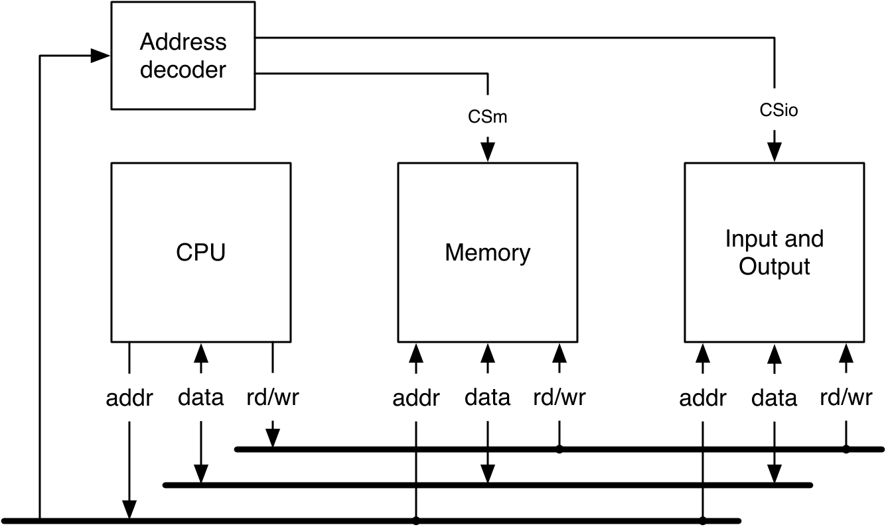
</p>

***Figure 12.1** — A CPU, memory, and I/O on shared address/data/control buses.*

The bus splits into an **address** bus, a **data** bus, and **control** signals
such as *read* and *write*. The CPU drives the address and control lines and is
the only master, so it issues every command and nothing needs arbitration (a
second master would; [Chapter 5
§5.4](../ch05-combinational-building-blocks/README.md#54-arbiter) builds the
arbiters). Both commands carry an address, which selects either a word of memory
or a **register in an I/O device** — the wiring does not distinguish the two,
which is what memory-mapped I/O means
([Section 12.4](#124-memory-mapped-devices)). Not all address lines reach every
peripheral: the upper bits feed a decoder whose outputs drive the devices'
chip-select (CS) inputs.

On a read, the selected device drives the data bus after its **access time**. On
a write, the CPU drives the data bus and the peripheral accepts the data, often
on the rising edge of the write strobe. Because that bus is bidirectional and
shared by every device, each output needs a
[tri-state](https://en.wikipedia.org/wiki/Three-state_logic) driver: in the
tri-state configuration both output transistors are disabled and the pin is
practically disconnected from the logic.

Note that in its simplest form **the bus has no clock at all** — timing is
defined purely by the read and write access times of the peripherals, which
means the CPU's cycle has to suit the slowest device on the bus.
[Section 12.3](#123-handshake-schemes) is where that assumption is replaced by a
signal.

Modern computers use a dedicated bus per purpose — a memory bus for external
memory, and serial, point-to-point I/O buses such as
[PCI Express](https://en.wikipedia.org/wiki/PCI_Express) for peripherals. Even
so, the classic picture of an address bus, a data bus, and chip selects is still
the mainstream mindset for core interconnection, and it is what we adapt for
on-chip use next.

---

## 12.2 An on-chip bus

The concept translates to the inside of a chip, with two changes: the
**tri-state data bus goes away**, and the connections are **clocked**.

### Why tri-state is not practical inside a chip

On a board tri-state buys scarce pins and traces, and a board can police it.
Inside a chip the wires it saves are nearly free, and the risk is not worth it:
if two output enables are ever on at once — a decoder bug, a glitch while the
selection switches — the wire becomes a direct path from supply to ground, and
on silicon that is a respin rather than a rework. Internal tri-state buffers are
scarce in standard-cell flows and absent from modern FPGA fabrics in any case,
where synthesis rewrites such a net into the multiplexer below — so you get the
mux either way, just further from the source.

Tri-state does survive at the **chip boundary**, where an external bus still
needs bidirectional pins, and that is the one place Chisel offers it: an
`Analog(w.W)` port, `attach`ed to another `Analog` or to a `BlackBox` pad cell.
`Analog` extends `Element` rather than `Bits`, so it carries no operators at
all — a tri-state *internal* bus is not merely discouraged in Chisel, it is
inexpressible (see [§L](../SYSTEMVERILOG-NOTES.md#l-things-chisel-will-not-generate)).

### The read multiplexer

So we **split** the data bus into two sets of wires, one for writing and one for
reading, and select the read path with a **multiplexer** driven by the address
decoder. On-chip wires are cheap compared with PCB traces and connectors, so the
duplication costs little.

<p align="center">
  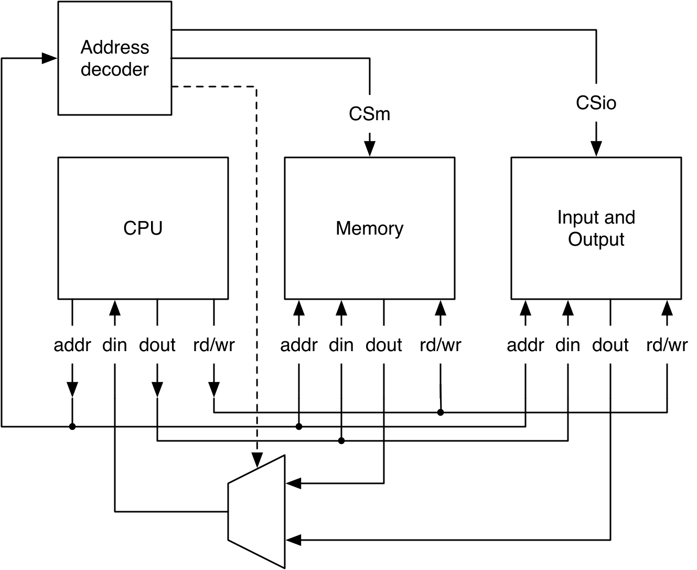
</p>

***Figure 12.2** — On-chip: a read mux replaces the tri-state data bus; the
decoder drives both the chip selects and the mux.*

Figure 12.2 is small enough to build outright, and worth building because it is
the only part of the on-chip bus with no protocol in it at all — just wiring:

`src/main/scala/soc/BusDecoder.scala`
```scala
class BusDecoder(val devices: Int = 4, val addrWidth: Int = 8,
                 val deviceBytes: Int = 16) extends Module {
  require(devices >= 2, "a decoder needs at least two devices to choose between")

  private val lo = log2Ceil(deviceBytes)  // log2Ceil rounds up to the next integer, so 16 bytes -> 4 bits
  private val sel = log2Ceil(devices)
  require(addrWidth >= lo + sel,
    s"$addrWidth address bits cannot select $devices devices of $deviceBytes bytes")

  val io = IO(new Bundle {
    val address = Input(UInt(addrWidth.W))
    val deviceRdData = Input(Vec(devices, UInt(32.W)))  // one input per device
    val cs = Output(Vec(devices, Bool()))               // chip selects
    val rdData = Output(UInt(32.W))                     // the read mux output
  })

  // Each device owns `deviceBytes` of the address space, so the bits below that
  // window address *within* a device, and only the bits above it choose one.
  private val index = io.address(lo + sel - 1, lo)  // the upper bits of the address select the device

  for (i <- 0 until devices) {
    io.cs(i) := index === i.U
  }
  io.rdData := io.deviceRdData(index)
}
```

The last four lines are the whole of Figure 12.2: `index` is the address decode,
the `for` loop fans it out into one-hot chip selects, and
`io.deviceRdData(index)` is the read multiplexer that replaces the tri-state
data bus — a `Vec` indexed by hardware, which Chisel elaborates into the mux the
figure draws. There are no registers, which is the point: this is
who-is-selected and whose-data-comes-back, not when-a-transfer-completes.

Note that `addrWidth` is the width of the *whole* bus address, not of the device
selector. With the default parameters — `devices = 4`, `deviceBytes = 16`,
`addrWidth = 8` — `index` is `io.address(5, 4)`, so the eight bits split three
ways:

| Bits | Role | Read by |
|---|---|---|
| `[3:0]` | offset inside a device: 16 bytes, four 32-bit registers | the selected device |
| `[5:4]` | `index` — which of the four devices | the decoder and the read mux |
| `[7:6]` | headroom — unused at four devices | the decoder, once `devices` grows |

The two top bits are spare rather than wasted: `sel` widens with the device
count, so `devices = 8` makes `index` `io.address(6, 4)` and `devices = 16`
makes it `io.address(7, 4)`, decoding the whole address. Six bits (`lo + sel`)
is the narrowest address the `require` accepts at four devices.

With four devices, then, the decoder inspects two bits and ignores two. `0x00`
and `0x0c` both select device 0 and `0x10` selects device 1, while `0x40`
aliases onto `0x00` because bits 7 and 6 are never examined — the same "not all
address lines reach every peripheral" arrangement as off-chip, done with bit
slicing instead of wiring. Widen `devices` to 16 and the aliasing disappears,
since every bit is then decoded.

Splitting the data bus makes the two directions asymmetric, which is why both
`cs` and the mux exist:

- **Writing is a broadcast.** Address and write data reach every device, and the
  chip select is what stops all but one from latching — the same job it did
  off-chip, and the reason `BusDecoder` needs no write port.
- **Reading is a selection.** Every device drives its own `rdData` wires
  continuously and the mux picks one. Nothing is ever switched off.

The cost of the trade is that the read path grows with the system: a tri-state
bus grows by one more tap on the same wire, while `deviceRdData` grows by another
32 wires and another mux input, so area and mux delay both rise with the device
count. For a handful of peripherals that is the right trade; past that, systems
stop widening one flat bus and go hierarchical — segments joined by bridges, a
crossbar, or a network-on-chip, such as the OCP-based one mentioned in
[Section 12.5](#open-core-protocol).

### Checking the wiring

`BusDecoder` has no registers, so the test needs no clock: `poke` an address,
`expect` the outputs, and read the answer in the same instant. The first case
walks a handful of byte addresses and checks the one-hot chip selects, the
address split above included: `0x0c` still selects device 0, and `0x35` selects
device 3.

`src/test/scala/BusDecoderTest.scala`
```scala
  "A bus decoder" should "select one device per 16-byte window" in {
    test(new BusDecoder(devices = 4)) { dut =>
      // Byte address -> which device. The low four bits address *within* a
      // device, so 0x00 and 0x0c both land on device 0.
      for ((addr, device) <- Seq(0x00 -> 0, 0x0c -> 0, 0x10 -> 1,
                                 0x20 -> 2, 0x35 -> 3)) {
        dut.io.address.poke(addr.U)
        for (i <- 0 until 4) {
          dut.io.cs(i).expect((i == device).B,
            f"address 0x$addr%02x should select device $device, not $i")
        }
      }
    }
  }
```

The second case is the property that matters for a bus that used to be
tri-state: sweep every address in the map and count how many chip selects are
active. Anything but exactly one would be two devices answering at once. The
third gives each device a distinguishable read value and checks the mux hands
back the selected one:

```scala
  it should "never select two devices at once" in {
    test(new BusDecoder(devices = 4)) { dut =>
      for (addr <- 0 until 64) {
        dut.io.address.poke(addr.U)
        val hot = (0 until 4).count(i => dut.io.cs(i).peekBoolean())
        assert(hot == 1, f"address 0x$addr%02x drove $hot chip selects, expected 1")
      }
    }
  }

  it should "route the selected device's data back through the read mux" in {
    test(new BusDecoder(devices = 4)) { dut =>
      // Give each device a distinguishable value, then check the mux picks it.
      for (i <- 0 until 4) {
        dut.io.deviceRdData(i).poke((0xd0 + i).U)
      }
      for ((addr, device) <- Seq(0x00 -> 0, 0x10 -> 1, 0x20 -> 2, 0x30 -> 3)) {
        dut.io.address.poke(addr.U)
        dut.io.rdData.expect((0xd0 + device).U,
          f"address 0x$addr%02x should read device $device")
      }
    }
  }
```

Run just this suite:

```
sbt "testOnly BusDecoderTest"
```

```
[info] BusDecoderTest:
[info] A bus decoder
[info] - should select one device per 16-byte window
[info] - should never select two devices at once
[info] - should route the selected device's data back through the read mux
[info] Run completed in 1 second, 15 milliseconds.
[info] Total number of tests run: 3
[info] Suites: completed 1, aborted 0
[info] Tests: succeeded 3, failed 0, canceled 0, ignored 0, pending 0
[info] All tests passed.
```

[Section 12.6](#126-build-run-and-check) runs the chapter's whole suite.

With this simple setup we assume every read or write completes in a single
clock cycle — realistic only for very small systems. A first, natural
extension is to expect the read result **one clock cycle after** the request,
which matches on-chip memories with a synchronous (registered), one-cycle-
latency read port, and also relaxes timing for IO devices. Writes are still
assumed to complete in one cycle.

To go further — devices with different or *varying* latency — we need
**handshaking**: the processor signals the start of a transaction with a read
or write request, and the device signals the *end* of the transaction with an
acknowledgment.

---

## 12.3 Handshake schemes

Up to here the master knew the timing in advance, though the two buses knew it
differently. The off-chip bus of [Section 12.1](#121-a-classic-microprocessor-bus)
has no bus clock at all: the CPU budgets the worst-case access time of the
slowest device and samples once that time has passed — which from the CPU's own
side still spans several of its clock cycles, three or more T-states on a Z80.
The on-chip bus of [Section 12.2](#122-an-on-chip-bus) is clocked, and there we
*assumed* one cycle per transfer, or read data one cycle later in the variant
above. That was an assumption for very small systems, not a property of buses.

What both have in common is that "the transfer is finished" is something the
master can *count* rather than observe: however many cycles a transfer takes,
the number is fixed in advance and built into the master. A device with variable
latency breaks that arrangement, because the only party that knows when the data
is good is the device. So the timing contract moves onto a wire:
the master **requests** by asserting `rd` or `wr`, and the slave
**acknowledges** with `ack` when the transfer is complete. A device that needs
longer simply keeps `ack` low, and the cycles it inserts that way are called
**wait states**.

That much the whole **request/acknowledge family** shares. What its members
disagree about is a single question — **when may `ack` rise?** — and the
disagreement is generated by two independent decisions:

- **Where does `ack` come from?** A wire off the request can answer inside the
  request cycle, but it strings the master, the address decoding, the slave, and
  the master's `ack` input onto one combinational path. Out of a flip-flop that
  path is gone, but the answer can then never arrive before the next clock edge.
- **How long does the master drive the request?** Holding it until `ack` keeps
  the bus occupied for the whole transfer. Releasing it after one cycle frees the
  bus immediately — but then `ack` refers to a command that is no longer on the
  wires, and the two sides have to agree on which one it was.

Three of the four combinations are worth building, in order of how much they
decouple the two sides ([Section 12.3.4](#1234-the-three-schemes-compared)
explains why the fourth is not):

| | `ack` is… | master holds the request? | cost |
|---|---|---|---|
| [12.3.1 combinational](#1231-the-combinational-handshake) | a wire off the request | yes | a path from master to slave and back, on the critical path |
| [12.3.2 pipelined](#1232-the-pipelined-handshake) | a flip-flop | no — one cycle | must track which command an ack belongs to |
| [12.3.3 registered](#1233-the-registered-handshake) | a flip-flop | yes | the bus stays busy for the whole transfer |

All three build their device behind one and the same port:

`src/main/scala/soc/ReqAckIO.scala`
```scala
class ReqAckIO(addrWidth: Int) extends Bundle {
  val address = Input(UInt(addrWidth.W))
  val rd = Input(Bool())
  val wr = Input(Bool())
  val rdData = Output(UInt(32.W))
  val wrData = Input(UInt(32.W))
  val wrMask = Input(UInt(4.W))
  val ack = Output(Bool())
}
```

Seven wires: an address, a read and a write strobe, the two data directions, a
byte mask, and an acknowledgment. Nothing in the port says *when* `ack` may
rise — that is the handshake, and it belongs to the device rather than to the
declaration, which is why all three schemes fit behind this one bundle, driving
the same device.

Two further handshakes are built later, each where its hardware lives:
**ready/valid** in [Section 12.4](#readyvalid-the-two-sided-handshake), and
**tagged completion** in [the AXI4 appendix](APPENDIX-AXI4.md#a4-transaction-ids-and-out-of-order-completion).
[Section 12.3.5](#1235-handshakes-this-chapter-does-not-build) names the ones
this chapter does not build at all.

### 12.3.1 The combinational handshake

In the simplest handshake `ack` is **combinational in the request**: the
processor drives the address bus (`address`) and the read signal (`rd`) in
cycle 2, and `ack` reacts through gates rather than on a clock edge. A device
that is ready can therefore answer inside that same cycle; a slower one leaves
`ack` low for a while, which is the case Figure 12.3 draws.

<p align="center">
  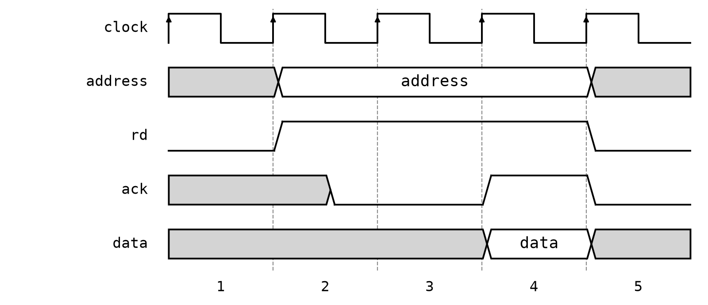
</p>

***Figure 12.3** — A read transaction with a combinational acknowledge. Gray
shading marks a signal whose value is undefined — nobody is driving it, or it
does not matter.*

In Figure 12.3, the read data is *not* available within one clock cycle but two
clock cycles later, as seen in cycle 4; `data` and `ack` are each valid for a
single clock cycle. Since `ack` is what ends the transaction, the processor has
to keep `address` and `rd` driven **until it sees `ack`** — which is why both
stay asserted across cycles 2, 3, and 4 in the diagram, and why no second
request can be issued in the meantime. Note also that `ack` is drawn as
undefined until part-way through cycle 2: it settles to its (low) value after a
combinational delay from `rd` rising, not on a clock edge.

The benefit of this protocol specification is that a single-cycle transaction
becomes *possible* — a device that can answer immediately raises `ack` already
in cycle 2. The price is that the handshake, including address decoding, is a
combinational circuit through the peripheral, which can hurt the maximum clock
frequency. The classic Wishbone protocol uses exactly this same-cycle
acknowledgment (Wishbone later added a pipelined mode too), and
`WishboneCounterWait` in [Section 12.5](#wishbone) is a working device with
exactly the timing drawn above.

Built against this chapter's own port, the scheme is almost entirely wire:

`src/main/scala/soc/CounterDevice.scala`
```scala
class CounterDeviceComb(val waitStates: Int = 0) extends Module {
  require(waitStates >= 0, "waitStates cannot be negative")

  val io = IO(new ReqAckIO(4))

  val cntRegs = RegInit(VecInit(Seq.fill(4)(0.U(32.W))))
  val idx = io.address(3, 2)
  val active = io.rd || io.wr

  val waitReg = RegInit(0.U(math.max(1, log2Ceil(waitStates + 1)).W))
  val done = waitReg === waitStates.U

  io.ack := active && done              // combinational in the request
  io.rdData := cntRegs(idx)

  when(!active) {
    waitReg := 0.U                      // no transfer in progress
  }.elsewhen(!done) {
    waitReg := waitReg + 1.U            // still counting out the access time
  }.otherwise {
    waitReg := 0.U                      // acked this cycle; rearm
  }

  for (i <- 0 until 4) {
    cntRegs(i) := cntRegs(i) + 1.U
  }
  when(io.ack && io.wr) {
    cntRegs(idx) := io.wrData
  }
}
```

The device itself is four 32-bit counters in a `Vec` (`cntRegs`), with `idx`
selecting one of them. The `for` loop increments all four unconditionally — no
`when`, nothing to do with `rd` or `wr` — so each counter runs off the clock
alone (*free-running*) and counter 0 reads 0, 1, 2, 3, … on successive cycles.
The address chooses *which* counter to read; it does not freeze that counter's
value, so reading the same address twice returns different numbers.

That is the point of using counters rather than plain registers: the value a
read returns tells you **which cycle the device sampled it**, so the latency
differences between the schemes show up in the data and not only in a waveform.
All three classes — `CounterDeviceComb` here, `CounterDevice` in 12.3.2, and
`CounterDeviceReg` in 12.3.3 — live in `src/main/scala/soc/CounterDevice.scala`
and carry this identical counter block. Only the handshake around it differs, so
everything said here about the counters holds for all three.

`waitStates` is the device's access time, counted in clock cycles. At `0` the
`done` term is always true, `ack` collapses to `active`, and a transfer finishes
inside its request cycle.
At `2` this is Figure 12.3 exactly: the ack stays low for the request cycle and
the one after, and rises in the third, while the master holds `rd` throughout
because it has no way to know when the answer is coming.

Either way `ack` is **combinational in the request** — `active` is *this*
cycle's `rd || wr`, so the path from the master's request through the device and
back to its `ack` input never crosses a flip-flop. That is precisely the path
that limits the clock frequency.

#### Checking it

The defining property is testable without stepping the clock at all: assert the
request and the ack is already there; withdraw the request and it disappears in
the same instant. A registered ack could do neither.

`src/test/scala/CounterDeviceTest.scala`
```scala
  "A combinational ReqAckIO device" should "answer inside the request cycle" in {
    test(new CounterDeviceComb()) { dut =>
      dut.io.address.poke(0.U)
      dut.io.rd.poke(true.B)
      // No clock step: with no wait states the ack is already there.
      dut.io.ack.expect(true.B, "a combinational ack lands in the request cycle")

      // And it is a wire, not a flop: withdrawing the request withdraws the ack
      // in the same cycle.
      dut.io.rd.poke(false.B)
      dut.io.ack.expect(false.B, "ack tracks rd within the cycle")
    }
  }
```

The two rate tests put numbers on the wait states. Both drive the same helper,
which holds `rd` high for a whole window and counts the acks:

```scala
  private def reqAckRate(dut: ReqAckIO, clock: Clock, cycles: Int): Int = {
    dut.address.poke(0.U)
    dut.wrData.poke(0.U)
    dut.wrMask.poke(15.U)
    dut.wr.poke(false.B)
    dut.rd.poke(true.B)                  // request held high throughout
    var acks = 0
    for (_ <- 0 until cycles) {
      clock.step()
      if (dut.ack.peekBoolean()) acks += 1
    }
    acks
  }

  it should "sustain one transfer per cycle with no wait states" in {
    test(new CounterDeviceComb(0)) { dut =>
      assert(reqAckRate(dut.io, dut.clock, 12) == 12,
        "a zero-wait combinational device acks every cycle")
    }
  }

  it should "drop to one per three cycles with two wait states" in {
    test(new CounterDeviceComb(2)) { dut =>
      assert(reqAckRate(dut.io, dut.clock, 12) == 4,
        "two wait states means one transfer per three cycles")
    }
  }
```

At zero wait states every cycle carries a transfer, so 12 cycles give 12 acks.
At two wait states the device answers every third cycle, so the same window
gives 4. That ratio — full rate versus a third of it — is the access time
showing up as throughput.

```
sbt 'testOnly CounterDeviceTest -- -z "combinational"'
```

```
[info] CounterDeviceTest:
[info] CounterDevice
[info] CounterDevice
[info] A pipelined slave
[info] A combinational ReqAckIO device
[info] - should answer inside the request cycle
[info] - should sustain one transfer per cycle with no wait states
[info] - should drop to one per three cycles with two wait states
[info] A registered ReqAckIO device
[info] Run completed in 1 second, 88 milliseconds.
[info] Total number of tests run: 3
[info] Suites: completed 1, aborted 0
[info] Tests: succeeded 3, failed 0, canceled 0, ignored 0, pending 0
[info] All tests passed.
```

(`-z` filters by test name; the bare subject lines are the other groups in the
suite, which the filter skipped.)

Same-cycle acknowledgment has been criticized — a single-cycle transaction is
rarely realistic in a larger system — leading to the **SimpCon** proposal: a
specification where `ack` (or busy/ready) need not be valid in the request
cycle, enabling pipelined transactions and avoiding the combinational path
between processor, address decoding, and device.

### 12.3.2 The pipelined handshake

A pipelined handshake avoids that combinational path altogether: a read or
write command is signaled by asserting `rd` or `wr` for a single clock cycle
(address and, for a write, the write data must be valid during that cycle —
commands are valid for one cycle only), and each command must be acknowledged
by an active `ack` **at the earliest
one cycle after the command** — later still if the device needs to insert
**wait states** by delaying `ack`. Read data is available together with `ack`,
for one clock cycle.

<p align="center">
  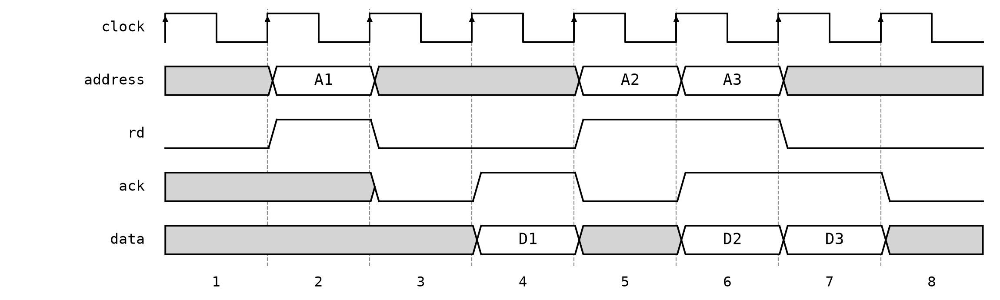
</p>

***Figure 12.4** — Read transaction with a pipelined acknowledgement: a first
read with a wait state, then two requests issued back to back.*

The request from the processor is only a single clock cycle long: `rd` is
asserted in cycle 2 with `A1` on `address`, and — unlike the combinational
protocol — **neither needs to stay driven until the acknowledgment**, so both
are released again in cycle 3. Compared to the former protocol, `ack` needs to be
valid (low or high) no earlier than one clock cycle after the `rd` command,
that is in cycle 3; there it is *low*, meaning the device inserts one wait
state, and it goes high in cycle 4 together with `D1`. So the first read has
two clock cycles of latency — the same latency as the combinational example
above.

The difference shows up on the next two reads. Because a request needs to be
valid for only a single cycle, `A2` and `A3` can be requested **back-to-back**
in cycles 5 and 6, and each is acknowledged at the earliest time the protocol
allows — one cycle later, in cycles 6 and 7, with `D2` and `D3`. Once the
pipeline is full this allows a throughput of one data word per clock cycle,
which the combinational protocol cannot reach.

The Patmos processor uses an OCP variant with exactly this protocol for its IO
devices (memory is connected via a separate burst interface); the *Patmos
Handbook* documents the OCP interfaces in detail. The
[`t-crest/soc-comm`](https://github.com/t-crest/soc-comm) Chisel repository
implements this pipelined interface for multicore devices such as a
network-on-chip.

This point-to-point, pipelined interconnect generalizes naturally: processor
and peripherals each connect via such an interface to a switching fabric, and
if the system has more than one master, the fabric must **arbitrate** among
masters requesting reads or writes.

`CounterDevice` is that scheme built, on the same four counters — but at the
protocol's *minimum* latency, not at Figure 12.4's. Its `ackReg := io.rd ||
io.wr` acknowledges every command exactly one cycle later and has no way to wait
longer, so it produces the back-to-back reads of cycles 5–7 and never the wait
state in the figure's first read; inserting one would take a device that holds
`ack` low, as `CounterDeviceComb(waitStates = 2)` does in
[Section 12.3.1](#1231-the-combinational-handshake). Because the read result
arrives the cycle *after* the command, and the command is valid only during that
cycle, it **registers the address** (`addrReg`) and **delays the ack**
(`ackReg`):

`src/main/scala/soc/CounterDevice.scala`
```scala
class CounterDevice extends Module {
  val io = IO(new ReqAckIO(4))

  val ackReg = RegInit(false.B)
  val addrReg = RegInit(0.U(2.W))
  val cntRegs = RegInit(VecInit(Seq.fill(4)(0.U(32.W))))

  ackReg := io.rd || io.wr
  when(io.rd) {
    addrReg := io.address(3, 2)   // byte address -> which 32-bit counter
  }
  io.rdData := cntRegs(addrReg)

  for (i <- 0 until 4) {
    cntRegs(i) := cntRegs(i) + 1.U
  }
  when (io.wr) {
    cntRegs(io.address(3, 2)) := io.wrData
  }

  io.ack := ackReg
}
```

Addressing four 32-bit counters needs **4 address bits**, not 2: addresses
count in *bytes*, while each counter is a 32-bit (4-byte) word, so the two
low address bits select a byte within a word and only the upper two bits
(`address(3, 2)`) select one of the four counters.

The counters themselves are a small **register file**: a `Reg` of a `Vec`,
initialized to all zeros by building a Scala `Seq` with `Seq.fill` (four Chisel
`0.U(32.W)` constants) and passing it to `VecInit`. A write and that cycle's
increment target the same register, and last connection wins — so the written
value lands and the counter carries on from there.

#### Checking it

`CounterDeviceTest` wraps the protocol in `read()`/`write()` helpers that poll
`ack` — a clean pattern for driving a pipelined interface from a test. `step`
takes a default argument, and `read` and `write` are nested functions closing
over `dut`:

`src/test/scala/CounterDeviceTest.scala`
```scala
  "CounterDevice" should "read, advance, and load counters" in {
    test(new CounterDevice()) { dut =>
      def step(n: Int = 1) = dut.clock.step(n)

      def read(addr: Int) = {
        dut.io.address.poke(addr.U)
        dut.io.rd.poke(true.B)
        step()
        dut.io.rd.poke(false.B)
        while (!dut.io.ack.peekBoolean()) step()   // wait for the delayed ack
        dut.io.rdData.peekInt()
      }
      def write(addr: Int, data: Int) = {
        dut.io.address.poke(addr.U)
        dut.io.wrData.poke(data.U)
        dut.io.wr.poke(true.B)
        step()
        dut.io.wr.poke(false.B)
        while (!dut.io.ack.peekBoolean()) step()
      }

      for (i <- 0 until 4) assert(read(i * 4) < 10, s"counter $i just started")
      step(100)
      for (i <- 0 until 4) assert(read(i * 4) > 100, s"counter $i advanced")
      write(2 * 4, 0)
      write(3 * 4, 1000)
      assert(read(2 * 4) < 5, "counter reset")
      assert(read(3 * 4) > 1000, "counter loaded")
    }
  }
```

The helpers hide the one thing that makes this protocol different from the
other two: the command is dropped after a single `step()`, and only *then* does
the test wait for `ack`. A combinational or registered device would have to keep
`rd` asserted through that wait.

The assertions use the free-running counters as a clock the test can read. Right
after reset every counter is below 10; after 100 idle cycles every one of them
is above 100, which proves they advance without any bus activity. Then a write
loads counter 2 with 0 and counter 3 with 1000, and the read-back shows both
values *plus* the cycles that have elapsed since — "counter reset" checks `< 5`,
not `== 0`, because the counter kept going while the read was in flight.

*Scala note — default arguments → [§C.7](../SCALA-NOTES.md#c7-default-arguments), nested (local) functions & closures → [§C.8](../SCALA-NOTES.md#c8-nested-local-functions--closures); string interpolation `s"…"` → [§J.5](../SCALA-NOTES.md#j5-string-interpolation-s).*

The same file also keeps the hand-written, "bit-banging" version of this test —
every pin poked and expected by hand — as `"CounterDevice" should "work"`. The
two are meant to be read side by side; [Chapter 13
§13.2–13.2.1](../ch13-debugging-testing-verification/README.md#132-testing-in-chisel)
uses exactly this pair to make the case for wrapping a protocol in functions.
Both run with:

```
sbt 'testOnly CounterDeviceTest -- -z "CounterDevice"'
```

```
[info] CounterDeviceTest:
[info] CounterDevice
[info] - should work
[info] CounterDevice
[info] - should read, advance, and load counters
[info] A pipelined slave
[info] A combinational ReqAckIO device
[info] A registered ReqAckIO device
[info] Run completed in 985 milliseconds.
[info] Total number of tests run: 2
[info] Suites: completed 1, aborted 0
[info] Tests: succeeded 2, failed 0, canceled 0, ignored 0, pending 0
[info] All tests passed.
```

The throughput claim — one transfer per cycle — is measured separately, in
[Section 12.3.4](#1234-the-three-schemes-compared).

### 12.3.3 The registered handshake

Between the two schemes above sits a third, and it is the one a first design
usually reaches for: keep the master holding its request, as the
combinational handshake does, but drive `ack` out of a **flip-flop** so nothing
combinational runs from the master, through address decoding, and back.

That one change removes the long combinational path. It does *not* free the
bus: the master must still keep `address` and `rd`/`wr` asserted until the ack
arrives, so a transfer occupies the request cycle plus
the ack cycle and nothing else can be issued meanwhile.

`src/main/scala/soc/CounterDevice.scala`
```scala
class CounterDeviceReg extends Module {
  val io = IO(new ReqAckIO(4))

  val cntRegs = RegInit(VecInit(Seq.fill(4)(0.U(32.W))))
  val idx = io.address(3, 2)
  val active = io.rd || io.wr

  val ackReg = RegInit(false.B)
  ackReg := active && !ackReg
  io.ack := ackReg

  // Read data is registered alongside the ack, so it is valid in the cycle the
  // master samples the ack.
  val dataReg = RegInit(0.U(32.W))
  dataReg := cntRegs(idx)
  io.rdData := dataReg

  for (i <- 0 until 4) {
    cntRegs(i) := cntRegs(i) + 1.U
  }
  // The write lands in the first cycle of the transfer, the ack in the second.
  when(active && !ackReg && io.wr) {
    cntRegs(idx) := io.wrData
  }
}
```

<p align="center">
  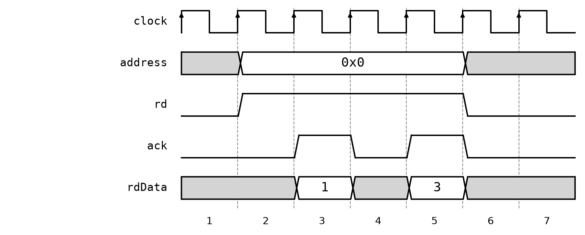
</p>

***Figure 12.5** — Two reads over a registered handshake, captured from
`CounterDeviceReg`. Grey marks a don't-care. Where Figures 12.3 and 12.4 are
protocol drawings, with symbolic `A1`/`D1` standing for any address and any
data, this one and the captures that follow (12.9–12.12) show the actual
simulated values of the module named in the caption — hence a real address
`0x0` and real counter readings.*

The shape of the cost is right there. `rd` goes high in cycle 2 and stays high
until cycle 5, because the master cannot know when the ack is coming; `ack`
answers in cycle 3, and the second read's ack lands in cycle 5. Two transfers,
four cycles — and cycle 4, where the device is idle but the bus is not free, is
the price of holding the request. Compare Figure 12.4, where the same two reads
would occupy cycles 2 and 3 alone.

Both reads address counter `0x0` yet return 1 and 3, because it free-runs
([Section 12.3.1](#1231-the-combinational-handshake)): the two acks sample it two
cycles apart. Cycle by cycle, with `rd` held from cycle 2 to 5 — `rd`, `rdData`,
and `ack` are as simulated, and `cntRegs(0)` follows from `dataReg :=
cntRegs(idx)`, which makes each cycle's counter value the next cycle's `rdData`:

| Cycle | `rd` | `cntRegs(0)` | `rdData` | `ack` |
|---|---|---|---|---|
| 1 | 0 | 0 | 0 | 0 |
| 2 | 1 | 1 | 0 | 0 |
| 3 | 1 | 2 | **1** | **1** ← first read completes |
| 4 | 1 | 3 | 2 | 0 |
| 5 | 1 | 4 | **3** | **1** ← second read completes |
| 6 | 0 | 5 | 4 | 0 |

The counter never stops, so `rdData` changes every cycle; what the handshake
decides is *which* of those values the master is entitled to take. Cycle 4 is
the wasted one — the request is still up, the counter still runs, but `ackReg`
is low because it acknowledged in cycle 3 and `&& !ackReg` keeps the pulse one
cycle wide.

The `&& !ackReg` is where a first attempt goes wrong, and the reason is exactly
the property that defines the scheme. Because the master holds its request
*through* the ack cycle, a plain `ackReg := active` sees the same request still
asserted in that cycle and acknowledges it a second time — one command, two
acks. Guarding with `!ackReg` keeps the pulse one cycle wide. The same guard
sits on the write in the class above — `when(active && !ackReg && io.wr)` — so a
held request cannot store its data twice either.

In the generated code the acknowledgment is a flip-flop read out through an
`assign`, where the combinational device of Section 12.3.1 had a bare wire:

```systemverilog
      ackReg <= active & ~ackReg;
```
```systemverilog
  assign io_ack = ackReg;
```

#### Checking it

The cost is measurable with the same `reqAckRate` helper the combinational
device used in [Section 12.3.1](#1231-the-combinational-handshake): hold `rd`
high for twelve cycles and count the acks. The device is never idle for want of
work, and still only half those cycles carry a transfer.

`src/test/scala/CounterDeviceTest.scala`
```scala
  "A registered ReqAckIO device" should "manage one transfer every two cycles" in {
    test(new CounterDeviceReg()) { dut =>
      // The request is held continuously and the device is never idle, yet it
      // can only answer every other cycle -- the cost of keeping the request
      // asserted through the ack cycle.
      assert(reqAckRate(dut.io, dut.clock, 12) == 6,
        "a registered device acks every other cycle")
    }
  }
```

Six acks in twelve cycles, against the combinational device's twelve in twelve
at zero wait states — the same hardware, the same counters, one flip-flop of
difference in the ack path.

```
sbt 'testOnly CounterDeviceTest -- -z "registered"'
```

```
[info] CounterDeviceTest:
[info] CounterDevice
[info] CounterDevice
[info] A pipelined slave
[info] A combinational ReqAckIO device
[info] A registered ReqAckIO device
[info] - should manage one transfer every two cycles
[info] Run completed in 888 milliseconds.
[info] Total number of tests run: 1
[info] Suites: completed 1, aborted 0
[info] Tests: succeeded 1, failed 0, canceled 0, ignored 0, pending 0
[info] All tests passed.
```

What the lost cycle buys is simplicity on both sides. The command is still on
the wires when the ack arrives, so neither end has to remember anything:
`CounterDeviceReg` indexes `io.address` directly where the pipelined
`CounterDevice` needs an `addrReg`, and a master needs no way to match a late
response to the command that caused it. Wait states come free — hold `ack` low
as long as you like, since the master is parked anyway.

So this is not a strawman. A **synchronous Wishbone slave** works exactly this
way, and [Section 12.5](#wishbone) builds this device again against the Wishbone
signal set, where Figure 12.8 shows its timing. ARM's **APB** — the peripheral
bus in most ARM SoCs — makes the same bargain from the other direction: address
and write data are held across a setup and an access phase, two cycles minimum
per transfer, no pipelining, and `PREADY` stretches it further. Intel's
**Avalon-MM** behaves the same way in its basic `waitrequest` mode. The pattern
is normal for control and configuration registers, where transfers are rare and
a simple master matters more than throughput.

### 12.3.4 The three schemes compared

The three subsections above each built the same four counters behind the same
`ReqAckIO` port, changing only the handshake. This section puts them next to one
another, because the registered and pipelined schemes are easy to conflate —
both put a flip-flop in front of `ack` — and the difference between them matters
more than the similarity.

The two decisions the section opened with are the table's "`ack` comes from" and
"Master holds the request until `ack`?" rows. The first decides whether a
combinational path runs from the master, through address decoding and the slave,
and back into the master — the path that limits the clock frequency; the second
decides whether a second transaction can start before the first has finished.
Every other row is a consequence of those two:

| | Combinational | Registered | Pipelined |
|---|---|---|---|
| Built here as | `CounterDeviceComb` (§12.3.1) | `CounterDeviceReg` (§12.3.3) | `CounterDevice` (§12.3.2) |
| `ack` comes from | a wire off the request | a flip-flop | a flip-flop |
| Can `ack` land in the request cycle? | yes | no | no |
| Master holds the request until `ack`? | yes | yes | **no — one cycle** |
| Transactions in flight | one | one | **many** |
| Combinational path master→slave→master | **yes** | no | no |
| Measured throughput | 1 per cycle with no wait states, 1 per 3 with two | 1 per 2 cycles | **1 per cycle** |

**Which to use.** It turns on one thing outside the slave: can the master have
more than one command in flight?

| Master | Use | Why | Cost |
|---|---|---|---|
| blocks on every access, clock slow enough | combinational | **lowest latency**: one cycle per transfer, the fewest of the three | the master→decoder→slave→master path sets the maximum clock frequency, and lengthens with every device on the decode |
| blocks on every access, that path won't meet timing | registered | the combinational path is gone, and one transfer at a time keeps both sides simple | two cycles per transfer, and the bus is held for both |
| several accesses in flight (cache refill, DMA) | pipelined | **highest throughput**: the only one that sustains one transfer per cycle | an address register in every slave, plus a master that can match each ack to the command that earned it |

Pipelined therefore wins on throughput and loses on everything else. If the
master blocks anyway that cost buys nothing, and two cycles per transfer against
the combinational device's one makes it the *slower* choice. Registered pays the
extra cycle but none of the bookkeeping, which is why it is the usual pick for
peripherals: ARM ships APB for those and AXI for memory in the same chip.

The throughput row above assumes the ideal master, by the way: `reqAckRate`
holds `rd` high for the whole window and the pipelined test issues a fresh
command every cycle.

The fourth combination — a combinational `ack` with a single-cycle command — is
degenerate rather than useful. If the master releases the request after one
cycle there is nothing left for a combinational `ack` to be a function of, so
the slave would have to answer within that one cycle, and there would be no
latency left to pipeline.

`src/test/scala/CounterDeviceTest.scala` measures the bottom row by keeping each
slave maximally busy and counting completed transfers, so the throughputs above
are numbers the build checks rather than claims. The combinational and
registered rates are the `reqAckRate` tests of Sections 12.3.1 and 12.3.3; the
pipelined one cannot use that helper, because it must issue a *new* command
every cycle instead of holding one:

```scala
  "A pipelined slave" should "complete one transaction every cycle" in {
    test(new CounterDevice()) { dut =>
      // Issue a new read every cycle without ever waiting for an ack. This is
      // what the single-cycle command buys: the master never has to hold the
      // bus, so a second request can go out while the first is still in flight.
      val n = 6
      var acks = 0
      for (i <- 0 until n) {
        dut.io.address.poke(((i % 4) * 4).U)
        dut.io.rd.poke(true.B)
        dut.clock.step()
        if (dut.io.ack.peekBoolean()) acks += 1
      }
      dut.io.rd.poke(false.B)
      assert(acks == n, s"a pipelined slave sustains one ack per cycle, got $acks in $n")
    }
  }
```

All three, side by side:

```
sbt "testOnly CounterDeviceTest"
```

```
[info] CounterDeviceTest:
[info] CounterDevice
[info] - should work
[info] CounterDevice
[info] - should read, advance, and load counters
[info] A pipelined slave
[info] - should complete one transaction every cycle
[info] A combinational ReqAckIO device
[info] - should answer inside the request cycle
[info] - should sustain one transfer per cycle with no wait states
[info] - should drop to one per three cycles with two wait states
[info] A registered ReqAckIO device
[info] - should manage one transfer every two cycles
[info] Run completed in 1 second, 409 milliseconds.
[info] Total number of tests run: 7
[info] Suites: completed 1, aborted 0
[info] Tests: succeeded 7, failed 0, canceled 0, ignored 0, pending 0
[info] All tests passed.
```

### 12.3.5 Handshakes this chapter does not build

The three schemes above are the request/acknowledge family in full. Two further
handshakes are built in this repository, just not in this section:
**ready/valid**, where the receiver can stall the sender as well
([Section 12.4](#readyvalid-the-two-sided-handshake)), and **tagged
completion**, where every command carries an id so that responses may come back
in another order ([the AXI4 appendix](APPENDIX-AXI4.md#a4-transaction-ids-and-out-of-order-completion)).

The families below are the ones with no hardware here at all. They are worth
recognising by name, and the links are the reference.

- **Credit-based flow control.** Instead of a per-transfer stall signal, the
  receiver grants the sender a number of **credits** — free buffer slots. The
  sender spends one per beat and stops at zero; the receiver returns credits as
  it drains. The round trip leaves the stall path entirely, which is what makes
  it the scheme of choice when the link is long relative to the clock: PCIe,
  CXL, and InfiniBand all use it, as do virtual-channel routers in a
  network-on-chip. See Dally and Towles, *Principles and Practices of
  Interconnection Networks*, and the flow-control chapter of the
  [PCIe base specification](https://pcisig.com/specifications).
- **Asynchronous (clockless) handshakes.** This is where the word *handshake*
  comes from. With no clock, request and acknowledge are the only timing: a
  **4-phase** (return-to-zero) protocol takes both signals back down between
  transfers, a **2-phase** (transition-signalling) protocol treats every edge as
  an event and halves the transitions at the cost of harder logic. The data can
  be *bundled* (ordinary wires plus a matched delay) or *dual-rail* / 1-of-N,
  which encodes validity into the data and is delay-insensitive. Built out of
  Muller C-elements; see Sutherland's
  [Micropipelines](https://dl.acm.org/doi/10.1145/63526.63532) (CACM 1989) and
  Sparsø and Furber, *Principles of Asynchronous Circuit Design*.
- **Crossing clock domains.** Structurally the registered handshake of
  [Section 12.3.3](#1233-the-registered-handshake), except each side sees the
  other's signal through a two-flop synchronizer, so the full 4-phase sequence
  is mandatory: a pulse that is one cycle wide in the sending domain can be
  missed entirely in the receiving one. Bulk data usually skips the per-transfer
  handshake for an asynchronous FIFO with Gray-coded pointers (rocket-chip's
  `AsyncQueue`). See Cummings, *Clock Domain Crossing (CDC) Design &
  Verification Techniques Using SystemVerilog* (SNUG Boston 2008), in the
  [former Sunburst Design paper archive](https://www.paradigm-works.com/technical-library).
- **Retry, abort, and split responses.** Every scheme here assumes a slave that
  will eventually answer. A slave that cannot — a busy DRAM controller, a bridge
  whose far side is occupied — may instead be allowed to *refuse* and have the
  master reissue: AHB's `HRESP` has RETRY and SPLIT alongside ERROR, Wishbone
  adds `RTY_O` and `ERR_O` next to `ACK_O` (the bundle in
  `src/main/scala/wishbone/Wishbone.scala` implements only `ACK_O`), and PCI let
  a target disconnect mid-burst. The cost is that a transaction is no longer
  guaranteed to make progress, so the master needs a retry policy and the system
  needs an argument about why it terminates.

---

## 12.4 Memory-mapped devices

The device here uses the **pipelined** handshake of
[Section 12.3.2](#1232-the-pipelined-handshake): `MemMappedRV` drives
`ackReg := io.mem.rd || io.mem.wr`, so a single-cycle command is answered one
cycle later and the master never holds the bus. That is the minimum latency the
scheme allows, and the same shape as `CounterDevice`.

The choice is for comparability, not because pipelining is always right: keeping
the handshake identical to `CounterDevice` means the only thing that differs
between the two devices is what sits behind the port. A UART is in fact the
case where the other schemes are competitive — software touches it rarely and
one register at a time, so the throughput pipelining buys goes unused while its
cost, an address register in every slave, is still paid
([Section 12.3.4](#1234-the-three-schemes-compared)).

Devices share the address space; upper address bits are decoded to select one.
As part of the system design we must choose an address map — there is no one
right answer. An example memory map for a **16-bit** microcontroller (so
addresses run 0x0000–0xffff): the lowest addresses hold a read-only memory
(ROM) with the program to execute, followed by a writable RAM for data; all
IO devices are pushed to the top of the space (above 0xf000) so they stay out
of the way if the memory regions need to grow, with **16 bytes** reserved per
device. This is a made-up example — an address map has as much flexibility as
the designer wants:

| Address | Device |
|---------|--------|
| 0x0000–0x0fff | ROM |
| 0x1000–0x1fff | RAM |
| 0xf000 | UART |
| 0xf010 | LEDs |
| 0xf020 | Keys |

A map like this is decoded at **two levels**, and this chapter builds one module
for each. The upper bits pick the device: that is `BusDecoder` from
[Section 12.2](#the-read-multiplexer), whose default `deviceBytes = 16` is
exactly the 16 bytes per device reserved above. The lower bits then pick a
register *inside* the selected device, and how many of them are used is up to
that device — `CounterDevice` and the UART bridge below both hold four words in
their window, so both decode two bits with `address(3, 2)`, leaving the low two
bits as the byte within a word. Everything above those bits is the decoder's
business, not the device's.

The two levels are built and tested separately here; wiring them into one
system means routing `ack` back through the decoder as well as `rdData`, which
`BusDecoder` deliberately leaves out — it predates the handshake entirely.

### Ready/valid: the two-sided handshake

The schemes of [Section 12.3](#123-handshake-schemes) share an asymmetry: the
master decides when a transfer starts, and the slave only decides when it ends.
Nothing lets the slave say *not yet, do not even start* — `ReqAckIO` has no wire
for it, so a slave that cannot take a command must take it anyway and withhold
`ack`. The **ready/valid** handshake of
[Chapter 9](../ch09-communicating-state-machines/README.md#93-the-readyvalid-interface)
removes the asymmetry: the producer raises `valid` when it has data, the
consumer raises `ready` when it can accept data, and a transfer happens in
exactly those cycles where both are high — what `Decoupled` calls `fire`.

It is not a fourth request/acknowledge scheme, because it answers a different
question. Req/ack is a **transaction** handshake: one request, one response,
the response bound to the request that caused it. Ready/valid is **flow control
on one unidirectional channel**, with no notion of a response at all — so the
two compose rather than compete, and a request/response protocol built on
ready/valid needs one channel per direction plus a rule for pairing them up.
Three properties follow, and all three matter in this section and the next:

- **Backpressure is symmetric.** Either side can stall the other by holding its
  flag low, so a slow consumer needs no separate "wait" signal.
- **`valid` must not depend combinationally on `ready`** (or the reverse) — two
  modules each waiting for the other's flag deadlock, and Chisel will not catch
  it for you.
- **A raised `valid` should not be withdrawn** before it is consumed. Chisel
  spells the stronger promise `IrrevocableIO`, and AXI requires it: once
  asserted, `VALID` stays asserted until the transfer completes.

Chisel ships the canonical example: `Queue` is a ready/valid FIFO, stalling its
producer when full and its consumer when empty, and it is what this chapter uses
wherever a buffer is needed. [Chapter
11](../ch11-example-designs/README.md#112-generalized-fifos-readyvalid--inheritance)
builds the same thing by hand, five ways.

Where ready/valid matters most is the next section. AXI applies it to **five
independent channels**, so a transaction is no longer a
handshake at all — it is reassembled from five separate transfers, which is why
an AXI slave needs a state machine where a `ReqAckIO` slave needs none, and why
`AxiLiteCounter` must accept AW and W in either order
([Section 12.5](#axi)).

### A memory-mapped UART

Some IO devices, like the counters of Section 12.3, expose ordinary registers.
Others — like a UART, whose shift registers are built in
[Chapter 6](../ch06-sequential-building-blocks/README.md) — expose a ready/valid
interface instead. The common
solution is to map the write and read channel onto one address (driving the
corresponding `valid`/`ready` on the write or read command), and map the two
flags into a **status register** at a different address so software can poll
before it reads or writes:

| Address | read | write |
|---------|------|-------|
| 0xf000 | status | control |
| 0xf001 | receive buffer | transmit buffer |

| Status bit | Meaning |
|-----------|---------|
| 0 (TDRE) | Transmit data register empty (ok to send) |
| 1 (RDRF) | Receive data register full (data to read) |

When the transmit data register is empty (TDRE) we can send new data; when
the receive data register is full (RDRF) we can read data. The terminology
sounds dated because it *is*: this is precisely the status-register mapping
of the first serial port of the IBM PC, built around the
[8250](https://en.wikipedia.org/wiki/8250_UART) UART chip — and it is still a
valid design today.

Polling a status register this way is only safe under the no-withdraw rule
above: once asserted, `rx.valid` and `tx.ready` must stay asserted until
consumed, or software could poll "ready", act on it, and find the condition
gone. If a device cannot guarantee that, insert a one-word buffer
(register) on each of the two ready/valid channels between the memory-mapped
interface and the device to restore the guarantee.

The memory-mapped device needs no new port: it reuses the `ReqAckIO` declared in
[Section 12.3](#123-handshake-schemes) at four address bits — with the pipelined
handshake of [Section 12.3.2](#1232-the-pipelined-handshake) behind it, as above
— so the whole chapter runs on one bus definition. Only `wrMask` goes unused:
the device moves whole words between the bus and a byte stream, so there is no
sub-word write to mask.

The four address bits are the device's 16-byte window, and `MemMappedRV` lays
four 32-bit registers into it, word-aligned exactly as `CounterDevice` lays out
its counters (`address(3, 2)` picks the word, the low two bits are the byte
inside it):

| Offset | Read | Write |
|---|---|---|
| `0x0` | status — RDRF, TDRE | control — interrupt enables |
| `0x4` | receive data, pops `rx` | transmit data, pushes `tx` |
| `0x8` | words received | — |
| `0xc` | 0 | — |

That is the book's two-register UART widened into the window it was already
given. Software sees the same status and data registers — at 0xf000 and 0xf004
rather than the book's 0xf000 and 0xf001, since these are words — plus two
additions the extra address bits pay for: a **control** register holding the
interrupt-enable mask, and a **count** of the words read out of the stream.

`src/main/scala/soc/ReqAckIO.scala`
```scala
class ReqAckIO(addrWidth: Int) extends Bundle {
  val address = Input(UInt(addrWidth.W))
  val rd = Input(Bool())
  val wr = Input(Bool())
  val rdData = Output(UInt(32.W))
  val wrData = Input(UInt(32.W))
  val wrMask = Input(UInt(4.W))
  val ack = Output(Bool())
}
```

Put together, the device, its bus port, and the loopback that exercises it look
like this:

<p align="center">
  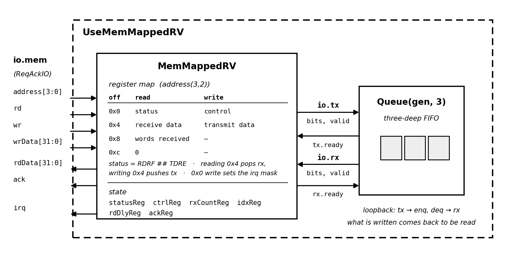
</p>

***Figure 12.6** — `UseMemMappedRV`: a memory-mapped bridge and the FIFO that
closes the loop. The bus port on the left is one `ReqAckIO`; on the right, `tx`
and `rx` are `Decoupled`, so each carries `bits`/`valid` one way and `ready`
back. Writing the data word pushes into the `Queue`, reading it pops out the
other side — which is why anything written can be read back.*

`MemMappedRV` bridges that bus to a `Decoupled` (ready/valid) stream:

`src/main/scala/soc/MemMappedRV.scala`
```scala
class MemMappedRV[T <: Data](gen: T) extends Module {
  val io = IO(new Bundle() {
    val mem = new ReqAckIO(4)
    val tx = Decoupled(gen)
    val rx = Flipped(Decoupled(gen))
    val irq = Output(Bool())
  })

  // The register map above, as named constants: these are `address(3, 2)`
  // values, so byte offset 0x0 is word 0, 0x4 is word 1 and 0x8 is word 2.
  // They are Chisel literals rather than Scala Ints so they can be used
  // directly in `===` and as `switch`/`is` arms. Being constants they
  // elaborate away -- the generated Verilog compares `idxReg` against 2'h0,
  // 2'h1 and 2'h2, and holds no state for them.
  private val status = 0.U(2.W)
  private val data = 1.U(2.W)
  private val count = 2.U(2.W)

  val statusReg = RegInit(0.U(2.W))
  val ctrlReg = RegInit(0.U(2.W))
  val rxCountReg = RegInit(0.U(32.W))
  val ackReg = RegInit(false.B)
  val idxReg = RegInit(0.U(2.W))
  val rdDlyReg = RegInit(false.B)

  val idx = io.mem.address(3, 2)      // byte address -> which of the four words

  statusReg := io.rx.valid ## io.tx.ready

  ackReg := io.mem.rd || io.mem.wr
  io.mem.ack := ackReg

  when (io.mem.rd) {
    idxReg := idx
  }
  rdDlyReg := io.mem.rd

  // Reading the data word pops one item off rx, in the same cycle the master is
  // handed the value. Reading status or count consumes nothing.
  io.rx.ready := rdDlyReg && idxReg === data
  when (io.rx.fire) {
    rxCountReg := rxCountReg + 1.U
  }

  io.mem.rdData := 0.U
  switch (idxReg) {
    is (status) { io.mem.rdData := statusReg }
    is (data) { io.mem.rdData := io.rx.bits.asUInt }
    is (count) { io.mem.rdData := rxCountReg }
  }

  // Only a write to the data word transmits; a write to the control word stores
  // the interrupt enables instead.
  io.tx.bits := io.mem.wrData.asTypeOf(io.tx.bits)
  io.tx.valid := io.mem.wr && idx === data
  when (io.mem.wr && idx === status) {
    ctrlReg := io.mem.wrData
  }

  // The control bits mask the status bits: bit 0 raises an interrupt when there
  // is room to send, bit 1 when there is data to read.
  io.irq := (statusReg & ctrlReg).orR
}
```

`idxReg` is the registered decode: the command is gone by the time the answer is
due, so the device remembers which word was asked for, and the read mux runs off
`idxReg` rather than the address. `rdDlyReg` marks "a read happened last cycle",
and together they make `io.rx.ready` a one-cycle pulse — so reading the data
word pops exactly one item off the stream while reading status or count consumes
nothing.

The write side is qualified the same way: `io.tx.valid := io.mem.wr && idx ===
data` transmits only for a write to `0x4`, and a write to `0x0` lands in
`ctrlReg` instead. `io.irq` is then just `(statusReg & ctrlReg).orR` — the
status bits masked by the enables, which is how a real UART's interrupt line
works.

Like `CounterDevice`, `MemMappedRV` answers with one cycle of latency, the
minimum the pipelined handshake allows.

**Simplification:** to keep the example small, a read of the data word always
returns `io.rx.bits` even if the receive channel has nothing valid, and a write
to it always asserts `tx.valid` even if the send buffer is full — instead of
stalling `ack` until the channel is actually ready. The bridge therefore does
not translate ready/valid backpressure into wait states; it **exposes** it, as
the status bits. The example delegates that check entirely to software, which is
expected to read the status register first and only touch the data word once
TDRE/RDRF say it is safe.

Ignore that discipline and the failures are quiet ones. `tx.ready` here is the
`Queue`'s enqueue-ready, so it goes low once three words are outstanding; a
write past that point raises `tx.valid` against a low `ready`, so nothing fires,
the word is dropped, and the bus transfer is acknowledged anyway. A read of the
data word while `rx.valid` is low is the mirror image: the master gets whatever
`rx.bits` happens to hold, and the word count does not advance. Both are
recoverable by polling — TDRE clears before the drop, and the count reveals the
stale read — which is exactly why the status register exists.

`UseMemMappedRV` closes the loop so the bridge can be tested on its own — the
transmit side feeds a three-deep `Queue` whose dequeue side comes back as the
receive side:

`src/main/scala/soc/MemMappedRV.scala`
```scala
class UseMemMappedRV[T <: Data](gen: T) extends Module {
  val io = IO(new Bundle() {
    val mem = new ReqAckIO(4)
    val irq = Output(Bool())
  })

  val memDevice = Module(new MemMappedRV(gen))
  memDevice.io.rx <> Queue(memDevice.io.tx, 3)  // three-deep FIFO.
  io.mem <> memDevice.io.mem
  io.irq := memDevice.io.irq
}
```

`Queue(memDevice.io.tx, 3)` is the whole loopback: the object-apply form of
`Queue` takes a `Decoupled` producer, returns the buffered `Decoupled`
consumer, and instantiates the FIFO in between.

#### Checking it

The test drives the bus exactly as software would: poll the status register,
then move data. The `read`/`write` helpers are the pipelined-protocol pattern of
[Section 12.3.2](#1232-the-pipelined-handshake) again, this time on `io.mem`.

`src/test/scala/MemMappedRVTest.scala`
```scala
  "MemMappedRV bridge" should "expose status and move data through the FIFO" in {
    test(new UseMemMappedRV(UInt(16.W))) { dut =>
      def step(n: Int = 1) = dut.clock.step(n)

      def read(addr: Int) = {
        dut.io.mem.address.poke(addr.U)
        dut.io.mem.rd.poke(true.B)
        step()
        dut.io.mem.rd.poke(false.B)
        while (!dut.io.mem.ack.peekBoolean()) step()
        dut.io.mem.rdData.peekInt()
      }
      def write(addr: Int, value: Int) = {
        dut.io.mem.address.poke(addr.U)
        dut.io.mem.wrData.poke(value.U)
        dut.io.mem.wr.poke(true.B)
        step()
        dut.io.mem.wr.poke(false.B)
        while (!dut.io.mem.ack.peekBoolean()) step()
      }

      step(5)
      assert(read(status) == 1, "TX flag should be set (FIFO ready)")
      write(data, 123)                  // transmit -> into the FIFO
      step(10)
      assert(read(status) == 3, "TX and RX flags should be set")
      assert(read(data) == 123, "receive value should match what was sent")
      assert(read(count) == 1, "one word has been read out of the stream")
    }
  }
```

Each assertion checks one part of the map. After reset the FIFO is empty, so
TDRE alone is set and the status reads `1` — bit 0 is `tx.ready`. Writing 123 to
`0x4` pushes a word into the FIFO, and ten cycles later it has come round to the
dequeue side, so RDRF joins TDRE and the status reads `3`. Reading `0x4` then
pulls the value back out — the 123 that went in — and `0x8` reports that one
word has been taken off the stream, which is only true if the read popped it.

The second test is the one the old single-bit design would have failed: a write
to the control word must not enqueue anything.

```scala
  it should "not transmit on a write to the control word" in {
    test(new UseMemMappedRV(UInt(16.W))) { dut =>
      def step(n: Int = 1) = dut.clock.step(n)
      def write(addr: Int, value: Int) = {
        dut.io.mem.address.poke(addr.U)
        dut.io.mem.wrData.poke(value.U)
        dut.io.mem.wr.poke(true.B)
        step()
        dut.io.mem.wr.poke(false.B)
        while (!dut.io.mem.ack.peekBoolean()) step()
      }

      step(5)
      write(status, 0)                  // control write: must not enqueue
      step(10)
      dut.io.mem.address.poke(status.U)
      dut.io.mem.rd.poke(true.B)
      step()
      dut.io.mem.rd.poke(false.B)
      while (!dut.io.mem.ack.peekBoolean()) step()
      dut.io.mem.rdData.expect(1.U, "RDRF must still be clear: nothing was sent")
    }
  }
```

The third checks the interrupt line: silent with the mask at zero, still silent
once "data to read" is enabled but nothing has arrived, and asserted only when
an enabled condition actually holds.

```scala
  it should "raise irq only for an enabled condition" in {
    test(new UseMemMappedRV(UInt(16.W))) { dut =>
      def step(n: Int = 1) = dut.clock.step(n)
      def write(addr: Int, value: Int) = {
        dut.io.mem.address.poke(addr.U)
        dut.io.mem.wrData.poke(value.U)
        dut.io.mem.wr.poke(true.B)
        step()
        dut.io.mem.wr.poke(false.B)
        while (!dut.io.mem.ack.peekBoolean()) step()
      }

      step(5)
      dut.io.irq.expect(false.B, "no interrupt while the control word is zero")

      write(status, 2)                  // enable the "data to read" interrupt
      step()
      dut.io.irq.expect(false.B, "still nothing to read")

      write(data, 55)                   // send one word round the loopback
      step(10)
      dut.io.irq.expect(true.B, "RDRF is set and its interrupt is enabled")
    }
  }
```

```
sbt "testOnly MemMappedRVTest"
```

```
[info] MemMappedRVTest:
[info] MemMappedRV bridge
[info] - should expose status and move data through the FIFO
[info] - should not transmit on a write to the control word
[info] - should raise irq only for an enabled condition
[info] Run completed in 1 second, 160 milliseconds.
[info] Total number of tests run: 3
[info] Suites: completed 1, aborted 0
[info] Tests: succeeded 3, failed 0, canceled 0, ignored 0, pending 0
[info] All tests passed.
```

---

## 12.5 Bus and interface standards

Several point-to-point and bus standards have been proposed over the years;
the [ready/valid discipline](#readyvalid-the-two-sided-handshake) of Section
12.4 underlies most of them.

Each standard below picks one of the three schemes from Sections 12.3.1 to
12.3.3 and layers on the [ready/valid](#readyvalid-the-two-sided-handshake) of
Section 12.4 and, for full AXI4, the [tagging](APPENDIX-AXI4.md#a4-transaction-ids-and-out-of-order-completion) of the appendix, so it is
worth naming them up front. Classic Wishbone is the
**combinational** handshake and its synchronous variant is the **registered**
one, so the three Wishbone slaves built here are `CounterDeviceComb` at zero and
at two wait states, and `CounterDeviceReg`, wearing Wishbone's signal names. AXI
differs in what it fixes: its ready/valid channels settle the "does the
initiator hold?" question at *yes* — `VALID` may not be withdrawn once raised —
while leaving each slave free to drive `READY` from a wire or from a flop. Every
AXI slave in this chapter uses a flop, which is why they measure as
registered-style; what varies between them is how many transactions they will
accept at once.

### Wishbone

[Wishbone](https://en.wikipedia.org/wiki/Wishbone_(computer_bus)) is a
public-domain specification defining a point-to-point connection (not a bus in
the classic shared-wire sense), used by several open-source IP cores, but
still in the spirit of a microcomputer/backplane bus. This is not the best fit
for an SoC interconnect: Wishbone requires the **master** to hold address and
data valid for the *entire* read or write cycle. For a master whose data is
only valid a single cycle (as in the pipelined scheme), that means either
registering address/data *before* the Wishbone connection — costing an extra
cycle of latency — or a multiplexer that is expensive in both time and
resources. A better fix is to register the address and data **in the slave**
instead. That register is free of latency, because the slave decodes the
incoming address combinationally in the very cycle it captures it: the decode
and the capture overlap, where a register in front of the interface must
complete before decoding can start. The mirror issue applies to the
**slave's** output data: since it is only valid for one cycle, a master that
doesn't sample it immediately must register it — so, by convention, the slave
should keep its last valid output held even after the Wishbone strobe
(`wb.stb`) is deasserted (holding data is normally free in hardware — it is
just a specification detail). The classic Wishbone specification has no
pipelined read or write; the newer **B4** specification adds a pipelined mode,
so a Wishbone system may now mix two specifications that are not necessarily
compatible with each other.

Wishbone names its signals from the **master's** point of view: `_O` is an
output of the master, `_I` an input. So `ADR_O` carries the address and `DAT_O`
the write data, while `DAT_I` is the read data coming back from the slave;
`WE_O` is the write enable (low = read, high = write), `CYC_O` indicates a bus
cycle is in progress, `STB_O` strobes the individual transfer, and `ACK_I` is
the slave's acknowledgment.

<p align="center">
  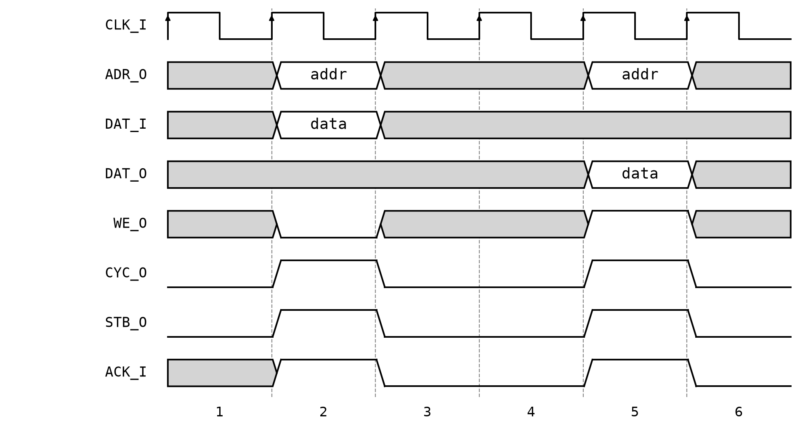
</p>

***Figure 12.7** — Wishbone asynchronous read followed by an asynchronous
write.*

The read occupies cycle 2 on its own: the master raises `CYC_O` and `STB_O`
with `WE_O` low and the address on `ADR_O`, and the slave answers **within that
same cycle** with `ACK_I` high and the read data on `DAT_I`. After two idle
cycles, the write in cycle 5 works the same way — `WE_O` high, write data on
`DAT_O` — and is again acknowledged combinationally inside the cycle. This is a
Wishbone slave responding asynchronously: one transfer per clock cycle, at the
price of the combinational path described in
[Section 12.3.1](#1231-the-combinational-handshake).

<p align="center">
  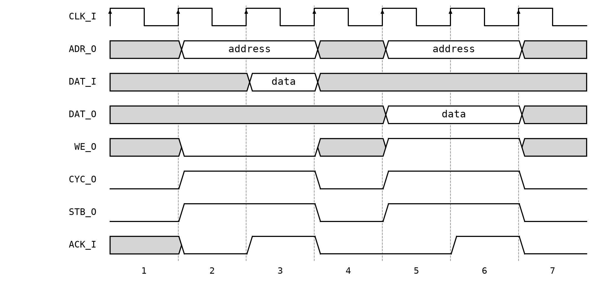
</p>

***Figure 12.8** — Wishbone synchronous read followed by a synchronous write.*

With a synchronous (registered) slave the acknowledgment arrives on a clock edge
instead, so each transfer takes two cycles: the read is requested in cycle 2,
`ACK_I` is low there and goes high in cycle 3 together with `DAT_I`; the write
likewise spans cycles 5 and 6. Note what the master must do for this to work —
`ADR_O`, `CYC_O`, `STB_O`, and (on the write) `DAT_O` all stay valid across
**both** cycles, until the acknowledgment arrives. That is exactly the
requirement criticized above: a master whose address and data are valid for only
a single cycle cannot drive this directly, and needs them registered first.
Neither figure shows the B4 pipelined mode — both are the classic
specification, once with a combinational slave and once with a registered one,
and in both the next transfer cannot start until the current one is
acknowledged.

#### A Wishbone slave in Chisel

Building both slaves makes the difference between the two figures concrete. `WishboneIO` carries the signal set exactly as the figures label
it, declared from the **master's** side so that a slave can just flip it:

`src/main/scala/wishbone/Wishbone.scala`
```scala
class WishboneIO(addrWidth: Int) extends Bundle {
  val adr = Output(UInt(addrWidth.W))   // ADR_O
  val datWr = Output(UInt(32.W))        // DAT_O, master -> slave
  val datRd = Input(UInt(32.W))         // DAT_I, slave -> master
  val we = Output(Bool())               // WE_O:  high = write, low = read
  val sel = Output(UInt(4.W))           // SEL_O: active byte lanes
  val cyc = Output(Bool())              // CYC_O: a bus cycle is in progress
  val stb = Output(Bool())              // STB_O: this transfer is valid
  val ack = Input(Bool())               // ACK_I: slave terminates the transfer
}
```

The device behind it is deliberately the *same* four free-running loadable
counters as `CounterDevice` in [Section 12.3.2](#1232-the-pipelined-handshake), so
the protocol is the only thing that changes. The asynchronous slave of Figure
12.6 is almost entirely combinational:

`src/main/scala/wishbone/Wishbone.scala`
```scala
class WishboneCounter extends Module {
  val io = IO(Flipped(new WishboneIO(4)))

  val cntRegs = RegInit(VecInit(Seq.fill(4)(0.U(32.W))))
  val idx = io.adr(3, 2)                // byte address -> which 32-bit counter

  // A transfer is in progress only when CYC and STB are both asserted: CYC
  // frames the whole bus cycle, STB qualifies this individual transfer.
  val active = io.cyc && io.stb

  io.ack := active                      // combinational: same-cycle ack
  io.datRd := cntRegs(idx)

  for (i <- 0 until 4) {
    cntRegs(i) := cntRegs(i) + 1.U
  }
  when(active && io.we) {
    cntRegs(idx) := io.datWr
  }
}
```

Two details are worth pausing on. `Flipped` reverses every direction in the
bundle at once, which is why a single `WishboneIO` written from the master's
view serves both sides of the wire — this is the same mechanism as `Flipped`
on a `Decoupled` in [Chapter 9](../ch09-communicating-state-machines/README.md).
And `active` is `cyc && stb` rather than `stb` alone: `CYC_O` frames a whole
bus cycle (which may span several transfers) while `STB_O` qualifies the
individual transfer, so a slave must look at both.

That slave answers immediately, which is the *best* case of the combinational
protocol rather than the one Figure 12.3 draws. To reproduce the figure the
device needs an access time — an ack that is still a wire, but not ready yet:

`src/main/scala/wishbone/Wishbone.scala`
```scala
class WishboneCounterWait(val waitStates: Int = 2) extends Module {
  require(waitStates >= 0, "waitStates cannot be negative")

  val io = IO(Flipped(new WishboneIO(4)))

  val cntRegs = RegInit(VecInit(Seq.fill(4)(0.U(32.W))))
  val idx = io.adr(3, 2)
  val active = io.cyc && io.stb

  // How many cycles the current transfer has been asking for.
  val waitReg = RegInit(0.U(math.max(1, log2Ceil(waitStates + 1)).W))
  val done = waitReg === waitStates.U

  io.ack := active && done              // combinational in the request
  io.datRd := cntRegs(idx)

  when(!active) {
    waitReg := 0.U                      // no transfer in progress
  }.elsewhen(!done) {
    waitReg := waitReg + 1.U            // still counting out the access time
  }.otherwise {
    waitReg := 0.U                      // acked this cycle; rearm for the next
  }

  for (i <- 0 until 4) {
    cntRegs(i) := cntRegs(i) + 1.U
  }
  // The transfer completes in the ack cycle, so that is when the write lands.
  when(io.ack && io.we) {
    cntRegs(idx) := io.datWr
  }
}
```

With `waitStates = 2` this is Figure 12.3 exactly. Set `waitStates = 0` and
`done` is always true, collapsing the module back into `WishboneCounter` above.

<p align="center">
  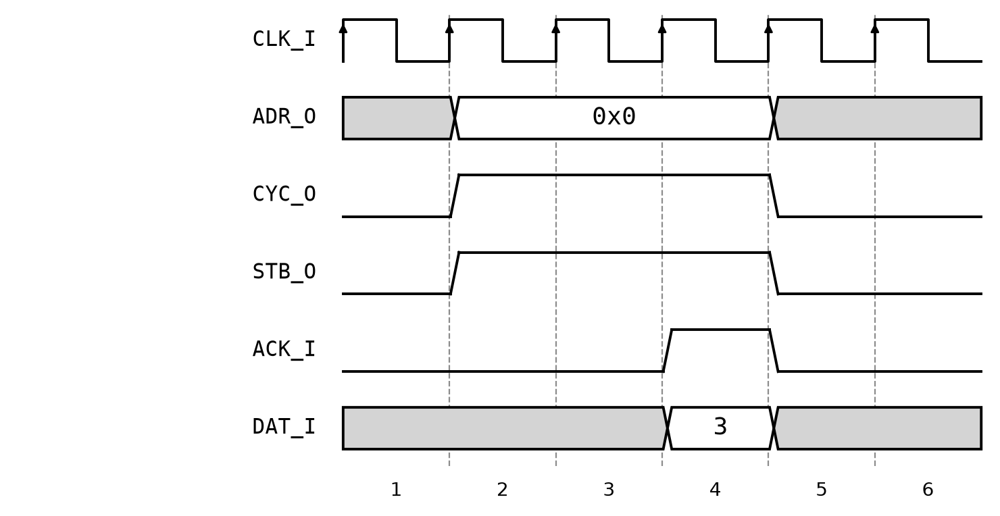
</p>

***Figure 12.9** — `WishboneCounterWait(2)`, captured from simulation. Read it
against Figure 12.3.*

Every feature of Figure 12.3 is there: the address is valid across cycles
2, 3, and 4; the request (`CYC_O` and `STB_O`, standing in for the figure's
`rd`) is held for all three because the master cannot know when the ack will
come; `ACK_I` rises only in cycle 4; and the read data is meaningful only in
that same cycle. The transaction takes three cycles to move one word.

The one visible difference is that Figure 12.3 draws `ack` as *undefined* until
part-way through cycle 2, whereas the capture shows a clean low. The figure
describes a signal settling combinationally after some propagation delay;
the real device drives `ack` from `active && done`, so with no request asserted
it is deterministically low. The capture is the more literal truth about this
hardware, and the figure is the more general statement about the protocol.

`DAT_I` reads 3 simply because the counters free-run from zero and three cycles
have elapsed.

The crucial point is that `ack` is still **combinational in the request**, even
though a register is involved. `waitReg` decides *when* the device is ready, but
`active` — this cycle's `cyc && stb` — decides whether the ack is asserted at
all. The generated code shows the difference between "a register is in the
module" and "a register is in the ack path":

```systemverilog
  wire             done = waitReg == 2'h2;
  wire             io_ack_0 = active & done;
```

`done` comes out of a flop but `io_ack_0` is a **wire**, so the path from the
master's `cyc`/`stb` to the master's `ack` input never passes through a
flip-flop. A test pins this down without any clock stepping at all:

`src/test/scala/HandshakeStylesTest.scala`
```scala
      // Withdrawing the request withdraws the ack in the *same* cycle, with no
      // clock step in between. A registered ack could not do this -- which is
      // the whole objection to the combinational handshake: this path runs from
      // the master, through address decoding and the slave, and back.
      dut.io.cyc.poke(false.B)
      dut.io.ack.expect(false.B, "ack tracks cyc within the cycle")
      dut.io.cyc.poke(true.B)
      dut.io.ack.expect(true.B, "and comes straight back")
```

The synchronous slave of Figure 12.8 differs only in that `ack` and the read
data are registered:

`src/main/scala/wishbone/Wishbone.scala`
```scala
class WishboneCounterSync extends Module {
  val io = IO(Flipped(new WishboneIO(4)))

  val cntRegs = RegInit(VecInit(Seq.fill(4)(0.U(32.W))))
  val idx = io.adr(3, 2)
  val active = io.cyc && io.stb

  // `&& !ackReg` keeps the ack a single cycle wide: the master holds cyc/stb
  // valid through the ack cycle too, and without this the still-active request
  // would be acknowledged a second time.
  val ackReg = RegInit(false.B)
  ackReg := active && !ackReg
  io.ack := ackReg

  // Read data is registered alongside the ack, so it is valid in the same cycle
  // the master samples the ack.
  val dataReg = RegInit(0.U(32.W))
  dataReg := cntRegs(idx)
  io.datRd := dataReg

  for (i <- 0 until 4) {
    cntRegs(i) := cntRegs(i) + 1.U
  }
  // The write lands in the first cycle of the transfer, the ack follows in the
  // second; `!ackReg` stops the held request from writing twice.
  when(active && !ackReg && io.we) {
    cntRegs(idx) := io.datWr
  }
}
```

That `&& !ackReg` is the part a first attempt usually gets wrong. Because the
master keeps `CYC_O`/`STB_O` asserted *through* the acknowledgment cycle — look
again at Figure 12.8, where they span cycles 2 and 3 — a plain `ackReg :=
active` would see the request still active in cycle 3 and acknowledge it a
second time in cycle 4.

The generated SystemVerilog is the evidence that these three really are
different hardware. In `WishboneCounter.sv` the acknowledgment is a bare wire:

```systemverilog
  assign io_datRd = _GEN[io_adr[3:2]];
  assign io_ack = active;
```

while in `WishboneCounterSync.sv` it is a flip-flop, updated inside the clocked
block and read out through a separate `assign`:

```systemverilog
      ackReg <= active & ~ackReg;
      _GEN_0 = {{cntRegs_3}, {cntRegs_2}, {cntRegs_1}, {cntRegs_0}};
      dataReg <= _GEN_0[io_adr[3:2]];
```
```systemverilog
  assign io_ack = ackReg;
```

*(Generated blocks here have firtool's `// src/…` source-location comments
stripped; nothing else is changed.)*

#### Checking it

`WishboneCounterTest` drives both slaves with the same master routine and pins
each one to its figure. The asynchronous slave is checked with no clock step at
all — the ack has to be there already — and then the request is withdrawn to
show the ack falling with it:

`src/test/scala/WishboneCounterTest.scala`
```scala
  "An asynchronous Wishbone slave" should "acknowledge in the request cycle (Figure 12.7)" in {
    test(new WishboneCounter()) { dut =>
      dut.io.sel.poke(15.U)
      dut.io.adr.poke(0.U)
      dut.io.we.poke(false.B)
      dut.io.cyc.poke(true.B)
      dut.io.stb.poke(true.B)

      // No clock step: the ack is combinational, so it is already there.
      dut.io.ack.expect(true.B, "an asynchronous slave acks within the request cycle")
      dut.clock.step()

      dut.io.cyc.poke(false.B)
      dut.io.stb.poke(false.B)
      dut.io.ack.expect(false.B, "ack falls with the request")
    }
  }
```

The synchronous slave is the same request, checked the other way round: `false`
in the request cycle, because a flop cannot answer before an edge, and `true`
after one step.

```scala
  "A synchronous Wishbone slave" should "acknowledge one cycle later (Figure 12.8)" in {
    test(new WishboneCounterSync()) { dut =>
      dut.io.sel.poke(15.U)
      dut.io.adr.poke(0.U)
      dut.io.we.poke(false.B)
      dut.io.cyc.poke(true.B)
      dut.io.stb.poke(true.B)

      dut.io.ack.expect(false.B, "a registered slave cannot ack in the request cycle")
      dut.clock.step()
      dut.io.ack.expect(true.B, "the ack arrives on the next clock edge")

      dut.clock.step()
      dut.io.cyc.poke(false.B)
      dut.io.stb.poke(false.B)
    }
  }
```

The third test uses a latency-agnostic master — poll `ACK_I`, then release
`CYC_O`/`STB_O` — so one routine works against either slave, and the cycles it
spends waiting are what separate the two figures. Writing 1000 into counter 1
and reading it back returns just over 1000, since the counter free-runs while
the read is in flight:

```scala
  it should "load and read back a counter" in {
    test(new WishboneCounterSync()) { dut =>
      write(dut, 4, 1000)                 // byte address 4 -> counter 1
      val (value, cycles) = read(dut, 4)
      assert(cycles == 1, "a registered slave takes one extra cycle")
      // The counters free-run, so the value has advanced by the handful of
      // cycles the read itself took.
      assert(value >= 1000 && value < 1010, s"expected just over 1000, got $value")
    }
  }
```

```
sbt "testOnly WishboneCounterTest"
```

```
[info] WishboneCounterTest:
[info] An asynchronous Wishbone slave
[info] - should acknowledge in the request cycle (Figure 12.7)
[info] A synchronous Wishbone slave
[info] - should acknowledge one cycle later (Figure 12.8)
[info] - should load and read back a counter
[info] Run completed in 1 second, 96 milliseconds.
[info] Total number of tests run: 3
[info] Suites: completed 1, aborted 0
[info] Tests: succeeded 3, failed 0, canceled 0, ignored 0, pending 0
[info] All tests passed.
```

The throughput side is measured in `HandshakeStylesTest`, which counts acks over
a fixed window for the wait-state slave (one transfer per three cycles) and the
synchronous one (one per two) — the Wishbone numbers in the recap table:

```
sbt 'testOnly HandshakeStylesTest -- -z "slave"'
```

```
[info] HandshakeStylesTest:
[info] A combinational slave with wait states
[info] - should hold ack low until its access time has passed (Figure 12.3)
[info] - should drive ack combinationally, not from a register
[info] - should complete one transaction every three cycles
[info] A registered slave
[info] - should complete one transaction every two cycles
[info] An AXI4-Lite slave
[info] - should also manage only one transfer every two cycles
[info] A full AXI4 memory
[info] An out-of-order AXI4 memory
[info] Run completed in 1 second, 296 milliseconds.
[info] Total number of tests run: 5
[info] Suites: completed 1, aborted 0
[info] Tests: succeeded 5, failed 0, canceled 0, ignored 0, pending 0
[info] All tests passed.
```

#### The cost of putting Wishbone under a pipelined master

The criticism the section opened with — that Wishbone makes the master hold
address and data valid for the whole transfer, so a master whose data lives for
one cycle needs a register, and "a register results in one additional cycle of
latency" — is a claim about cycle counts. A bridge makes it measurable.

`src/main/scala/wishbone/ReqAckToWishbone.scala`
```scala
class ReqAckToWishbone(addrWidth: Int) extends Module {
  val io = IO(new Bundle {
    val mem = new ReqAckIO(addrWidth)        // slave side, faces the processor
    val wb = new WishboneIO(addrWidth)      // master side, faces the device
  })

  val idle :: transfer :: respond :: Nil = Enum(3)
  val state = RegInit(idle)

  val addrReg = RegInit(0.U(addrWidth.W))
  val dataReg = RegInit(0.U(32.W))
  val selReg = RegInit(0.U(4.W))
  val weReg = RegInit(false.B)
  val rdDataReg = RegInit(0.U(32.W))

  io.wb.adr := addrReg
  io.wb.datWr := dataReg
  io.wb.sel := selReg
  io.wb.we := weReg
  io.wb.cyc := state === transfer
  io.wb.stb := state === transfer

  io.mem.rdData := rdDataReg
  io.mem.ack := false.B

  switch(state) {
    is(idle) {
      when(io.mem.rd || io.mem.wr) {
        addrReg := io.mem.address
        dataReg := io.mem.wrData
        selReg := io.mem.wrMask
        weReg := io.mem.wr
        state := transfer
      }
    }
    is(transfer) {
      when(io.wb.ack) {
        rdDataReg := io.wb.datRd
        state := respond
      }
    }
    // A separate cycle so the upstream `ack` is registered, not a combinational
    // function of the Wishbone `ack`. Returning it straight from `transfer`
    // would rebuild exactly the combinational path the pipelined scheme avoids --
    // and `rdDataReg` would not be valid yet anyway.
    is(respond) {
      io.mem.ack := true.B
      state := idle
    }
  }
}
```

The three states are the whole argument. `idle` captures the single-cycle
command into `addrReg`/`dataReg`/`selReg`/`weReg` — the registers Wishbone
forces on a pipelined master. `transfer` drives `CYC_O`/`STB_O` and holds
everything steady until `ACK_I`. `respond` exists purely so the upstream `ack`
comes out of a flop: returning it straight from `transfer` would rebuild the
combinational path the pipelined scheme was chosen to avoid, and `rdDataReg`
would not be valid yet in any case.

`BridgedWishboneCounter` wires that bridge to `WishboneCounter`, giving a module
with the same `ReqAckIO(4)` port as the native `CounterDevice` — so one
testbench routine can drive both and count the cycles between command and `ack`:

`src/main/scala/wishbone/ReqAckToWishbone.scala`
```scala
class BridgedWishboneCounter extends Module {
  val io = IO(new ReqAckIO(4))

  val bridge = Module(new ReqAckToWishbone(4))
  val device = Module(new WishboneCounter())

  bridge.io.wb <> device.io
  io <> bridge.io.mem
}
```

#### Checking it

The claim under test is a cycle count, so the test measures both paths with the
same routine and compares them to each other rather than to a constant:

`src/test/scala/ReqAckToWishboneTest.scala`
```scala
  "The Wishbone bridge" should "cost exactly one extra cycle of latency" in {
    var native = 0
    test(new CounterDevice()) { dut =>
      native = readLatency(dut.io, dut.clock, 0)._2
    }

    var bridged = 0
    test(new BridgedWishboneCounter()) { dut =>
      bridged = readLatency(dut.io, dut.clock, 0)._2
    }

    assert(native == 1, s"a native pipelined slave acks after one cycle, got $native")
    assert(bridged == native + 1,
      s"registering the command for Wishbone costs one cycle: $native -> $bridged")
  }
```

The second test then checks that the extra cycle is the *only* difference — the
bridge still writes and reads the counters correctly:

```scala
  it should "still move data correctly" in {
    test(new BridgedWishboneCounter()) { dut =>
      write(dut.io, dut.clock, 8, 2000)   // byte address 8 -> counter 2
      val (value, _) = readLatency(dut.io, dut.clock, 8)
      // Free-running counters again: the value has ticked on a few cycles.
      assert(value >= 2000 && value < 2010, s"expected just over 2000, got $value")
    }
  }
```

```
sbt "testOnly ReqAckToWishboneTest"
```

```
[info] ReqAckToWishboneTest:
[info] The Wishbone bridge
[info] - should cost exactly one extra cycle of latency
[info] - should still move data correctly
[info] Run completed in 1 second, 163 milliseconds.
[info] Total number of tests run: 2
[info] Suites: completed 1, aborted 0
[info] Tests: succeeded 2, failed 0, canceled 0, ignored 0, pending 0
[info] All tests passed.
```

One cycle native, two through the bridge. The bridge also gives up the pipelined
scheme's back-to-back requests, since classic Wishbone has no pipelining and only
one transfer can be in flight — the second cost of the mismatch, and the reason
the chapter prefers registering address and data *in the slave*.

### AXI

The Advanced Microcontroller Bus Architecture (AMBA), from ARM, defines three
buses: Advanced High-performance Bus (AHB), Advanced System Bus (ASB, the
predecessor of AHB, deprecated — it uses both clock phases, unusual for a
modern synchronous design), and Advanced Peripheral Bus (APB). AHB connects
on-chip memory, cache, and external memory to the processor; peripherals hang
off the lower-bandwidth APB via a bridge. An AHB transfer can complete in one
cycle with burst operation; an APB transfer takes **two cycles with no burst
mode**, and APB **v3** adds wait states to peripheral bus cycles.

AMBA AXI (Advanced eXtensible Interface) and **ACE version 4** are the latest
extension to AMBA. AXI adds out-of-order transaction completion via a 4-bit
transaction ID tag; a `ready` signal acknowledges the *start* of the
transaction, and the master must hold the transaction information (e.g. the
address) until the interconnect asserts `ready` — which gives up the elegant
single-cycle address phase of the original AHB. AXI applies ready/valid
handshaking across **all five channels**: read address, read data, write
address, write data, and write response. Decoupling write address from write
data this way requires a more complex slave able to accept the two in any
order.

#### AXI4-Lite in Chisel

**AXI4-Lite** is the subset of AXI4 with no bursts and no transaction IDs: one
data beat per address, and — with no ids to tell responses apart — no way to
reorder them. `AxiLiteCounter` below goes one step further and keeps a single
transaction in flight. AXI4-Lite keeps all five channels,
so it is enough to show what the two claims above actually mean in hardware.
(The full protocol — bursts, IDs, out-of-order completion — is built and tested
in [the AXI4 appendix](APPENDIX-AXI4.md).)

Each channel is a plain `Decoupled`, which is why the ready/valid discipline
of [Section 12.4](#readyvalid-the-two-sided-handshake) is the whole
foundation of AXI rather than an analogy for it:

`src/main/scala/axilite/AxiLite.scala`
```scala
class AxiLiteIO(addrWidth: Int) extends Bundle {
  val aw = Decoupled(new AxiLiteAddr(addrWidth))    // write address
  val w = Decoupled(new AxiLiteWrData)              // write data
  val b = Flipped(Decoupled(new AxiLiteWrResp))       // write response
  val ar = Decoupled(new AxiLiteAddr(addrWidth))    // read address
  val r = Flipped(Decoupled(new AxiLiteRdData))     // read data
}
```

The three request channels point one way and the two response channels the
other, which is what the `Flipped` on `b` and `r` expresses — a master drives
AW/W/AR and receives B/R.

A read uses two of the five channels and shows the handshake at its simplest:

<p align="center">
  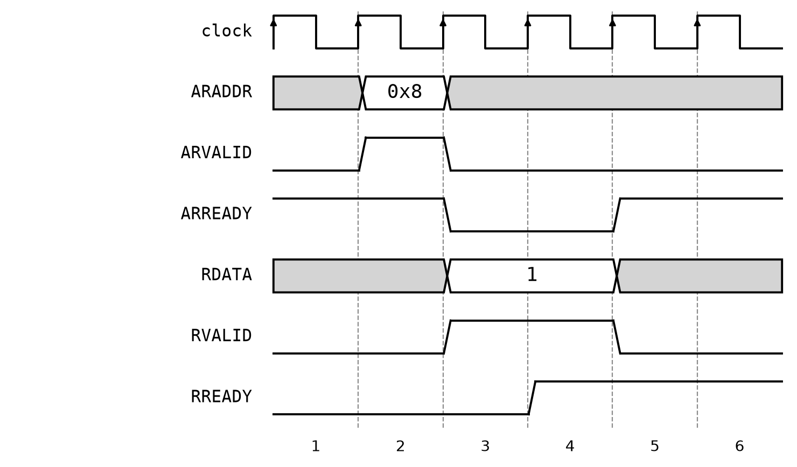
</p>

***Figure 12.10** — An AXI4-Lite read, captured from `AxiLiteCounter`. Grey marks
a don't-care: a channel's payload is only meaningful while its `VALID` is
asserted.*

The master presents `ARADDR` in cycle 2 and the slave accepts it in that same
cycle, since `ARREADY` was already high. The data appears on `RDATA` in cycle 3
— but the master is not ready until cycle 4, so the slave simply *holds* the
beat, and the transfer happens in cycle 4 where both `RVALID` and `RREADY` are
high. That is the entire ready/valid rule: a transfer occurs in exactly the
cycles where both are asserted, and either side may stall the other by
withholding its half. (`RDATA` reads 1 because the counters free-run from zero
and one cycle has elapsed.)

Now the consequence. Because AW and W are independent handshakes with no
ordering between them, a slave may see the address first, the data first, or
both in the same cycle, and must handle all three. It cannot simply wait for AW
and then read W: a master is entitled to present the data beat first, and a
slave that stalls waiting for the address it expects to come first will
deadlock against a master that is waiting to be relieved of its data. So each
channel gets its own holding register, and the write fires once both halves are
in:

`src/main/scala/axilite/AxiLite.scala`
```scala
class AxiLiteCounter extends Module {
  val io = IO(Flipped(new AxiLiteIO(4)))

  val cntRegs = RegInit(VecInit(Seq.fill(4)(0.U(32.W))))
  for (i <- 0 until 4) {
    cntRegs(i) := cntRegs(i) + 1.U
  }

  // --- write address and write data, captured independently ---------------
  val awIdxReg = RegInit(0.U(2.W))
  val awFullReg = RegInit(false.B)
  val wDataReg = RegInit(0.U(32.W))
  val wFullReg = RegInit(false.B)
  val bValidReg = RegInit(false.B)

  io.aw.ready := !awFullReg             // room for one address
  io.w.ready := !wFullReg               // room for one data beat

  when(io.aw.fire) {
    awIdxReg := io.aw.bits.addr(3, 2)
    awFullReg := true.B
  }
  when(io.w.fire) {
    wDataReg := io.w.bits.data
    wFullReg := true.B
  }

  // Both halves present (in whichever order they arrived) and the previous
  // response already taken: perform the write and raise the response.
  when(awFullReg && wFullReg && !bValidReg) {
    cntRegs(awIdxReg) := wDataReg
    awFullReg := false.B
    wFullReg := false.B
    bValidReg := true.B
  }
  when(io.b.fire) {
    bValidReg := false.B
  }

  io.b.valid := bValidReg
  io.b.bits.resp := AxiResp.okay

  // --- read ---------------------------------------------------------------
  // One outstanding read: the address is accepted, the counter sampled into a
  // register, and the data offered on R until the master takes it.
  val rDataReg = RegInit(0.U(32.W))
  val rValidReg = RegInit(false.B)

  io.ar.ready := !rValidReg
  when(io.ar.fire) {
    rDataReg := cntRegs(io.ar.bits.addr(3, 2))
    rValidReg := true.B
  }
  when(io.r.fire) {
    rValidReg := false.B
  }

  io.r.valid := rValidReg
  io.r.bits.data := rDataReg
  io.r.bits.resp := AxiResp.okay
}
```

`fire` is `valid && ready` — the cycle a transfer actually happens. Note that
the slave never looks at which channel arrived first; it only asks whether both
are now present, which is exactly why either order works.

Both orders, captured from the same slave:

<p align="center">
  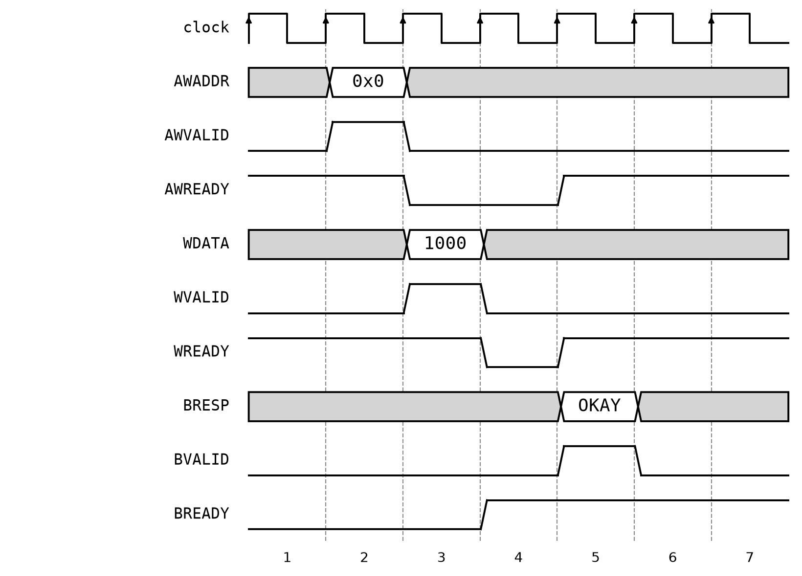
</p>

***Figure 12.11** — A write with the address first: `AWADDR` in cycle 2, `WDATA`
in cycle 3, response in cycle 5.*

<p align="center">
  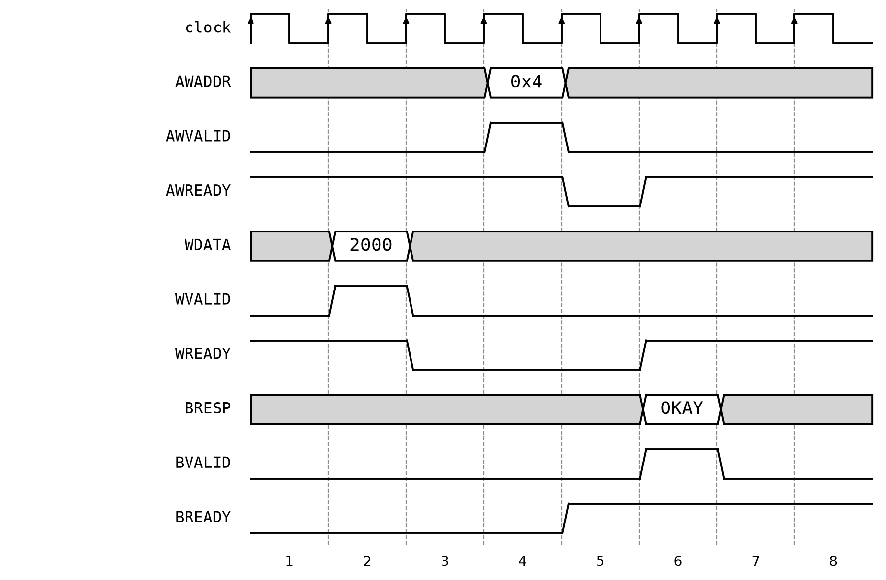
</p>

***Figure 12.12** — The same write with the data first: `WDATA` in cycle 2,
`AWADDR` only in cycle 4, response in cycle 6.*

Read the two together and the holding registers become visible as behaviour.
In Figure 12.12 the data beat is taken in cycle 2 and then `WREADY` goes low —
the slave's one data slot is full. For the next two cycles it has a data beat
and nowhere to put it, and crucially `BVALID` stays low: it does **not**
acknowledge a write it cannot yet perform. Only when `AWADDR` arrives in cycle
4 do both halves exist; cycle 5 shows `AWREADY` and `WREADY` both low while the
write happens, and the response follows in cycle 6.

Figure 12.11 is the same transaction with the channels swapped, and the slave
behaves symmetrically — `AWREADY` drops after cycle 2 instead. Neither ordering
is privileged, which is precisely the property the ids-free, two-channel write
path buys and the reason a slave cannot be written as "wait for AW, then read
W": a master presenting data first would deadlock against it.

#### Checking it

The three tests are the three orderings that matter. The first sends AW then W,
the second sends W then AW, and both must produce exactly one response:

`src/test/scala/AxiLiteCounterTest.scala`
```scala
  "An AXI4-Lite slave" should "accept a write with the address first" in {
    test(new AxiLiteCounter()) { dut =>
      sendAddr(dut.io.aw, dut.clock, 0)
      sendData(dut.io.w, dut.clock, 1000)

      dut.io.b.ready.poke(true.B)
      while (!dut.io.b.valid.peekBoolean()) dut.clock.step()
      dut.io.b.bits.resp.expect(AxiResp.okay)
      dut.clock.step()
    }
  }
```

```scala
  it should "accept the same write with the data first" in {
    test(new AxiLiteCounter()) { dut =>
      // The data beat arrives with no address in sight; the slave has to park
      // it until AW turns up.
      sendData(dut.io.w, dut.clock, 2000)
      dut.io.b.valid.expect(false.B, "no response until both halves have arrived")
      sendAddr(dut.io.aw, dut.clock, 4)

      dut.io.b.ready.poke(true.B)
      while (!dut.io.b.valid.peekBoolean()) dut.clock.step()
      dut.io.b.bits.resp.expect(AxiResp.okay)
      dut.clock.step()
    }
  }
```

The `expect(false.B)` in the middle of the second test is the part that matters:
it pins down that the slave parks the data beat and stays silent rather than
acknowledging a write it has no address for yet. Without the holding registers
this is where a "wait for AW, then read W" slave would deadlock.

The third test closes the loop over the other two channels, AR and R, and uses
the free-running counters to prove the write landed where it was addressed:

```scala
  it should "read back what was written" in {
    test(new AxiLiteCounter()) { dut =>
      sendAddr(dut.io.aw, dut.clock, 8)   // byte address 8 -> counter 2
      sendData(dut.io.w, dut.clock, 3000)
      dut.io.b.ready.poke(true.B)
      while (!dut.io.b.valid.peekBoolean()) dut.clock.step()
      dut.clock.step()

      sendAddr(dut.io.ar, dut.clock, 8)
      dut.io.r.ready.poke(true.B)
      while (!dut.io.r.valid.peekBoolean()) dut.clock.step()
      val value = dut.io.r.bits.data.peekInt()
      dut.io.r.bits.resp.expect(AxiResp.okay)
      dut.clock.step()

      // Free-running counters: a few cycles have passed since the write.
      assert(value >= 3000 && value < 3010, s"expected just over 3000, got $value")
    }
  }
```

```
sbt "testOnly AxiLiteCounterTest"
```

```
[info] AxiLiteCounterTest:
[info] An AXI4-Lite slave
[info] - should accept a write with the address first
[info] - should accept the same write with the data first
[info] - should read back what was written
[info] Run completed in 1 second, 168 milliseconds.
[info] Total number of tests run: 3
[info] Suites: completed 1, aborted 0
[info] Tests: succeeded 3, failed 0, canceled 0, ignored 0, pending 0
[info] All tests passed.
```

Its throughput — one transfer per two cycles, the registered rate — is measured
in `HandshakeStylesTest` alongside the Wishbone slaves, in the run shown above.

### Open Core Protocol

Sonics Inc. defined the Open Core Protocol (OCP) as an open, freely available
standard, now maintained by the OCP International Partnership (OCP-IP). The
Patmos processor and the T-CREST multicore platform use OCP: the Patmos
repository contains memory controllers, peripheral devices, and a
network-on-chip, all with an OCP interface.

### Further Bus Specifications

**Avalon**, from Intel, is a system-on-a-programmable-chip interconnect
specification covering everything from a simple asynchronous static-RAM-style
interface to sophisticated pipelined transfers with variable latency. This
flexibility comes from the *Avalon Switch Fabric*, which translates between
the different interconnection styles and is generated by Intel's SOPC Builder
tool — but the switch fabric itself appears to be Intel-proprietary, tying the
specification to Intel FPGAs.

The **On-Chip Peripheral Bus (OPB)** is an open standard from IBM, used by
Xilinx for several years. It specifies a bus for multiple masters and slaves
without mandating an implementation — a distributed ring, a centralized
multiplexer, or a centralized AND/OR network are all suggested. Xilinx used
the AND/OR approach, which requires every inactive master and slave to drive
its data bus to zero; Xilinx has since moved all its interconnects to AXI.

---

## 12.6 Build, run, and check

```
$ sbt test
```

Expected tail (32 tests across 8 suites):

```
[info] Run completed in 1 second, 972 milliseconds.
[info] Total number of tests run: 32
[info] Suites: completed 8, aborted 0
[info] Tests: succeeded 32, failed 0, canceled 0, ignored 0, pending 0
[info] All tests passed.
```

Generate SystemVerilog:

```
$ sbt "runMain Generate"
```

emits twelve files into `generated/`:

| File | What it is |
|------|------------|
| `BusDecoder.sv` | address decoder + read mux, no handshaking (Figure 12.2) |
| `CounterDeviceComb.sv` | `ReqAckIO` device, combinational ack, 2 wait states (Section 12.3.1) |
| `CounterDeviceReg.sv` | the four counters, registered ack (Section 12.3.3) |
| `CounterDevice.sv` | the four counters, pipelined handshake (Section 12.3.2) |
| `UseMemMappedRV.sv` | the memory-mapped ready/valid bridge (Section 12.4) |
| `WishboneCounter.sv` | the same counters, asynchronous Wishbone slave (Figure 12.7) |
| `WishboneCounterWait.sv` | the Wishbone equivalent of `CounterDeviceComb` (Figure 12.9) |
| `WishboneCounterSync.sv` | the same counters, synchronous Wishbone slave (Figure 12.8) |
| `AxiLiteCounter.sv` | the same counters, AXI4-Lite slave |
| `BridgedWishboneCounter.sv` | `WishboneCounter` reached through the bridge |
| `Axi4Memory.sv` | burst-capable AXI4 memory ([appendix](APPENDIX-AXI4.md)) |
| `Axi4OooReadMemory.sv` | out-of-order AXI4 read memory ([appendix](APPENDIX-AXI4.md)) |

`BridgedWishboneCounter.sv` holds three modules — `ReqAckToWishbone`,
`WishboneCounter`, and the `BridgedWishboneCounter` that joins them. One
`emitVerilog` writes a whole hierarchy into one file, so the bridge is not
emitted separately.

---

## 12.7 Recap

- A classic microprocessor bus (Z80/6502-style) shares one tri-state data bus,
  needs no clock, and defines timing purely through peripheral access times;
  on-chip interconnect replaces the tri-state data bus with a **read mux**
  driven by the **address decoder**; connections are clocked.
- **Three acknowledgment schemes**, decided by two questions — is `ack` a wire
  or a flop, and does the master hold its request? **Combinational** = wire,
  held: single-cycle transfers, but decoding sits on the critical path.
  **Registered** = flop, still held: the path is gone but the bus is not, so it
  is half a fix. **Pipelined** = flop, released after one cycle: the only one
  that reaches back-to-back requests, at the cost of tracking which command an
  ack belongs to. Measured at 1 transfer per 3, per 2, and per cycle.
- **Two further schemes**, each introduced where its hardware lives.
  **Ready/valid** ([Section 12.4](#readyvalid-the-two-sided-handshake)) makes
  stalling symmetric — the receiver can refuse a transfer, which req/ack has no
  wire for — and is per-channel flow control rather than a transaction, so AXI
  needs five channels and a state machine to rebuild one transaction from it.
  **Tagged completion** ([the appendix](APPENDIX-AXI4.md#a4-transaction-ids-and-out-of-order-completion)) puts an id on the command and the
  same id on the response, removing the in-order requirement the pipelined
  scheme imposes and with it head-of-line blocking. Credit-based flow control,
  clockless 2-/4-phase handshakes, clock-domain crossings, and retry/split
  responses are named in
  [Section 12.3.5](#1235-handshakes-this-chapter-does-not-build) but not
  built.
- The pipelined scheme generalizes to point-to-point links through a switching
  fabric, with arbitration once there is more than one master; Patmos/OCP and
  `t-crest/soc-comm` use exactly this shape.
- **Memory-mapped** devices live in the shared address space; a status register
  exposes ready/valid flags for polling (mirroring the IBM PC's 8250 UART), and
  a bridge (`MemMappedRV`) maps a bus to a `Decoupled` stream.
- Standards (Wishbone, AXI, OCP, Avalon, OPB) formalize these ideas atop
  ready/valid, each with its own trade-offs around who holds data valid and for
  how long.
- **One device, seven implementations.** The same four counters appear behind
  every scheme and every protocol in the chapter, so the only variable is the
  interconnect: `CounterDeviceComb` / `CounterDeviceReg` / `CounterDevice` on
  `ReqAckIO`, three Wishbone slaves, and `AxiLiteCounter`. The table below lists
  them side by side, and `ReqAckToWishbone` measurably turns a 1-cycle pipelined
  read into a 2-cycle one.
- **AXI4-Lite** is AXI with the bursts and ids removed: five `Decoupled`
  channels, and a write path that must accept AW and W in either order. Full
  AXI4 is in [the appendix](APPENDIX-AXI4.md).

### Every module, side by side

[Section 12.3.4](#1234-the-three-schemes-compared) compares the three schemes on one
port. This table widens that to every module in the chapter, protocol slaves
included, each classified by its actual driver expression:

| Module | `ack` / `ready` driver | Source | Holds request? | Scheme | Throughput |
|---|---|---|---|---|---|
| `WishboneCounter` | `io.ack := active` | **wire** | yes | combinational, no wait states | 1 / cycle |
| `WishboneCounterWait(2)` | `io.ack := active && done` | **wire**, gated by a flop | yes | combinational + wait states | 1 / 3 cycles ✔ |
| `WishboneCounterSync` | `ackReg := active && !ackReg` | flop | yes | registered | 1 / 2 cycles ✔ |
| `CounterDevice` | `ackReg := io.rd \|\| io.wr` | flop | **no** — 1-cycle command | **pipelined** | 1 / cycle ✔ |
| `MemMappedRV` | `ackReg := rd \|\| wr` | flop | **no** | **pipelined** | 1 / cycle |
| `ReqAckToWishbone` (`mem` side) | `io.mem.ack` in the `respond` state | flop (FSM) | **no** | pipelined, 2-cycle latency ✔ | 1 / 3 cycles |
| `ReqAckToWishbone` (`wb` side) | consumes `io.wb.ack` | — | **yes** | a held-request *master* | — |
| `AxiLiteCounter` | `!awFullReg`, `!wFullReg`, `!rValidReg` | flop | yes (`valid` held) | registered-equivalent | 1 / 2 cycles ✔ |
| `Axi4Memory`, single beat | `wState === wIdle`, `rState === rIdle` | flop (FSM) | yes | registered-equivalent | 1 / 2 cycles ✔ |
| `Axi4Memory`, inside a burst | as above | flop (FSM) | yes | burst amortisation | ~1 beat / cycle ✔ |
| `Axi4OooReadMemory` | `hasFree` (from `busyRegs`) | flop | yes | 2 outstanding, out-of-order | 1 / 2 cycles ✔ |

✔ measured by `src/test/scala/CounterDeviceTest.scala` (the three `ReqAckIO`
schemes) and `src/test/scala/HandshakeStylesTest.scala` (the protocol slaves);
the rest follow by
inspection.

Three things the table makes visible that the individual sections do not:

**A register in the module is not a register in the ack path.**
`WishboneCounterWait` contains `waitReg`, but `active` — this cycle's
`cyc && stb` — still gates the ack, so the master→slave→master path never
crosses a flip-flop. Its generated code is a `wire`, not a `reg`.

**AXI slaves land on the registered scheme, for a different reason.** `Decoupled`
fixes one axis: a source always holds `valid` until `ready`. So the AXI question
is not "does the master hold?" but how many transactions the slave accepts at
once — and these accept one, so acceptance and completion serialise onto the
same 1-per-2-cycles the registered Wishbone slave manages. The difference is
that for Wishbone this is the protocol's ceiling, while for AXI it is a property
of *these slaves*: the protocol separates acceptance (`ARREADY`) from completion
(`RVALID`) precisely so a richer slave can overlap them.

**Bursts, not pipelining, are AXI's throughput story here.** One address
handshake amortised over eight beats reaches nearly one beat per cycle — the
only place in the chapter where a ready/valid device beats the request/acknowledge
ones. And `Axi4OooReadMemory`'s two slots buy *ordering freedom, not rate*: it
still measures 1 per 2 cycles, because `servingReg` leaves a dead cycle between
bursts (see [the appendix](APPENDIX-AXI4.md#a6-what-these-models-leave-out)).

---

## 12.8 Exercise

`BusDecoder` in Section 12.2 selects a device and routes its read data, but it
knows nothing about handshaking. Put the two halves together: wire two
`CounterDevice`s behind a `BusDecoder`, give each its own 16-byte window, and add
the missing piece — combining the devices' `ack` signals so the master sees one
acknowledgment from whichever device was selected. Then drive both from a test
through the `read`/`write` helpers and check that each window reaches its own
device.

**Also:** Take `MemMappedRV` with a streaming device connected to its
`rx`/`tx` ports and write a ChiselTest testbench for the memory interface.
Explore what happens if the test ignores the status flags — i.e. it reads
data while the receive channel is invalid, or writes while the transmit
channel isn't ready. Then modify `MemMappedRV` so `ack` is delayed until the
streaming device's `rx`/`tx` are actually ready/valid, and check whether your
testbench still works with the delayed `ack`. If simulating both the
streaming device and the memory interface starts to feel awkward in plain
Scala — needing two software state machines running "in parallel" — that is
exactly the problem multithreaded testing solves; see the
[testing chapter](../ch13-debugging-testing-verification/README.md).

---

Back to the **[tutorial index](../README.md)**.
Previous: **[Chapter 11 — Example Designs](../ch11-example-designs/README.md)**.
Next: **[Chapter 13 — Debugging, Testing, and Verification](../ch13-debugging-testing-verification/README.md)**.
