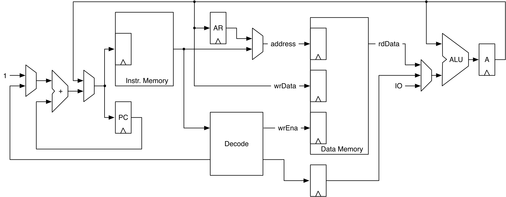

# Chapter 14 — Design of a Processor (Leros)

This chapter builds a real (if small) microprocessor: **Leros**, a 32-bit
**accumulator machine**. It's an advanced example — some computer-architecture
background helps — that ties together everything so far: an ISA, an ALU with an
accumulator, an instruction decoder, a data memory, and a fetch/execute state
machine. We follow the book's bottom-up path (ALU → decode → memory) and build
the pieces that stand on their own, testing the ALU against a Scala reference
model.

*Conventions: every file path is relative to
`tutorial/ch14-design-of-a-processor/`, and every command is run from that
folder.*

> **Scope of this project.** The full Leros ties the datapath together with an
> **assembler** and an **instruction memory** that reads and assembles a program
> file at generation time (`InstrMem`, `Leros`, the `util` assembler). Those need
> an external program and file I/O, so — to keep this a clean, self-contained,
> passing build — we include the parts that elaborate and test standalone: the
> **ALU/accumulator**, the **decoder**, the **data memory**, and the shared
> constants. The excluded pieces are described below; read the full design in the
> [Leros repository](https://github.com/leros-dev/leros).

## What's in this project

```
ch14-design-of-a-processor/
├── build.sbt · project/build.properties
├── figures/leros-datapath.png
├── src/main/scala/
│   ├── leros/shared/shared.scala   opcode + ALU-op constants (shared)
│   ├── leros/AluAccu.scala         the ALU with the accumulator register
│   ├── leros/Decode.scala          the instruction decoder
│   ├── leros/DataMem.scala         the byte-addressable data memory
│   └── Generate.scala
└── src/test/scala/leros/
    └── AluAccuTest.scala           ALU vs. a Scala reference model
```

---

## 14.1 The instruction set (ISA)

The ISA is the contract between software and hardware, independent of the
implementation. Leros is an **accumulator machine**: every operation has the
accumulator `A` as one source and (usually) the destination; the second operand
is either an immediate `i` or one of 256 registers `Rn`. Memory access goes
through `A` using an address register `AR`. A selection of the instruction set:

| Opcode | Function | Description |
|--------|----------|-------------|
| `add` / `addi` | A = A + Rn / A + i | add register / immediate |
| `sub` / `subi` | A = A − Rn / A − i | subtract |
| `shr` | A = A >>> 1 | shift right |
| `load` / `loadi` | A = Rn / i | load register / immediate |
| `and,or,xor (+i)` | A = A op Rn/i | logic ops |
| `loadhi/h2i/h3i` | A[hi] = i | load into upper bytes |
| `store` | Rn = A | store A to register |
| `ldaddr` | AR = A | set the address register |
| `loadind`/`storeind` | A = mem[AR+…] / mem[…] = A | memory load/store |
| `br,brz,brnz,brp,brn` | PC += o (conditional) | branches |
| `jal` | PC = A, Rn = PC+2 | jump and link |
| `scall` | — | system call (sim hook) |

Instructions are **16 bits**: the upper byte encodes the opcode, the lower byte
holds an immediate, register number, or branch offset. The internal ALU
operation codes and instruction opcodes both live in one shared object, so the
hardware, an assembler, and a simulator can all use them:

`src/main/scala/leros/shared/shared.scala`
```scala
object Constants {
  val ADD = 0x08; val ADDI = 0x09; val SUB = 0x0c /* ... */
  // ALU operation codes (used by AluAccu and produced by Decode)
  val nop = 0; val add = 1; val sub = 2; val and = 3
  val or = 4; val xor = 5; val ld = 6; val shr = 7
}
```

---

## 14.2 The datapath

Leros executes each instruction in **two clock cycles** (`fetch`, `execute`) —
a state machine with a datapath (the FSMD idea from Chapter 9).

<p align="center">
  
</p>

***Figure 14.1** — The Leros datapath. The PC addresses the instruction memory;
`Decode` drives the muxes and the ALU; the data memory holds data and the
registers; the ALU combines the accumulator `A` with an immediate or a register
value; `AR` holds the memory address.*

---

## 14.3 The ALU with accumulator

The central component. `op` selects the operation; one operand is the
accumulator, the other is `din`. The `switch` maps each op to a Chisel
expression; the `enaMask`/`enaByte`/`off` machinery supports byte/half-word and
load-high instructions by writing only selected bytes back into the accumulator:

`src/main/scala/leros/AluAccu.scala`
```scala
switch(op) {
  is(nop.U) { res := a }
  is(add.U) { res := a + b }
  is(sub.U) { res := a - b }
  is(and.U) { res := a & b }
  is(or.U)  { res := a | b }
  is(xor.U) { res := a ^ b }
  is(shr.U) { res := a >> 1 }
  is(ld.U)  { res := b }
}
```

**Testing against a Scala reference model.** We write the same ALU in plain
Scala and check the hardware against it over corner cases and random inputs.
This doesn't catch spec errors (both sides share the spec) but is a strong
sanity check:

`src/test/scala/leros/AluAccuTest.scala`
```scala
def alu(a: Int, b: Int, op: Int): Int = op match {
  case 1 => a + b
  case 2 => a - b
  // ...
  case 7 => a >>> 1
}
// poke a, step; poke b + op, step; then:
dut.io.accu.expect((alu(a, b, fun).toLong & 0x00ffffffffL).U)
```

---

## 14.4 Decoding instructions

The decoder turns a 16-bit instruction into the control signals used in the
execute state. It uses a `default`-initialized output bundle (so each opcode
overrides only what it needs) and a big `switch` on the opcode:

`src/main/scala/leros/Decode.scala`
```scala
switch(instr(15, 8)) {
  is(ADD.U)  { d.op := add.U; d.enaMask := MaskAll; d.isRegOpd := true.B }
  is(ADDI.U) { d.op := add.U; d.enaMask := MaskAll; d.useDecOpd := true.B }
  is(SHR.U)  { d.op := shr.U; d.enaMask := MaskAll }
  // ... loads, logic, store, memory access, scall
}
```

It also sign-extends the immediate and computes the (word/half/byte) branch
offset. Branch opcodes are detected from only the upper 4 bits.

---

## 14.5 The data memory

Data memory also holds the 256 registers. It's organized as 32-bit words split
into four bytes, so byte/half-word stores can use a **write mask**:

`src/main/scala/leros/DataMem.scala`
```scala
val mem = SyncReadMem(1 << memAddrWidth, Vec(4, UInt(8.W)))
val rdVec = mem.read(io.rdAddr)
io.rdData := rdVec(3) ## rdVec(2) ## rdVec(1) ## rdVec(0)
// ... split wrData into bytes ...
when (io.wr) { mem.write(io.wrAddr, wrVec, wrMask) }
```

---

## 14.6 The rest of the processor (excluded here)

The book completes Leros with three generator-heavy pieces that need an external
program file, so they are **not** in this runnable project:

- **An assembler** (`util`) — ~100 lines of Scala that parse a `.s` file in two
  passes (symbol table, then encode). A great example of a *hardware-time*
  generator: it assembles the program during elaboration.
- **The instruction memory** (`InstrMem`) — calls the assembler to fill a `Vec`
  of 16-bit instructions from a program path.
- **The top-level `Leros`** — the `fetch`/`execute` state machine wiring the
  ALU, decoder, and both memories together (`AluAccu`, `Decode`, `DataMem` here
  are exactly its building blocks).

---

## 14.7 Build, run, and check

```
$ sbt test
```

Expected (1 test — the ALU vs. its reference model over corner + random inputs):

```
[info] AluAccuTest:
[info] AluAccu
[info] - should match a Scala reference model
[info] Tests: succeeded 1, failed 0, canceled 0, ignored 0, pending 0
[info] All tests passed.
```

Generate SystemVerilog:

```
$ sbt "runMain Generate"
```

emits `AluAccu.sv`, `Decode.sv`, and `DataMem.sv`.

---

## 14.8 Recap

- An **ISA** is the software/hardware contract; Leros is a 32-bit accumulator
  machine with 16-bit instructions.
- A processor is an **FSMD**: a fetch/execute state machine over a datapath (PC,
  instruction memory, decoder, data memory, ALU + accumulator, `AR`).
- Build **bottom-up** (ALU → decode → memory) and test the ALU against a **Scala
  reference model**.
- Shared **constants** let the hardware, assembler, and simulator agree; an
  assembler that runs at generation time is itself a hardware generator.

## 14.9 Exercise

Read along with the full [Leros repository](https://github.com/leros-dev/leros):
run its tests, break something and watch a test fail, or write your own Leros
implementation (single-cycle, or pipelined for speed). Or design your own
accumulator ISA and ALU and test it against a Scala model as we did here.

Back to the **[tutorial index](../README.md)**.
Previous: **[Chapter 13 — Debugging, Testing, and Verification](../ch13-debugging-testing-verification/README.md)**.
Next: **[Chapter 15 — A RISC-V Pipeline](../ch15-a-risc-v-pipeline/README.md)**.
