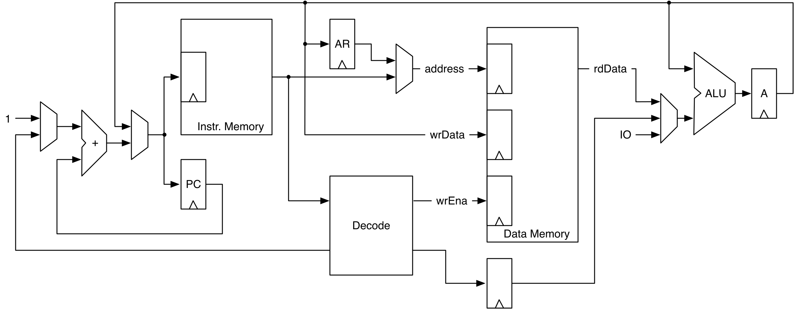

# Chapter 14 — Design of a Processor (Leros)

This chapter builds a real (if small) microprocessor: **Leros**, a 32-bit
**accumulator machine**. It's an advanced example — some computer-architecture
background helps — that ties together everything so far: an ISA, an ALU with an
accumulator, an instruction decoder, a data memory, an assembler that runs at
hardware-generation time, and a fetch/execute state machine that wires them into
a processor that runs programs.

We follow the book's bottom-up path — ALU → decode → data memory → assembler →
instruction memory → state machine — and each step is checked by a test you can
run on its own. The last step runs five assembly programs on the finished
processor.

*Conventions: every file path is relative to
`tutorial/ch14-design-of-a-processor/`, and every command is run from that
folder.*

> **What this implementation covers.** Every instruction in the ISA table below
> that `Decode` has a case for: the arithmetic and logic operations with a
> register or an immediate operand, the load-high family, `store`, `ldaddr`, the
> word and byte indirect accesses, all five branches, and `scall`. What is left
> out, and how you can tell: `jal` and the `in`/`out` port instructions have
> opcodes in `Constants` but no case in `Decode`; the half-word indirect
> accesses `loadindh`/`storeindh` have no opcode constant at all — though
> `DecodeOut` keeps the `isLoadIndH`/`isStoreIndH`/`isHalfOff` fields, and
> `AluAccu` the `enaHalf` path, that they would drive. Finishing them is the
> second exercise in § 14.12; the full design is in the
> [Leros repository](https://github.com/leros-dev/leros).

---

## 14.1 The instruction set (ISA)

The ISA is the contract between software and hardware, independent of the
implementation. Leros is an **accumulator machine**: every operation has the
accumulator `A` as one source and (usually) the destination; the second operand
is either an immediate `i` or one of 256 registers `Rn`. Memory access goes
through `A` using an address register `AR`. The full instruction set:

| Opcode | Function | Description |
|--------|----------|-------------|
| `add` | A = A + Rn | add register Rn to A |
| `addi` | A = A + i | add immediate value i to A |
| `sub` | A = A − Rn | subtract register Rn from A |
| `subi` | A = A − i | subtract immediate value i from A |
| `shr` | A = A >>> 1 | shift A logically right |
| `load` | A = Rn | load register Rn into A |
| `loadi` | A = i | load immediate value i into A |
| `and` | A = A and Rn | and register Rn with A |
| `andi` | A = A and i | and immediate value i with A |
| `or` | A = A or Rn | or register Rn with A |
| `ori` | A = A or i | or immediate value i with A |
| `xor` | A = A xor Rn | xor register Rn with A |
| `xori` | A = A xor i | xor immediate value i with A |
| `loadhi` | A[15:8] = i | load immediate into second byte |
| `loadh2i` | A[23:16] = i | load immediate into third byte |
| `loadh3i` | A[31:24] = i | load immediate into fourth byte |
| `store` | Rn = A | store A into register Rn |
| `jal` | PC = A, Rn = PC + 2 | jump to A and store return address |
| `ldaddr` | AR = A | load address register AR with A |
| `loadind` | A = mem[AR+(i << 2)] | load a word from memory into A |
| `loadindb` | A = mem[AR+i][7:0] | load a byte from memory into A |
| `loadindh` | A = mem[AR+(i << 1)][15:0] | load a half word from memory into A |
| `storeind` | mem[AR+(i << 2)] = A | store A into memory |
| `storeindb` | mem[AR+i] = A[7:0] | store a byte into memory |
| `storeindh` | mem[AR+(i << 1)] = A[15:0] | store a half word into memory |
| `br` | PC = PC + o | branch |
| `brz` | if A == 0: PC = PC + o | branch if A is zero |
| `brnz` | if A != 0: PC = PC + o | branch if A is not zero |
| `brp` | if A >= 0: PC = PC + o | branch if A is positive |
| `brn` | if A < 0: PC = PC + o | branch if A is negative |
| `scall` | — | system call (simulation hook) |

`A` is the accumulator, `PC` the program counter, `i` an immediate (0–255),
`Rn` a register `n` (0–255), `o` a branch offset relative to `PC`, and `AR` the
address register for memory access.

*The accumulator and the register file are, in this current implementation,
32 bits wide — kept configurable, with an eye towards also supporting 16-bit or
64-bit versions of Leros.*

Leros branches are **relative** to the current instruction, and can branch
forward and backward around **2000 instructions**. For larger control-flow
changes and for function calls/returns, Leros has a jump-and-link (`jal`)
instruction: it jumps to the address held in the accumulator and stores the
address of the following instruction into a register, which can later be used
to return from the function.

Here is an example program in Leros assembly — and it is a file in this project,
the first of five the processor is tested with in § 14.8:

`asm/test.s`
```
// The example program from Section 14.1: immediate load, arithmetic, and
// logic instructions. Like every Leros test program it leaves 0 in the
// accumulator, and ends with a system call.
loadi 1
addi 2
ori 0x50
andi 0x1f
subi 0x13
loadi 0xab
addi 0x01
subi 0xac

scall 0
```

Each instruction consists of an opcode mnemonic and a constant, written in
decimal or hexadecimal. This snippet shows immediate versions of load,
arithmetic, and logic instructions. The last instruction, `scall 0`, is a
system call that ends execution (or simulation) — this short program is part
of the Leros test suite, whose convention is that the accumulator holds 0 at
the end of a passing test. Following that line by line: `loadi 1` then
`addi 2` make A = 3, `ori 0x50` makes it 0x53, `andi 0x1f` narrows it to 0x13,
and `subi 0x13` brings it to 0; the last three instructions build 0xac and
subtract it again.

Instructions are **16 bits**: the upper byte encodes the opcode, the lower byte
holds an immediate, register number, or branch offset (part of the branch
offset also uses bits in the upper byte). For example, `00001001.00000010` is
an `addi` instruction that adds 2 to the accumulator, whereas `00001000.00000011`
adds the content of `R3` to the accumulator. For branches, 3 of the instruction
bits are used for larger offsets — a 12-bit signed offset in total, which is
where the ±2000 instructions of branch reach comes from.

The full encoding, in the upper 8 bits of each instruction (unused bits marked
`-`):

```
+--------+----------+
|00000---| nop      |
|000010-0| add      |
|000010-1| addi     |
|000011-0| sub      |
|000011-1| subi     |
|00010---| sra      |
|00011---| -        |
|00100000| load     |
|00100001| loadi    |
|00100010| and      |
|00100011| andi     |
|00100100| or       |
|00100101| ori      |
|00100110| xor      |
|00100111| xori     |
|00101001| loadhi   |
|00101010| loadh2i  |
|00101011| loadh3i  |
|00110---| store    |
|001110-?| out      |
|000001-?| in       |
|01000---| jal      |
|01001---| -        |
|01010---| ldaddr   |
|01100-00| ldind    |
|01100-01| ldindb   |
|01100-10| ldindh   |
|01110-00| stind    |
|01110-01| stindb   |
|01110-10| stindh   |
|1000nnnn| br       |
|1001nnnn| brz      |
|1010nnnn| brnz     |
|1011nnnn| brp      |
|1100nnnn| brn      |
|11111111| scall    |
+--------+----------+
```

Two names differ between the two tables: the shift is `shr` in the ISA table and
`sra` in the encoding table (the assembler accepts either), and the indirect
accesses are `loadind`/`storeind` in the ISA table and `ldind`/`stind` here (the
assembler uses the ISA-table spelling).

The internal ALU operation codes and instruction opcodes both live in one
shared object, so the hardware, the assembler, and a simulator can all use them
and stay in agreement automatically:

`src/main/scala/leros/shared/shared.scala`
```scala
object Constants {
  val NOP = 0x00
  val ADD = 0x08
  val ADDI = 0x09
  val SUB = 0x0c
  val SUBI = 0x0d
  val SHR = 0x10
  val LD = 0x20
  val LDI = 0x21
  val AND = 0x22
  val ANDI = 0x23
  val OR = 0x24
  val ORI = 0x25
  val XOR = 0x26
  val XORI = 0x27
  val LDHI = 0x29
  val LDH2I = 0x2a
  val LDH3I = 0x2b
  val ST = 0x30
  val OUT = 0x39
  val IN = 0x05
  val JAL = 0x40
  val LDADDR = 0x50
  val LDIND = 0x60
  val LDINDB = 0x61
  val STIND = 0x70
  val STINDB = 0x71
  val BR = 0x80
  val BRZ = 0x90
  val BRNZ = 0xa0
  val BRP = 0xb0
  val BRN = 0xc0
  val SCALL = 0xff // 0 is simulator exit

  val BRANCH_MASK = 0xf0

  // ALU operation codes (used by AluAccu and produced by Decode)
  val nop = 0
  val add = 1
  val sub = 2
  val and = 3
  val or = 4
  val xor = 5
  val ld = 6
  val shr = 7
}
```

*Scala note — `object` as namespace / companion → [§A.4](../SCALA-NOTES.md#a4-object-as-a-namespace--companion-object).*

The lower-case names at the end are a **second, smaller encoding**: the 3-bit
ALU operation code that `Decode` produces and `AluAccu` consumes. It is internal
to the hardware and unrelated to the instruction opcodes above it — `add` is ALU
op 1, while the `add` instruction is opcode 0x08.

---

## 14.2 The datapath

Leros executes each instruction in **two clock cycles** (`fetch`, `execute`) —
a state machine with a datapath (the FSMD idea from Chapter 9).

<p align="center">
  
</p>

***Figure 14.1** — The Leros datapath. The PC addresses the instruction memory;
`Decode` drives the muxes and the ALU; the data memory holds data and the
registers; the ALU combines the accumulator `A` with an immediate or a register
value; `AR` holds the memory address.*

On-chip memories usually have input registers that cannot themselves be read
(at least on FPGAs). That's why the same "next PC" value is fed to both the PC
register and the input register of the instruction memory. For non-branching
instructions, the next PC is simply PC + 1 (counted in 16-bit instruction
words, not bytes). For a relative branch, the branch immediate is sign-extended
and added to the PC. For `jal`, the PC can instead be loaded from `A`.

In the `fetch` state an instruction is fetched and decoded; `Decode` decides
what happens in the following `execute` state. Decode also generates the
operand for instructions with an immediate operand (e.g., `addi`, `loadhi`).
Since that operand is only consumed in the `execute` state, it must be stored
in a register between the two states.

The second memory doubles as both the general data memory and the storage for
the 255 registers — the register number is just an address into the same
memory. `AR` (itself loaded from `A`) supplies the address for a load or store;
a load's result is placed into `A`, and a store takes its data from `A`.
Finally, the ALU combines `A` with either an immediate (from the instruction)
or a register value (read from memory).

Each box in that figure is a file, and the rest of the chapter fills them in
bottom-up: `AluAccu.scala` (§ 14.3), `Decode.scala` (§ 14.4),
`DataMem.scala` (§ 14.5), `util/Assembler.scala` (§ 14.6),
`InstrMem.scala` (§ 14.7), and `Leros.scala` (§ 14.8), which wires them
together and adds the PC, `AR`, and the state machine.

---

## 14.3 The ALU with accumulator

The central component of a processor is the
[arithmetic logic unit](https://en.wikipedia.org/wiki/Arithmetic_logic_unit),
or ALU for short — so we start with the ALU and a test bench. `op` selects the
operation; one operand is the accumulator, the other is `din`. The `switch`
maps each op to one Chisel expression:

`src/main/scala/leros/AluAccu.scala`
```scala
class AluAccu(size: Int) extends Module {
  val io = IO(new Bundle {
    val op = Input(UInt(3.W))
    val din = Input(UInt(size.W))
    val enaMask = Input(UInt(4.W))
    val enaByte = Input(Bool())
    val enaHalf = Input(Bool())
    val off = Input(UInt(2.W))
    val accu = Output(UInt(size.W))
  })

  val accuReg = RegInit(0.U(size.W))

  val op = io.op
  val a = accuReg
  val b = io.din
  val res = WireDefault(a)

  switch(op) {
    is(nop.U) { res := a }
    is(add.U) { res := a + b }
    is(sub.U) { res := a - b }
    is(and.U) { res := a & b }
    is(or.U)  { res := a | b }
    is(xor.U) { res := a ^ b }
    is(shr.U) { res := a >> 1 }
    is(ld.U)  { res := b }
  }
```

The rest of the module is the byte-level write-back that the load-high and
byte-access instructions need. Chisel has no sub-word assignment, so the new
accumulator value is assembled **byte by byte**: `split(i)` takes the new
result byte where `enaMask(i)` is set and keeps the old accumulator byte where
it is not. `enaByte`/`enaHalf` select the sign-extended byte or half word
instead, and `off` says which byte or half of the word to take:

`src/main/scala/leros/AluAccu.scala`
```scala
  val byte = WireDefault(res(7, 0))
  val half = WireDefault(res(15, 0))
  when(io.off === 1.U) {
    byte := res(15, 8)
  }.elsewhen(io.off === 2.U) {
    byte := res(23, 16)
    half := res(31, 16)
  }.elsewhen(io.off === 3.U) {
    byte := res(31, 24)
  }
  val signExt = Wire(SInt(32.W))
  when (io.enaByte) {
    signExt := byte.asSInt
  } .otherwise {
    signExt := half.asSInt
  }

  // Workaround for missing subword assignments: build the accumulator byte by
  // byte, choosing new result bytes or old accu bytes via enaMask.
  val split = Wire(Vec(4, UInt(8.W)))
  for (i <- 0 until 4) {
    split(i) := Mux(io.enaMask(i), res(8 * i + 7, 8 * i), accuReg(8 * i + 7, 8 * i))
  }

  when((io.enaByte || io.enaHalf) & io.enaMask.andR) {
    accuReg := signExt.asUInt
  } .otherwise {
    accuReg := split.asUInt
  }

  io.accu := accuReg
}
```

Two consequences of that write mask are worth naming now, because § 14.8
depends on both: `enaMask` of `"b0000"` leaves the accumulator **unchanged**
(every `split(i)` keeps its old byte), which is how instructions that do not
write `A` are expressed and how the accumulator is held still during `fetch`;
and the sign-extending path is taken only when the mask is **all** ones, so a
partial mask always means "merge bytes".

#### Checking it

For testing, we write the same ALU function in plain Scala:

`src/test/scala/leros/AluAccuTest.scala`
```scala
      // The Scala reference: the ALU function written in ordinary Scala.
      def alu(a: Int, b: Int, op: Int): Int = {
        op match {
          case 0 => a
          case 1 => a + b
          case 2 => a - b
          case 3 => a & b
          case 4 => a | b
          case 5 => a ^ b
          case 6 => b
          case 7 => a >>> 1
          case _ => -123 // shall not happen
        }
      }
```

*Scala note — `match`/`case` → [§F.3](../SCALA-NOTES.md#f3-match--case--wildcard-case-_).*

While this duplication of hardware written in Chisel and an implementation in
Scala does not detect errors that are already in the shared specification, it
is at least a strong sanity check. We use some corner-case values as the test
vector, and a helper `testOne()` that pokes `a` in, steps, then pokes `b` and
the operation `fun`, steps again, and compares against the Scala reference:

`src/test/scala/leros/AluAccuTest.scala`
```scala
      // Load a into the accumulator, then apply op with b, and compare.
      def testOne(a: Int, b: Int, fun: Int): Unit = {
        dut.io.op.poke(ld.U)
        dut.io.enaMask.poke("b1111".U)
        dut.io.din.poke((a.toLong & 0x00ffffffffL).U)
        dut.clock.step(1)
        dut.io.op.poke(fun.U)
        dut.io.din.poke((b.toLong & 0x00ffffffffL).U)
        dut.clock.step(1)
        dut.io.accu.expect((alu(a, b, fun.toInt).toLong & 0x00ffffffffL).U)
      }

      def test(values: Seq[Int]) = {
        for (fun <- 0 to 7; a <- values; b <- values) testOne(a, b, fun)
      }

      // Interesting corner cases, then random inputs.
      val interesting = Seq(1, 2, 4, 123, 0, -1, -2, 0x80000000, 0x7fffffff)
      test(interesting)

      val randArgs = Seq.fill(10)(scala.util.Random.nextInt())
      test(randArgs)
```

*Scala note — conversions (`.toList`/`.toInt`/`.toLong`) → [§E.3](../SCALA-NOTES.md#e3-conversions-tolist-toindexedseq-toint-tolong); multi-generator `for` → [§G.1](../SCALA-NOTES.md#g1-multi-generator-for).*

The first poke is a `ld` with a full mask, which is how the reference value gets
*into* the accumulator; the second applies the operation under test. The
multi-generator `for` runs all 8 operations against every ordered pair of test
values, so the corner-case run alone is 8 × 9 × 9 = 648 comparisons.

Exhaustive testing of a 32-bit ALU is not possible (there are far too many
input combinations), which is why we picked corner cases as input values;
besides testing against corner cases, it is also useful to test against random
inputs, as the last two lines above do.

```
$ sbt "testOnly leros.AluAccuTest"
```

```
[info] AluAccuTest:
[info] AluAccu
[info] - should match a Scala reference model
[info] Run completed in 985 milliseconds.
[info] Total number of tests run: 1
[info] Suites: completed 1, aborted 0
[info] Tests: succeeded 1, failed 0, canceled 0, ignored 0, pending 0
[info] All tests passed.
```

---

## 14.4 Decoding instructions

From the ALU, we work backward and implement the instruction decoder.
Instruction decoding generates the signals that drive the multiplexers and the
ALU in the next stage/state. We define the instruction encoding in its own
Scala class and a *shared* package (§ 14.1's `Constants`), because we want to
share the encoding constants between the hardware implementation of Leros, an
assembler for Leros, and an instruction-set simulator.

For the decode component we define a `Bundle` for the output, later used in
the execution state and fed partially into the ALU:

`src/main/scala/leros/Decode.scala`
```scala
class DecodeOut extends Bundle {
  val operand = UInt(32.W)
  val enaMask = UInt(4.W)
  val op = UInt()
  val off = SInt(10.W)
  val isRegOpd = Bool()
  val useDecOpd = Bool()
  val isStore = Bool()
  val isStoreInd = Bool()
  val isStoreIndB = Bool()
  val isStoreIndH = Bool()
  val isLoadInd = Bool()
  val isLoadIndB = Bool()
  val isLoadIndH = Bool()
  val isDataAccess = Bool()
  val isByteOff = Bool()
  val isHalfOff = Bool()
  val isLoadAddr = Bool()
  val exit = Bool()
}
```

`operand`, `enaMask`, and `op` go straight to the ALU; `off` is the byte offset
for an indirect access; the `is…` flags are the multiplexer selects and write
enables that § 14.8 consumes; `exit` reports a `scall`.

We also define a companion object for `DecodeOut` with a function `default()`
that creates a `DecodeOut` and sets every field to a default value, so decode
only has to override what an instruction actually needs:

`src/main/scala/leros/Decode.scala`
```scala
// A companion object with a `default` that builds a DecodeOut with every field
// set to its default — so the decoder only overrides what each opcode needs.
object DecodeOut {

  val MaskNone = "b0000".U
  val MaskAll = "b1111".U

  def default: DecodeOut = {
    val v = Wire(new DecodeOut)
    v.operand := 0.U
    v.enaMask := MaskNone
    v.op := nop.U
    v.off := 0.S
    v.isRegOpd := false.B
    v.useDecOpd := false.B
    v.isStore := false.B
    v.isStoreInd := false.B
    v.isStoreIndB := false.B
    v.isStoreIndH := false.B
    v.isLoadInd := false.B
    v.isLoadIndB := false.B
    v.isLoadIndH := false.B
    v.isDataAccess := false.B
    v.isByteOff := false.B
    v.isHalfOff := false.B
    v.isLoadAddr := false.B
    v.exit := false.B
    v
  }
}
```

Decode takes the 16-bit instruction as input and delivers the decoded signals
as output; those driving signals are given a default value by calling
`default`. Branch opcodes are recognized from only their upper 4 bits, and for
a branch the low 12 bits are masked away so that the opcode `switch` below
matches the branch's base opcode and nothing else:

`src/main/scala/leros/Decode.scala`
```scala
// Decode: 16-bit instruction in, control signals out. A big switch on the
// opcode (upper 8 bits) sets the ALU op and the multiplexer selects for the
// execute state, plus sign-extension of the immediate and the branch offset.
class Decode() extends Module {
  val io = IO(new Bundle {
    val din = Input(UInt(16.W))
    val dout = Output(new DecodeOut)
  })

  import DecodeOut._

  val d = DecodeOut.default

  // Branch opcodes decode from only the upper 4 bits.
  val isBranch = WireDefault(false.B)
  def mask(i: Int) = ((i >> 4) & 0x0f).asUInt

  val field = io.din(15, 12)
  when (field === mask(BR)) { isBranch := true.B }
  when (field === mask(BRZ)) { isBranch := true.B }
  when (field === mask(BRNZ)) { isBranch := true.B }
  when (field === mask(BRP)) { isBranch := true.B }
  when (field === mask(BRN)) { isBranch := true.B }

  val instr = Mux(isBranch, io.din & (BRANCH_MASK.U << 8), io.din)

  val noSext = WireDefault(false.B)
  val sigExt = Wire(SInt(32.W))
  sigExt := instr(7, 0).asSInt
  d.operand := sigExt.asUInt
  when (noSext) { d.operand := instr(7, 0) }
```

`noSext` is the exception to sign extension: the logic immediates
(`andi`/`ori`/`xori`) mask or set bits in the low byte and would be useless if
the immediate were sign-extended to all-ones in the upper three bytes.

The decoding itself is one large switch statement on the part of the
instruction that represents the opcode (in Leros, for most instructions, the
upper 8 bits):

`src/main/scala/leros/Decode.scala`
```scala
  switch(instr(15, 8)) {
    is(ADD.U)  { d.op := add.U; d.enaMask := MaskAll; d.isRegOpd := true.B }
    is(ADDI.U) { d.op := add.U; d.enaMask := MaskAll; d.useDecOpd := true.B }
    is(SUB.U)  { d.op := sub.U; d.enaMask := MaskAll; d.isRegOpd := true.B }
    is(SUBI.U) { d.op := sub.U; d.enaMask := MaskAll; d.useDecOpd := true.B }
    is(SHR.U)  { d.op := shr.U; d.enaMask := MaskAll }
    is(LD.U)   { d.op := ld.U;  d.enaMask := MaskAll; d.isRegOpd := true.B }
    is(LDI.U)  { d.op := ld.U;  d.enaMask := MaskAll; d.useDecOpd := true.B }
    is(AND.U)  { d.op := and.U; d.enaMask := MaskAll; d.isRegOpd := true.B }
    is(ANDI.U) { d.op := and.U; d.enaMask := MaskAll; noSext := true.B; d.useDecOpd := true.B }
    is(OR.U)   { d.op := or.U;  d.enaMask := MaskAll; d.isRegOpd := true.B }
    is(ORI.U)  { d.op := or.U;  d.enaMask := MaskAll; noSext := true.B; d.useDecOpd := true.B }
    is(XOR.U)  { d.op := xor.U; d.enaMask := MaskAll; d.isRegOpd := true.B }
    is(XORI.U) { d.op := xor.U; d.enaMask := MaskAll; noSext := true.B; d.useDecOpd := true.B }
    is(LDHI.U) {
      d.op := ld.U; d.enaMask := "b1110".U
      d.operand := sigExt(23, 0).asUInt ## 0.U(8.W); d.useDecOpd := true.B
    }
    is(LDH2I.U) {
      d.op := ld.U; d.enaMask := "b1100".U
      d.operand := sigExt(15, 0).asUInt ## 0.U(16.W); d.useDecOpd := true.B
    }
    is(LDH3I.U) {
      d.op := ld.U; d.enaMask := "b1000".U
      d.operand := instr(7, 0) ## 0.U(24.W); d.useDecOpd := true.B
    }
    is (ST.U)     { d.isStore := true.B }
    is (LDADDR.U) { d.isLoadAddr := true.B }
    is (LDIND.U)  { d.isDataAccess := true.B; d.isLoadInd := true.B; d.op := ld.U; d.enaMask := MaskAll }
    is (LDINDB.U) { d.isDataAccess := true.B; d.isLoadIndB := true.B; d.isByteOff := true.B; d.op := ld.U; d.enaMask := MaskAll }
    is (STIND.U)  { d.isDataAccess := true.B; d.isStoreInd := true.B }
    is (STINDB.U) { d.isDataAccess := true.B; d.isStoreIndB := true.B; d.isByteOff := true.B }
    is(SCALL.U)   { d.exit := true.B }
  }
```

Additionally, decode generates a sign-extended version of the constant in the
instruction, and computes the offset used by the indirect load and store
instructions — scaled by the access size, because the immediate counts words,
half words, or bytes while `AR` counts bytes:

`src/main/scala/leros/Decode.scala`
```scala
  val instrSignExt = Wire(SInt(32.W))
  instrSignExt := instr(7, 0).asSInt
  val off = Wire(SInt(10.W))
  off := instrSignExt << 2 // default word offset
  when(d.isHalfOff) {
    off := instrSignExt << 1
  }.elsewhen(d.isByteOff) {
    off := instrSignExt
  }
  d.off := off

  io.dout := d
}
```

#### Checking it

`Decode` is purely combinational: poke an instruction word and read the control
signals back in the same cycle, with no clock step at all. The five tests take
the five decisions the decoder makes.

The first separates the two operand sources — `add r3` reads a register,
`addi 2` uses the decoder's own operand:

`src/test/scala/leros/DecodeTest.scala`
```scala
  "Decode" should "route register and immediate operands differently" in {
    test(new Decode()) { dut =>
      // add r3: the operand comes from the register file.
      dut.io.din.poke(((ADD << 8) + 3).U)
      dut.io.dout.op.expect(add.U)
      dut.io.dout.isRegOpd.expect(true.B)
      dut.io.dout.useDecOpd.expect(false.B)
      dut.io.dout.enaMask.expect("b1111".U)

      // addi 2: the operand comes from decode itself.
      dut.io.din.poke(((ADDI << 8) + 2).U)
      dut.io.dout.op.expect(add.U)
      dut.io.dout.isRegOpd.expect(false.B)
      dut.io.dout.useDecOpd.expect(true.B)
      dut.io.dout.operand.expect(2.U)
    }
  }

  it should "sign-extend arithmetic immediates but not logic ones" in {
```

The second pins down `noSext`: the same immediate `0xff` becomes −1 for `addi`
and 255 for `andi`/`ori`:

`src/test/scala/leros/DecodeTest.scala`
```scala
      dut.io.din.poke(((ADDI << 8) + 0xff).U)
      dut.io.dout.operand.expect("hffffffff".U) // addi 0xff subtracts one
      dut.io.din.poke(((ANDI << 8) + 0xff).U)
      dut.io.dout.operand.expect("h000000ff".U) // andi masks the low byte
      dut.io.din.poke(((ORI << 8) + 0xff).U)
      dut.io.dout.operand.expect("h000000ff".U)
    }
  }

  it should "give each load-high instruction its own byte mask" in {
    test(new Decode()) { dut =>
```

The third checks that each load-high instruction claims exactly its own byte
lane, which together with § 14.3's masking rule is what makes them composable:

`src/test/scala/leros/DecodeTest.scala`
```scala
      dut.io.dout.enaMask.expect("b1110".U)
      dut.io.dout.operand.expect("h00001200".U)
      dut.io.din.poke(((LDH2I << 8) + 0x12).U)
      dut.io.dout.enaMask.expect("b1100".U)
      dut.io.dout.operand.expect("h00120000".U)
      dut.io.din.poke(((LDH3I << 8) + 0x12).U)
      dut.io.dout.enaMask.expect("b1000".U)
      dut.io.dout.operand.expect("h12000000".U)
    }
  }

  it should "scale the indirect offset by the access size" in {
    test(new Decode()) { dut =>
```

The fourth checks the offset scaling — offset 3 means 12 bytes for a word
access and 3 bytes for a byte access:

`src/test/scala/leros/DecodeTest.scala`
```scala
      dut.io.dout.isDataAccess.expect(true.B)
      dut.io.dout.isLoadInd.expect(true.B)
      dut.io.dout.off.expect(12.S) // word access: three words is twelve bytes
      dut.io.dout.isByteOff.expect(false.B)

      dut.io.din.poke(((LDINDB << 8) + 3).U)
      dut.io.dout.isLoadIndB.expect(true.B)
      dut.io.dout.isByteOff.expect(true.B)
      dut.io.dout.off.expect(3.S) // byte access: the offset is used as it is
    }
  }

  it should "leave branches to the top level and flag scall" in {
    test(new Decode()) { dut =>
```

And the fifth confirms the two ends of the switch: a branch falls through it
entirely (leaving every default in place, because branches are resolved in
`Leros`), while `scall` sets `exit` and nothing else:

`src/test/scala/leros/DecodeTest.scala`
```scala
      // and every control signal keeps its default: the branch itself is
      // decoded in Leros, from the upper four bits.
      dut.io.din.poke(0xa005.U) // brnz -5
      dut.io.dout.op.expect(nop.U)
      dut.io.dout.enaMask.expect("b0000".U)
      dut.io.dout.isStore.expect(false.B)
      dut.io.dout.exit.expect(false.B)

      dut.io.din.poke(((SCALL << 8) + 0).U)
      dut.io.dout.exit.expect(true.B)
    }
  }
}
```

```
$ sbt "testOnly leros.DecodeTest"
```

```
[info] DecodeTest:
[info] Decode
[info] - should route register and immediate operands differently
[info] - should sign-extend arithmetic immediates but not logic ones
[info] - should give each load-high instruction its own byte mask
[info] - should scale the indirect offset by the access size
[info] - should leave branches to the top level and flag scall
[info] Run completed in 1 second, 503 milliseconds.
[info] Total number of tests run: 5
[info] Suites: completed 1, aborted 0
[info] Tests: succeeded 5, failed 0, canceled 0, ignored 0, pending 0
[info] All tests passed.
```

---

## 14.5 The data memory

Data memory also holds the 256 registers. It's organized as 32-bit words split
into four bytes, so byte/half-word stores can use a **write mask**:

`src/main/scala/leros/DataMem.scala`
```scala
// The Leros data memory, also holding the 256 registers. Organized as 32-bit
// words split into four bytes so byte/half-word stores can use a write mask.
class DataMem(memAddrWidth: Int) extends Module {
  val io = IO(new Bundle {
    val rdAddr = Input(UInt(memAddrWidth.W))
    val rdData = Output(UInt(32.W))
    val wrAddr = Input(UInt(memAddrWidth.W))
    val wrData = Input(UInt(32.W))
    val wr = Input(Bool())
    val wrMask = Input(UInt(4.W))
  })

  val mem = SyncReadMem(1 << memAddrWidth, Vec(4, UInt(8.W)))

  val rdVec = mem.read(io.rdAddr)
  io.rdData := rdVec(3) ## rdVec(2) ## rdVec(1) ## rdVec(0)
  val wrVec = Wire(Vec(4, UInt(8.W)))
  val wrMask = Wire(Vec(4, Bool()))
  for (i <- 0 until 4) {
    wrVec(i) := io.wrData(i * 8 + 7, i * 8)
    wrMask(i) := io.wrMask(i)
  }
  when (io.wr) {
    mem.write(io.wrAddr, wrVec, wrMask)
  }
}
```

It is a `SyncReadMem`, so a read takes effect **one clock cycle** after the
address is applied. That single fact is why Leros needs two states: the read
has to be started in `fetch` for the data to be there in `execute`.

#### Checking it

Three tests, one per property. The first is the read latency: write a word,
apply its address, and the data appears only after a step.

`src/test/scala/leros/DataMemTest.scala`
```scala
  // Write one word, with the given byte mask.
  private def write(dut: DataMem, addr: Int, data: Long, mask: String = "b1111"): Unit = {
    dut.io.wrAddr.poke(addr.U)
    dut.io.wrData.poke(data.U)
    dut.io.wrMask.poke(mask.U)
    dut.io.wr.poke(true.B)
    dut.clock.step(1)
    dut.io.wr.poke(false.B)
  }

  "DataMem" should "deliver a written word one cycle after the read address" in {
    test(new DataMem(8)) { dut =>
      write(dut, 0x10, 0x12345678L)
      dut.io.rdAddr.poke(0x10.U)
      dut.clock.step(1) // the read is synchronous: data arrives a cycle later
      dut.io.rdData.expect("h12345678".U)
    }
  }

```

The second is the write mask — writing all-ones with mask `"b0010"` must change
only byte 1, which is exactly what `storeindb` relies on:

`src/test/scala/leros/DataMemTest.scala`
```scala
    test(new DataMem(8)) { dut =>
      write(dut, 0x20, 0x00000000L)
      write(dut, 0x20, 0xffffffffL, "b0010") // byte 1 only
      dut.io.rdAddr.poke(0x20.U)
      dut.clock.step(1)
      dut.io.rdData.expect("h0000ff00".U)
    }
  }

```

The third checks the other direction: with `wr` low, the address and data
inputs are ignored entirely. Leros drives `wrData` with the accumulator on
*every* cycle, so this is what keeps non-store instructions from corrupting
memory:

`src/test/scala/leros/DataMemTest.scala`
```scala
    test(new DataMem(8)) { dut =>
      write(dut, 0x30, 0x0000002aL)
      dut.io.wrAddr.poke(0x30.U)
      dut.io.wrData.poke(0xffffffffL.U)
      dut.io.wr.poke(false.B)
      dut.clock.step(1)
      dut.io.rdAddr.poke(0x30.U)
      dut.clock.step(1)
      dut.io.rdData.expect(0x2a.U)
    }
  }
}
```

```
$ sbt "testOnly leros.DataMemTest"
```

```
[info] DataMemTest:
[info] DataMem
[info] - should deliver a written word one cycle after the read address
[info] - should write only the bytes selected by the mask
[info] - should not write at all when wr is low
[info] Run completed in 1 second, 134 milliseconds.
[info] Total number of tests run: 3
[info] Suites: completed 1, aborted 0
[info] Tests: succeeded 3, failed 0, canceled 0, ignored 0, pending 0
[info] All tests passed.
```

---

## 14.6 Assembling instructions

To write programs for Leros we need an assembler. For a very first test we can
hard-code a few instructions into a Scala array and use it to initialize the
instruction memory:

`src/test/scala/leros/AssemblerTest.scala`
```scala
  // The hand-encoded program of Section 14.6.
  val fixed = Array[Int](
    0x0903, // addi 0x3
    0x09ff, // -1
    0x0d02, // subi 2
    0x21ab, // ldi 0xab
    0x230f, // and 0x0f
    0x25c3, // or 0xc3
    0x0000
  )
```

That is a very inefficient way to test a processor, though. Writing an
assembler with an expressive language like Scala is not a big project — Leros'
assembler is about 100 lines of code. A function `getProgram` calls the
assembler; a symbol table for branch destinations is collected in a `Map`. A
classic assembler runs in two passes — (1) collect the symbol-table values,
(2) assemble the program using the symbols from pass 1 — so `assemble` is
called twice with a parameter indicating which pass it is:

`src/main/scala/leros/util/Assembler.scala`
```scala
object Assembler {

  // Destination addresses, collected in the first pass.
  val symbols = collection.mutable.Map[String, Int]()

  def getProgram(prog: String) = assemble(prog)

  def assemble(prog: String): Array[Int] = {
    symbols.clear() // one symbol table per program
    assemble(prog, false)
    assemble(prog, true)
  }
```

(`symbols.clear()` is ours, not the book's: the map is a field of the object, so
without it the labels of one program would still be in the table when the next
one is assembled — and this project assembles six programs in one JVM.)

`assemble` starts by opening the source file and defining helper functions to
parse the possible operands: an integer constant (decimal or hex), a register
number, and a branch destination:

`src/main/scala/leros/util/Assembler.scala`
```scala
  def assemble(prog: String, pass2: Boolean): Array[Int] = {

    val source = Source.fromFile(prog)
    var program = List[Int]()
    var pc = 0

    // An integer constant, decimal or hexadecimal.
    def toInt(s: String): Int = {
      if (s.startsWith("0x")) {
        Integer.parseInt(s.substring(2), 16)
      } else {
        Integer.parseInt(s)
      }
    }

    // A register number, written r0..r255.
    def regNumber(s: String): Int = {
      assert(s.startsWith("r"), "Register numbers shall start with 'r'")
      s.substring(1).toInt
    }

    // A branch operand is a label from the symbol table (or a plain number).
    // The encoded field is the distance from the branch to its destination,
    // a signed 12-bit value.
    def branchOff(s: String): Int = {
      if (!pass2) {
        0 // destinations are not known yet in pass 1
      } else {
        val off = if (symbols.contains(s)) symbols(s) - pc else toInt(s)
        assert(off >= -2048 && off < 2048, "Branch offset out of range: " + off)
        off & 0x0fff
      }
    }
```

`branchOff` is what the two passes are *for*. It encodes the distance from the
branch to its destination, and in pass 1 that distance is not knowable yet —
a forward branch names a label whose address is still being collected — so
pass 1 returns 0 and only pass 2 looks the label up. Both passes count `pc`
identically, so the addresses pass 1 records are the ones pass 2 needs.

The core of the assembler is a Scala `match` expression over the mnemonic of
each line:

`src/main/scala/leros/util/Assembler.scala`
```scala
    for (line <- source.getLines()) {
      val tokens = line.trim.split(" +")
      val Pattern = "(.*:)".r
      val instr = tokens(0) match {
        case "//" => // comment
        case Pattern(l) =>
          if (!pass2) symbols += (l.substring(0, l.length - 1) -> pc)
        case "nop" => NOP << 8
        case "add" => (ADD << 8) + regNumber(tokens(1))
        case "sub" => (SUB << 8) + regNumber(tokens(1))
        case "and" => (AND << 8) + regNumber(tokens(1))
        case "or" => (OR << 8) + regNumber(tokens(1))
        case "xor" => (XOR << 8) + regNumber(tokens(1))
        case "load" => (LD << 8) + regNumber(tokens(1))
        case "store" => (ST << 8) + regNumber(tokens(1))
        case "addi" => (ADDI << 8) + toInt(tokens(1))
        case "subi" => (SUBI << 8) + toInt(tokens(1))
        case "andi" => (ANDI << 8) + toInt(tokens(1))
        case "ori" => (ORI << 8) + toInt(tokens(1))
        case "xori" => (XORI << 8) + toInt(tokens(1))
        case "loadi" => (LDI << 8) + toInt(tokens(1))
        case "loadhi" => (LDHI << 8) + toInt(tokens(1))
        case "loadh2i" => (LDH2I << 8) + toInt(tokens(1))
        case "loadh3i" => (LDH3I << 8) + toInt(tokens(1))
        case "shr" => SHR << 8
        case "sra" => SHR << 8
        case "ldaddr" => LDADDR << 8
        case "loadind" => (LDIND << 8) + toInt(tokens(1))
        case "loadindb" => (LDINDB << 8) + toInt(tokens(1))
        case "storeind" => (STIND << 8) + toInt(tokens(1))
        case "storeindb" => (STINDB << 8) + toInt(tokens(1))
        case "br" => (BR << 8) + branchOff(tokens(1))
        case "brz" => (BRZ << 8) + branchOff(tokens(1))
        case "brnz" => (BRNZ << 8) + branchOff(tokens(1))
        case "brp" => (BRP << 8) + branchOff(tokens(1))
        case "brn" => (BRN << 8) + branchOff(tokens(1))
        case "scall" => (SCALL << 8) + toInt(tokens(1))
        case "" => // empty line
        case t: String => throw new Exception("Assembler error: unknown instruction: " + t)
        case _ => throw new Exception("Assembler error")
      }
      // Labels and comments produce no instruction word.
      instr match {
        case i: Int =>
          if (pass2) program = i :: program
          pc += 1
        case _ =>
      }
    }
    source.close()
    program.reverse.toArray
  }
}
```

Three Scala details in that block:

- `"(.*:)".r` turns a string into a **regular expression**, and a regex used as
  a `case` pattern matches the whole token and binds its capture group — so
  `case Pattern(l)` fires on `loop:` with `l = "loop:"`. That is how a label
  line is told apart from an instruction without listing every mnemonic twice.
- The `match` yields `Int` for instructions and `Unit` for labels, comments, and
  blank lines, so `instr` has the inferred type `Any`. The second `match`,
  `case i: Int`, is a **type pattern**: it recovers the instruction words and
  drops everything else — which is precisely the rule that labels occupy no
  instruction word while still advancing nothing.
- `program = i :: program` prepends, so the list comes out reversed and the
  method ends with `program.reverse.toArray`.

The book's version also has `if (!pass2) println(line)`, echoing the source
during the first pass; we leave it out so that assembling six programs does not
bury the test output.

#### Checking it

The assembler is plain Scala, so its test needs no hardware simulation. The
first test is the hand-coded array above: `asm/fixed.s` is that same program
written in assembly, and assembling it must reproduce the array word for word.

`asm/fixed.s`
```
// The hand-encoded program of Section 14.6, in assembly. It is assembled by
// AssemblerTest and compared against that hard-coded array; it does not end
// with a system call, so it is not meant to be run.
addi 0x3
addi 0xff
subi 2
loadi 0xab
andi 0x0f
ori 0xc3
nop
```

`src/test/scala/leros/AssemblerTest.scala`
```scala
  "The assembler" should "reproduce the hand-encoded program" in {
    assert(Assembler.getProgram("asm/fixed.s").toSeq == fixed.toSeq)
  }
```

The second test is the two-pass machinery, on the branch program of § 14.8: one
backward branch, one forward branch, and the invariant that a label is not an
instruction.

`src/test/scala/leros/AssemblerTest.scala`
```scala
  it should "resolve backward and forward branches" in {
    val code = Assembler.getProgram("asm/branch.s")
    // brnz loop: the branch is at 2, its destination at 1, so the offset is -1
    // in the low 12 bits of a 0xa0.. opcode.
    assert(code(2) == 0xa000 + (-1 & 0xfff))
    // brz cont: the branch is at 3, `cont` is at 6, so the offset is +3.
    assert(code(3) == 0x9000 + 3)
    // Labels themselves occupy no instruction word.
    assert(code.length == 16)
  }
```

The third is the error path — an unknown mnemonic must be reported, not
silently assembled into something:

`src/test/scala/leros/AssemblerTest.scala`
```scala
  it should "reject an unknown mnemonic" in {
    val bad = java.io.File.createTempFile("leros", ".s")
    java.nio.file.Files.write(bad.toPath, "movl 1\n".getBytes)
    val e = intercept[Exception] { Assembler.getProgram(bad.getPath) }
    assert(e.getMessage.contains("unknown instruction: movl"))
    bad.delete()
  }
```

```
$ sbt "testOnly leros.AssemblerTest"
```

```
[info] AssemblerTest:
[info] The assembler
[info] - should reproduce the hand-encoded program
[info] - should resolve backward and forward branches
[info] - should reject an unknown mnemonic
[info] Run completed in 153 milliseconds.
[info] Total number of tests run: 3
[info] Suites: completed 1, aborted 0
[info] Tests: succeeded 3, failed 0, canceled 0, ignored 0, pending 0
[info] All tests passed.
```

---

## 14.7 The instruction memory

`InstrMem` is configured with the address width (`memAddrWidth`) and a path to
the program (`prog`). Its constructor calls the assembler from § 14.6 to
assemble the program — an example of a hardware generator that assembles code
for an embedded processor during hardware generation. The Scala array holding
the program is converted to a `Seq` and then mapped to a Chisel `Vec` with the
anonymous function `_.asUInt(16.W)`. The memory also contains an address
register (`memReg`) to enable mapping the instruction memory onto FPGA on-chip
memory:

`src/main/scala/leros/InstrMem.scala`
```scala
// The Leros instruction memory. Its constructor calls the assembler, so the
// program is assembled during hardware generation: a hardware generator that
// compiles code for the processor it is generating. `memReg` is the memory's
// address register, which is what lets the memory map onto an FPGA on-chip
// memory (and is why the "next PC" has to be fed to it, not the current PC).
class InstrMem(memAddrWidth: Int, prog: String) extends Module {
  val io = IO(new Bundle {
    val addr = Input(UInt(memAddrWidth.W))
    val instr = Output(UInt(16.W))
  })

  val code = Assembler.getProgram(prog)
  assert(scala.math.pow(2, memAddrWidth) >= code.length, "Program too large")
  val progMem = VecInit(code.toIndexedSeq.map(_.U(16.W)))
  val memReg = RegInit(0.U(memAddrWidth.W))
  memReg := io.addr
  io.instr := progMem(memReg)
}
```

The book writes the mapping as `_.asUInt(16.W)`; in Chisel 6 the `.U(16.W)`
form above is the current spelling of the same conversion.

*The book notes that, in the Chisel version it was written against, the
generated code for this pattern contains a large priority mux that FPGA
synthesis tools cannot map onto an on-chip memory, and that the MLIR-based
CIRCT backend was expected to fix this. On the Chisel 6 / CIRCT toolchain used
here, it has: `sbt "runMain Generate"` emits the program as a packed array
indexed by the address register, not a mux chain (the array literal lists the
highest index first, so `_GEN[0]` is the last entry — `16'h2101`, `loadi 1`):*

```systemverilog
  wire [15:0][15:0] _GEN =
    '{16'h2101,
      16'h2101,
      16'h2101,
      16'h2101,
      16'h2101,
      16'h2101,
      16'h2101,
      16'hFF00,
      16'hDAC,
      16'h901,
      16'h21AB,
      16'hD13,
      16'h231F,
      16'h2550,
      16'h902,
      16'h2101};	// src/main/scala/leros/InstrMem.scala:23:12
```

```systemverilog
  assign io_instr = _GEN[memReg[3:0]];
```

*Whether a particular FPGA tool then infers a ROM from that array is a question
for that tool, but the shape the book was waiting for is what firtool now
emits. The book also names a second workaround for when a tool will not
cooperate — the one used in the Patmos project for its bootloader: hand-write
Verilog that fits the synthesis tools and include it as a black box.*

Two things in that output are worth reading carefully. The 9-instruction
program became a **16-entry** array, padded by repeating entry 0; and the
8-bit address register is truncated to `memReg[3:0]`. Chisel says so during
elaboration:

```
[warn] src/main/scala/leros/InstrMem.scala 23:22: [W004] Dynamic index with width 8 is too wide for Vec of size 9 (expected index width 4).
[warn]   io.instr := progMem(memReg)
[warn]                      ^
[warn] There were 1 warning(s) during hardware elaboration.
```

So the instruction memory is only as large as the program, and addresses beyond
it wrap. That is harmless here — every test program ends with `scall`, and the
test bench stops the clock there — but it is the reason the warning appears
once per elaborated program in the output of `sbt test`.

---

## 14.8 A state machine with data path implementation

The Leros ISA does not mandate a concrete implementation — throughout this
chapter we made implicit design decisions, and here we discuss one design
option. In the presented implementation, the data memory is **shared** with
the register file: the 256 registers are just an array in the data memory. A
different implementation might use dedicated on-chip memories for data and
registers instead.

Leros is implemented as a state machine with a datapath, so each instruction
takes more than one clock cycle: two states, `fetch` and `execute`.

`src/main/scala/leros/Leros.scala`
```scala
// The two states of the Leros state machine.
object State extends ChiselEnum {
  val fetch, execute = Value
}

// Leros as a state machine with a datapath: every instruction takes two clock
// cycles. In `fetch` the instruction is fetched and decoded, and the data
// memory read is started (it is synchronous and needs a cycle). In `execute`
// the accumulator gets its new value and a store, if any, is performed.
class Leros(prog: String, memAddrWidth: Int = 8, size: Int = 32) extends Module {
  val io = IO(new Bundle {
    val accu = Output(UInt(size.W))
    val pc = Output(UInt(memAddrWidth.W))
    val exit = Output(Bool())
  })

  import State._

  val stateReg = RegInit(fetch)
```

The state machine switches between the two states. In `fetch`, an instruction
is fetched from the instruction memory and decoded. We also **start** a read
from the data memory already in `fetch`, because the data memory is
synchronous and needs one clock cycle to deliver its result (§ 14.5). In
`execute`, a new value is computed for the accumulator (or the data-memory read
result is moved into it), and a write to the data memory, if any, is performed.

Instantiation of the instruction memory, parameterized with the program file
name, and of the decoder. The decoder's input is the instruction from the fetch
module, and its outputs are the decode signals; since those signals are needed
in the `execute` state, they are registered in `decReg`:

`src/main/scala/leros/Leros.scala`
```scala
  // Instruction fetch. The program is assembled into this memory.
  val imem = Module(new InstrMem(memAddrWidth, prog))
  val instr = imem.io.instr

  // Decode. The signals are consumed in the execute state, so they are
  // registered at the end of fetch.
  val dec = Module(new Decode())
  dec.io.din := instr
  val decout = dec.io.dout

  val decReg = RegInit(DecodeOut.default)
  when(stateReg === fetch) {
    decReg := decout
  }
```

The following shows the instantiation of the ALU/accumulator and the two main
state registers, the program counter (`pcReg`) and the address register
(`addrReg`):

`src/main/scala/leros/Leros.scala`
```scala
  val alu = Module(new AluAccu(size))
  val accu = alu.io.accu

  // The main architectural state: the program counter and the address register.
  val pcReg = RegInit(0.U(memAddrWidth.W))
  val addrReg = RegInit(0.U(size.W))

  // The data memory, which also holds the 256 registers.
  val dataMem = Module(new DataMem(memAddrWidth))
```

Then the data memory and its port connections. The address is where the
register file and the indirect accesses part company: a register operand is
addressed by the instruction's own low byte, while an indirect access is
addressed by `AR` plus the decoded offset. `AR` counts **bytes**, so the low two
bits of that sum become the byte offset within the word and the rest is the word
address:

`src/main/scala/leros/Leros.scala`
```scala
  // A register operand is addressed by the instruction's low byte. An indirect
  // access is addressed by AR plus the decoded offset - a byte address, so the
  // word address drops the low two bits and they become the byte offset.
  val effAddr = (addrReg.asSInt +& decout.off).asUInt
  val effAddrWord = effAddr(memAddrWidth + 1, 2)
  val effAddrOff = effAddr(1, 0)

  val memAddr = Mux(decout.isDataAccess, effAddrWord, instr(7, 0))
  val memAddrReg = RegNext(memAddr)
  val effAddrOffReg = RegNext(effAddrOff)
  dataMem.io.rdAddr := memAddr
  val dataRead = dataMem.io.rdData
  dataMem.io.wrAddr := memAddrReg
  dataMem.io.wrData := accu
  dataMem.io.wr := false.B
  dataMem.io.wrMask := "b1111".U
```

Both the address and the byte offset are also captured in a register
(`memAddrReg`, `effAddrOffReg`), because the write in `execute` has to use the
address computed in `fetch`. Note that `wrData` is wired to the accumulator
unconditionally and `wr` defaults to false: nothing is written unless an
instruction asks for it.

The ALU's operand is the last multiplexer in the datapath — the decoded
immediate when `useDecOpd` is set, and the data-memory read otherwise, which
covers both a register operand and an indirect load:

`src/main/scala/leros/Leros.scala`
```scala
  // The ALU's second operand is the decoded immediate or the memory read.
  val opd = WireDefault(dataRead)
  when(decReg.useDecOpd) {
    opd := decReg.operand
  }
  alu.io.din := opd
  alu.io.op := decReg.op
  // The accumulator may only change in execute, so during fetch the byte
  // write mask is forced to "no bytes".
  alu.io.enaMask := Mux(stateReg === execute, decReg.enaMask, DecodeOut.MaskNone)
  alu.io.enaByte := decReg.isLoadIndB
  alu.io.enaHalf := decReg.isLoadIndH
  alu.io.off := effAddrOffReg
```

Forcing `enaMask` to `MaskNone` during `fetch` is what keeps the accumulator
still for one of the two cycles. `AluAccu` has no clock enable — its register
updates every cycle — so "do not change `A` yet" has to be said with the byte
mask (§ 14.3).

Branches are the part `Decode` deliberately left alone. They are recognized
from the upper 4 bits, and the remaining 12 bits are the signed offset:

`src/main/scala/leros/Leros.scala`
```scala
  // Branches are recognized from the upper 4 bits of the instruction; the
  // remaining 12 bits are a signed offset relative to the branch itself.
  def brField(op: Int) = ((op >> 4) & 0x0f).U
  val brOff = instr(11, 0).asSInt
  val doBranch = WireDefault(false.B)
  switch(instr(15, 12)) {
    is(brField(BR)) { doBranch := true.B }
    is(brField(BRZ)) { doBranch := accu === 0.U }
    is(brField(BRNZ)) { doBranch := accu =/= 0.U }
    is(brField(BRP)) { doBranch := accu(size - 1) === 0.U }
    is(brField(BRN)) { doBranch := accu(size - 1) === 1.U }
  }
```

The condition reads the accumulator directly. No branch writes `A`, so its
value is the one the preceding instruction left there.

Finally the state machine itself. Because the instruction memory has an address
register fed with the *next* PC, the address has to be **held** during `fetch`
(so the instruction stays available for the execute cycle) and advanced only in
`execute` — which is also where the PC register itself is updated, where a store
is performed, and where `ldaddr` loads `AR`:

`src/main/scala/leros/Leros.scala`
```scala
  // The same "next PC" goes to the PC register and to the instruction
  // memory's address register, so it must hold during fetch and only advance
  // in execute.
  val brTarget = (pcReg.asSInt +& brOff).asUInt
  val pcNext = WireDefault(pcReg)
  imem.io.addr := pcNext

  switch(stateReg) {
    is(fetch) {
      stateReg := execute
    }
    is(execute) {
      stateReg := fetch
      pcNext := Mux(doBranch, brTarget(memAddrWidth - 1, 0), pcReg +% 1.U)
      pcReg := pcNext

      when(decReg.isStore || decReg.isStoreInd) {
        dataMem.io.wr := true.B
      }
      when(decReg.isStoreIndB) {
        dataMem.io.wr := true.B
        dataMem.io.wrMask := UIntToOH(effAddrOffReg)
        dataMem.io.wrData := Fill(4, accu(7, 0))
      }
      when(decReg.isLoadAddr) {
        addrReg := accu
      }
    }
  }

  io.accu := accu
  io.pc := pcReg
  io.exit := decReg.exit
}
```

`brTarget` adds the offset to the branch's *own* PC, which is what makes the
offsets the assembler computes (`symbols(s) - pc`) come out right. The byte
store is the one write that does not take the full word: its mask is the
one-hot of the byte offset, and the accumulator's low byte is replicated across
all four lanes so that the selected lane gets it.

`io.accu`, `io.pc`, and `io.exit` are not part of the processor — they are there
so a test bench can watch the accumulator, follow the program counter, and see
when a `scall` was executed.

#### Checking it

The Leros test-suite convention from § 14.1 makes the test bench small: run the
program until `exit`, then check that the accumulator is 0. One assertion covers
every instruction the program used, because any wrong result propagates to the
end.

`src/test/scala/leros/LerosTest.scala`
```scala
    test(new Leros(prog)) { dut =>
      var cycles = 0
      while (!dut.io.exit.peekBoolean() && cycles < maxCycles) {
        dut.clock.step(1)
        cycles += 1
      }
      assert(cycles < maxCycles, s"$prog did not reach scall in $maxCycles cycles")
      dut.io.accu.expect(0.U, s"$prog shall leave 0 in the accumulator")
    }
  }

  "Leros" should "run the example program of Section 14.1" in { run("asm/test.s") }
```

The `maxCycles` guard is the other half of the check: a program that never
reaches its `scall` — because a branch went to the wrong place, or a loop never
terminates — fails instead of hanging.

`src/test/scala/leros/LerosTest.scala`
```scala
  it should "build a word with the load-high instructions" in { run("asm/loadhi.s") }
  it should "load and store words and bytes indirectly" in { run("asm/memory.s") }
  it should "take all five kinds of branch" in { run("asm/branch.s") }
}
```

The five programs are chosen to cover the datapath one path at a time.
`asm/test.s` (§ 14.1) uses only immediates, so it exercises the
`useDecOpd` mux and the ALU. `asm/registers.s` routes every ALU operation
through the register file instead — which means every one of those results made
the round trip out to the data memory and back:

`asm/registers.s`
```
// Register operands. The registers are just words in the data memory, so
// `store rn` and `load rn`, `add rn` and the rest address that memory with
// the instruction's low byte.
loadi 0x0f
store r1
loadi 0x33
store r2
load r1
and r2
store r3
load r1
or r2
xor r2
sub r3
add r3
shr
shr
sub r3

scall 0
```

`asm/loadhi.s` is the byte-masking path of § 14.3: build 0x12345678 one byte at
a time, twice, and xor the two.

`asm/loadhi.s`
```
// The load-high family writes one byte of the accumulator at a time. Build
// 0x12345678 twice and xor the two, which leaves 0.
loadi 0x78
loadhi 0x56
loadh2i 0x34
loadh3i 0x12
store r1
loadi 0x78
loadhi 0x56
loadh2i 0x34
loadh3i 0x12
xor r1

scall 0
```

`asm/memory.s` uses `AR` and the indirect accesses: a word written and read
back, a second word at offset 1 to show the offset scaling, and a byte written
into the middle of a word and sign-extended back into `A`. Every intermediate
result is checked on the spot with `brnz fail`, so a failure names itself rather
than just producing a wrong number at the end.

`asm/memory.s`
```
// Indirect memory access through the address register AR. AR holds a byte
// address; the immediate is a word offset for `loadind`/`storeind` and a byte
// offset for `loadindb`/`storeindb`.
loadi 0x40
ldaddr
loadi 0x7b
storeind 0
loadi 0x2a
storeind 1
loadind 0
subi 0x7b
brnz fail
loadind 1
subi 0x2a
brnz fail
loadindb 0
subi 0x7b
brnz fail
loadi 0x11
storeindb 1
loadindb 1
subi 0x11

scall 0

fail:
loadi 0xff
scall 0
```

`asm/branch.s` takes all five branches in turn, with a `loadi 0xff` on each
not-taken path so that a branch that goes the wrong way cannot leave 0 in the
accumulator.

`asm/branch.s`
```
// All five branches. A counting loop on brnz, then brz, brn, br, and brp in
// turn; any wrong branch lands on a `loadi 0xff` and fails the accumulator
// check at the end.
loadi 5
loop:
subi 1
brnz loop
brz cont
loadi 0xff
scall 0

cont:
subi 1
brn neg
loadi 0xff
scall 0

neg:
addi 1
br done
loadi 0xff

done:
brp ok
loadi 0xff

ok:
scall 0
```

```
$ sbt "testOnly leros.LerosTest"
```

```
[info] LerosTest:
[info] Leros
[info] - should run the example program of Section 14.1
[info] - should compute with register operands
[info] - should build a word with the load-high instructions
[info] - should load and store words and bytes indirectly
[info] - should take all five kinds of branch
[info] Run completed in 2 seconds, 101 milliseconds.
[info] Total number of tests run: 5
[info] Suites: completed 1, aborted 0
[info] Tests: succeeded 5, failed 0, canceled 0, ignored 0, pending 0
[info] All tests passed.
```

To write a program of your own, drop a `.s` file into `asm/` and add one line to
`LerosTest`. Keep the two conventions: end with `scall 0`, and arrange for the
accumulator to be 0 when you get there.

---

## 14.9 Implementation variations

Real processors perform
[instruction pipelining](https://en.wikipedia.org/wiki/Instruction_pipelining):
more than one instruction is in flight at a time. For Leros, we could imagine
a three-stage pipeline — instruction fetch, instruction decode, and execute —
with three instructions in the pipeline at once, executing one instruction per
clock cycle instead of one every two cycles. Compared to the implementation
presented in this chapter, pipelining could roughly **double** the performance
of Leros. The next chapter presents a pipelined processor implementing the
RISC-V instruction set.

---

## 14.10 Build, run, and check

```
$ sbt test
```

Expected tail (17 tests across the 5 suites — one per component, plus the five
programs of `LerosTest`):

```
[info] Run completed in 1 second, 782 milliseconds.
[info] Total number of tests run: 17
[info] Suites: completed 5, aborted 0
[info] Tests: succeeded 17, failed 0, canceled 0, ignored 0, pending 0
[info] All tests passed.
```

Between the suites you will also see one `[W004]` block per elaborated program,
which is the instruction-memory truncation explained in § 14.7 — five of them,
one per program in `LerosTest`.

Generate SystemVerilog:

```
$ sbt "runMain Generate"
```

`src/main/scala/Generate.scala`
```scala
// Emit SystemVerilog for the Leros processor and for the building blocks the
// chapter discusses in their own right. InstrMem is not emitted separately:
// one emitVerilog writes the whole hierarchy into Leros.sv, so it is in there.
// Run with:  sbt "runMain Generate"
object Generate extends App {
  // Collect the emitted .sv files in one folder instead of the project root.
  // Chisel's own default target directory is "." - `--target-dir` overrides it.
  val opts = Array("--target-dir", "generated")

  emitVerilog(new AluAccu(32), opts)
  emitVerilog(new Decode(), opts)
  emitVerilog(new DataMem(8), opts)
  emitVerilog(new Leros("asm/test.s"), opts)
}
```

That emits `AluAccu.sv`, `Decode.sv`, `DataMem.sv`, and `Leros.sv` into
`generated/`. `InstrMem` is not emitted on its own: one `emitVerilog` writes the
whole hierarchy into one file, so it is inside `Leros.sv` (along with `AluAccu`,
`Decode`, and `DataMem` — the separate files for those three are for reading
them in isolation).

`Leros.sv` is generated from `asm/test.s`, so the program is baked into it — the
`_GEN` array of § 14.7 *is* the program. Point `Generate` at a different `.s`
file and you get a different processor.

---

## 14.11 Recap

- An **ISA** is the software/hardware contract; Leros is a 32-bit accumulator
  machine with 16-bit instructions.
- A processor is an **FSMD**: a fetch/execute state machine over a datapath (PC,
  instruction memory, decoder, data memory, ALU + accumulator, `AR`).
- The two-cycle structure is forced by one detail: the data memory is
  synchronous, so the read must start a cycle before its result is used.
- Build **bottom-up** (ALU → decode → memory → assembler → instruction memory →
  state machine) and test each piece as you go — the ALU against a **Scala
  reference model**, the finished processor against whole programs.
- Shared **constants** let the hardware, assembler, and simulator agree; an
  assembler that runs at generation time is itself a hardware generator, and the
  program ends up inside the generated SystemVerilog.
- Real processors **pipeline**; a 3-stage Leros pipeline could roughly double
  its performance — the subject of the next chapter.

## 14.12 Exercise

This exercise assignment, in one of the last chapters, is in a very free form.
You are at the end of your learning tour through Chisel and ready to tackle
design problems that you find interesting.

One option is to reread the chapter and read along with the full
[Leros repository](https://github.com/leros-dev/leros): run its tests, fiddle
with the code by breaking it, and see that tests fail. The same works here —
change one `is(...)` case in `Decode.scala` and watch which of the five programs
in `LerosTest` notices.

A second option is to finish the three instructions this project leaves out.
`loadindh`/`storeindh` are the smallest: add the opcodes to `Constants`, two
cases to `Decode` that set `isHalfOff` and `isLoadIndH`/`isStoreIndH`, a
half-word store to `Leros`, two mnemonics to the assembler, and a program under
`asm/`. `jal` is the interesting one, because it is the first instruction that
writes something other than the accumulator into the data memory.

Another option is to write your own implementation of Leros. The
implementation here is just one possible organization — you could
write a Chisel simulation version of Leros with a single pipeline stage, or go
crazy and superpipeline Leros for the highest possible clocking frequency.

A third option is to design your own processor from scratch. Maybe the
demonstration of how to build the Leros processor, and the tools needed along
the way, have convinced you that processor design and implementation are no
magic art, but engineering that can be very joyful.

Back to the **[tutorial index](../README.md)**.
Previous: **[Chapter 13 — Debugging, Testing, and Verification](../ch13-debugging-testing-verification/README.md)**.
Next: **[Chapter 15 — A RISC-V Pipeline](../ch15-a-risc-v-pipeline/README.md)**.
