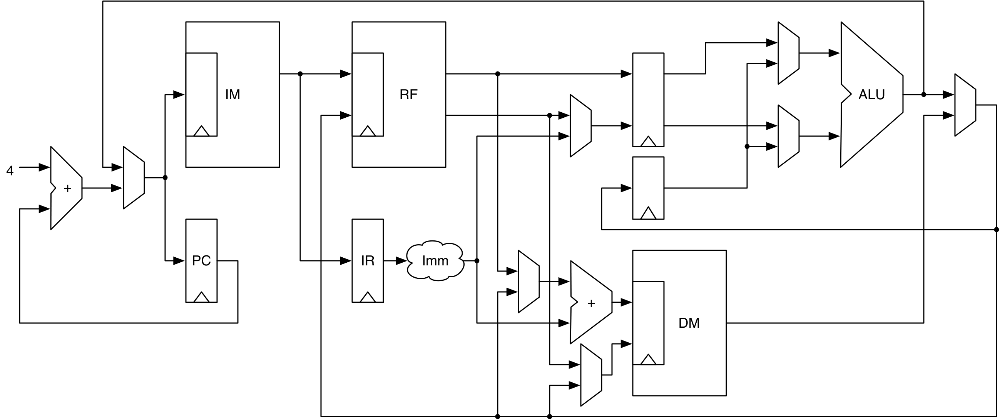

# Chapter 15 — A RISC-V Pipeline

**Pipelining** overlaps the stages of instruction processing so that, ideally,
one instruction completes every clock cycle — in contrast to the multi-cycle
Leros processor of Chapter 14. This chapter presents **Wildcat**, a small,
readable **RISC-V (RV32I)** processor built as a **3-stage pipeline**. We build
the parts that stand on their own — the ALU and decoder (written as functions
returning hardware), the CSR block, and the instruction ROM — test them, and
generate the SystemVerilog for the *complete* `ThreeCats` CPU.

Pipelining is a familiar idea outside hardware, too. In a car factory's
assembly line, each station performs one specialized task — say, engine
installation — and the car moves on to the next station as soon as that task
is done, so many cars are in different stages of assembly at the same time.
Wildcat applies the same idea to instruction processing: instructions flow
through the pipeline, with one processor unit performing one operation at each
stage, so that (ideally) a different instruction is in flight at every stage
on every clock cycle. Beyond the pipeline built in this chapter, the
[Wildcat GitHub repo](https://github.com/schoeberl/wildcat) also contains a
RISC-V instruction-set simulator written in plain Scala, and a single-cycle
Chisel version of the processor for comparison and demonstration.

*Conventions: every file path is relative to `tutorial/ch15-a-risc-v-pipeline/`,
and every command is run from that folder.*

> **Scope note.** Wildcat's full system needs a *program* in its memories, and
> the upstream repo loads programs from ELF files via a `jelf` dependency and
> runs them on Verilator. To stay self-contained (three dependencies, no
> external files), this project **builds and generates** the whole `ThreeCats`
> pipeline and **unit-tests** the pieces that don't need a program: the ALU,
> the decoder, the CSRs, and the instruction ROM. Running full programs (and the
> `StandardFive`/`WildFour`/`ThreeCats` co-simulation test suite) lives in the
> [Wildcat GitHub repo](https://github.com/schoeberl/wildcat).

## What's in this project

```
ch15-a-risc-v-pipeline/
├── build.sbt · project/build.properties
├── figures/wildcat.png
├── src/main/scala/
│   ├── wildcat/defines.scala                 ISA constants + AluType/InstrType enums
│   └── wildcat/pipeline/
│       ├── connections.scala                 InstrIO / MemIO / DecodedInstr bundles
│       ├── Wildcat.scala                      abstract top level
│       ├── Functions.scala                    decode / alu / compare / regfile / ...
│       ├── ThreeCats.scala                    the 3-stage pipelined CPU
│       ├── InstructionROM.scala               preloaded instruction memory
│       ├── Csr.scala                          control & status registers
│       └── FunctionWrappers.scala             (tutorial) AluModule / DecodeModule
├── src/main/scala/Generate.scala
└── src/test/scala/wildcat/WildcatTest.scala
```

---

## 15.1 The RV32I ISA in brief

RISC-V is an open instruction-set architecture (ISA) originally developed at
the University of California, Berkeley. Andrew Waterman defined it in his PhD
thesis, supervised by Krste Asanovic and Dave Patterson, distilling three
decades of RISC architectures — MIPS, SPARC, and Alpha — into the RISC-V ISA
definition. Because the definition is open source, many microcontroller
vendors have switched to RISC-V over the last few years.

RISC-V is an ISA *definition*; it does not mandate an implementation. The "V"
stands for the **fifth** RISC project at Berkeley, and it also signals that
vector instructions are part of the standard.

The RISC-V definition has two base integer ISAs — **RV32I** and **RV64I**, for
32-bit and 64-bit architectures — plus optional extensions such as **M**
(multiply/divide), **F** and **D** (single-/double-precision floating point),
and many more, layered on top of the base. Wildcat implements the base
**RV32I**.

RV32I has 32 registers of 32 bits (x0 is always 0) and a program counter; a
load-store architecture with 32-bit instructions. The instruction classes:
register/register and register/immediate ALU ops, loads and stores, and control
flow (conditional branches, `jal`/`jalr`). For example:

- `add x1, x2, x3` — add registers `x2` and `x3`, result into `x1`.
- `add x1, x2, 42` — add the immediate `42` to `x2`, result into `x1`.
- `lw x3, 4(x1)` — load a word from address `x1 + 4` into `x3`.
- `sw x2, 4(x1)` — store the content of `x2` to address `x1 + 4`.
- `bne x2, x3, fail` — branch to `fail` if `x2 != x3`.
- `jal x1, foo` — jump to `foo`, saving the return address in `x1`.

Wildcat implements this base ISA. For a detailed description, see the classic
textbook by Patterson and Hennessy, or the official
[RISC-V Instruction Set Manual](https://github.com/riscv/riscv-isa-manual).

---

## 15.2 Pipeline stage definition

A pipeline stage performs one specific function within a single clock cycle,
and that function is combinational. Registers sit between the stages to hold
intermediate results.

Because a register sits *between* two stages, we need a convention for which
stage it belongs to: the stage's input register, or its output register? For
practical reasons — matching how on-chip memories are built, with a registered
address input (Chapter 6) — Wildcat treats a stage's **input register** as
part of that stage, not its output register.

---

## 15.3 Number of pipeline stages

The number of pipeline stages is an architectural choice. Longer pipelines can
run at a higher clock frequency, but each extra stage adds register overhead
and design complexity.

The classic RISC organization, used throughout computer-architecture textbooks
(Patterson & Hennessy), is a **5-stage pipeline**:

1. Instruction fetch
2. Instruction decode and register-file read
3. Execute
4. Memory access
5. Write-back

Real RISC-V implementations range from two stages to many more. One driver of
the stage count is the on-chip memory used for instructions and data: a
scratchpad or cache with a registered address input (Chapter 6) has a
one-cycle read latency, and that input register *is* a pipeline register. To
keep the design simple, Wildcat collapses the classic 5 stages down to
**three**:

1. Instruction fetch
2. Instruction decode, register-file read, and address computation
3. Execute and memory access

*(A register file built from plain flip-flops, read asynchronously, would let
this collapse further to just two stages — but it gives up the on-chip-memory
implementation that Wildcat's register file uses; see §15.5.)*

---

## 15.4 A three-stage pipeline

A pipeline stage does one combinational job per cycle; registers between stages
hold intermediate results. On-chip memories (with a registered address and
one-cycle read latency) set a practical lower bound of three stages:

1. **Fetch** — instruction memory (IM) read.
2. **Decode** — register-file (RF) read, decode, address computation.
3. **Execute** — ALU / branch / memory access.

<p align="center">
  
</p>

***Figure 15.1** — The 3-stage Wildcat pipeline (simplified, omitting control
and decoded signals). Instructions flow left→right through PC/IM (fetch),
RF/IR/Imm (decode), and the ALU/DM (execute); results write back to the RF or
DM.*

### Top level

`src/main/scala/wildcat/pipeline/Wildcat.scala`
```scala
abstract class Wildcat() extends Module {
  val io = IO(new Bundle {
    val imem = new InstrIO()
    val dmem = new MemIO()
  })
}
```

`Wildcat` is an **abstract superclass** shared by the different pipeline
implementations (e.g. different pipeline organizations) — `ThreeCats` extends
it. Its IO is deliberately minimal: just the connections to instruction memory
and data memory. We stay flexible about what those memories actually are —
scratchpad memories for small implementations, or caches for larger ones — and
IO devices are multiplexed onto the data-memory port rather than given a
separate interface. The memories, caches, and IO devices themselves are wired
up at the system-on-chip (SoC) top level, not here.

---

## 15.5 Datapath as functions

Wildcat writes the datapath pieces as **Scala functions that return hardware**
(the lightweight style from Chapter 10) and composes them in the pipeline. The
**ALU** switches on an operation id from an enum shared with a Scala ISA
simulator:

`src/main/scala/wildcat/pipeline/Functions.scala`
```scala
def alu(op: UInt, a: UInt, b: UInt): UInt = {
  val res = Wire(UInt(32.W))
  res := DontCare
  switch(op) {
    is(ADD.id.U) { res := a + b }
    is(SUB.id.U) { res := a - b }
    is(SLL.id.U) { res := a << b(4, 0) }
    is(SLT.id.U) { res := (a.asSInt < b.asSInt).asUInt }
    // ... XOR, SRL, SRA, OR, AND, SLTU
  }
  res
}
```

The **decoder** turns an opcode into control flags plus the immediate and ALU op:

`src/main/scala/wildcat/pipeline/Functions.scala`
```scala
def decode(instruction: UInt) = {
  val opcode = instruction(6, 0)
  val decOut = Wire(new DecodedInstr())
  // ... defaults ...
  switch(opcode) {
    is(AluImm.U) { decOut.instrType := I.id.U; decOut.isImm := true.B; decOut.rfWrite := true.B; decOut.rs1Valid := true.B }
    is(Alu.U)    { decOut.instrType := R.id.U; decOut.rfWrite := true.B; decOut.rs1Valid := true.B; decOut.rs2Valid := true.B }
    // ... Branch, Load, Store, Lui, AuiPc, Jal, JalR, System
  }
  decOut.aluOp := getAluOp(instruction)
  decOut.imm := getImm(instruction, decOut.instrType)
  decOut
}
```

The **register file** uses `SyncReadMem` with `WriteFirst` (read-during-write
forwarding), forces x0 to read 0, and returns a Scala tuple:

`src/main/scala/wildcat/pipeline/Functions.scala`
```scala
val regs = SyncReadMem(32, UInt(32.W), SyncReadMem.WriteFirst)
val rs1Val = Mux(RegNext(rs1) === 0.U, 0.U, regs.read(rs1))
val rs2Val = Mux(RegNext(rs2) === 0.U, 0.U, regs.read(rs2))
when(wrEna && rd =/= 0.U) { regs.write(rd, wrData) }
(rs1Val, rs2Val, debugRegs)
```

On an FPGA, on-chip memories are initialized to zero at configuration time —
but on an ASIC, the memory content after reset is undefined. So reading
register `x0` must be special-cased to return `0` rather than whatever
(possibly random) content sits in the underlying memory; that's the `Mux`
around `regs.read(...)` above. Note also that `regs.read()` returns its result
with **one clock cycle of latency**, so the multiplexer has to compare against
`rs1`/`rs2` **delayed** by a cycle (`RegNext(rs1)`), not the address applied
this cycle — the same manual-forwarding pattern used for read-during-write
memories in [Chapter 6](../ch06-sequential-building-blocks/README.md#66-memory).
The function returns a Scala **tuple**; besides `rs1Val` and `rs2Val` it also
returns `debugRegs`, a set of debugging registers that mirror the register
file's state for the testbench and are simply ignored at synthesis.

Two read ports per cycle (`rs1` and `rs2`) are impractical to get from a single
FPGA on-chip memory. The real implementation therefore uses **two** on-chip
memories, both written with the same data on every register write, each
supplying one of the two read ports.

Because these are *functions*, we test them via tiny wrapper modules:

`src/main/scala/wildcat/pipeline/FunctionWrappers.scala`
```scala
class AluModule extends Module {
  val io = IO(new Bundle {
    val op = Input(UInt(4.W)); val a = Input(UInt(32.W)); val b = Input(UInt(32.W))
    val res = Output(UInt(32.W))
  })
  io.res := alu(io.op, io.a, io.b)
}
```

---

## 15.6 The pipeline, fetch, decode, and execute

`ThreeCats` wires the three stages together, including forwarding (from the
execute stage back to decode) and branch/jump handling.

### Instruction fetch

The program counter (PC) points at the next instruction to execute; since
RISC-V instructions are 32 bits wide, it is incremented by 4 each cycle, or set
to a branch target (the mux before the adder). The **fetch** stage generates
the PC and drives the instruction memory with the *next* PC (the ROM's
registered address is the fetch pipeline register — see §15.2's stage
convention: the input register belongs to the stage that feeds it). Because
the IM's registered address is part of the fetch pipeline register, and so is
`pcReg`, we cannot feed the IM with `pcReg`'s (already-latched) output — we
must feed it `pcNext`, the value about to be latched *this* cycle, so the two
registers stay in lockstep. Per the book's design, `pcReg` is initialized to
`-4` so that `pcNext` is `0` on the very first cycle after reset (this
project's `ThreeCats.scala` initializes `pcReg` to `0` directly):

`src/main/scala/wildcat/pipeline/ThreeCats.scala`
```scala
val pcReg = RegInit(0.S(32.W).asUInt)
val pcNext = WireDefault(Mux(doBranch, branchTarget, pcReg + 4.U))
pcReg := pcNext
io.imem.address := pcNext

val instr = WireDefault(io.imem.data)
when (io.imem.stall) {
  instr := 0x00000013.U   // NOP while stalled
  pcNext := pcReg
}
```

For simulation and small FPGA experiments, a ROM is preloaded from a Scala array:

`src/main/scala/wildcat/pipeline/InstructionROM.scala`
```scala
class InstructionROM(code: Array[Int]) extends Module {
  val io = IO(Flipped(new InstrIO()))
  val addrReg = RegInit(0.U(32.W))
  addrReg := io.address
  val instructions = VecInit(code.toIndexedSeq.map(_.S(32.W).asUInt))
  io.data := instructions(addrReg(31, 2))   // one-cycle read latency
  io.stall := false.B
}
```

### Instruction decode and register file read

The second stage decodes the instruction, reads the register file, and
computes a memory address. Its pipeline register is `instrReg`; `rs1`/`rs2`
are the register-file read addresses. RISC-V's encoding keeps the register-address
fields in the same bit positions across instruction formats, so `rs1`/`rs2`
can be read *before* the instruction type is even known — if the values turn
out not to be needed, they are simply ignored:

`src/main/scala/wildcat/pipeline/ThreeCats.scala`
```scala
val instrReg = RegInit(0x00000033.U) // nop on reset
instrReg := Mux(doBranch, 0x00000033.U, instr)
val rs1 = instr(19, 15)
val rs2 = instr(24, 20)
val rd = instr(11, 7)
val (rs1Val, rs2Val, debugRegs) = registerFile(rs1, rs2, wbDest, wbData, wrEna, true)

val decOut = decode(instrReg)
```

The load/store address is computed here too, forwarding `rs1`/`rs2` from the
execute stage when the preceding instruction has not yet been written back to
the register file:

`src/main/scala/wildcat/pipeline/ThreeCats.scala`
```scala
// Forwarding to memory
val address = Mux(wrEna && (wbDest =/= 0.U) && wbDest === decEx.rs1, wbData, rs1Val)
val data = Mux(wrEna && (wbDest =/= 0.U) && wbDest === decEx.rs2, wbData, rs2Val)

val memAddress = (address.asSInt + decOut.imm).asUInt
decEx.memLow := memAddress(1, 0)
```

The data memory's address and store data/enable are then driven directly from
decode — the memory's own input registers form the execute stage's pipeline
register:

`src/main/scala/wildcat/pipeline/ThreeCats.scala`
```scala
io.dmem.rdAddress := memAddress
io.dmem.rdEnable := false.B
io.dmem.wrAddress := memAddress
io.dmem.wrData := data
io.dmem.wrEnable := VecInit(Seq.fill(4)(false.B))
when(decOut.isLoad && !doBranch) {
  io.dmem.rdEnable := true.B
}
when(decOut.isStore && !doBranch) {
  val (wrd, wre) = getWriteData(data, decEx.func3, memAddress(1, 0))
  io.dmem.wrData := wrd
  io.dmem.wrEnable := wre
}
```

### Execute and memory read

The third stage executes an ALU operation, a branch/jump, or a memory load.
The ALU's second operand is either the forwarded register value `v2` or the
decoded immediate; `isLui`/`isAuiPc` override the ALU result directly:

`src/main/scala/wildcat/pipeline/ThreeCats.scala`
```scala
val res = Wire(UInt(32.W))
val val2 = Mux(decExReg.decOut.isImm, decExReg.decOut.imm.asUInt, v2)
res := alu(decExReg.decOut.aluOp, v1, val2)
when(decExReg.decOut.isLui) {
  res := decExReg.decOut.imm.asUInt
}
when(decExReg.decOut.isAuiPc) {
  res := (decExReg.pc.asSInt + decExReg.decOut.imm).asUInt
}
```

The ALU operations are a Scala `Enumeration`, shared with the ISA simulator
(and converted to Chisel constants with `.id.U`, as seen in the `alu` function
in §15.5):

`src/main/scala/wildcat/defines.scala`
```scala
object AluType extends Enumeration {
  type AluType = Value
  val ADD, SUB, SLL, SLT, SLTU, XOR, SRL, SRA, OR, AND = Value
}
```

The branch target is the PC plus the branch immediate, or (for `jalr`) the ALU
result; `compare()` is a small function implementing the branch condition:

`src/main/scala/wildcat/pipeline/ThreeCats.scala`
```scala
branchTarget := (decExReg.pc.asSInt + decExReg.decOut.imm).asUInt
when(decExReg.decOut.isJalr) {
  branchTarget := res
}
doBranch := ((compare(decExReg.func3, v1, v2) && decExReg.decOut.isBranch) || decExReg.decOut.isJal || decExReg.decOut.isJalr) && decExReg.valid
```

Finally, a load multiplexes the data-memory read data down to a byte, half-word,
or word using `func3` and the address's low two bits (`selectLoadData`):

`src/main/scala/wildcat/pipeline/ThreeCats.scala`
```scala
when(decExReg.decOut.isLoad && !doBranch) {
  res := selectLoadData(io.dmem.rdData, decExReg.func3, decExReg.memLow)
}
```

---

## 15.7 Build, run, and check

```
$ sbt test
```

Expected tail (5 tests):

```
[info] Tests: succeeded 5, failed 0, canceled 0, ignored 0, pending 0
[info] All tests passed.
```

The tests check: the ALU across RV32I operations; the decoder on an R-type `add`
and an I-type `addi` (including its immediate); the CSR `MARCHID` (47); and the
instruction ROM returning a preloaded program (with its one-cycle latency).

Generate SystemVerilog:

```
$ sbt "runMain Generate"
```

emits `ThreeCats.sv` (the **complete 3-stage CPU** — ~500 lines of
SystemVerilog), `Csr.sv`, `InstructionROM.sv`, `AluModule.sv`, and
`DecodeModule.sv`. That the whole pipelined core elaborates to Verilog is the
headline result of this chapter.

> **`.v` → `.sv`:** as elsewhere, Chisel 6 emits SystemVerilog (`.sv`) via
> CIRCT/firtool where the book says `.v`.

---

## 15.8 Recap

- A **pipeline** overlaps fetch/decode/execute for ~1 instruction per cycle;
  on-chip memories with one-cycle reads motivate Wildcat's **3 stages**.
- The datapath is built from **functions returning hardware** (`alu`, `decode`,
  `compare`, `registerFile`, …), composed in `ThreeCats`, with forwarding and
  branch handling.
- The register file uses `SyncReadMem` (`WriteFirst`) and forces x0 to 0.
- The **whole CPU generates SystemVerilog**; the ALU/decoder/CSR/ROM are unit-
  tested here — full program execution is in the upstream Wildcat repo.

## 15.9 Exercise

Extend the design: add a new ALU wrapper test for the shift/compare ops, or
hand-assemble a short RV32I program into an `InstructionROM` and reason about how
many cycles each instruction takes to flow through the three stages. For the full
experience (running programs, co-simulation against a Scala ISA model), clone the
[Wildcat repository](https://github.com/schoeberl/wildcat).

Back to the **[tutorial index](../README.md)**.
Previous: **[Chapter 14 — Design of a Processor](../ch14-design-of-a-processor/README.md)**.
Next: Chapter 16 — Contributing to Chisel (coming next).
