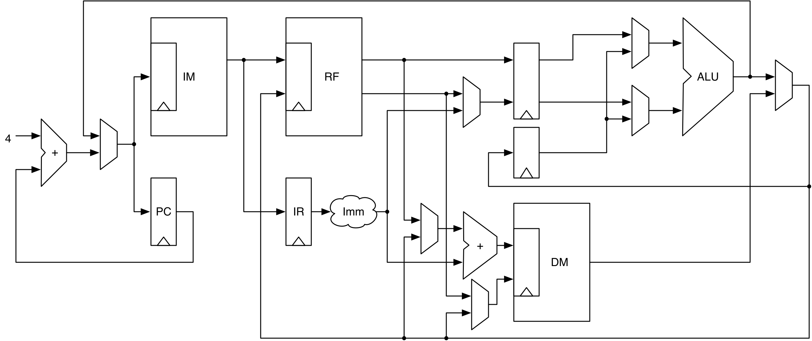

# Chapter 15 — A RISC-V Pipeline

**Pipelining** overlaps the stages of instruction processing so that, ideally,
one instruction completes every clock cycle — in contrast to the multi-cycle
Leros processor of Chapter 14. This chapter presents **Wildcat**, a small,
readable **RISC-V (RV32I)** processor built as a **3-stage pipeline**. We build
each part in turn — the ALU and decoder (written as functions returning
hardware), the register file, the CSR block, the instruction ROM — test each
one on its own, then wire the whole `ThreeCats` CPU to memories and watch a
hand-assembled program run through it. Finally we generate the SystemVerilog
for the complete CPU.

Pipelining is a familiar idea outside hardware, too. In a car factory's
assembly line, each station performs one specialized task — say, engine
installation — and the car moves on to the next station as soon as that task
is done, so many cars are in different stages of assembly at the same time.
Wildcat applies the same idea to instruction processing: instructions flow
through the pipeline, with one processor unit performing one operation at each
stage, so that (ideally) a different instruction is in flight at every stage
on every clock cycle. Beyond the pipeline built in this chapter, the
[Wildcat GitHub repo](https://github.com/schoeberl/wildcat) also contains a
RISC-V instruction-set simulator written in plain Scala, and a single-cycle
Chisel version of the processor for comparison and demonstration.

*Conventions: every file path is relative to `tutorial/ch15-a-risc-v-pipeline/`,
and every command is run from that folder.*

> **Scope note.** The upstream Wildcat repo loads programs from ELF files via a
> `jelf` dependency and runs them on Verilator. To stay self-contained (three
> dependencies, no external files), this project hand-assembles its programs as
> a Scala `Array[Int]`. That is enough to unit-test every piece — ALU, decoder,
> CSRs, instruction ROM — *and* to run a short program through the complete
> `ThreeCats` pipeline (§15.8). What stays upstream: ELF loading, RISC-V
> compliance suites, and the `StandardFive`/`WildFour`/`ThreeCats`
> co-simulation against a Scala ISA model —
> [Wildcat on GitHub](https://github.com/schoeberl/wildcat).

---

## 15.1 The RV32I ISA in brief

RISC-V is an open instruction-set architecture (ISA) originally developed at
the University of California, Berkeley. Andrew Waterman defined it in his PhD
thesis, supervised by Krste Asanovic and Dave Patterson, distilling three
decades of RISC architectures — MIPS, SPARC, and Alpha — into the RISC-V ISA
definition. Because the definition is open source, many microcontroller
vendors have switched to RISC-V over the last few years.

RISC-V is an ISA *definition*; it does not mandate an implementation. The "V"
stands for the **fifth** RISC project at Berkeley, and it also signals that
vector instructions are part of the standard.

The RISC-V definition has two base integer ISAs — **RV32I** and **RV64I**, for
32-bit and 64-bit architectures — plus optional extensions such as **M**
(multiply/divide), **F** and **D** (single-/double-precision floating point),
and many more, layered on top of the base. Wildcat implements the base
**RV32I**.

RV32I has 32 registers of 32 bits (x0 is always 0) and a program counter; a
load-store architecture with 32-bit instructions. The instruction classes:
register/register and register/immediate ALU ops, loads and stores, and control
flow (conditional branches, `jal`/`jalr`). For example:

- `add x1, x2, x3` — add registers `x2` and `x3`, result into `x1`.
- `add x1, x2, 42` — add the immediate `42` to `x2`, result into `x1`.
- `lw x3, 4(x1)` — load a word from address `x1 + 4` into `x3`.
- `sw x2, 4(x1)` — store the content of `x2` to address `x1 + 4`.
- `bne x2, x3, fail` — branch to `fail` if `x2 != x3`.
- `jal x1, foo` — jump to `foo`, saving the return address in `x1`.

Wildcat implements this base ISA. For a detailed description, see the classic
textbook by Patterson and Hennessy, or the official
[RISC-V Instruction Set Manual](https://github.com/riscv/riscv-isa-manual).

---

## 15.2 Pipeline stage definition

A pipeline stage performs one specific function within a single clock cycle,
and that function is combinational. Registers sit between the stages to hold
intermediate results.

Because a register sits *between* two stages, we need a convention for which
stage it belongs to: the stage's input register, or its output register? For
practical reasons — matching how on-chip memories are built, with a registered
address input (Chapter 6) — Wildcat treats a stage's **input register** as
part of that stage, not its output register.

---

## 15.3 Number of pipeline stages

The number of pipeline stages is an architectural choice. Longer pipelines can
run at a higher clock frequency, but each extra stage adds register overhead
and design complexity.

The classic RISC organization, used throughout computer-architecture textbooks
(Patterson & Hennessy), is a **5-stage pipeline**:

1. Instruction fetch
2. Instruction decode and register-file read
3. Execute
4. Memory access
5. Write-back

Real RISC-V implementations range from two stages to many more. One driver of
the stage count is the on-chip memory used for instructions and data: a
scratchpad or cache with a registered address input (Chapter 6) has a
one-cycle read latency, and that input register *is* a pipeline register. To
keep the design simple, Wildcat collapses the classic 5 stages down to
**three**:

1. Instruction fetch
2. Instruction decode, register-file read, and address computation
3. Execute and memory access

*(A register file built from plain flip-flops, read asynchronously, would let
this collapse further to just two stages — but it gives up the on-chip-memory
implementation that Wildcat's register file uses; see §15.5.4.)*

---

## 15.4 A three-stage pipeline

A pipeline stage does one combinational job per cycle; registers between stages
hold intermediate results. On-chip memories (with a registered address and
one-cycle read latency) set a practical lower bound of three stages:

1. **Fetch** — instruction memory (IM) read.
2. **Decode** — register-file (RF) read, decode, address computation.
3. **Execute** — ALU / branch / memory access.

<p align="center">
  
</p>

***Figure 15.1** — The 3-stage Wildcat pipeline (simplified, omitting control
and decoded signals). Instructions flow left→right through PC/IM (fetch),
RF/IR/Imm (decode), and the ALU/DM (execute); results write back to the RF or
DM.*

### Top level

`src/main/scala/wildcat/pipeline/Wildcat.scala`
```scala
abstract class Wildcat() extends Module {
  val io = IO(new Bundle {
    val imem = new InstrIO()
    val dmem = new MemIO()
  })
}
```

`Wildcat` is an **abstract superclass** shared by the different pipeline
implementations (e.g. different pipeline organizations) — `ThreeCats` extends
it. Its IO is deliberately minimal: just the connections to instruction memory
and data memory. We stay flexible about what those memories actually are —
scratchpad memories for small implementations, or caches for larger ones — and
IO devices are multiplexed onto the data-memory port rather than given a
separate interface. The memories, caches, and IO devices themselves are wired
up at the system-on-chip (SoC) top level, not here — §15.8 builds that top
level so we can run a program.

Both ports are `Bundle`s, and both have a `stall` input the memory raises when
it cannot answer this cycle (a cache miss, say):

`src/main/scala/wildcat/pipeline/connections.scala`
```scala
// Interface to the instruction memory: present an address, get the instruction
// (one cycle later); `stall` freezes the pipeline (e.g. a cache miss).
class InstrIO extends Bundle {
  val address = Output(UInt(32.W))
  val data = Input(UInt(32.W))
  val stall = Input(Bool())
}

// Interface to the data memory: separate read and write ports, byte write
// enables (Vec of 4 for the four bytes of a 32-bit word).
class MemIO extends Bundle {
  val rdAddress = Output(UInt(32.W))
  val rdData = Input(UInt(32.W))
  val rdEnable = Output(Bool())
  val wrAddress = Output(UInt(32.W))
  val wrData = Output(UInt(32.W))
  val wrEnable = Output(Vec(4, Bool()))
  val stall = Input(Bool())
}
```

The directions are written from the **CPU's** point of view, so a memory
declares its port as `Flipped(new MemIO())`. Reads and writes get separate
address ports, and `wrEnable` is a `Vec` of four `Bool`s — one per byte of the
32-bit word — so that a byte or half-word store does not need a
read-modify-write cycle.

The same file holds the decoder's output bundle, the control word that travels
down the pipeline with the instruction:

`src/main/scala/wildcat/pipeline/connections.scala`
```scala
// The decoded form of an instruction — the output of the decode function.
class DecodedInstr extends Bundle {
  val instrType = UInt(3.W)
  val aluOp = UInt(4.W)
  val imm = SInt(32.W)
  val isImm = Bool()
  val isLui = Bool()
  val isAuiPc = Bool()
  val isLoad = Bool()
  val isStore = Bool()
  val isBranch = Bool()
  val isJal = Bool()
  val isJalr = Bool()
  val rfWrite = Bool()
  val isECall = Bool()
  val isCssrw = Bool()
  val rs1Valid = Bool()
  val rs2Valid = Bool()
}
```

---

## 15.5 Datapath as functions

Wildcat writes the datapath pieces as **Scala functions that return hardware** —
the lightweight alternative to a `Module`, from
[Chapter 10 §10.2](../ch10-hardware-generators/README.md#102-lightweight-components-with-functions).
`ThreeCats` composes them into the pipeline. They all live in one object:

*illustrative — the object's shape; each function is shown in full below*

```scala
object Functions {
  def decode(instruction: UInt) = { ... }
  def getAluOp(instruction: UInt): UInt = { ... }
  def compare(funct3: UInt, op1: UInt, op2: UInt): Bool = { ... }
  def getImm(instruction: UInt, instrType: UInt): SInt = { ... }
  def registerFile(rs1: UInt, rs2: UInt, rd: UInt, wrData: UInt,
                   wrEna: Bool, useMem: Boolean = true) = { ... }
  def alu(op: UInt, a: UInt, b: UInt): UInt = { ... }
  def selectLoadData(data: UInt, func3: UInt, memLow: UInt): UInt = { ... }
  def getWriteData(data: UInt, func3: UInt, memLow: UInt) = { ... }
}
```

A function has no module boundary, so there are no ports to declare and no
`Module(new ...)` to write; the hardware it builds is simply inlined wherever it
is called. The price is that a function is not directly testable — there is
nothing to poke. §15.5.3 shows the fix: wrap it in a two-line module.

### 15.5.1 The ALU

The ALU switches on an operation id and produces the result:

`src/main/scala/wildcat/pipeline/Functions.scala`
```scala
  def alu(op: UInt, a: UInt, b: UInt): UInt = {
    val res = Wire(UInt(32.W))
    res := DontCare
    switch(op) {
      is(ADD.id.U) { res := a + b }
      is(SUB.id.U) { res := a - b }
      is(AND.id.U) { res := a & b }
      is(OR.id.U) { res := a | b }
      is(XOR.id.U) { res := a ^ b }
      is(SLL.id.U) { res := a << b(4, 0) }
      is(SRL.id.U) { res := a >> b(4, 0) }
      is(SRA.id.U) { res := (a.asSInt >> b(4, 0)).asUInt }
      is(SLT.id.U) { res := (a.asSInt < b.asSInt).asUInt }
      is(SLTU.id.U) { res := (a < b).asUInt }
    }
    res
  }
```

Three details worth pausing on:

- **`op` is an enumeration id.** `ADD`, `SUB`, … come from a Scala
  `Enumeration` in `defines.scala` (shown in §15.6.3), shared with a Scala ISA
  simulator; `.id.U` turns one into a Chisel constant.
- **Shifts use `b(4, 0)`.** RV32I shifts by the low five bits of the operand
  only, so a shift amount of 33 shifts by 1, not by 33.
- **`res := DontCare`, not a default value.** The `switch` covers all ten ALU
  ops, so any other `op` cannot occur in a correct decode. Saying "don't care"
  rather than "0" tells the synthesis tool it may pick whatever is cheapest.
  It also means an *un*decoded op reads as garbage instead of a plausible 0 —
  which is what you want, because it fails loudly in simulation.

The signed operations go through `.asSInt`: `>>` on a `UInt` shifts in zeros
(logical, `SRL`), the same operator on an `SInt` replicates the sign bit
(arithmetic, `SRA`), and `<` compares signed or unsigned depending on the type.
One operator, two circuits, chosen by the Chisel type — see
[§D.1](../SYSTEMVERILOG-NOTES.md#d1-expressions).

### 15.5.2 The decoder

`decode` turns an instruction into a `DecodedInstr` control word. Every flag is
given a default first, and the `switch` on the opcode overrides the ones that
apply:

`src/main/scala/wildcat/pipeline/Functions.scala`
```scala
  def decode(instruction: UInt) = {

    val opcode = instruction(6, 0)
    val func3 = instruction(14, 12)
    val decOut = Wire(new DecodedInstr())
    decOut.instrType := R.id.U
    decOut.isImm := false.B
    decOut.isLui := false.B
    decOut.isAuiPc := false.B
    decOut.isLoad := false.B
    decOut.isStore := false.B
    decOut.isBranch := false.B
    decOut.isJal := false.B
    decOut.isJalr := false.B
    decOut.rfWrite := false.B
    decOut.isECall := false.B
    decOut.isCssrw := false.B
    decOut.rs1Valid := false.B
    decOut.rs2Valid := false.B
    switch(opcode) {
      is(AluImm.U) {
        decOut.instrType := I.id.U
        decOut.isImm := true.B
        decOut.rfWrite := true.B
        decOut.rs1Valid := true.B
      }
      is(Alu.U) {
        decOut.instrType := R.id.U
        decOut.rfWrite := true.B
        decOut.rs1Valid := true.B
        decOut.rs2Valid := true.B
      }
      is(Branch.U) {
        decOut.instrType := SBT.id.U
        decOut.isImm := true.B
        decOut.isBranch := true.B
      }
      is(Load.U) {
        decOut.instrType := I.id.U
        decOut.rfWrite := true.B
        decOut.isLoad := true.B
      }
      is(Store.U) {
        decOut.instrType := S.id.U
        decOut.isStore := true.B
      }
      is(Lui.U) {
        decOut.instrType := U.id.U
        decOut.rfWrite := true.B
        decOut.isLui := true.B
      }
      is(AuiPc.U) {
        decOut.instrType := U.id.U
        decOut.rfWrite := true.B
        decOut.isAuiPc := true.B
      }
      is(Jal.U) {
        decOut.instrType := UJ.id.U
        decOut.rfWrite := true.B
        decOut.isJal := true.B
      }
      is(JalR.U) {
        decOut.instrType := I.id.U
        decOut.isImm := true.B
        decOut.rfWrite := true.B
        decOut.isJalr := true.B
      }
      is(System.U) {
        decOut.instrType := I.id.U
        when (func3 === 0.U) {
          decOut.isECall := true.B
        } .otherwise {
          decOut.isCssrw := true.B
        }
      }
    }
    decOut.aluOp := getAluOp(instruction)
    decOut.imm := getImm(instruction, decOut.instrType)
    decOut
  }
```

An unknown opcode hits none of the `is` arms and so keeps the defaults, of
which `rfWrite := false.B` is the important one: an illegal instruction cannot
corrupt the register file. Note the last two lines — the ALU op and the
immediate are *not* decoded by the `switch`; they get their own functions,
because both are read out of fixed instruction fields.

The ALU op comes from `func3`, with `func7` and the opcode disambiguating the
two pairs that share a `func3`:

`src/main/scala/wildcat/pipeline/Functions.scala`
```scala
  def getAluOp(instruction: UInt): UInt = {

    val opcode = instruction(6, 0)
    val func3 = instruction(14, 12)
    val func7 = instruction(31, 25)

    val aluOp = WireDefault(ADD.id.U)
    switch(func3) {
      is(F3_ADD_SUB.U) {
        aluOp := ADD.id.U
        when(opcode =/= AluImm.U && opcode =/= JalR.U && func7 =/= 0.U) {
          aluOp := SUB.id.U
        }
      }
      is(F3_SLL.U) { aluOp := SLL.id.U }
      is(F3_SLT.U) { aluOp := SLT.id.U }
      is(F3_SLTU.U) { aluOp := SLTU.id.U }
      is(F3_XOR.U) { aluOp := XOR.id.U }
      is(F3_SRL_SRA.U) {
        when(func7 === 0.U) { aluOp := SRL.id.U }.otherwise { aluOp := SRA.id.U }
      }
      is(F3_OR.U) { aluOp := OR.id.U }
      is(F3_AND.U) { aluOp := AND.id.U }
    }
    aluOp
  }
```

`ADD`/`SUB` share `func3 = 000` and are told apart by `func7`, but *only* for
R-type instructions — there is no `subi`, so an `addi` (opcode `AluImm`) with a
non-zero `func7` is still an add, and the immediate's upper bits must not be
mistaken for a `func7`. `jalr` needs the same exemption, since it too computes
an address by adding an immediate. `SRL`/`SRA` share `func3 = 101` and are
separated by `func7` in every format.

The immediate is scattered across different bit positions in each instruction
format, so `getImm` reassembles it and sign-extends with `Fill`:

`src/main/scala/wildcat/pipeline/Functions.scala`
```scala
  def getImm(instruction: UInt, instrType: UInt): SInt = {

    val imm = Wire(SInt(32.W))
    imm := instruction(31, 20).asSInt
    switch(instrType) {
      is(I.id.U) {
        imm := (Fill(20, instruction(31)) ## instruction(31, 20)).asSInt
      }
      is(S.id.U) {
        imm := (Fill(20, instruction(31)) ## instruction(31, 25) ## instruction(11, 7)).asSInt
      }
      is(SBT.id.U) {
        imm := (Fill(19, instruction(31)) ## instruction(7) ## instruction(30, 25) ## instruction(11, 8) ## 0.U(1.W)).asSInt
      }
      is(U.id.U) {
        imm := (instruction(31, 12) ## Fill(12, 0.U)).asSInt
      }
      is(UJ.id.U) {
        imm := (Fill(11, instruction(31)) ## instruction(19, 12) ## instruction(20) ## instruction(30, 21) ## 0.U(1.W)).asSInt
      }
    }
    imm
  }
```

Bit 31 is the sign bit in every format, which is why `Fill(n, instruction(31))`
appears in all of them — RISC-V places it there deliberately so the sign
extension can start before the format is known. Branch (`SBT`) and jump (`UJ`)
immediates end in a hard-wired `0.U(1.W)`: those targets are always even, so
the encoding does not waste a bit on the value it already knows.

*Scala/Chisel note — `##` is bit concatenation and `Fill(n, x)` replicates `x`
n times; both are from `chisel3.util`.*

### 15.5.3 Testing a function: the wrappers

A function is not a `Module`, so there are no ports to poke. The fix is a
wrapper module whose whole body is one call:

`src/main/scala/wildcat/pipeline/FunctionWrappers.scala`
```scala
// Wraps the ALU function.
class AluModule extends Module {
  val io = IO(new Bundle {
    val op = Input(UInt(4.W))
    val a = Input(UInt(32.W))
    val b = Input(UInt(32.W))
    val res = Output(UInt(32.W))
  })
  io.res := alu(io.op, io.a, io.b)
}

// Wraps the instruction decoder, exposing a few decoded fields.
class DecodeModule extends Module {
  val io = IO(new Bundle {
    val instr = Input(UInt(32.W))
    val instrType = Output(UInt(3.W))
    val aluOp = Output(UInt(4.W))
    val imm = Output(SInt(32.W))
    val rfWrite = Output(Bool())
    val isImm = Output(Bool())
    val isBranch = Output(Bool())
  })
  val d = decode(io.instr)
  io.instrType := d.instrType
  io.aluOp := d.aluOp
  io.imm := d.imm
  io.rfWrite := d.rfWrite
  io.isImm := d.isImm
  io.isBranch := d.isBranch
}
```

These two are tutorial additions, not book code: upstream Wildcat tests the
functions indirectly, by running programs. They exist so each function can be
checked on its own, and so it can be generated to SystemVerilog and read.

#### Checking it

The ALU is combinational, so the test never steps the clock — poke the
operands, expect the result:

`src/test/scala/wildcat/WildcatTest.scala`
```scala
  "Alu" should "compute the RV32I operations" in {
    test(new AluModule) { dut =>
      def check(op: AluType, a: Long, b: Long, expected: Long) = {
        dut.io.op.poke(op.id.U)
        dut.io.a.poke(a.U)
        dut.io.b.poke(b.U)
        dut.io.res.expect(expected.U)
      }
      check(ADD, 12, 10, 22)
      check(SUB, 12, 10, 2)
      check(AND, 12, 10, 8)
      check(OR, 12, 10, 14)
      check(XOR, 12, 10, 6)
      check(SLL, 1, 4, 16)      // 1 << 4
      check(SRL, 256, 2, 64)    // 256 >> 2
      check(SLT, 3, 5, 1)       // 3 < 5
      check(SLTU, 5, 3, 0)      // 5 < 3 is false
    }
  }
```

`check` takes the op as an `AluType` — the Scala enumeration value, not a
number — so the test reads in ISA terms and a renumbering of the enumeration
cannot silently invalidate it. The last two lines are the ones that would catch
a signed/unsigned mix-up: `SLT` and `SLTU` differ only in how they interpret
the same bits.

```
sbt 'testOnly wildcat.pipeline.WildcatTest -- -z "RV32I operations"'
```

```
[info] WildcatTest:
[info] Alu
[info] - should compute the RV32I operations
[info] Decode
[info] Decode
[info] Csr
[info] InstructionROM
[info] ThreeCats
[info] Run completed in 845 milliseconds.
[info] Total number of tests run: 1
[info] Suites: completed 1, aborted 0
[info] Tests: succeeded 1, failed 0, canceled 0, ignored 0, pending 0
[info] All tests passed.
```

(`-z` filters by test name; the bare subject lines are the suite's other groups,
which the filter skipped. The full set of filters is in
[Chapter 13 §13.2.2](../ch13-debugging-testing-verification/README.md#1322-selecting-tests-with-tags--and-the-other-filters).)

The decoder gets two hand-assembled instructions, one R-type and one I-type:

`src/test/scala/wildcat/WildcatTest.scala`
```scala
  "Decode" should "decode an R-type add" in {
    test(new DecodeModule) { dut =>
      // add x3, x1, x2  = 0x002081B3
      dut.io.instr.poke("h002081B3".U)
      dut.io.instrType.expect(InstrType.R.id.U)
      dut.io.aluOp.expect(ADD.id.U)
      dut.io.rfWrite.expect(true.B)
      dut.io.isImm.expect(false.B)
      dut.io.isBranch.expect(false.B)
    }
  }

  "Decode" should "decode an I-type addi with its immediate" in {
    test(new DecodeModule) { dut =>
      // addi x1, x0, 10 = 0x00A00093
      dut.io.instr.poke("h00A00093".U)
      dut.io.instrType.expect(InstrType.I.id.U)
      dut.io.aluOp.expect(ADD.id.U)
      dut.io.rfWrite.expect(true.B)
      dut.io.isImm.expect(true.B)
      dut.io.imm.expect(10.S)
    }
  }
```

The pair is chosen so the two differ in exactly the fields that must differ.
Both are adds that write the register file, so `aluOp` and `rfWrite` match; only
`instrType` and `isImm` change, and the I-type additionally checks that
`getImm` extracted `10` from bits 31–20. `isBranch` is expected `false` in the
R-type case to confirm the flag defaults survive an opcode that does not touch
them.

```
sbt 'testOnly wildcat.pipeline.WildcatTest -- -z "decode an"'
```

```
[info] WildcatTest:
[info] Alu
[info] Decode
[info] - should decode an R-type add
[info] Decode
[info] - should decode an I-type addi with its immediate
[info] Csr
[info] InstructionROM
[info] ThreeCats
[info] Run completed in 1 second, 190 milliseconds.
[info] Total number of tests run: 2
[info] Suites: completed 1, aborted 0
[info] Tests: succeeded 2, failed 0, canceled 0, ignored 0, pending 0
[info] All tests passed.
```

### 15.5.4 The register file

The register file is a function too, and it returns a Scala **tuple** of the two
read values plus a debug mirror:

`src/main/scala/wildcat/pipeline/Functions.scala`
```scala
  def registerFile(rs1: UInt, rs2: UInt, rd: UInt, wrData: UInt, wrEna: Bool, useMem: Boolean = true) = {

    if (useMem) {
      val debugRegs = RegInit(VecInit(Seq.fill(32)(0.U(32.W)))) // only for debugging
      when(wrEna && rd =/= 0.U) {
        debugRegs(rd) := wrData
      }
      val regs = SyncReadMem(32, UInt(32.W), SyncReadMem.WriteFirst)
      val rs1Val = Mux(RegNext(rs1) === 0.U, 0.U, regs.read(rs1))
      val rs2Val = Mux(RegNext(rs2) === 0.U, 0.U, regs.read(rs2))
      when(wrEna && rd =/= 0.U) {
        regs.write(rd, wrData)
      }
      (rs1Val, rs2Val, debugRegs)
    } else {
      val regs = RegInit(VecInit(Seq.fill(32)(0.U(32.W))))
      val rs1Val = regs(RegNext(rs1))
      val rs2Val = regs(RegNext(rs2))
      when(wrEna && rd =/= 0.U) {
        regs(rd) := wrData
      }
      (rs1Val, rs2Val, regs)
    }
  }
```

`useMem` picks between two implementations of the same interface. With
`useMem = true` the storage is a `SyncReadMem` — on-chip memory, cheap on an
FPGA; with `false` it is a `Vec` of registers, which costs 32 × 32 flip-flops
but reads asynchronously. `ThreeCats` passes `true`.

The memory version has three consequences the register version does not:

- **x0 must be forced to 0.** On an FPGA, on-chip memory is initialized to zero
  at configuration time; on an ASIC its content after reset is undefined. So
  reading `x0` must return `0` rather than whatever sits in the underlying
  memory — that is the `Mux` around `regs.read(...)`.
- **The `Mux` compares a *delayed* address.** `regs.read()` answers one clock
  cycle later, so the comparison must use `RegNext(rs1)`, the address that
  produced *this* cycle's data, not the one applied now. Same manual-forwarding
  pattern as the memories in
  [Chapter 6 §6.6](../ch06-sequential-building-blocks/README.md#66-memory).
- **`WriteFirst` handles read-during-write.** An instruction writing `x5` in the
  same cycle another reads it gets the new value forwarded, not the stale one.

`debugRegs` is a plain register mirror of the same writes. It exists only so a
test bench can look at the architectural state without dissecting an on-chip
memory; nothing reads it in hardware, so synthesis removes it
([§E.1](../SYSTEMVERILOG-NOTES.md#e1-registers-you-do-not-read-do-not-exist)).
§15.8 uses it as the observation point for a running program.

Two read ports per cycle (`rs1` and `rs2`) are impractical to get from a single
FPGA on-chip memory. The real implementation therefore uses **two** on-chip
memories, both written with the same data on every register write, each
supplying one of the two read ports.

There is no standalone register-file test here: the function needs a stream of
reads and writes to say anything, which is exactly what a running program
provides. §15.8's program writes `x1`, `x2`, `x3`, `x4` and reads them back
through this file.

---

## 15.6 The pipeline, fetch, decode, and execute

`ThreeCats` wires the three stages together, including forwarding (from the
execute stage back to decode) and branch/jump handling.

### 15.6.1 Instruction fetch

The program counter (PC) points at the next instruction to execute; since
RISC-V instructions are 32 bits wide, it is incremented by 4 each cycle, or set
to a branch target (the mux before the adder). The **fetch** stage generates
the PC and drives the instruction memory with the *next* PC. That is the part
worth slowing down for: the IM's registered address is part of the fetch
pipeline register, and so is `pcReg`, so feeding the IM from `pcReg`'s
(already-latched) output would put the two registers one cycle apart. Feeding
it `pcNext` — the value about to be latched *this* cycle — keeps them in
lockstep, and the IM's address input always holds the same value as the PC.

`src/main/scala/wildcat/pipeline/ThreeCats.scala`
```scala
  // PC generation
  val pcReg = RegInit(0.S(32.W).asUInt)
  val pcNext = WireDefault(Mux(doBranch, branchTarget, pcReg + 4.U))
  pcReg := pcNext
  io.imem.address := pcNext

  // Fetch
  val instr = WireDefault(io.imem.data)
  when (io.imem.stall) {
    instr := 0x00000013.U
    pcNext := pcReg
  }
```

On a stall — a cache miss, say — a NOP (`0x00000013`, which is `addi x0, x0, 0`)
is substituted for the instruction and `pcNext` is held at `pcReg`, so nothing
advances and nothing is lost.

> **A note on the reset value.** The book's text says `pcReg` is initialized to
> `-4`, so that `pcNext` is `0` in the first cycle after reset. The code — here
> and upstream, which keeps the `-4` version as a comment — initializes it to
> `0`, so `pcNext` is `4` in that first cycle and address `0` is never presented
> to the memory. It still works, because the ROM's own address register also
> resets to `0`: the memory hands out the instruction at address 0 while the PC
> is already fetching address 4. §15.8's test confirms it — the first
> instruction of the program executes, with no leading NOP needed.

For simulation and small FPGA experiments, the instruction memory is a ROM
preloaded from a Scala array at hardware-generation time:

`src/main/scala/wildcat/pipeline/InstructionROM.scala`
```scala
class InstructionROM(code: Array[Int]) extends Module {
  val io = IO(Flipped(new InstrIO()))

  val addrReg = RegInit(0.U(32.W))
  addrReg := io.address
  val instructions = VecInit(code.toIndexedSeq.map(_.S(32.W).asUInt))
  io.data := instructions(addrReg(31, 2))   // word index = byte address / 4
  io.stall := false.B
}
```

`VecInit` over a Scala `Array[Int]` builds a `Vec` of constants — the array is
Scala data, evaluated during elaboration, and what reaches the hardware is a
read-only lookup table. `addrReg` is the registered address that gives the
one-cycle read latency and *is* the fetch pipeline register. Indexing with
`addrReg(31, 2)` drops the two low bits, turning a byte address into a word
index. `stall` is tied low: a ROM always answers immediately.

Elaborating this ROM prints a warning, and it is worth reading rather than
ignoring:

```
[warn] src/main/scala/wildcat/pipeline/InstructionROM.scala 14:26: [W004] Dynamic index with width 30 is too wide for Vec of size 4 (expected index width 2).
[warn]   io.data := instructions(addrReg(31, 2))   // word index = byte address / 4
[warn]                          ^
```

A 30-bit index into a 4-entry `Vec` is wider than it needs to be; Chisel keeps
the low bits and warns. For a real program the ROM is much larger and the point
is moot, but it is a reminder that an out-of-range index wraps rather than
faulting.

#### Checking it

The ROM's one behaviour is: present an address, get that word one cycle later.

`src/test/scala/wildcat/WildcatTest.scala`
```scala
  "InstructionROM" should "return the preloaded program (one-cycle latency)" in {
    val program = Array(0x00A00093, 0x01400113, 0x002081B3, 0x00000073)
    test(new InstructionROM(program)) { dut =>
      dut.io.address.poke(0.U)
      dut.clock.step()
      dut.io.data.expect("h00A00093".U)
      dut.io.address.poke(4.U)
      dut.clock.step()
      dut.io.data.expect("h01400113".U)
      dut.io.address.poke(8.U)
      dut.clock.step()
      dut.io.data.expect("h002081B3".U)
    }
  }
```

Each `expect` follows a `step`, which is the latency made explicit: checking
`data` in the same cycle as the `poke` would read the *previous* address's word.
The addresses go 0, 4, 8 — byte addresses — while the array indices are 0, 1, 2,
so this also checks the `addrReg(31, 2)` shift.

```
sbt 'testOnly wildcat.pipeline.WildcatTest -- -z "preloaded program"'
```

```
[info] WildcatTest:
[info] Alu
[info] Decode
[info] Decode
[info] Csr
[info] InstructionROM
[info] - should return the preloaded program (one-cycle latency)
[info] ThreeCats
[info] Run completed in 869 milliseconds.
[info] Total number of tests run: 1
[info] Suites: completed 1, aborted 0
[info] Tests: succeeded 1, failed 0, canceled 0, ignored 0, pending 0
[info] All tests passed.
```

### 15.6.2 Instruction decode and register file read

The second stage decodes the instruction, reads the register file, and computes
a memory address. Its pipeline register is `instrReg`; `rs1`/`rs2` are the
register-file read addresses. RISC-V's encoding keeps the register-address
fields in the same bit positions across instruction formats, so `rs1`/`rs2` can
be read *before* the instruction type is even known — if the values turn out not
to be needed, they are simply ignored:

`src/main/scala/wildcat/pipeline/ThreeCats.scala`
```scala
  val instrReg = RegInit(0x00000033.U) // nop on reset
  instrReg := Mux(doBranch, 0x00000033.U, instr)
  val rs1 = instr(19, 15)
  val rs2 = instr(24, 20)
  val rd = instr(11, 7)
  val (rs1Val, rs2Val, debugRegs) = registerFile(rs1, rs2, wbDest, wbData, wrEna, true)

  val decOut = decode(instrReg)
```

Note the two different sources: `rs1`/`rs2` come from `instr` (the *incoming*
instruction, because the register file's read is itself registered and so needs
the address a cycle early), while `decode` sees `instrReg` (the latched one).
`0x00000033` is `add x0, x0, x0` — a NOP that also happens to be the reset value
and the instruction injected on a taken branch, killing the wrongly-fetched
instruction behind it.

The load/store address is computed here too, forwarding `rs1`/`rs2` from the
execute stage when the preceding instruction has not yet been written back to
the register file:

`src/main/scala/wildcat/pipeline/ThreeCats.scala`
```scala
  // Forwarding to memory
  val address = Mux(wrEna && (wbDest =/= 0.U) && wbDest === decEx.rs1, wbData, rs1Val)
  val data = Mux(wrEna && (wbDest =/= 0.U) && wbDest === decEx.rs2, wbData, rs2Val)

  val memAddress = (address.asSInt + decOut.imm).asUInt
  decEx.memLow := memAddress(1, 0)
```

The `wbDest =/= 0.U` term is not an optimization: `x0` is hard-wired to zero, so
a write to it must never be forwarded as if it had taken effect.

The data memory's address and store data/enable are then driven directly from
decode — the memory's own input registers form the execute stage's pipeline
register:

`src/main/scala/wildcat/pipeline/ThreeCats.scala`
```scala
  io.dmem.rdAddress := memAddress
  io.dmem.rdEnable := false.B
  io.dmem.wrAddress := memAddress
  io.dmem.wrData := data
  io.dmem.wrEnable := VecInit(Seq.fill(4)(false.B))
  when(decOut.isLoad && !doBranch) {
    io.dmem.rdEnable := true.B
  }
  when(decOut.isStore && !doBranch) {
    val (wrd, wre) = getWriteData(data, decEx.func3, memAddress(1, 0))
    io.dmem.wrData := wrd
    io.dmem.wrEnable := wre
  }
```

The `!doBranch` guard matters more for the store than for the load: a load that
should not have happened only writes a register that is discarded anyway, but a
store on a mispredicted path would corrupt memory.

`getWriteData` prepares a store. It replicates the byte or half-word across the
32-bit word and raises only the byte enables that address selects, so no
read-modify-write is needed:

`src/main/scala/wildcat/pipeline/Functions.scala`
```scala
  def getWriteData(data: UInt, func3: UInt, memLow: UInt) = {
    val wrData = WireDefault(data)
    val wrEnable = VecInit(Seq.fill(4)(false.B))
    switch(func3) {
      is(SB.U) {
        wrData := data(7, 0) ## data(7, 0) ## data(7, 0) ## data(7, 0)
        wrEnable(memLow) := true.B
      }
      is(SH.U) {
        wrData := data(15, 0) ## data(15, 0)
        switch(memLow) {
          is(0.U) { wrEnable(0) := true.B; wrEnable(1) := true.B }
          is(2.U) { wrEnable(2) := true.B; wrEnable(3) := true.B }
        }
      }
      is(SW.U) {
        wrEnable := VecInit(Seq.fill(4)(true.B))
      }
    }
    (wrData, wrEnable)
  }
```

Replicating the byte four times means the same wires can feed every lane, and
`wrEnable(memLow)` — a `Vec` indexed by hardware — picks which lane actually
takes it. A misaligned half-word (`memLow` 1 or 3) matches neither `is` arm and
so writes nothing.

### 15.6.3 Execute and memory read

The third stage executes an ALU operation, a branch/jump, or a memory load.
The ALU's second operand is either the forwarded register value `v2` or the
decoded immediate; `isLui`/`isAuiPc` override the ALU result directly:

`src/main/scala/wildcat/pipeline/ThreeCats.scala`
```scala
  val res = Wire(UInt(32.W))
  val val2 = Mux(decExReg.decOut.isImm, decExReg.decOut.imm.asUInt, v2)
  res := alu(decExReg.decOut.aluOp, v1, val2)
  when(decExReg.decOut.isLui) {
    res := decExReg.decOut.imm.asUInt
  }
  when(decExReg.decOut.isAuiPc) {
    res := (decExReg.pc.asSInt + decExReg.decOut.imm).asUInt
  }
```

`v1` and `v2` are the forwarded operands — the execute stage's own result from
the previous cycle, if it targets a register this instruction reads:

`src/main/scala/wildcat/pipeline/ThreeCats.scala`
```scala
  // Forwarding
  val v1 = Mux(exFwdReg.valid && exFwdReg.wbDest === decExReg.rs1, exFwdReg.wbData, decExReg.rs1Val)
  val v2 = Mux(exFwdReg.valid && exFwdReg.wbDest === decExReg.rs2, exFwdReg.wbData, decExReg.rs2Val)
```

Without these two multiplexers, `add x3, x1, x2` immediately after the `addi`
that produces `x2` would read a stale `x2`, because the write-back has not
reached the register file yet. §15.8's program is written to exercise exactly
that back-to-back case.

The ALU operations are a Scala `Enumeration`, shared with the ISA simulator (and
converted to Chisel constants with `.id.U`, as seen in `alu` in §15.5.1):

`src/main/scala/wildcat/defines.scala`
```scala
object AluType extends Enumeration {
  type AluType = Value
  val ADD, SUB, SLL, SLT, SLTU, XOR, SRL, SRA, OR, AND = Value
}
```

*Scala note — Scala `Enumeration` → [§B.3](../SCALA-NOTES.md#b3-scalas-enumeration--type-alias); `type` alias → [§C.3](../SCALA-NOTES.md#c3-type-alias).*

The same file also holds the opcode constants (`Opcode`), the `InstrType`
enumeration used by `getImm`, the `func3`/`func7` constants for the ALU, branch,
and load/store instructions, and the CSR addresses used in §15.7 — all as plain
Scala values, so a Scala assembler or simulator can share them with the
hardware.

The branch target is the PC plus the branch immediate, or (for `jalr`) the ALU
result:

`src/main/scala/wildcat/pipeline/ThreeCats.scala`
```scala
  // Branching and jumping
  branchTarget := (decExReg.pc.asSInt + decExReg.decOut.imm).asUInt
  when(decExReg.decOut.isJalr) {
    branchTarget := res
  }
  doBranch := ((compare(decExReg.func3, v1, v2) && decExReg.decOut.isBranch) || decExReg.decOut.isJal || decExReg.decOut.isJalr) && decExReg.valid
```

`compare` implements the six branch conditions, again with one operator per
signedness:

`src/main/scala/wildcat/pipeline/Functions.scala`
```scala
  def compare(funct3: UInt, op1: UInt, op2: UInt): Bool = {
    val res = Wire(Bool())
    res := false.B
    switch(funct3) {
      is(BEQ.U) { res := op1 === op2 }
      is(BNE.U) { res := op1 =/= op2 }
      is(BLT.U) { res := op1.asSInt < op2.asSInt }
      is(BGE.U) { res := op1.asSInt >= op2.asSInt }
      is(BLTU.U) { res := op1 < op2 }
      is(BGEU.U) { res := op1 >= op2 }
    }
    res
  }
```

`doBranch` reaches all the way back to the fetch stage — it is the mux select on
`pcNext` in §15.6.1 and the kill signal on `instrReg` in §15.6.2. The trailing
`&& decExReg.valid` is what stops an instruction that was itself killed by an
earlier branch from taking a second one.

Finally, a load multiplexes the data-memory read data down to a byte, half-word,
or word using `func3` and the address's low two bits:

`src/main/scala/wildcat/pipeline/ThreeCats.scala`
```scala
  // Memory read access
  when(decExReg.decOut.isLoad && !doBranch) {
    res := selectLoadData(io.dmem.rdData, decExReg.func3, decExReg.memLow)
  }
```

`selectLoadData` is `getWriteData`'s mirror image — it extracts the addressed
bytes and sign- or zero-extends them:

`src/main/scala/wildcat/pipeline/Functions.scala`
```scala
  def selectLoadData(data: UInt, func3: UInt, memLow: UInt): UInt = {
    val res = Wire(UInt(32.W))
    res := data
    switch(func3) {
      is(LB.U) {
        switch(memLow) {
          is(0.U) { res := Fill(24, data(7)) ## data(7, 0) }
          is(1.U) { res := Fill(24, data(15)) ## data(15, 8) }
          is(2.U) { res := Fill(24, data(23)) ## data(23, 16) }
          is(3.U) { res := Fill(24, data(31)) ## data(31, 24) }
        }
      }
      is(LH.U) {
        switch(memLow) {
          is(0.U) { res := Fill(16, data(15)) ## data(15, 0) }
          is(2.U) { res := Fill(16, data(31)) ## data(31, 16) }
        }
      }
      is(LBU.U) {
        switch(memLow) {
          is(0.U) { res := data(7, 0) }
          is(1.U) { res := data(15, 8) }
          is(2.U) { res := data(23, 16) }
          is(3.U) { res := data(31, 24) }
        }
      }
      is(LHU.U) {
        switch(memLow) {
          is(0.U) { res := data(15, 0) }
          is(2.U) { res := data(31, 16) }
        }
      }
    }
    res
  }
```

`lb`/`lh` replicate the sign bit with `Fill`; `lbu`/`lhu` (the `U` suffix) just
pad with zeros. `lw` needs no arm at all — the default `res := data` is already
the whole word.

---

## 15.7 Control and status registers

RISC-V's control and status registers (CSRs) hold cycle counters, timers, and
identification values, read with the `csrr` family of instructions. Wildcat's
decoder already flags them (`isCssrw` in §15.5.2); the register block itself is
a small read-only module:

`src/main/scala/wildcat/pipeline/Csr.scala`
```scala
class Csr() extends Module {
  val io = IO(new Bundle {
    val address = Input(UInt(12.W))
    val data = Output(UInt(32.W))
  })

  val data = WireDefault(0.U(32.W))

  switch(io.address) {
    is(CYCLE.U) { data := 0.U }
    is(CYCLEH.U) { data := 0.U }
    is(MCYCLE.U) { data := 0.U }
    is(MCYCLEH.U) { data := 0.U }
    is(TIME.U) { data := 0.U }
    is(TIMEH.U) { data := 0.U }
    is(MTIME.U) { data := 0.U }
    is(MTIMEH.U) { data := 0.U }
    is(MARCHID.U) { data := WILDCAT_MARCHID.U }
  }

  io.data := data
}
```

The CSR addresses are 12 bits and come from the `CSR` object in `defines.scala`.
Everything except `MARCHID` reads as `0` here — the counters are placeholders
for a real implementation, which is why the arms exist at all rather than
falling through to the default. `MARCHID` is the architecture id, and Wildcat's
is **47**, registered in the RISC-V
[marchid list](https://github.com/riscv/riscv-isa-manual/blob/main/marchid.md).

#### Checking it

Two reads: the one address that carries a value, and one that must not.

`src/test/scala/wildcat/WildcatTest.scala`
```scala
  "Csr" should "return the Wildcat architecture id" in {
    test(new Csr) { dut =>
      dut.io.address.poke(MARCHID.U)
      dut.io.data.expect(47.U)
      dut.io.address.poke(CYCLE.U)
      dut.io.data.expect(0.U)
    }
  }
```

Reading `MARCHID` proves the constant is wired to the right address; reading
`CYCLE` immediately after proves the block is combinational — no clock step
between the two pokes — and that a placeholder address really does read `0`
rather than holding the previous value.

```
sbt 'testOnly wildcat.pipeline.WildcatTest -- -z "architecture id"'
```

```
[info] WildcatTest:
[info] Alu
[info] Decode
[info] Decode
[info] Csr
[info] - should return the Wildcat architecture id
[info] InstructionROM
[info] ThreeCats
[info] Run completed in 805 milliseconds.
[info] Total number of tests run: 1
[info] Suites: completed 1, aborted 0
[info] Tests: succeeded 1, failed 0, canceled 0, ignored 0, pending 0
[info] All tests passed.
```

---

## 15.8 Running a program

Everything so far has been tested in isolation. The pipeline itself only says
something once instructions flow through it, and for that the CPU needs its two
memories — the wiring the abstract `Wildcat` class deliberately leaves to a
system-on-chip top level (§15.4).

### 15.8.1 A data memory

The instruction ROM of §15.6.1 covers the instruction side. The data side needs
a writable memory with byte enables, matching `MemIO`:

`src/main/scala/wildcat/pipeline/ScratchPadMem.scala`
```scala
class ScratchPadMem(nrBytes: Int = 4096) extends Module {
  val io = IO(Flipped(new MemIO()))

  val nrWords = nrBytes / 4
  val mems = Seq.fill(4)(SyncReadMem(nrWords, UInt(8.W), SyncReadMem.WriteFirst))

  // Word index: drop the two byte-select bits, keep log2Up(nrWords) bits.
  val hi = log2Up(nrWords) + 1
  val rdWord = io.rdAddress(hi, 2)
  val wrWord = io.wrAddress(hi, 2)

  io.rdData := mems(3).read(rdWord) ## mems(2).read(rdWord) ##
               mems(1).read(rdWord) ## mems(0).read(rdWord)

  for (i <- 0 until 4) {
    when(io.wrEnable(i)) {
      mems(i).write(wrWord, io.wrData(8 * i + 7, 8 * i))
    }
  }

  io.stall := false.B
}
```

**Four byte-wide memories, not one word-wide one.** That is what makes
`getWriteData`'s per-lane `wrEnable` usable: a `sb` writes one of the four
memories and leaves the others alone. A read always reads all four and
concatenates them back into a word, with `mems(3)` supplying the most
significant byte (little-endian: the lowest address is the least significant
byte). `SyncReadMem` gives the same one-cycle read latency as the ROM, and that
latency is the execute stage's pipeline register.

Upstream Wildcat's `ScratchPadMem` additionally preloads its content from hex
files it writes during elaboration; this one starts empty, which is all the
programs here need.

### 15.8.2 The SoC top level

`WildcatTop` is the small system: CPU, ROM, data memory.

`src/main/scala/wildcat/pipeline/WildcatTop.scala`
```scala
class WildcatTop(program: Array[Int], nrBytes: Int = 4096) extends Module {
  val io = IO(new Bundle {
    val regs = Output(Vec(32, UInt(32.W)))
    val stop = Output(Bool())
  })

  val cpu = Module(new ThreeCats())
  val imem = Module(new InstructionROM(program))
  val dmem = Module(new ScratchPadMem(nrBytes))

  cpu.io.imem <> imem.io
  cpu.io.dmem <> dmem.io

  // debugRegs and stop are internal to ThreeCats, not ports, so we bore them
  // out instead of adding debug ports to the CPU (Chapter 13 section 13.2.3).
  io.regs := BoringUtils.bore(cpu.debugRegs)
  io.stop := BoringUtils.bore(cpu.stop)
}
```

`<>` connects the two `Bundle`s port by port, and because the memories declare
their side as `Flipped`, the directions line up without naming a single signal.

The two debug outputs need `BoringUtils`. `debugRegs` (the register-file mirror
from §15.5.4) and `stop` (raised by `ecall`) are ordinary `val`s inside
`ThreeCats`, not ports — a parent module cannot read them, and Chisel says so:
`ThreeCats.debugRegs cannot be read from module WildcatTop`. `bore` drills the
connection through the hierarchy, adding the needed ports along the way, without
editing the CPU to carry debug ports it does not otherwise need. It is still
experimental, hence the `chisel3.util.experimental` import; see
[Chapter 13 §13.2.3](../ch13-debugging-testing-verification/README.md#1323-accessing-internal-signals-with-boringutils).

`WildcatTop` is therefore a **simulation** top level. Because `bore` gives its
`ThreeCats` instance extra ports, emitting both it and the plain CPU would put
two different modules named `ThreeCats` into `generated/` — so §15.9 emits the
clean one only.

#### Checking it

The program is hand-assembled RV32I, chosen so that each instruction tests
something the previous sections built:

`src/test/scala/wildcat/WildcatTest.scala`
```scala
  // The program below is hand-assembled RV32I. It ends with ecall, which the
  // pipeline reports on `stop`.
  val program = Array(
    0x00A00093, // addi x1, x0, 10
    0x01400113, // addi x2, x0, 20
    0x002081B3, // add  x3, x1, x2   (both operands forwarded)
    0x00302023, // sw   x3, 0(x0)
    0x00002203, // lw   x4, 0(x0)
    0x00000073, // ecall
    0x00000013, // nop
    0x00000013) // nop
```

The two `addi`s exercise the I-type immediate path; the `add` reads both
registers written by the two instructions directly ahead of it, so it can only
produce 30 if the execute-stage forwarding of §15.6.3 works; `sw`/`lw` round a
value through `getWriteData`, the scratchpad, and `selectLoadData`; `ecall`
raises `stop`. The trailing NOPs let the last real instruction drain.

`src/test/scala/wildcat/WildcatTest.scala`
```scala
  "ThreeCats" should "execute a small RV32I program" in {
    test(new WildcatTop(program)) { dut =>
      // Three cycles of fill (fetch, decode, execute) before the first result
      // reaches the register file.
      dut.clock.step(3)
      dut.io.regs(1).expect(10.U, "addi x1, x0, 10")

      // From here the pipeline is full: one instruction commits per cycle.
      dut.clock.step()
      dut.io.regs(2).expect(20.U, "addi x2, x0, 20")
      dut.clock.step()
      dut.io.regs(3).expect(30.U, "add x3, x1, x2 with forwarded operands")

      // sw x3 then lw x4 round-trips the value through the data memory.
      dut.clock.step(2)
      dut.io.regs(4).expect(30.U, "lw x4 reads back what sw x3 wrote")
    }
  }

  it should "raise stop on ecall" in {
    test(new WildcatTop(program)) { dut =>
      dut.io.stop.expect(false.B)
      // ecall is the sixth instruction, so it reaches execute in cycle 7.
      dut.clock.step(7)
      dut.io.stop.expect(true.B, "ecall reached the execute stage")
    }
  }
```

The **cycle counts are the point**, not just the values. `x1` appears three
cycles after reset — the pipeline fill, one cycle per stage — and then `x2` and
`x3` appear one cycle apart each. That is the chapter's opening claim measured:
after the fill, the 3-stage pipeline retires one instruction per clock cycle.
The `lw` result needs two more cycles rather than one, because the store ahead
of it writes no register.

The second test watches `stop`, which is `decExReg.decOut.isECall` — the `ecall`
reaching the execute stage. It is low at reset and high exactly at cycle 7,
which is what a test harness for a longer program would use to know the program
has finished.

```
sbt 'testOnly wildcat.pipeline.WildcatTest -- -z "small RV32I program" -z "ecall"'
```

```
[info] WildcatTest:
[info] Alu
[info] Decode
[info] Decode
[info] Csr
[info] InstructionROM
[info] ThreeCats
[info] - should execute a small RV32I program
[info] - should raise stop on ecall
[info] Run completed in 1 second, 558 milliseconds.
[info] Total number of tests run: 2
[info] Suites: completed 1, aborted 0
[info] Tests: succeeded 2, failed 0, canceled 0, ignored 0, pending 0
[info] All tests passed.
```

Two `-z` filters select two tests; the filter is a substring of the full test
name, so `"ecall"` picks the second one out of the `ThreeCats` group.

**The forwarding claim, checked.** It is easy to assert that the `add` needs
forwarding; here is the evidence. Replacing the two multiplexers of §15.6.3 with
the unforwarded register values —

*illustrative — a temporary edit to `ThreeCats.scala`, not the committed code*

```scala
  val v1 = decExReg.rs1Val
  val v2 = decExReg.rs2Val
```

— and re-running the same test:

```
[info] - should execute a small RV32I program *** FAILED ***
[info]   In step 5: io_regs_3=10 (0xa) did not equal expected=30 (0x1e): add x3, x1, x2 with forwarded operands at (WildcatTest.scala:107) (WildcatTest.scala:107)
```

`x3` comes out as 10, not 30: `x1` had already reached the register file, but
`x2` — written by the instruction directly ahead — still read as 0.

---

## 15.9 Build, run, and check

Run the whole suite:

```
$ sbt test
```

```
[info] WildcatTest:
[info] Alu
[info] - should compute the RV32I operations
[info] Decode
[info] - should decode an R-type add
[info] Decode
[info] - should decode an I-type addi with its immediate
[info] Csr
[info] - should return the Wildcat architecture id
[info] InstructionROM
[info] - should return the preloaded program (one-cycle latency)
[info] ThreeCats
[info] - should execute a small RV32I program
[info] - should raise stop on ecall
[info] Run completed in 1 second, 927 milliseconds.
[info] Total number of tests run: 7
[info] Suites: completed 1, aborted 0
[info] Tests: succeeded 7, failed 0, canceled 0, ignored 0, pending 0
[info] All tests passed.
[success] Total time: 2 s, completed Sep 4, 2026, 2:27:04 AM
```

Seven tests in one suite, `src/test/scala/wildcat/WildcatTest.scala`. Each
`[warn] ... [W004]` line above the results is the instruction-ROM index warning
explained in §15.6.1, repeated once per elaboration.

Generate the SystemVerilog:

```
$ sbt "runMain Generate"
```

```
[info] running Generate 
[warn] src/main/scala/wildcat/pipeline/InstructionROM.scala 14:26: [W004] Dynamic index with width 30 is too wide for Vec of size 4 (expected index width 2).
[warn]   io.data := instructions(addrReg(31, 2))   // word index = byte address / 4
[warn]                          ^
[warn] There were 1 warning(s) during hardware elaboration.
[success] Total time: 4 s, completed Sep 4, 2026, 2:26:59 AM
```

`src/main/scala/Generate.scala` writes six files into `generated/`:

| File | Lines | What it is |
|---|---|---|
| `ThreeCats.sv` | 501 | the **complete 3-stage CPU** |
| `ScratchPadMem.sv` | 162 | the data memory of §15.8.1 |
| `InstructionROM.sv` | 90 | the instruction ROM of §15.6.1 |
| `DecodeModule.sv` | 65 | the decoder wrapper of §15.5.3 |
| `AluModule.sv` | 34 | the ALU wrapper of §15.5.3 |
| `Csr.sv` | 16 | the CSR block of §15.7 |

That the whole pipelined core elaborates to SystemVerilog is the headline result
of this chapter — 501 lines, one module, no submodules, because the datapath is
built from functions rather than from modules.

`WildcatTop` is deliberately **not** emitted: it is the simulation harness, and
its bored debug ports would produce a second, differently-ported module named
`ThreeCats` (§15.8.2).

> **`.v` → `.sv`:** as elsewhere, Chisel 6 emits SystemVerilog (`.sv`) via
> CIRCT/firtool where the book says `.v`.

Clean up the generated artifacts with `rm -rf generated test_run_dir`.

---

## 15.10 Recap

- A **pipeline** overlaps fetch/decode/execute for ~1 instruction per cycle;
  on-chip memories with one-cycle reads motivate Wildcat's **3 stages**.
- The datapath is built from **functions returning hardware** (`alu`, `decode`,
  `getAluOp`, `getImm`, `compare`, `registerFile`, `selectLoadData`,
  `getWriteData`), composed in `ThreeCats`. Functions have no ports, so each is
  tested through a two-line wrapper module.
- The register file uses `SyncReadMem` (`WriteFirst`), forces x0 to 0, and
  compares against a *delayed* address because the read is registered.
- **Forwarding** from execute back to decode is what lets dependent instructions
  run back to back; remove it and §15.8's program computes 10 instead of 30.
- `WildcatTop` adds the two memories, `BoringUtils.bore` exposes the CPU's
  internal state, and a hand-assembled program runs through the real pipeline —
  one instruction per cycle once it is full.
- The **whole CPU generates SystemVerilog** (501 lines).

## 15.11 Exercise

Extend the program in §15.8 with a loop — a `bne` backwards — and work out from
the cycle counts how many cycles the taken branch costs. The pieces to reason
about are `doBranch` reaching back to the fetch stage and the NOP injected into
`instrReg` (§15.6.2). Then add the branch conditions to a wrapper test the way
`AluModule` wraps the ALU, so `compare` is checked on its own.

For the full experience — ELF programs, RISC-V compliance suites, co-simulation
against a Scala ISA model, and the `StandardFive`/`WildFour` pipelines to
compare against — clone the
[Wildcat repository](https://github.com/schoeberl/wildcat).

Back to the **[tutorial index](../README.md)**.
Previous: **[Chapter 14 — Design of a Processor](../ch14-design-of-a-processor/README.md)**.
Next: Chapter 16 — Contributing to Chisel (coming next).
